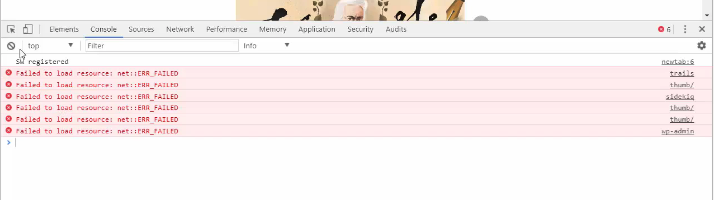

# MODULE 04 - 003: JavaScript

## How to run JS programs

## UPDATED TO DEBIAN USERS USING VSCode

****

### Node.js Isolated Installation & VS Code Debugging Guide

## 1. Install NVM

```bash
# From https://github.com/nvm-sh/nvm

curl -o- https://raw.githubusercontent.com/nvm-sh/nvm/v0.40.2/install.sh | bashusercontent.com/nvm-sh/nvm/v0.39.7/install.sh | bash### 
```

### 2. Reload Shell Configuration

```bash
source ~/.bashrc     # or ~/.zshrc if using Zsh
```

### 3. Install Node.js

```bash
# As 2025 March, 22.14.0 is the LTS

nvm install 22.14.0     # Install specific version

nvm use 22.14.0         # Use this version
```

### 4. Verify Installation

```bash
node --version

which node         # Note this path for VS Code configuration
```


## Configure VS Code Debugging

Create `.vscode/launch.json` in your project:

```json
{
     "version": "0.2.0",
     "configurations": [
 {
     "type": "node",
     "request": "launch",
     "name": "Debug Current File",
     "skipFiles": ["<node_internals>/**"],
     "program": "${file}",
     "runtimeExecutable": "/home/youruser/.nvm/versions/node/v22.14.0/bin/node",
     "console": "integratedTerminal"
 }
 ]
}
```


> **Note**: Replace `/home/youruser/...` with the path from `which node`

## Usage Instructions

1. Open any JavaScript file in your project

2. Set breakpoints by clicking left of line numbers

3. Press `F5` or:
   
   - Open Run and Debug view (`Ctrl+Shift+D`)
   
   - Select "Debug Current File"
   
   - Click green play button


## Optional: Nodemon Configuration

For automatic restart on file changes:

1. Install nodemon:

```bash
npm install -g nodemon
```


2. Add to `launch.json`:

```js
{
     "type": "node",
     "request": "launch",
     "name": "Debug with Nodemon",
     "runtimeExecutable": "nodemon",
     "program": "${file}",
     "restart": true,
     "console": "integratedTerminal"
}
```

This setup keeps Node.js versions isolated per project and enables seamless debugging in VS Code.


****

## Video lesson Speech

In this lesson you'll learn how to run JavaScript code in both the 
browser and CodePen development environments, including examining how to
 configure both options.

****

In this lesson, we're going to walk through how to set up our development environment for the course. Now we're going to walk through two different ways to set it up depending on what your preference is. The first is going to be to use purely the Chrome browser. Remember that Javascript is a language that can be interpreted by your browser which means that you could technically go through this entire course just by using the browser tools that are available to you. 

We're also going to talk about another tool it's free to use called Code pen.


That's the way you can leverage javascript development and you can also do things such as save the files things like that. None of which are going to require you to have a Mac or a PC. They can be done on pretty much any computer connected to the Internet. 

Now obviously, you could also do all of this in your local environment but that would have a number of different requirements. You'd have to do things such as install the node framework and you'd have to do some other things, I would rather us just focus on being able to program in javascript. As we go further along our development journey, we're going to walk through how we can put this all on our local machine. But right now I think the most important thing is understanding how javascript works and how we can program in it. 

The very first thing I'm going to do is show you how to use your browser to do this.

If you have a browser window open and this is going to be slightly different if you're on a Mac versus a PC. On a PC right now. But you're going to have your little options on the top right-hand side. And then if you scroll down to where it says more tools and click on developer tools this is going to open up this page for you. 


This is going to be your console where you can go and actually run the Javascript code. Now depending on what page you open it up to you may get some little error messages like this. 



That's perfectly fine. If you click this little clear console button 


or you press control L then that will allow you to clear everything out so you can focus on the code. Now just to make sure that everything's working. I'm going to type something super basic in and it's just going to be a variable. I'm going to just say 


```var hello_world = "Hi there";```             (Just like that) 

If I hit return it's going to say undefined. If I just say hello world again you can see that it returns. "Hi there". So this is working. 

If you've never done this before this is your first bit of Javascript code right here and we ran it right in the browser you didn't have to install anything. You're able to go straight to it.

Now obviously if you do not have the Chrome browser installed then I'd recommend you install it. You can technically do this in Firefox and in some of the more modern versions of Internet Explorer. If you're wanting to follow along I recommend for you to use Chrome. This is what I use thru out every single boot camp course that I have because I really like the developer tools that it gives and it makes it very nice and easy to build with. So that's we're going to be using for, part of it and I'm going to switch back and forth between the two. 

You can pick out whichever one is your favorite and stick with that. I personally like to use a few different options and I know depending on whatever your preferences you might want to be able to follow along with those but just so you are aware, throughout this entire course you're going to be able to use either one because both of them are going to interpret the javascript code exactly the same. Now the other option is code pen now code pen is completely free for what we're going to be using it for in this course.

 If you press sign up right here you can sign up and it has right here where it looks like you have all these paid options. But if you just click Join CodePen Free then you can type all of your information in right here and you can have a free account. 


Now I already have an account so I'm not going to sign up for a new. If I click on login and click on log in right here. This is what you're going to see as soon as you sign in.


Now in order to start writing javascript code, you can go up to create and click new pen. This is going to give you an entire development environment. Now technically you could write HTML and CSS code for this course. We're just going to be using javascript so I can drag to resize us all the way to the left so that we'll have plenty of room. I'm also going to zoom in so that you see exactly what I am typing and you don't have to squint your eyes or anything like that. 

We have the ability to save our environment so here I'm going to say javascript-devcamp-course and hit return. 


That's going to create this for me, now I'll be able to save it. And come back to it if I take a break and all of my code will be saved. I just click the little save button and everything's good to go. Now a few settings that I want to use and that you may or may not want to use if you're following along. If I click on settings and click on the Javascript section this gives you a few different options just in case you want to change it for this course. I'm not going to use a javascript preprocessor and we're not going to go into this. This essentially would allow us to use some things like typescript. We'll cover that in the typescript course and Babbel and Coffeescript but we're not going to worry about that right now. This is just something in case you're curious about what these things are.

This is just the ability to add some custom settings to each one of your various types of projects that you want to save. Now one of the very important things that I wanted to do is come down to the bottom and press on the console button.

This is going to allow us to do is to type out our code. Then the code that's going to get run is going to get run right down on the bottom. Now coming over to the down arrow if you click on it, you'll see a few different options like Tidy JS, Analyze JS, and some options there. 


We'll play around with these a little bit as we start to explore it. You also have the ability to do things like changing the view. 


Now some of the things you may use a little bit more if you're getting into and you want to add your HTML and CSS code. For this course, I'm just going to keep all of these items exactly the same as we go along in the course we may change up a few settings we may do some things that may make life a little bit easier. For right now everything we're going to do is going to simply work just like this. So if I type in something like the same thing 


```var
console.log(hello_world); ```

Console
```Hi there```

You can see that automatically it saves it and it runs "Hi there" in the console. 

Now, this is exactly like how we did over in the browser just using the development tools so both of these items are going to be able to allow us to type our Javascript code. As you noticed we didn't have to make any installations we didn't have to save any code, we didn't have to install any programs or anything like that. This is one of the quickest ways to get up and running and start writing our code and start building javascript programs. So now that you have both of those options you are ready to go through the entire course.

## Resources

- [CodePen](https://codepen.io)
```
