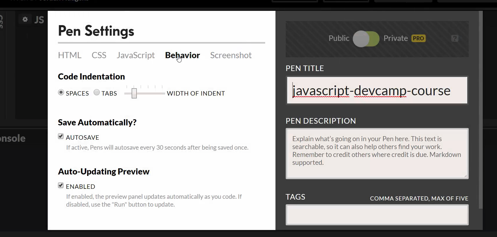
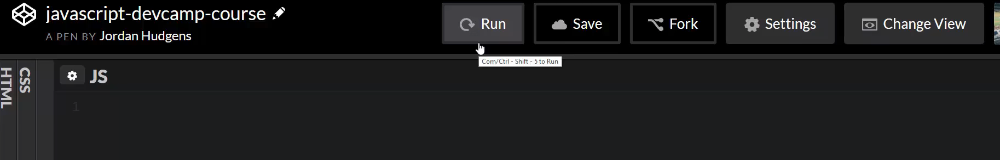
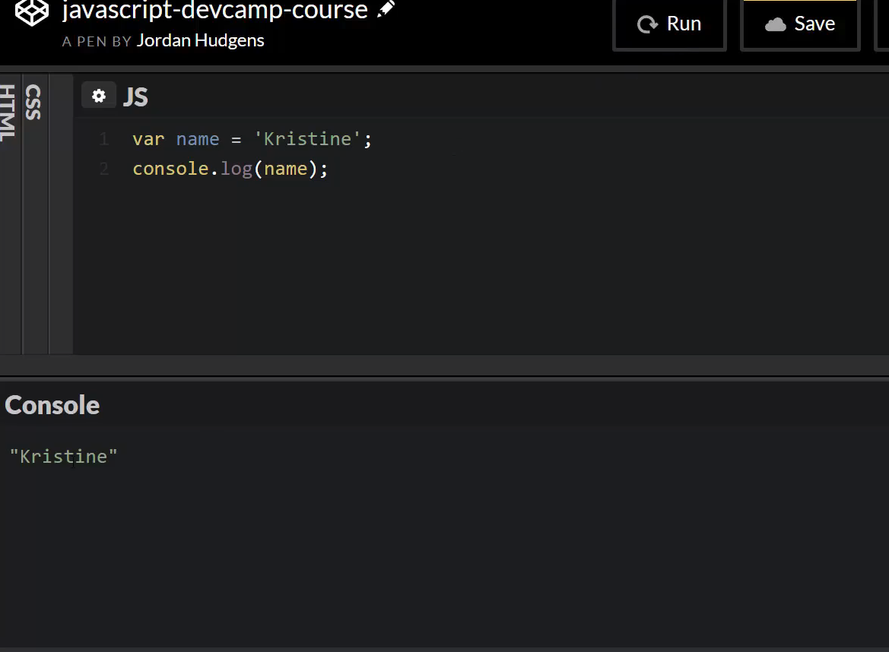
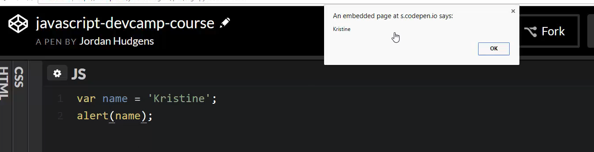
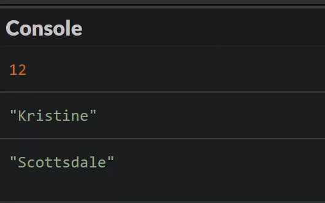

# MODULE 04 - 004: JavaScript, Variables (1)

## How to Work with Variables in JavaScript

This guide examines how to work with variables in JavaScript, including:
 how to store data in variables, how to define multiple variables at the
 same time, and how to use both the let and var variable options.

****

In this guide, we're going to be introduced to javascript variables. Variables in computer programming are tools that you can use in order to store data. That's one of the easiest ways to think about them. There are a number of analogies that I've heard that are helpful such as thinking of a variable as being like a bucket where you can place contents into that bucket and then from there you can carry it and use it however you need it. 

Essentially a variable is like a storage facility for anything that you need to put into it. Now Javascript has all kinds of different reasons to use variables. As you go through this course, we're going to be using them in pretty much every single guide. So it's a good idea to become familiar with them and if you learn any other programming languages, each one of them has some type of a concept of a variable.

In order to be able to access data, to be able to store inside something, and then call it later. That's essentially what variables are. I'm going to show you two different ways that we can use them, usually, I'm only going to use one type of development environment. But just because this is early on in the course I'm going to use both. If I hit (Control + shift + i) this is going to bring up the javascript console right here. If I zoom in and I'm zooming in if you're on a PC by just pressing control and plus or command and plus on a mac. I'm mainly doing this just so that you can see it better.

If I clear out the console, now I can type it. The syntax that I'm going to use is something that I think is intuitive. A variable starts with the letters V-A-R. What we can do in javascript is say var and then the name of the variable. Here I'm just going to say var name and I'm going to set this equal to my daughter's name, I'm going to say ```var name = Kristine;``` and then finish off with a semicolon. 

If I hit return, this has been stored. The name Kristine has been stored in the variable name. Undefined, what this essentially means is whenever we store a value and we store a piece of data inside of a variable. This just means that nothing else has occurred. In other words, we haven't printed that data out. We haven't sent it in to a function we haven't done anything with it so this return value is just undefined because nothing got returned. If you're new to programming that probably makes no sense whatsoever, and that's perfectly fine. We're going to understand what it means to return something later on. 

Don't let that be confusing if you are new to it. Now what we're able to do is, call "name" end with a semi-colon ```name;``` hit return and now you can see we have access to this name. That's a very basic way of being able to use this.
Now one other thing just as you're going through the course I'm also going to make all of the code available to you on GitHub. So you're going to be able to reference it here and I'll store it in the guides as well, so you have a reference point. 

I'm going to finish off this talk on variables in CodePen. Because I like the way that it renders out, it also makes it easier to see everything. We saw how we could store a name, let's now also talk about how we can store multiple values. I'm going to make one small change here, I'm going to come up to settings and I'm going to come up to behavior. 



We talked about javascript and some of the different options. If I click on behavior I don't want this to be auto-saved and I do not want auto-updating preview. It's perfectly fine if you have it. The only thing that I don't like about it, for providing a tutorial and you being able to watch it is on the console. You actually see output maybe sooner than I would want you to be able to see it. It may be kind of confusing. I'm just going to make it so that it doesn't auto-update. You can leave that on your side but I want to be very clear with what every type of code I write does. So I'm going to change that one option, so now that's saved. Now you can see we have this new button here called run. 



It's not auto-saving anymore and it's not auto-running. Now we just have to press run and it will run the code for us. Now if I type in the same thing I'm going to say ```var name = 'Kristine';``` I'm doing the same exact code just so you see everything's working. Now if I press run nothing's going to happen because nothing gets returned. This is where code pen and the javascript console are a little bit different. If we want anything to show up down here then we have to do something like this where I say ```console.log(name);``` and now if I run this it's going to show Kristine. 



Another option just so you know it's available and we'll do it a few times and this course is an alert. What an alert does is for example, if you've ever been on a browser and pressed a button and a little screen came up that said "Are you sure you want to do this" such as if you tried to delete something you may have a little pop up that says "Are you sure you want to do that." Well many times that is a javascript alert. 

If I run 

`alert(name);`

you can see that we have a little thing that popped up and it says Kristine because we called alert and name.



Those are two ways of being able to view what we have available.

I'm going to show you a few different ways that we can work with variables. This is a very basic way.

But we also have a different type of variable. We have a type of variable called let. Var is one option let is another and I'm going to change my `var name = 'Kristine';` I'm going to say `var age = 12;` and then `let name = 'Kristine';` And now if I say `console.log(age);` followed by `console.log(name);` I can hit clear and run this and you can see it prints out 12 and Kristine so everything there is working properly.

Now we're going to discuss in some later episodes what the difference between var and let are. But just to give you a little bit of a heads up those are the two main ways that you will declare variables in javascript, just to give you a little sneak preview. The difference is var is a type of variable that you can change and let is something that you do not want to change and in fact, most versions of javascript won't even let you change it. So in other words, if I say `let name = 'Kristine';` I can never change name later on and I'll talk about later on when you want to do something like that.

Now there are some other ways that we can work with these. Sometimes you may not want to actually define the values right away.

If I have a number of variables, let's say I get rid of all of the examples above. Let's say I have a name and say I have a city and an age. I can actually define all of these all at the same time. If I know my full list of variables are name, city, and age I can just say `var name, city, age;`

As the program goes along I can define them later on. I can say,

`name = 'Kristine'; city = 'Scottsdale'; age = 12;`

make sure you end those with semi-colons.

Let me do one more console log, you see that we have age and name. Let's also add city just so you can see that everything's working.

All put together it should look like this

`name = 'Kristine'; city = 'Scottsdale'; age = 12; console.log(age); console.log(name); console.log(city);`

Now if I run this, then you can see we have age 12 Kristine and then Scottsdale.



This is another common convention that you're going to see when declaring variables. It's just simply declaring the name. Essentially you're defining and saying OK I have these different data points I want to work with and sometime later I'm going to define them. Now you may wonder why in the world would I ever want to do this.

Well, it's harder to see when you're just doing pure programming like this. But if you imagine a real-world application like say an invoicing application you may want to say that you have things such as a customer name and a total and a list of products or a description or something like that and then you have hundreds of items and you want to render those all on the page.

You may want to actually list each one of those items at the very top and then as your program runs it'll simply fill in each one of the values so it will set each variable equal to that value each time it gets shown in this example for the invoice. That's a time where you'd want to do that just so it makes it cleaner and you can see in one part of your code all of your variables, where they're listed out and then you can go and you can access them whenever you need to.

That is how you can work with variables in javascript.

```javascript
var name, city, age;
name = 'Kristine';
city = 'Scottsdale';
age = 12;

console.log(age);
console.log(name);
console.log(city);
```

****

## Resources

- [Source Code](https://github.com/rails-camp/javascript-programming/blob/master/section_a_05_introduction_to_variables.js)

****

## Coding Exercise

```js
/*
Coding Exercise

Create 2 variables, called cat, and dog respectively, and set their values to something.
*/
```
