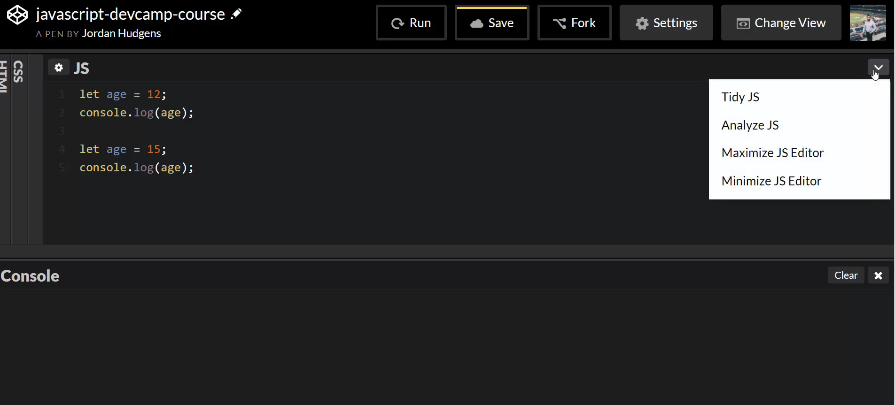
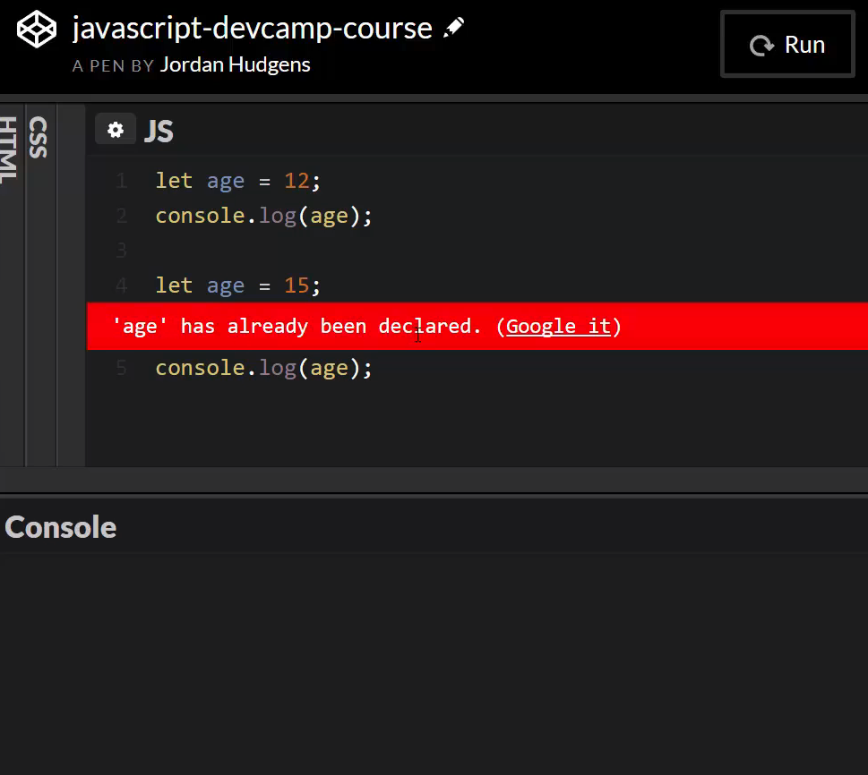

# MODULE 04 - 005: JavaScript, Variables (2)

## Understanding the Key Difference Between Var and Let Variables Types

This guide walks through the key differences between the var and let 
based variables types in the JavaScript programming language. Focusing 
on the unique feature of 'let' that doesn't allow it to be re-defined.

****

Now that you have a decent idea of how to create variables, both how to define them and also how to set their values. Let's talk about how we can actually change a variable's value. This is going to lead us directly into the conversation for understanding the main difference between the var type of variables and the let type of variables that we just walked through. 

I'm going to create a new variable here and this one I'm going to call age and we'll set it equal to 12 ```var age = 12;``` and then just to make sure everything's working. You say ```console.log(age);``` If I run this it runs it and it's 12. 

Everything is working just like how you'd expect. Now I can redefine this so if I come up here, copy it and actually I'll copy both lines. Now if I want to redefine this and say change it to 15 and run it again you can see that we have 12 and 15 both printed out here perfectly. 

So everything there is working the way that you may have expected. You hit clear and also save it. And now let's talk about how LET works differently. I'm going to change this to ```let``` instead of ```var```. Now let's try running it exactly the same way we did. If I hit run you may notice nothing is happening. Hit it again. Still nothing happening. That's not a problem with your browser or with code pen this is how the ```let``` variable is supposed to work. You are not supposed to be able to redefine the entire variable.

And if you want a little bit of insight on that if you come up and click on this little arrow here



this is where we talked about analyzing JS. If you click on that you can see that it actually shows you the problem and it says that age has already been declared. 



It also says to google it which would give you a little bit of an idea on exactly what is happening. You can do that if you feel like it. I'll simply explain the way that I personally like to think about it. And that is that a ```var``` gives you a very flexible type of variable you can think of it almost like a temporary type of a container. You can use it you can get rid of it. You can replace it, override, everything works exactly the way that you'd expect that to work.

```let``` on the other hand gives a little bit more of a strict framework for how you can redefine variables and you may wonder when you would ever want to use that. I can tell you there are a number of times where I've accidentally overridden variables. So I define something like say that I had a blog and I had a variable called blog posts and that variable was supposed to contain the blog post. But at some other part of the program I wanted to call something else blog post I redefined it and accidentally overrode that value. If I would have used a ```let``` then that wouldn't have happened.

The program would have thrown an error and I would have seen where the problem was so whenever you want to have some type of a variable or a data point that you don't want to have it accidentally overridden, that's where ```let``` comes in very handy and you see quite a bit of modern javascript is going to use ```let``` throughout the programs and that also extends into the frameworks like angular JS. You see a lot of ```let``` base variables because it's a little bit easier to control and you don't have as much of that fear of having one of your values accidentally overridden later on in the program. So that is an introduction to the main differences between ```var``` and ```let```

And also it also demonstrates how you can change variable values.

## Var variables can be re-defined

```javascript
var age = 12;
console.log(age);

var age = 15; // yep!
console.log(age);
```

## Let variables cannot be re-defined

```javascript
let age = 12;
console.log(age);

let age = 15; // nope!
console.log(age);
```

## Resources

- [Source code](https://github.com/rails-camp/javascript-programming/blob/master/section_b_06_difference_var_let.js)

****

## COding Exercise

```js
/*
Coding Exercise

Reassign the let variable below so it equals 10
*/

let number = 5;
```
