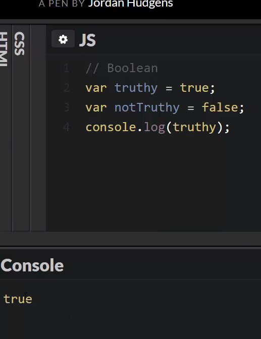
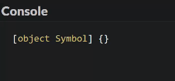

# MODULE 04 - 008: JavaScript

## Primitive Data Types

---

### 1. Boolean Data Type

### 2. Null Data Type

### 3. Undefined Data Type

### 4. Number Data Type

### 5. String Data Type

### 6. Symbol Data Type

### About Weak Typing -> ANY data type allowed

---

JavaScript provides several **primitive data types**, which categorize different forms of data we work with in our programs. Understanding these types is essential for writing efficient and error-free code.

A **data type** defines the kind of value a variable can store. For example, some values represent **numbers**, while others represent **text** (strings), **true/false** conditions (booleans), or even special types like **null** and **undefined**.

JavaScript is a **dynamically typed language**, meaning we don't have to explicitly declare a variable's type—it is determined automatically by the value assigned.

---

## 1. Boolean Data Type

A **Boolean** has only two possible values: `true` or `false`.

Example:

```js
var truthy = true;
var notTruthy = false;

console.log(truthy); // Output: true
```

Booleans are often used in conditions:

```js
var isUserLoggedIn = false;

if (isUserLoggedIn) {
    console.log("Welcome back!");
} else {
    console.log("Please log in.");
}
```

****

## 2. Null Data Type

The **null** value represents the intentional absence of a value.

Anyway, `null`is **always** considered as a number.

```js
var absenceOfValue = null;

console.log(absenceOfValue);
```

****

## 3. Undefined Data Type

`undefined` means a variable has been declared but has **not been assigned** a value.

```js
var notDefined;

console.log(notDefined); // Output: undefined
```

The key difference between `null` and `undefined` is that **null** is an explicitly assigned value, whereas `undefined` means a variable has been declared but not initialized.

****

## 4. Number Data Type

JavaScript **numbers** include both integers and floating-point values.

```js
var age = 25;
var price = 99.99;

console.log(age);   // Output: 25
console.log(price); // Output: 99.99
```

JavaScript does not differentiate between **integers** and **floating-point numbers**; both are represented as `Number`.


****

## 5. String Data Type

A **string** is a sequence of characters enclosed in quotes (`""` or `''`).

```js
var firstName = "Alice";
var greeting = 'Hello, world!';

console.log(firstName); // Output: Alice
console.log(greeting);  // Output: Hello, world!
```

You can use either **single** (`'`) or **double** (`"`) quotes.

****

## 6. Symbol Data Type

**Symbol** is a unique and immutable data type introduced in **ES6**.   

It is mainly used for creating unique object properties.

```javascript
var uniqueId = Symbol("id");

console.log(uniqueId); // Output: Symbol(id)
```

Symbols are **guaranteed to be unique**, even if they have the same description.


****

## JavaScript's Dynamic/Weak Typing:     'any' is allowed

Unlike strong typed languages (like Java or C++), JavaScript **dynamically assigns types**.

For example, a variable can hold different types at different times:

```js
var dynamicVar = "Hello"; // String
console.log(typeof dynamicVar); // Output: string

dynamicVar = 42; // Now it's a Number
console.log(typeof dynamicVar); // Output: number
```

This flexibility allows for faster development but also introduces potential errors when unexpected type changes occur.

****

## Resources

- [MDN Web Docs - JavaScript Data Types](https://developer.mozilla.org/en-US/docs/Web/JavaScript/Data_structures)

- [W3Schools - JavaScript Data Types](https://www.w3schools.com/js/js_datatypes.asp)

---

## Video lesson Speech

This lesson walks through each of the JavaScript data types. Additionally, we'll discuss how JavaScript utilizes dynamic typing.

****

In this guide, we're going to talk about javascript data types. If you are new to javascript development or new to programming, then let's talk about what a data type is. Essentially it is how javascript categorizes all of our data points. If we have variables a data type is a way that javascript sees that type of variable so does it see a sentence or does it see a number. The reason why that's important (there are more categories than that). Those are just a few examples. 

Imagine that you have a sentence of words that sentence can have certain types of functions called on them so you could capitalize on all the words if you tried to capitalize a number. Then an error is going to happen and it should because we need to know and we need to be able to use the right functions on the right type of data and that is what the data types allow us to do. 

We are going to go through each one of the data types provided by javascript. I'm going to put a comment at the top for each one. 

The first one, we're going to start alphabetically, is the `Boolean` data type. 

Now Boolean can have two potential values. True and false.

I can declare some variables.

```javascript
var truthy = true;
var notTruthy = false;
console.log(truthy);
```

If I run this you can see it returns true. 



Now, this is not a name it's not a letter it's not a series of letters like our name variables are. These are just two values. True and false. And so those are the only two things that a boolean can be. So this would be something like saying is a user a paid user if you're building an application and it's a SASS product and you want to be able to see which of these users is paid and which ones are a free member. Well, you can in your data say this is a paid user it's true that they are paid and then when we get into conditionals we're going to talk about how we can leverage that to give our programs dynamic behavior. Right now just know that we have a boolean data type and it has two potential values true and false.

The next one we're going to talk about is the `Null` data type. 

Now null can only have one value and that is null. 

If you say 

```javascript
var nully = null;
console.log(nully);
```

If I run this then it just prints out null.

Essentially what null is, is it's the absence of any kind of value. 

The next one we're going to do you've kind of already seen but it's important to understand that it's different than null. So null means empty. So this would be something like say, that you had a registration page and you had some optional fields such as a Twitter user name or something like that. If a user decided not to fill that in then that value for that Twitter user name would just be null. It's our way of understanding that that variable or that value could be there. But in this case, it's just empty. 

Moving down we're going to go to the next one which is `undefined`. We've seen that a few times and so `undefined` allows us to do is something that usually you're going to be using more with debugging because it's exactly what you get when something is simply declared. And it's not given a value. 

So here 

```javascript
var notDefined;
console.log(notDefined);
```

and just say var not defined set it equal to, actually in this case I'm just we're not going to set it equal to anything because this is usually the way you're going to see this. 

If I hit run you can see it's undefined. I didn't set it equal to undefined because by default when you simply declare a variable javascript is going to set it equal to undefined.

That's kind of an important thing to know because there are going to be many times when you're debugging your program and you'll think that you have access to some value or you think that you set the value only later on to find out. It comes back as undefined which means at some point the spot where the value got assigned got skipped or it never happened. Something like that so that's why that's important. And it's also nice because you can do things like check to see is this value defined yet or not. And there may seem to be some similarities between null and undefined but hopefully you can kind of see that subtle difference where null means that it is defined. It does have access to that variable but it just is empty. There's nothing there whereas with undefined what it means is it has not been assigned yet so it's not empty. There literally is no value that is there yet it needs to be assigned later. 

Now the next one we're going to do may seem a little bit more practical and that is `number`. 
We've seen this before this is where we can do something like 

```javascript
var age = 12; 
console.log(age);
```

This is just going to print out that value. 12 everything there works. 

Now, this is where I want to take a little bit of a pause and talk about how javascript works with variables and data types much differently than many other programming languages. If you're coming to javascript from say, Java or C or C++ those are called statically typed languages. In those languages, what we just did here would not work.

The reason it would not work is that those languages typically require you to define what the data type is going to be. So the syntax would look something like this 

```javascript
var age : Number = 12;
```

And then in those cases those compilers when it's scanning the code and it comes to this age variable it says OK we can expect that age is going to be of the number data type. And here is the value. Well, javascript is similar to languages such as Ruby and Python where it actually skips that step. So you don't have to type that in the parser actually does that work for you. So in this case the interpreter is going to hit line 12. It's going to see var it's going to see age and then it's going to see that we assigned it. Now it does some checking and it checks to see what data type is 12 and when it sees that data type the data type for 12 is number it does the assignment and it forces that. 

Javascript has some kind of side languages or some precompiler such as typescript that are very similar to javascript but they force you to put in the data types that are actually the reason why typescript is called typescript. A lot of it is a personal opinion. 

There is a pretty big debate in the developer community on if statically or dynamically type languages are better people who believe in statically type languages, think that it's much better because it enforces this. Imagine a scenario with age where we think it's going to be a number but there are times where somebody types it in and it's a string.

Then if we ever tried to do any type of computation on that. Say we try to add age plus another number it's going to throw an error and the program is going to crash whereas if we had to enforce that. Then the program wouldn't have even compiled in the first place. Now some of that is kind of high level and starting to get a little bit more advanced so don't let that scare you off. I just want to give you a little bit of an idea of data types in javascript and how they work differently than in many other languages. 

Continuing down the line. We have the 

`String` data type now strings are what you're usually going to see used for words and sentences. 

```javascript
var name = “Kristine";
```

And this is using quotes. And then if I come here just like we've done before `console.log` this it's going to print out Kristine.

With the string data type we have a couple of different options we can do this.
But we can also do something like this as well. 

```javascript
var name = "Kristine";
var nameTwo = 'Jordan';
console.log(name);
```

If I do name two. Notice that this is going to work exactly the same way. So we have name. And if I get a name two and run it it's going to print out both of these properly.

```javascript
var name = "Kristine";
var nameTwo = 'Jordan';
    console.log(name);
    console.log(nameTwo);
```

One of these had double quotation marks and one of them had single. For the most part in how you're going to be using javascript, it is not going to matter one way or the other. It starts to become more important when we talk about formatting output but we'll talk about that later on when we get into an entire module just dedicated to the string data type. 

For right now just know that both of these when the javascript interpreter sees that it's going to recognize quotation marks and it's going to set that equal to the string data type. 

The last one I'm going to talk about is a little bit more advanced and we're not going to go into a lot of detail on it mainly because you in building introductory type programs will never even touch the `symbol` data type. This is something that is brand new in ESX. So anything prior to that it will not know what a symbol is. Essentially what symbols do is they're kind of similar to strings except they have some very specific rules about them. They can not be changed. There can only be one of them. And so they're the closest thing that Javascript has to what's called an immutable type object. So when you create it then it is what it is you cannot change that value. 

It's used primarily for working with objects which is what we're going to be talking about next. But they're more for advanced type features but I'm still going to show it to you just so you can see what all of the types of variables look like. 

```javascript
var mySym = Symbol();
console.log(mySym);
```

It's just going to print out an object symbol. Now you can pass a string in here so I could just pass foo

```javascript
var mySym = Symbol('foo');
console.log(mySym);
```

And one thing for new developers as you're reading documentation. You're going to see foo and bar used a lot. And I've actually had developers come up and ask what is special about foo and bar. As a side note, there is nothing special about them. They for some reason have just been used for decades in programming documentation and in explanations because it's a very quick way to just know a simple word to use it is literally the exact same. 

I could type asdf or something like that it doesn't represent anything special. Whenever you see that on a stack overflow or some piece of documentation know that all they're doing is they just wanted a simple word to use. The only reason I wanted to bring it up is that I have been asked that by students multiple times. There's nothing special about it. It's just a piece of kind of programming lore in that sense. 

If I hit run now. Now we have an object symbol



but inside of it is the actual foo. If we're to use this in an object which we're going to talk about next then it's going to have unique representation which is going to be the symbol of foo. 

That is the full set of data types in javascript. Once again that's `boolean` `null` `undefined` `number` `string` and `symbol` in the next guide we're going to talk about the very important type of component in javascript development that we're going to be using out this entire course so I wanted to dedicate an entire lesson to it. And that is the object.

```javascript
// 04-008:  Primitive Data Types

/*
About Weak typing language as JS is:

It means that ANY type of data can be assigned
and reassigned to a variable.
*/

var dynamicVar = 'I am a String';
console.log(typeof dynamicVar);

dynamicVar = 42;
console.log(typeof dynamicVar) // Now, it's a number

dynamicVar = 'I am a String again. I can be ANY data type'


// Primitive Data Types

// 1. Boolean Data Type

var truthy = true;
var nonTruthy = false;

var isUserLogged = false;

if (isUserLogged) {

    console.log('The user is logged in');

} else {
    console.log('The user is not logged in')
}

// 2. Null Data Type

var absenceOfValue = null;

console.log(absenceOfValue); // Remenber, null is always treated as Number


// 3. Undefined Data Type

var notDefined;

console.log(notDefined);

// 4. Number Data Type

var age = 25;
var price = 99.99;

console.log(age);
console.log(price);

// 5. String Data Type

var firstName = "Alice";
var greeting = 'Hello World!';

console.log(firstName);
console.log(greeting);

// 6. Symbol Data Type (Will be mentioned in Modern JS section)

var uniqueId = Symbol('id');

console.log(uniqueId);


```

## Resources

- [Source code](https://github.com/rails-camp/javascript-programming/blob/master/section_b_09_data_types.js)

****

## Coding Exercise

```js
/*
Coding Exercise

Assign the variable a value of data type string.
*/

var string = // Write here
```
