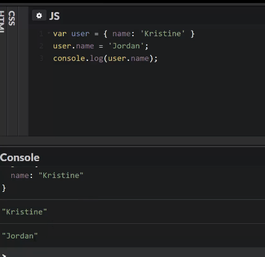
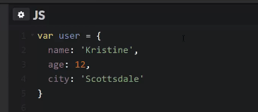
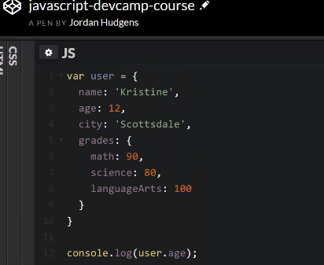

# MODULE 04 - 009: JavaScript

## Objects

---

## Video lesson Speech

This guide explains how to work with JavaScript objects. This will 
include: how to define an object, how to parse values from an object, 
how to work with nested objects, and how to add new key/value pairs on 
the fly.

****

This is going to be a very exciting lesson. The reason for it is because we are going and talk about javascript objects now. As you go along your javascript journey you are going to discover you're going to be using objects all day long. Objects are used for all kinds of different programs for all kinds of different frameworks for working with functions we're working with each one of the variables data structures everything like that. 

You're going to use objects for and the reason for it is because it has one a very nice syntax but it also gives you an ability to query data and to set data and also to create a blueprint for your object. And that may sound a little bit abstract and so we're going to go through a basic example. 

I'm going to create a variable here called user and the syntax for this is to use curly braces. And so I'm going to say var user and inside of it I'll just go name and then it'll go Kristine. And that is all I have to do.

```javascript
var user = { name: 'Kristine' }
console.log(user);
```

So if I console log this. Notice also I didn't put a semicolon after `var user = { name: 'Kristine' }`. Now if I run this it's going to print out the object. Now that doesn't seem like a big deal but that means that our syntax is right. But now I can do object or user name so I can actually call this key inside of it. It will look like this

```javascript
var user = { name: 'Kristine' }
console.log(user.name);
```

And now you can see it prints out Kristine.

This gives us the ability to call with this decimal type notation and actually call and reference points inside of the object. This is something that is very powerful and let's say that we want to rename something. 

```javascript
var user = { name: 'Kristine' }
user.name = 'Jordan';
console.log(user.name);
```

Now if I run this, you can see that that object has been changed.



What I did was I reset the name and got rid of Kristine put Jordan instead called it. Now we're referencing that new name. That's a very basic way of working with objects. Now let's get into a little bit more of an advanced example. The syntax whenever you're defining just a single key-value pair and that's what you have here. You have a key on the left-hand side followed by a colon followed by whatever the value is. Whenever you have just one it's fine for you to put it on one line. But when you have multiple then usually you're going to want to put this on multiple lines just like we're doing in the example below. Now, as you add more items or as you add more key-value pairs put a comma at the end and then add your next one. Here I'm going to say age is equal to 12 and city is equal to Scottsdale. 



Now I can reference age. Run this again and it returns 12. We could also set city this same exact way. I won't go through that because that's what we just did. But you can play around with these so you can get familiar with the syntax.

Essentially what this is doing is it's giving us the ability to create an object with multiple values. Each one of those values has something inside of it that we can reference whatever name that we choose to give it. This makes for a really nice interface and like I mentioned at the beginning you're going to be using this syntax all day long as you build javascript programs. Now in addition to this, this is a very basic type of object. Now let's get into a little bit more advanced type work. If I do a comma after Scottsdale I'm going to show how we can actually have nested objects so you can put an object inside of another object.

This is something that is very commonplace for things like API development where you need to be able to group items inside of other items. Here I'm going to say grades and from there we're going to use the same exact syntax so I'm going to use curly braces again. We started with curly braces when we assign the variable and then we put our values grades is still just a key for our user object. But now grades has semicolon but instead of something like a string or a number we're putting another object right there. Here I can put more keys and more key-value pairs so I can say math and we'll say 90 and then science and we'll call 80 and then Language Arts we'll put it at a hundred. 



The way that you'd reference this may seem intuitive but maybe not depending on your experience with it. But just like we able to call age if we want grades all we have to do, is traverse the object so we're calling grades. If I were to console.log that it's going to print out each one of those grades. Now if I want a specific grade it's the same exact way we picked up age. So if I come here and now I want to grab math I just type drop math hit run and it prints out 90 which is the value for math. 

Notice what we did there, we started at the user object then we looked for grades which also contains an object inside of it as its value. And then we grabbed math and we finally got the value we wanted. Now, this is cool but it gets even better. One thing that happens a lot is as you're building objects you need to dynamically build them on the fly. Let's say that Kristine got a new class and so we need to add a grade dynamically. We can't come back in and change what's already there. We need to actually update it which is something that could happen in a program. 

What I can do is say `user.grades.coding = 99;` What this is going to do is it's going to add a new key-value pair inside of grades. In order to add something we don't have to come back into the user variable and add it, we can actually do it at runtime.

I think that's something that is pretty neat. Now, if I say user grades and if I run this you can see right here, that now our object of grades has coding language, arts, math, and science even though it didn't start out with it. We're able to define that and add it as our program was run. That is something that one it's pretty cool but also the further you go along in your javascript development journey you're going to see objects used all over the place so this is something I definitely recommend for you to experiment with. 

Build your objects. Try to build all kinds of different combinations of putting objects inside of other objects finding out how to parse them. And that is going to help you out quite a bit as you go through this course as well as when you start to build out real-world javascript programs.

```javascript
var user = {
  name: 'Kristine',
  age: 12,
  city: 'Scottsdale',
  grades: {
    math: 90,
    science: 80,
    languageArts: 100
  }
}
user.age = 13;
user.grades.coding = 95;
```

## Resources

- [Source code](https://github.com/rails-camp/javascript-programming/blob/master/section_b_10_objects.js)


****

# Coding Exercise

```js
/* Coding Exercise

update the user grades to add an english grade that is 87 */


var user = {
  name: 'Kristine',
  age: 12,
  city: 'Scottsdale',
  grades: {
    math: 90,
    science: 80,
    languageArts: 100
  }
};


```
