# MODULE 04 - 018: JavaScript Exercise

## Getting the Average from an array

---

## Video lesson Speech

In this javascript coding exercise we're going to walk through how we 
can get the average from an array and we're going to see how we can 
leverage some functional programming mechanisms in order to do that.

****

So if you have an array that looks something like this `[1, 2, 3];`. What I want to be able to do is to take any number of values and add them up and then divide them. So if you're a little bit rusty on your sixth-grade mathematics then the way that you get an average is by totaling up each one of the values so we're going to grab the sum of the array and then we need to divide that sum by the total number of elements. 

So, in this case, it would be three. And so the average of this specific array is 2 and we're going to see how we can perform this process and do it in as efficient a way as possible. 

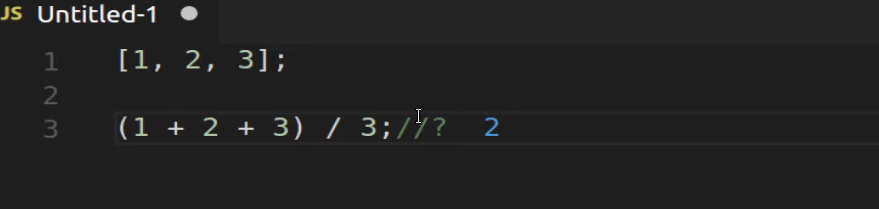

So if you are following along and you want to actually learn this and really work through it what I highly recommend is that you pause the video right now and you go and you try to build this out yourself and then afterward come back and watch the solution that I personally built out. 

So now in my solution, this is the way that I'd personally do that. There are a number of ways to get the average from an array and I don't want you to use any third-party tools or any kind of mathematics library in order to do this. Because, I want you to understand how to work with a collection, and then how to perform computations on it because this is going to be something you're going to need to do in coding Interview exercises and also just in your day to day development. 

So if you were to ask me how to get the average from an array in javascript. What I would do is create a function called getAverage and I'm going to use an arrow function for this and it's simply going to take in a single variable argument so I'm going to say I want to accept an array as an argument and then I'm going to use an arrow function. Now inside of here, this is where all the magic is going to happen. This is where I'm going to create a sum that's going to tally up all the values inside of the array that got passed in, and then I'm going to divide it by the length. 

Now, there are a number of ways you could do this. You may have done something if you tried to do this yourself, you may have done something like this where you created a variable where you kind of tried to keep track. So, you might do something like const total or something like that. Started it off at zero and then said array for each and you created some kind of for loop and then from there, you try to tally up each one of the values. So you said total and then you incremented that total by each element and that would have been a perfectly fine way of doing that. 

```javascript
const getAverage = arr => {
    const total = 0;
    arr.array.forEach(element => {
        total += element
    });
}
```

And if you got the answer where you're able to create your sum and then create your average then that's perfectly fine and I would not say that that's a wrong way of doing it whatsoever. But what I want to do is show you a different way of doing that, I want to show you a functional way. 

So I'm going to use a tool called reduce and so this is a function specific to JavaScript and before we even get into that what I want to also walk you through because when it comes to these solutions it's really to me. The goal is not just to give you the answer that would be pointless. If that was really the case I would give you the different instructions and then I'd just send you the solution and just post that and that would be all there was to it. To me, there's no point in that, I want to impart to you the way that I personally would walk through the solution and how I would see other professional developers do it. 

If I were to give myself or some other developer that's experienced this exact problem what I usually would see them do and what I do personally is walk through their solution without actually getting into the code. So I would do something like this if I was told to get the average inside of it. I would write some pseudo-code so I'd say Okay the first thing I need to do is I need to sum the values from the array. So right there I know the first step, then from there, I need to get the length of the array and then I need to divide the full length of the array sum by the length. 

That is right there with those three lines, that is the pseudo-code for this program. 

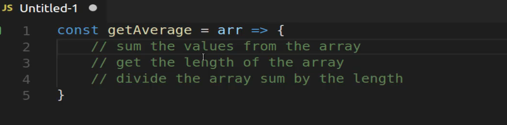

So this entire program needs to first sum the values, then get the length, and then divide the array by that length. Now something that I've seen and this is a very big distinction between experienced developers and new developers. Not to say that there's anything the matter with getting into this because I remember when I first started developing I struggled through a number of different problems. And what I saw when I was younger and I started to try to build out solutions like this I would just stare at the screen for a little while and that really did not accomplish anything. 

One thing I noticed when I started paying attention to the experience developers I was learning from, was that they very rarely simply stared at the screen but instead they would do things like this. They would write out the process even if they weren't writing code they would say Okay I want to do this first, then I wanna do this, and then I want to perform this other task. And what that does is it gives them a mental framework for being able to build out the solution. So let's first take this first process and I'm going to separate these out just so we can have a really nice distinction on how to build this out. 

So the way I'm going to sum these up is I'm going to use the reducer process so I'm going to say const reducer and set this equal to a function. So I'm gonna say total and then `currentValue` and I'm going to use an arrow function for this where I just say total plus currentValue. And just in case you're wondering right here this is just some boilerplate code and these names are not special. I want to be very clear whenever I'm working with Special Reserve names and when I'm not. So if I wanted to I could say that this was X and Y Z and this was y and z. 

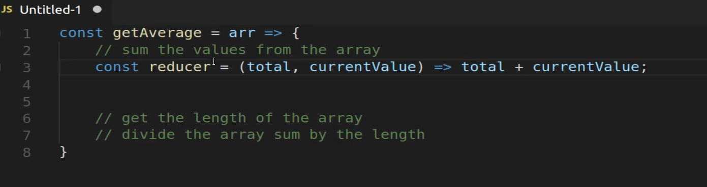

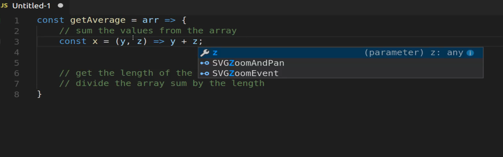

None of the names that we just used are reserved or anything like that, they're simply just descriptive names. What we have done here is we've created a function called reducer. Reducer takes in two arguments a total, a currentValue, and then it runs this process where it tallies the total plus the currentValue. Now what we're going to do with this reducer now that we've created it and we've stored it in a variable we're going to create another variable here called sum and set this equal to arr which arr right here is just whatever array we pass in to get average. 

I'm gonna say `arr.reduce`. Now reduce is a reserved word so reduce is a function that is available to the array class inside of JavaScript so any array you can call reduce on. And what reduce does is its argument is a function so you need to pass reduce a function. And so let's actually look if you're following along with vs code you may see this as well 

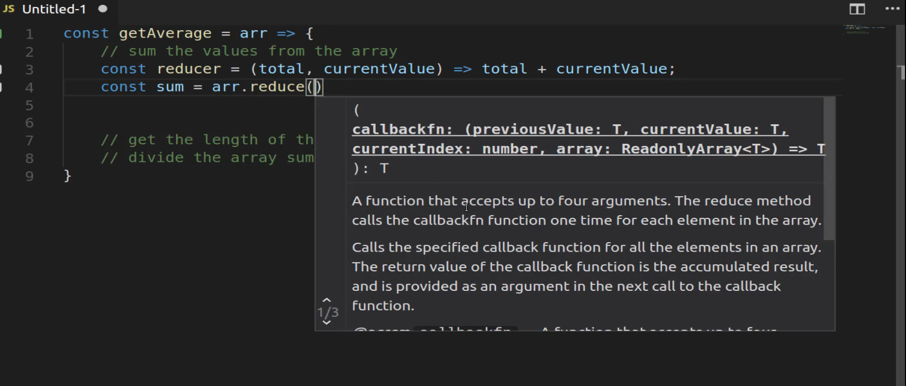

It says a function that accepts up to 4 arguments. The reduce method calls the callback function one time for each element in the array so it calls the specified callback function for all the elements in an array and the return value of the callback function is the accumulated result.

Now if you are not familiar with reduce or Javascript or if you're not in the practice of reading the documentation that may all have sounded like a weird alien language so let's walk through an example of exactly how this works. So all you have to do for reduce is you pass it in a function so remember we just created this nice reducer function. So let's see and I'm not going to save this. If you follow me on a lot of tutorials you may notice I do this a lot and it's because I'm in the habit whenever I'm working on my own applications to save the file constantly. 

But right now I'm not trying to save the file because I simply want to show you the output. So if I create some kind of an array so let's say that I called getAverage and inside of that we'll use our example of just 1, 2, and 3 and actually let me call it like this and it says undefined. So it's because I need to return sum so there you go. Okay, so now we get six. 

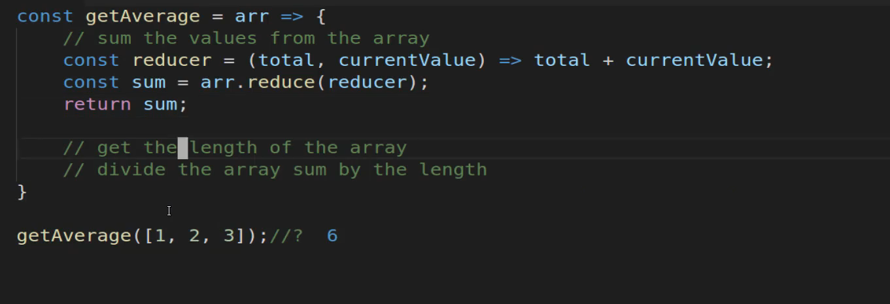

How in the world did we get 6? Well, let's walk through it. We created a reducer function here that reducer took in a total and current value. Now the thing that's kind of weird about this if you've never seen this before is you may have noticed we're not passing in a total or a currentValue. That's what the reduce function does, so when you pass in a function to reduce it expects this kind of setup where you're passing in the first argument is what is called the accumulator, so what it does is it accumulates the value. 

The second argument here is going to be whatever the current value is of the array that you're working with. Now if you're still confused let's actually get rid of this reducer and say you know I'm not going to pass in this weird reducer thing that I just created I'm going to grab all of these values and let's just paste this in directly. 

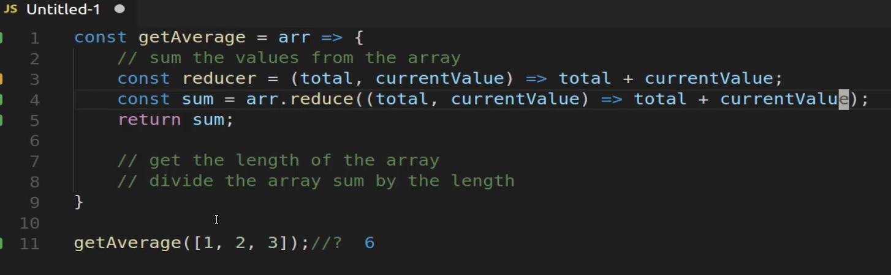

So I'm going to paste in a total and a currentValue, so I'm passing in these arguments and then I'm performing the exact same task so I can even get rid of this const reducer. And you can see down here that we're still getting the same value. 

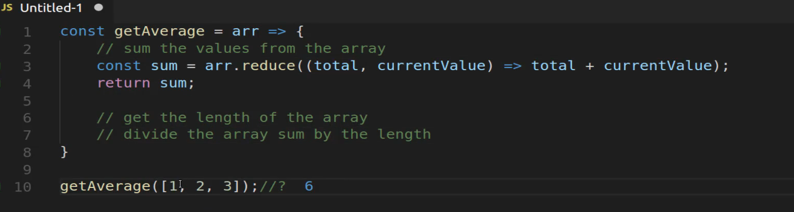

So what reduced does is it's taking in that total it's using that as the accumulator which means that it accumulates with each time that we go through, it's going to take the current value and then it's going to add it to the total. Now if you still don't believe me let me add on to this list, so I'm gonna say 3, 4, and 5. Now notice here that we're adding it up, so now we're at 15. 

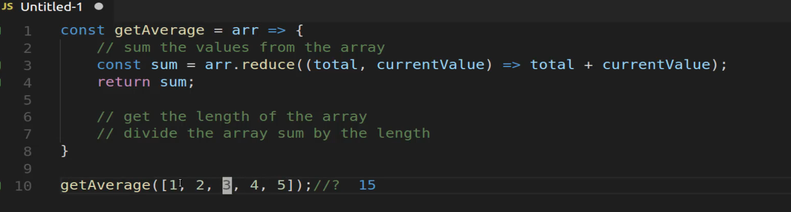

So it is taking each one of those values, so if you add each one of these up this does equal 15. Now reduce is not limited to doing sums if that was the case. That wouldn't be very helpful because then we could just call sum method and it would take everything in, it has to be more flexible than that. 

Imagine that we switch out this plus sign with a multiplication symbol. Now you can see on line 10 it switches the value is now 120. 

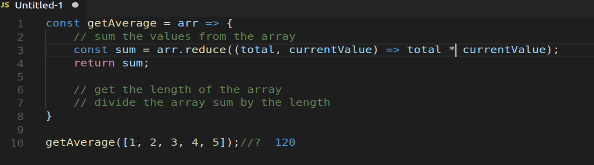

So this accumulator here, this total, is taking the current value, and then it is now multiplying it. If I switch it back to the plus you can see that it's back at 15. 

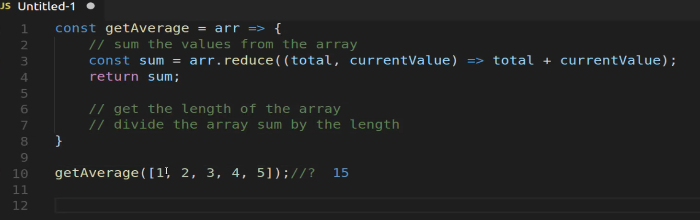

Let's walk through exactly what's happening here. When we start we're starting with a total, let me make this comment just so it doesn't give us an error. So the total, when you start off, is zero and then from there, we're going to take that current value. And in this case, when we're passing this in the current value is 1 just like we see it right there in the getAverage so that's the first time. Now we add 1 + 0, well we know 1 + 0 = 1 So that's now the current value of total. 

So what reduced does is iterates through the entire collection. So now it keeps track of that total so now the total is going to be 1 and that current value because we're now iterating through. Now we're at 2, so the current value is now 2 which means that the return value is going to be 2 + 1, so it's going to be 3. And then the next time it's going to be total which means our new total is going to be 3 because that's what the return value was it's accumulating and then the current value is now going to be 3. And as you may guess it's going to tally up 3 + 3 = 6 and then it's going to continue on from there.

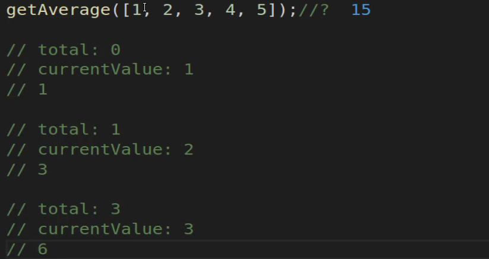

So it iterates each time so it's going to be just like you created some kind of for loop or something like that. It's going to keep track of that value it's going to loop through and it's going to keep on adding on. And it's going to be adding on in our case, but it also could be multiplying, it could be dividing, it could be doing anything you want. You can have this function be very flexible with whatever process it is and you'll just keep track of that value. 

Now I'm going to create our reducer function again because I think it's a little bit easier to keep track of that. So I'm gonna say `const reducer =` and then just we're just going gonna take these values again and then paste it up here and now I can just pass in reducer. This is one of the reasons I love javascript because we can store entire functions and variables and then pass them in just like we're doing right here on line 4. 

So there's no difference between the code we used to have and what I have here. This is just a little bit easier to read and keep track of and also make changes to. 

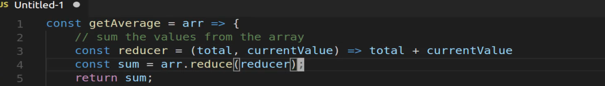

Now that we have that, we know this is working. So right now it's almost like we have sum function this is going through and it's returning the sum. If you notice we have everything we needed first step 1, now we need to get the length of the array. 

Well, how do we get the length? We could get rid of the sum and if we wanted to we could just say `return arr.length` and this is going to return 5, because there are 5 elements in the array so that is what we're wanting, we now know how to get the length of the array. 

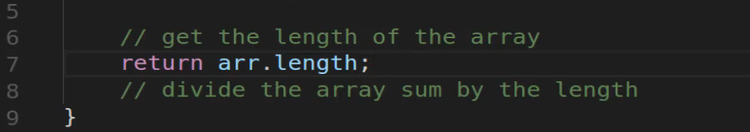

Now we don't want to return this so I'm going to move this down and so move it into the next step. So I want to divide the array sum by the length. So I can do that by just saying sum which is our variable divided by the array length. And as you can see right here we have our entire working program. 

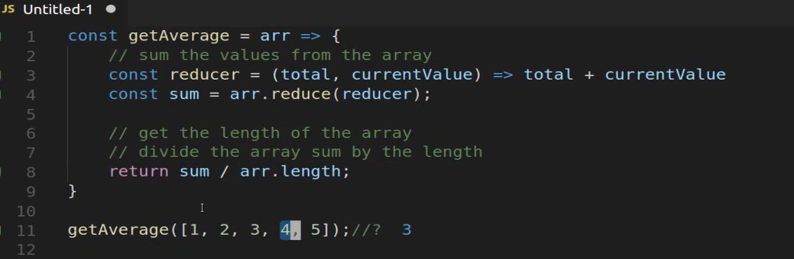

So we now have the ability to come here and get the values that we want. We have an array of 1, 2, and 3 that returns the average of 2 which is the correct average. Now if we're to add any other value so just a bunch of random numbers here you can see that the average keeps on updating and that is perfect. 

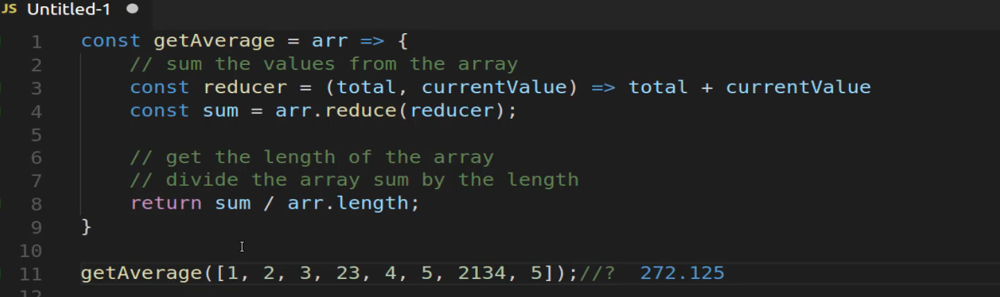

So if you take the values, or you take a list of 1, 2, 3, 23, 4, 5, 2134, and 5. It returns an average of 272.125. So our function of getAverage is working perfectly and we're leveraging a number of different programming components here. We've built an arrow function then we're calling it. We have created a reducer and we're using the reduce function so we're passing our reducer into reduce. So we're accumulating the value that's how we're creating the sum. And then from there, we're just taking our sum and we're dividing up by the length.

So I hope that if you went through this, the solution makes sense and it helps to give you a little bit of clarification on what functions like reduce and some of the functional components of JavaScript do to help you understand how you can apply it to your own programs.

****

## Resources

- [Exercise Solution](https://github.com/bottega-code-school/javascript-code-exercises/blob/master/data-structures/get-average.js)
- [Mozilla reference on Javascript Reducers] ([Array.prototype.reduce() - JavaScript | MDN](https://developer.mozilla.org/en-US/docs/Web/JavaScript/Reference/Global_Objects/Array/reduce))
