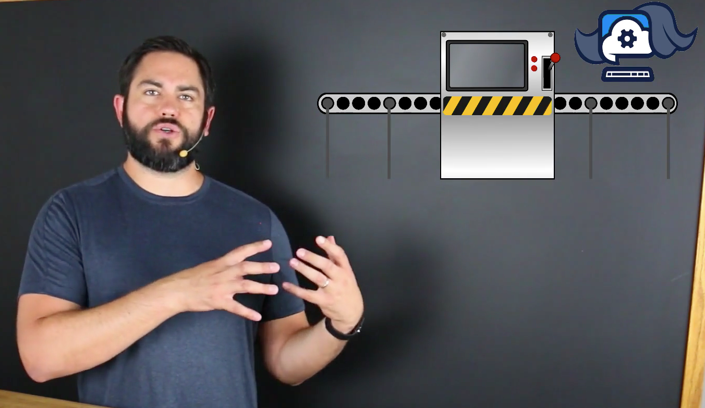

# MODULE 04 - 025: JavaScript

## Functions (1) - Introduction

****

## Video Lesson Speech

In this section of the course, we are going to dive into JavaScript functions.

****

Now, `functions` in JavaScript are one of the most critical topics related to learning how JavaScript works and how you can build full-fledged programs. 

If you've never heard of a function and you're new to programming, the way a function works is it's kind of like a machine.

This machine has the ability - you can think of a machine on an assembly line or some kind of plant - this machine can take information in and then it performs all kinds of processes. 

These are processes that you tell it to perform, and then it returns a different value.

So it takes in some kind of value and then it returns a different value. If you can understand that core concept related to functions, it's going to help you as you learn JavaScript as a whole. 

I once had a teacher tell me that if you can understand an input and an output for a program, you can understand anything. That is definitely the case when it comes to functions.

I think one of the best ways, before we get into the code, of understanding how functions work is to look at a real-life example. 

Let's imagine that you're building out a website that has `authentication`, which means that it's like pretty much every website that you go to like Facebook or Twitter where you have to type in your email address and then your password. 

Then if you typed in the right combination: they'll let you in, let you see your profile, and go through the application. Well if you were to build that out, imagine a scenario where you need to build that out from scratch. 

There are a lot of processes that have to take place:

- You have to connect to a database  
- You have to be able to read data in from the form  
- You have to perform conditionals to verify the email address  
- You need to check if it's in the database  
- You need to verify it matches the password  
- Then you have to redirect the user  

If they entered the right information, they go to their profile page. If they entered the wrong information, you have to let them know they typed in the wrong username or password. 

Well, that's a lot of steps. What a function can do is wrap all those up into a single line of code. 

Imagine if you had all those steps - say it's a dozen steps needed to authenticate a user. If you needed to log users in on multiple pages, without functions you'd have to copy and paste that code into every single file that you wanted to authenticate the user in. 

That is really a bad practice because then imagine a scenario where you have to change one of those lines of code. You'd have to remember every single place that you entered that code and then make that change everywhere. 

That's very error-prone, and you really would not have a good time programming following that process. 

What a function allows you to do is take all of that code - each one of those steps involved for logging in the user - and place them inside of a single function. 

Then anywhere else in the program that you want to check if a user can log in or not, you simply call that one function. You pass in the email address, the password, and the function runs automatically every time you call it. 

I know that may seem a little abstract if you've never worked with it before, but I think it helps to have a real-world scenario for when you'd want to use a function. 

Now that you have a high-level idea of how it works, let's get into the code and start building out our own functions in JavaScript.
