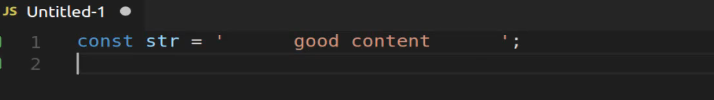
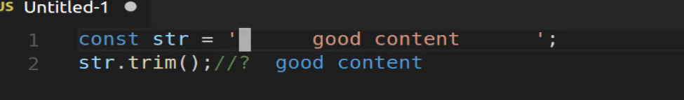
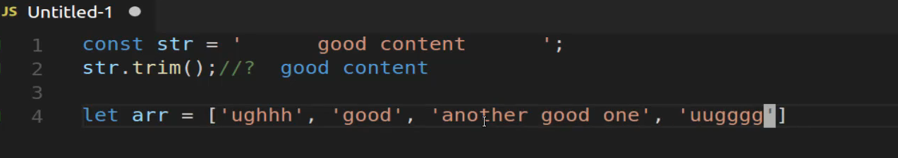
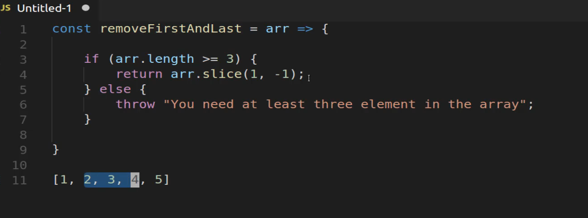
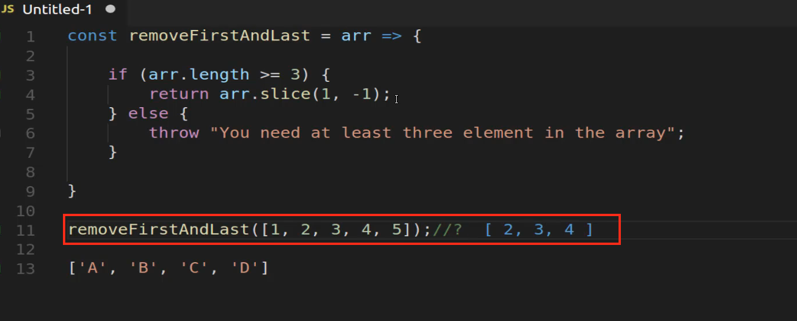
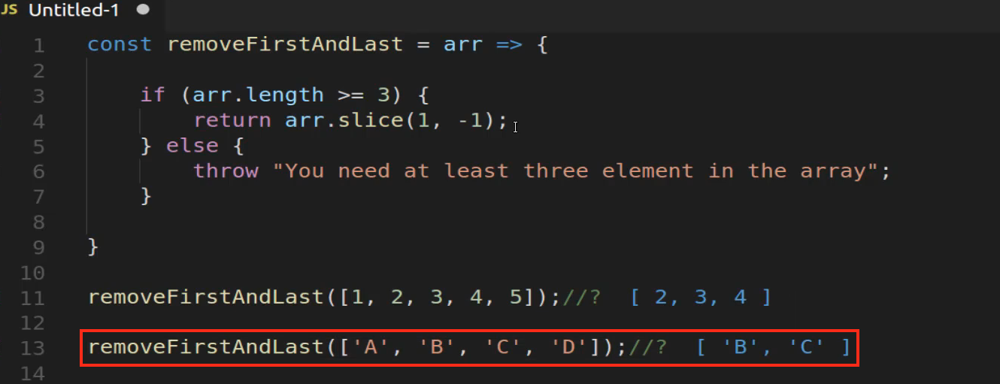
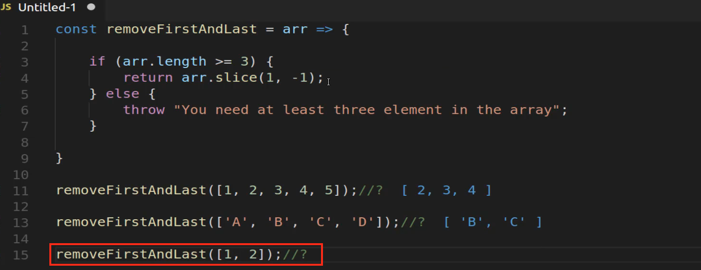
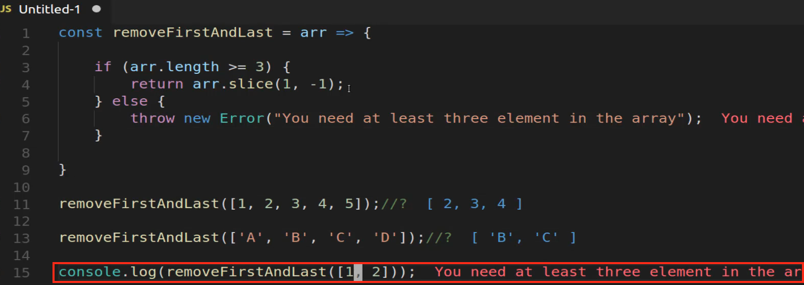

# MODULE 04 - 035: JavaScript Exercise

## Removing the first and the last elements from an array

****

## Video lesson Speech

In this JavaScript coding exercise, I want to walk through how we can create a trim function for arrays.

****

Now if you've never heard of the trim function it is a function that's available to strings in JavaScript. So if I were to do something like this where I say const and then just some kind of string and then inside of it have a lot of wasted space. A bunch of spaces and then I have some good content that I actually want followed by a bunch of bad spaces again that are pointless.

If I want to, I can say str.trim and it's a function and if I call this you can see that it returns good content 

With that what the trim function does is it gets rid of everything in front of good content and then it gets rid of everything after it so that is incredibly helpful. Now what I want to do is to have the same kind of behavior with an array so if I have some kind of array here so let's create a let variable here and say array and then inside of it I have some bad content and then I have something good and then another good one and then I have some more ugh content here. 

What I want to be able to do is to call some type of function that works like trim where it removes the ughh content or it removes whatever is on this side and also whatever is on this side of the array. Essentially it's going to drop something from the first and the last part of the array and then return only what's in the middle.

If we have one item in the middle it's going to return that one item, if we have 100 items in the middle it's going to return 100, it has to be flexible so if you're going through this as a coding exercise you are cheating if you are simply saying oh yeah get me the very next item or the item that is the zero-ith index and then just return that. That's cheating because we also need to grab any other items. So the goal of this is to drop the first item and then the last item from the array. 

If you're going through this and you're working on it as a coding exercise pause the video right now and then work on it and then when you come back then we'll walk through the solution. 

So the way that I will do this is I'm going to create a function here, I'm going to create an arrow function called remove first and last. So `removeFirstAndLast` and it is going to take in an array as an argument and if you follow the Guides that I do quite a bit you may start to think that this arr is some kind of reserved word. It is not, we could call it list, we could call it collection, we could do anything we want. I just like calling it this because this is what I do for a number of my program so I know whenever I see that arr I know it's short for array and that it's usually used as an argument in the programs that I use but you can use anything that you want. I just want to make that clear if you follow a lot of my guides you may see that and think that it's a special word. It's not, it's just a nice clear way of seeing what an array is as an argument. 

So what I'm going to do is I'm going to first have a little bit of error checking here, so if you want to remove the first and last item. Let's imagine that we have a very basic array. If we have an array like this `[1, 2, 3]` and we want to remove the first and last item when we want to return what's in the middle with that tells me is we cannot have an array that has any less than 3 items. Because if you tried to pass in an array like this you'd grab that first item and the last one you would remove them and then you'd be left with nothing you'd be left with an empty array. 

So I think that we should have some error checking here that makes sure that at least three items are passed and so I say if the arr which is our argument here of the array. So if the array length is greater than or equal to 3 then I want you to perform anything inside of here. So let's say this is our TODO and then else I want to say I want to actually throw an error that says you need at least three elements in the array and this is very helpful so if you've never seen this kind of process what we're doing here is we're adding a validator and so we're making sure that we at least have enough elements to work with if not we're going to throw an error. Now if you are a relatively new programmer you may think that errors are a bad thing but they're really not. There are many times in the programs I build out where I build my own custom errors like this so that I know or other developers that are using my programs know that they've made a mistake in how they've used one of my programs. 

So for example right here imagine that I was building a javascript NPM module and it had this goal where it simply removed the first and last elements. Well if someone's coming to the program and they call this and they accidentally call it with two items and then they get either undefined or something like that they may not know what their problem is but if I throw an error and I give a really nice descriptive error message just like this then what that tells them is it explains exactly how they need to fix that. 

It's very important whenever you're building out programs especially ones that other people are going to use that you give a nice descriptive error message. I would definitely give a recommendation when you get into more advanced programming. It's not just for JavaScript this could be for Ruby for python for anything if you're building out some kind of program you need to make sure that you are checking for errors and you're validating input and that you're giving really explicit messages whenever that input is not met.

So now let's come in and we only have really one line of code that we need to build out for this to work properly. So what we need to do is I want to say I am willing to return the array and then I'm gonna use the slice function in JavaScript and I'm gonna say 1 and then -1. So what this is going to do is it is going to start at the index of 1. Now don't get the 1 confused with the first element. This means index of 1 which is actually the second element. Then it's going to go to the very end of the array and it's going to remove that element. 

So imagine that we have an array like this `[1,2, 3, 4, 5]` and so if we had an array like this. What array slice 1 and -1 is going to do is it's going to grab this first element and it's going to say Okay, I want everything from here all the way until the 2nd to the last one because we gave -1. 

The way that slice works is it takes the first index and in this case, we're passing in 1. So 2 here has an index of 1 and I know that may sound confusing. Let's come here and add a string array `['A', 'B', 'C', 'D']`. So, in this case, A has an index of 0, B has an index of 1. So if we were to run this exact same process here what it would do is it would skip A because this has an index of zero.

It would say OK I want to start at an index of 1 and then it's going to go all the way up to the second to the last item because D here represents our  -1 index because whenever you pass in a -1 it takes the array and it moves backward so D is a -1. So we want to have all the elements to the left of that so it's gotta stop at C. So, in this case, it's just going to return B and C and that's all we want to do. 

So now let's actually test this out, so I'm going to say `removeFirstAndLast` and let's pass in this element `([1, 2, 3, 4, 5])`. And let's see if this works. Yes so, in this case, we get 2 3 and 4 so as you can see it dropped the 1 and dropped the 5. 

And let's do the same thing here. So here I'm going to say `removeFirstAndLast` and pass in the argument this `(['A', 'B', 'C', 'D'])` and now you can see that we get a [ 'B', 'C']. 

Now let's also make sure that our error is working. So I'll say `removeFirstAndLast`and let's just pass in `([1, 2])` and let's see if our error is working. And look at that we have nothing there that's actually going on because we have less than three elements. 

So if you want something to actually be explicit here say `console.log(removeFirstAndLast([1, 2]));`. So here we're actually getting our error. So I needed to add a throw new error right there and so now you can see this is working.

Imagine that you are building this out for someone else, so if you are going through this as just a regular javascript coding exercise technically you could have built the entire program like this where you simply said return array slice 1 to -1 or something like that, and that would work fine. But I also wanted to show you a little bit more of an advanced approach because if you're building out something that other people are going to use, then you want to take into account what happens when they give you some values that you may not have expected or that array slice would not work with. 

That's exactly what we're doing here with this else condition. So we're saying that we want to remove the first and last item. But if we only passed two in then we need to pass an error and say right here just like we're seeing what is being returned where it says you need to at least have three elements in the array. 

So I'm really happy with this, this is exactly what I'm wanting. If I were to build this out for some type of program like a react application or a view application or anything like that this would be perfect because if I call this remove first and last function and I didn't pass in enough elements it would give me a really nice error message and explain that hey you need to pass in some more elements if you want to call this and then I'd be able to do that and fix the bugs. 

Nice job if you went through that, you now know how to safely remove the first and last elements from an array in JavaScript.

****

## Resources

- [Exercise Solution Code](https://github.com/bottega-code-school/javascript-code-exercises/blob/master/data-structures/remove-first-and-last.js)
