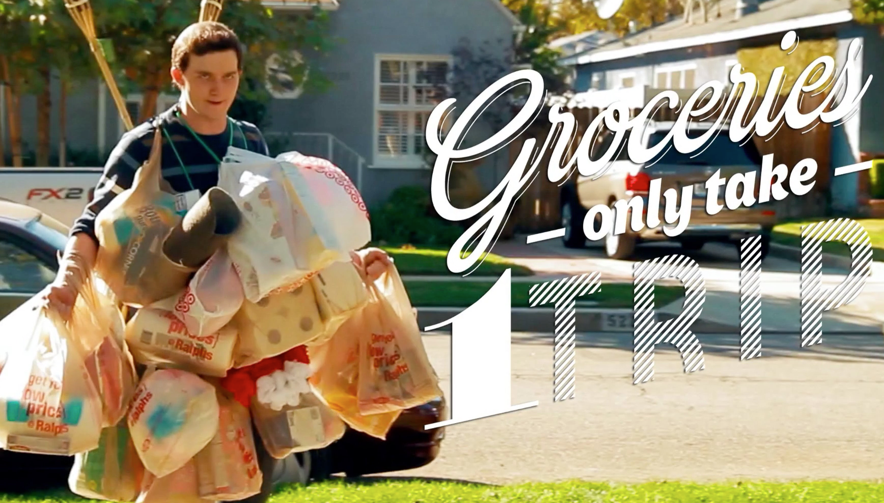

# MODULE 04 - 036: JavaScript

## Arrays (0)  - Introduction

---

## What Are Arrays?

Arrays are **ordered collections** that allow you to store multiple values in a single variable.   

Unlike regular variables that hold a single value, arrays group related data 
together, making it easier to manage and manipulate lists of items.

### Why Use Arrays?

- Store multiple values efficiently

- Maintain order of elements

- Access and modify data systematically

- Essential for handling API responses, databases, and dynamic content

---

## Real-World Analogy: Grocery Shopping

| Single Variable                     | Array                                         |
| ----------------------------------- | --------------------------------------------- |
| Like carrying one item in your hand | Like using a shopping cart                    |
| `let fruit = "apple";`              | `let fruits = ["apple", "banana", "orange"];` |
| Limited to one value                | Holds multiple related values                 |

**Key Idea:** Just as a shopping cart organizes groceries, arrays organize data for better handling.

---

## How Arrays Work

#### Basic Structure

An array is defined using square brackets `[]`, with elements separated by commas.

```js
// Array of strings  
let colors = ["red", "green", "blue"];

// Array of numbers  
let temperatures = [72, 68, 74, 80];

// Mixed data types (less common, but possible)  
let mixedArray = [true, 42, "hello"];
```

1. **Zero-Indexed** – The first element is at position `0`.

2. **Dynamic** – Arrays can grow or shrink as needed.

3. **Ordered** – Elements stay in the order they are added.

---

## Visualizing an Array

```js
Index: 0 1 2  
Value: "red" "green" "blue"  

 | | |  

Array: ["red", "green", "blue"]
```

**Example:**

- `colors[0]` returns `"red"`

- `colors[2]` returns `"blue"`

---

## Common Use Cases

1. **Storing Lists** – Names, tasks, products.

2. **Handling API Data** – JSON responses often come as arrays.

3. **Looping Through Data** – Process multiple items efficiently.

```js
// Example: Storing user names  

let users = ["Alice", "Bob", "Charlie"];


// Example: API response (simplified)  

let apiResponse = [  
    { id: 1, name: "Product A" },  
    { id: 2, name: "Product B" }  
];
```

---

## Video lesson Speech

In this section of the course, we're going to talk about the array data structure in JavaScript.

****

Now, if you've never heard of an `array` or you've never used them before at a high level: what an `array` is, is it is a collection. So it gives you the ability to store a collection of data. So whereas with a `standard variable`, so say when you store a `string` like a name that is just a single data object it's a single string. 

Well, what happens if you need to store a large number of names. Well, that is where arrays come in. As you go along your coding journey, you're going to discover that arrays are used throughout the entire JavaScript world. 

Any time that JavaScript is going to store a list of items, it's typically going to be in an array or a data structure very similar to it. For example, if you're building out a directory site kind of like a Yellow Pages or a Yelp kind of site, and you contact an `API`. That API is going to send you a list or a collection of items back. 

The way that JavaScript is going to interpret that is it's going to place that inside of an array. So if you're calling a database, if you're calling an API, if you're getting any kind of collection, JavaScript is just about always going to put it into an array. That's why it's so important to be able to understand what arrays are and also how to work with them.

The real-world analogy that I like to give to really help explain and solidify why arrays are so important is: imagine that you're going to the grocery store. If you go to the grocery store for just a few items, then you can just pick those up put them in your hands, and then carry them to the cash register. 


If you go and you have 100 items to get or even 12 items to get, any number that you can't really carry in your hands, you need something to put those into. You need a shopping cart typically. 



Well, inside of JavaScript that's what you use `arrays` for. You can really only store so many items inside of a `variable`, such as just you can put one number in a variable, or you can put one string in a variable. You can only really have so many variables before it starts to get a little messy. 

If you have the same data type, so if you have a bunch of usernames or restaurant listings or blog posts, then typically you're going to store those in an array. In the same way that when you go to the grocery store, it starts to get very unwieldy if you started carrying all of your groceries just in your hands. 

Same thing holds true for JavaScript. You want to be able to have a data structure that you can wrap all of those objects in, then you can store that single array inside of a variable, and then you can work with it. With all that being said, let's dive into the code and start building out some arrays in JavaScript. 
