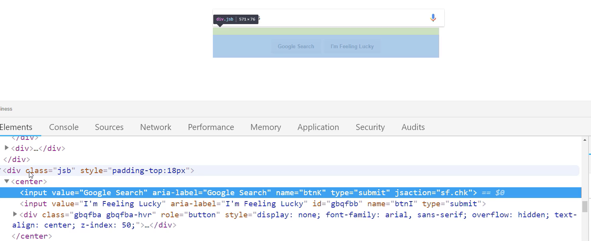

# MODULE 04 - 045: JavaScript

## Automating Tasks (1) - Running Google Queries

---

1. DOM Selection Methods

2. Google Search Element Structure

3. Input Field Manipulation

4. Button Click Simulation

5. Practical Automation Workflow

****

## 1. DOM Selection Methods

### Modern Selector Approaches

```js
// Preferred method (standard JavaScript)
document.querySelector('.gLFyf'); // Search input
document.querySelector('.FPdoLc > center > input[name="btnK"]'); // Search button

// Console shortcut ($ equivalent to document.querySelector)
$('.gLFyf'); 
```

**Selector Best Practices:**

- Prefer `querySelector` over class-specific shortcuts

- Use Chrome DevTools to verify selectors

- Avoid deep childNode traversal when possible

****

## 2. Google Search Element Structure (2025)

### Updated DOM Hierarchy

```js
.gLFyf (Search input)
.FPdoLc (Form container)
  ├── center (Wrapper)
      ├── input[name="btnK"] (Search button)
      ├── input[name="btnI"] (I'm Feeling Lucky)
```

**Key Changes:**

- Old: `.gsfi` → New: `.gLFyf` (search input)

- Old: `.jsb` → New: `.FPdoLc` (form container)

****

## 3. Input Field Manipulation

### Setting Search Value

```js
// Standard JavaScript
const searchInput = document.querySelector('.gLFyf');
searchInput.value = 'JavaScript automation tips';

// Console shortcut
$('.gLFyf').value = 'JavaScript automation tips';
```

**Pro Tip:**  
Trigger input events for dynamic pages:

```js
searchInput.dispatchEvent(new Event('input', { bubbles: true }));
```

****

## 4. Button Click Simulation

### Reliable Click Methods

```js
// Method 1: Direct selector
document.querySelector('.FPdoLc > center > input[name="btnK"]').click();

// Method 2: Form submission
document.forms[0].submit();

// Method 3: Enter key simulation
const enterEvent = new KeyboardEvent('keydown', { key: 'Enter', code: 'Enter' });
searchInput.dispatchEvent(enterEvent);
```

**Why Avoid ChildNode Traversal?**

- Google frequently changes internal DOM structure

- Deep traversal breaks easily with updates

- Specific selectors are more maintainable

****

## 5. Practical Automation Workflow

### Robust Search Automation Script

```js
function googleSearch(query) {
  // 1. Select elements
  const searchInput = document.querySelector('.gLFyf');
  const searchButton = document.querySelector('.FPdoLc > center > input[name="btnK"]');

  // 2. Validate elements exist
  if (!searchInput || !searchButton) {
    console.error('Google elements not found - selectors may need update');
    return;
  }

  // 3. Set search value
  searchInput.value = query;

  // 4. Trigger input events
  searchInput.dispatchEvent(new Event('input', { bubbles: true }));

  // 5. Submit search
  setTimeout(() => {
    searchButton.click();
  }, 500); // Small delay for UI updates
}

// Usage
googleSearch('Latest JavaScript automation techniques');
```

****

## Updated Coding Exercise

```html
<div class="parent">
    <div class="decoy"></div>
    <div class="decoy"></div>
    <div class="target">You got this!</div>
    <div class="decoy"></div>
</div>
```

```js
// Modern solution using querySelector
const targetDiv = document.querySelector('.target');

// Alternative precise selection
const preciseTarget = document.querySelector('.parent > .target');

// Verify selection
if (targetDiv) {
  console.log('Found:', targetDiv.textContent);
} else {
  console.error('Target element not found');
}
```

****

## Maintenance Tips

1. **Selector Stability:**  
   Google changes class names frequently. Monitor:
   
   - Input field classes
   
   - Button hierarchy
   
   - Form structure

2. **Fallback Strategies:**
   
   ```js
   // Try multiple selector options
   
   const searchInput = document.querySelector('.gLFyf') || 
                      document.querySelector('[name="q"]');
   ```

3. **Automation Ethics:**
   
   - Respect robots.txt
   
   - Add delays between actions
   
   - Avoid excessive requests

****

## Resources

- [Google Search Selector Updates](https://developers.google.com/search/docs/advanced/guidelines/google-search-selectors)

- [DOM Manipulation Guide](https://developer.mozilla.org/en-US/docs/Web/API/Document_Object_Model)

- [Web Automation Best Practices](https://www.automationethics.org/web-guidelines)

****

## Video lesson Speech

****

#### Code Update

Google has updated its website, this is the way to call its new classNames.

Instead of running `$('.gsfi').value = 'JavaScript tips'`to input text into the search bar the updated command is `$('.gLFyf').value = "Javascript tips";`

And to perform a search `$('.jsb').childNodes[0].childNodes[0].click` has been updated to `$(".FPdoLc").childNodes[1].childNodes[1].click()`

****

Now one caveat I will say in this section is: I'm going to start with the first few videos teaching you more the fundamentals. We are going to build out these scripts, but they're not going to probably be things that you'll be doing on a daily basis. 

The reason for that is because I think it's important to understand exactly what's going on before we get to the more challenging topic. We will eventually get to LinkedIn and we'll see how we can automate the ability to follow a bunch of hashtags all at one time. That kind of thing. 

You could follow along with that easily by just typing out the code I type. I think if we take a few easier examples in the beginning, then whenever you need to create your own script completely from scratch, you'll have a lot better idea of how I went about it, as opposed if I jumped to the most challenging one right away. 

With all that being said, the goal is to create a script that types into this little search bar right here, and then hits enter. So this would be the same as if I did something like this so I said `some query`, and then clicked on google search. That is what I want to automate. I want to have this filled in and then I want to click on google search.  

Any time that I'm building out a new script like this, the very first thing that I do is I just try to figure out what kind of data I'm working with because that's the first step. Because we're first going to have to select the value, we're going to have to traverse through this `HTML document`. We're going to have to find the value we want and then we can work with that. 

If I were to `right-click` here, and click on `view page source`: this is all the code that makes up that Google front-end. Now that isn't very fun to go through. So what I do instead is I right-click and then click on `inspect`. You could also click `control  + shift + i`. 

I like to do that so that shows me exactly what I'm working with, and I'm going to slide this to the right. So it's a little bit easier to see. 


Now what this tells me is it tells me some details about the `input element`. Thankfully this element has a `class` in an `ID`. Those are two things that we could use and we could work with. That is the first thing that I know that we need, and this is going to be the easy part is actually setting the text. Then, later on, we're going to see how we can click the button. 

First, let's just make sure that we have a script so that we can do this. I'm going to use the class, but we also could use the ID. The only difference is, remember that an ID can only be placed one spot on the page and a class is you could put as many classes as you want. 

In this specific case, it doesn't matter because I know there is only one of these on the page. So I'm going to click here and I'm going to show you two ways that you can use a `selector` inside of a browser.

The first is to use this `$` syntax where I say `$` and then in parentheses, I go with a quote, and then I can just paste in the className that we grab. Now if I finish that off and hit enter you can see it returns that entire `DOM node`, which is this `input element` right there.


That is perfectly fine. Now the other way that could do this is writing pure Javascript. So I could say something like: 

```javascript
const searchBar = document.querySelector('.gsfi')
```

In this case, I only want to grab one so I can say `querySelector` and not `querySelectorAll`. Then use the exact same syntax and it will say `undefined`, but then if I find my search bar you can see it returns the exact same value. 


So everything that we did with that first syntax can be accomplished in regular Javascript. Now the key difference here is if you're building out in testing a real javascript code snippet, something that you're going to put in a javascript file, then you have to go with this syntax.

If you simply want to automate something in the browser then you can use this. This gives you a really nice and easy API for simply grabbing elements and then working with them. This video I'm going to use this syntax, and then in future videos, I'm going to show you how to use the other one. 

Let me just clear this off, and you can clear it by pressing `control + l`. Now what I want to do is I want to set the value, so I'm going to say: this class and then I'll say:

```javascript
$('.gsfi').value = '' 
```

Then let's just have a string. I'll say I want to search for JavaScript tips just like this:

```javascript
$('.gsfi').value = 'JavaScript tips'
```

You can see right up here. It now says javascript tips. 


What we did is we grabbed this value, we grabbed the search bar, and then we said I want you to change the value. So now we want to have this string inside of it. That is working nicely. Now that we have that, now let's go and let's find the button. 

This one's going to get a little bit trickier, but it's good because it's going to teach us how we can traverse that `DOM node`. I'm going to come here once again, click on inspect, and then google search and now you can see. That we have this Google search input. 


Now there is only one little trick to this, and that is: do you notice how there is not an ID or a className here? That means that we can't use our normal selectors. What we're going to have to do is we're going to have to it's called `traversing the DOM`, which means we're going to grab the element a little bit higher up. 

In fact, we're going to grab this `JSB class element`, and then we are going to search through the elements until we find the Google search ones. 



I'm just going to copy this JSB one here, and I'm going to use the same syntax. I'm going to say: `$('.jsb')` just like that. You can see that gives us the entire object. This is good, but we don't really care about clicking on this wrapper. As you can see when I hover over here that is highlighting everything. 


So we want to actually get only this Google search button. If you click here, you can see that button is inside of `center`, and that is where we can find it. So what I'm going to do now is I'm going to hit `up`. I can say: `$('.jsb')`, and now the function that I want to run is called `childNodes`. 

What this tells JavaScript and what it does in the browser is it says: "okay, thank you for bringing me this JSB here, but I'm actually interested in what's inside of it. I'm interested in what's nested there." So now if I click on that, you can see it returns a `NodeList`, and this NodeList has a single element called `center`. 


That's fine. We want to grab this element, we can see it has an index of `0`, so here I can say `$('.jsb').childNodes[0]`, and let's just treat this as an array. It's not technically an array, it's in a NodeList, but we can use this bracket syntax. Now we have our center object. 

Do you notice how if you come back here, you know how we started at JSB then we moved to center, so now it's like we've moved one level down? Now what we can do is see what childNodes center has. So I can say:

```javascript
$('.jsb').childNodes[0].childNodes
```

Now you can see we're getting closer. 


Now we have these three inputs here, and this first one is what we're looking for. This is the Google search. So in order to get what we actually want, let's just hit `up` once, and because that's a node list we can treat it very similar to an array. Now if I give `[0]`, we have exactly what we're looking for. 

We finally have that Google search, and now all we have to do is call the click function. So I can say: 

```javascript
$('.jsb').childNodes[0].childNodes[0].click
```

What javascript is going to do is it actually going to, it still has our javascript tips text here, and then it's going to call click on whatever element we've selected which is this button. 

Now if I hit enter. It clicked, it worked, and you notice we didn't actually have to do anything ourselves. Now it searched for JavaScript tips, so that is working perfectly. Now like I said at the beginning this is not an automation tool that you will probably be using directly, because usually it's just a lot easier to type into the search bar.


Hopefully, now you have a little bit more of an idea on first how you can find the elements that you want to select in the DOM in the browser. Then from there how you can traverse to elements you can't quite select as much along with being able to use functions such as selecting and then clicking. We'll see you in the next video where we're going to take a look at Instagram. 

****

## Coding Exercise

Use the querySelector to grab the div with the class name "target".

```html
<div class="parent">
    <div class="decoy"></div>
    <div class="decoy"></div>
    <div class="target">You got this!</div>
    <div class="decoy"></div>
</div>
```

```js
var query = deleteThisAndReplaceWithYourCode
```
