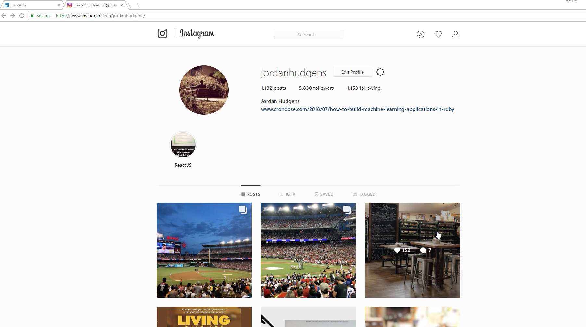
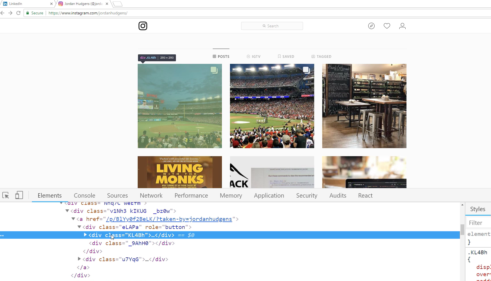
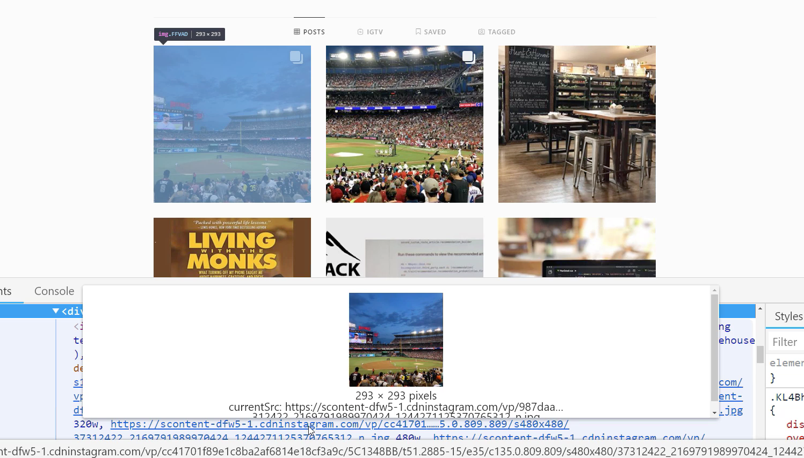
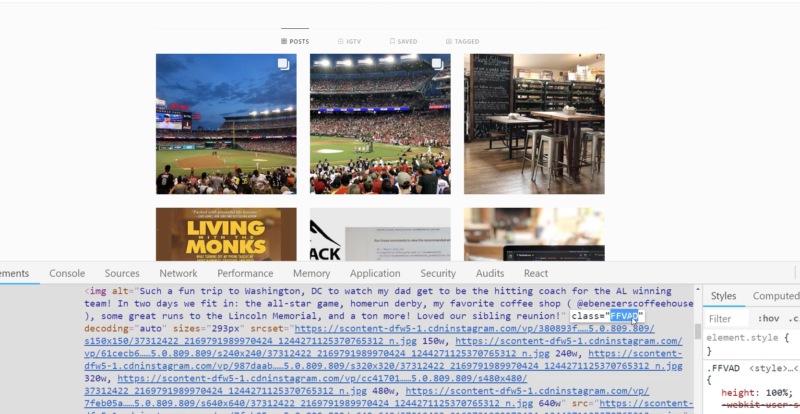
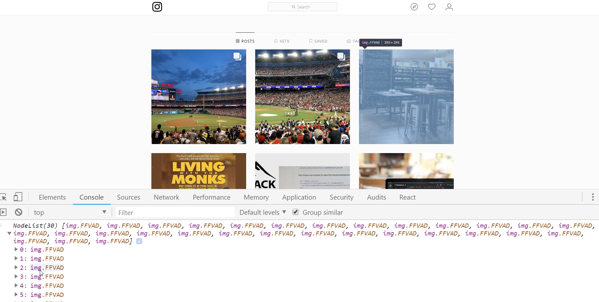
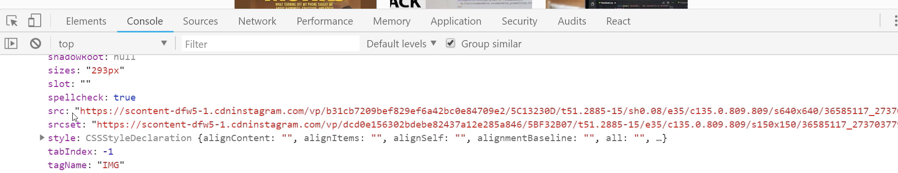
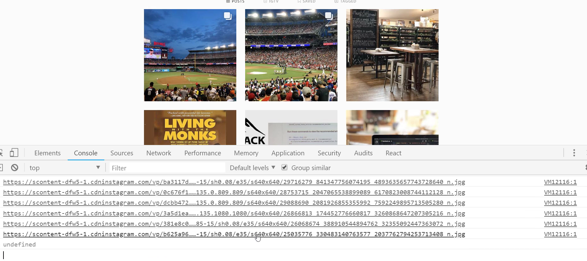
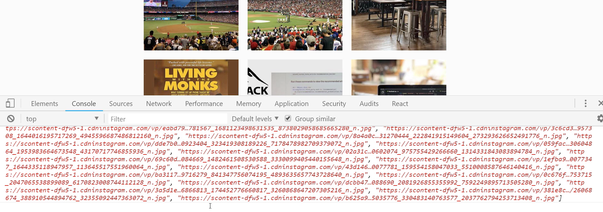
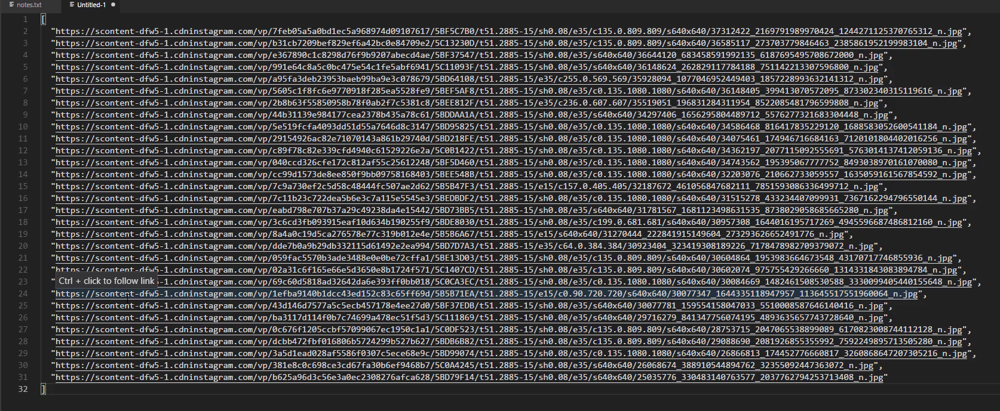

# MODULE 04 - 046: JavaScript

## Automating Tasks (2) - Pulling images from Instagram

---

## Video lesson Speech

This is going to be a fun guide, especially if you are a fan of 
Instagram. What we're going to walk through here is how to go and grab 
all of the Instagram URLs from a page.

****

As you can see right here, I'm on my Instagram profile. You can be on yours if you want to try it out on yours. Some of the classNames may be different depending on when you're watching this. I have seen Instagram has changed a few of their structural things on their Website a few times. 

I'm going to walk through the process on how I find everything, select it so that even if the `classNames` have changed you should still be able to accomplish the same goal. I want to grab each one of these images.



Now, if you click on the image, usually if you go to a website that stores their images in the traditional way, right here you'd be able to do something like say `copy image` or `save image as`. Instagram is a little bit trickier. You can't really do it that way. So we're going to have to use JavaScript in order to get all of these URLs. 

Let's start by right-clicking and then clicking on `inspect`. If I do that, what that's going to allow me to do is to see all of the classNames, and I want to go right here. You see where it says `div class` and then it has that `KL4BH`.



That's not what we want. That is the `wrapper DIV`, but if I extend that it's going to show all of the details. It's going to show the alt text and all of the images. Notice when I hover over each one of these images is showing each one these image links. It's showing me the image itself. 



Now that is one way of getting the image, but that's still really manual. The one thing that this is telling us is: we now have access. If you come over here, you can see the className of the image it's that `FFVAD` class. I'm going to copy that.  



Coming over here, this time in the last guide we use the `dollar selector syntax`. Now I'm going to use just pure Javascript, so I'm going to say:

```javascript
const images
```

Let's just get all of the images, and in this case whenever you're building the scripts you could say `let`, you could even use `var` for what we're doing here. It doesn't matter. I'm going to use `const images` and then:

```javascript
const images = document.querySelectorAll('.FFVAD')
```

Now if I run this, this is going to return all of the images in a `nodeList`. You can see if you extend this out, that it gives us each one of these. Looks like there are 30 of them, and if you want to go and hover over each one of them, see how it selects it on the page and it highlights that. 



So if I want to go with that second image here, I can extend that. It gives me access to the `alt text` and all different kinds of elements. What I really want though is the URL. Let's scroll down. Let's see exactly what we need in order to get access to the URL. Here it is. Right here you can see that we have this source, `SRC`, so that's what we're wanting.



Now what we need is we need to traverse through each one of these. We're going to loop through all of them, and then have this value returned. So let's come all the way down to the bottom, and then I'm going to type `control + l` and then `up` again just so we have access to our images. 

Now let's see if we can first just access the value. I'm going to say: 

```javascript
images.forEach()
```

This is going to give us the ability to loop over that node list and I'll just pass in a loop variable image. You could call this anything you want could call it `i` or `x`. It doesn't matter, but it's an image, so I'm just going to say:

```javascript
images.forEach(img => console.log(img.src));
```

So `forEach` takes a function as its argument, so we're going to pass this in. For right now I just want a console log these values out, just so I know what I have access to. Let's see if this works. So if I run that, you can see that worked perfectly. It gives us each one of these image values. 



If I click on this, you can see that there is one image. There is another one. Each one of those returns the image that we're looking for. So that is really cool. Technically, you could just copy and paste all of this, but we can do better than that. If you try and copy this, notice how it also brings in the little `debugger line`. 

We can do better than that. So now that we know how we can access it, let's create an empty array. So I'm going to say:

```javascript
let imageUrlArray = [];
```

Now if you just scroll up, or hit the `up arrow`, instead of `console.logging` that value what I want to do is I want to add to that the images array. If you remember how to do that, we can just say:

```javascript
images.forEach(img => imageUrlArray.push(img.src));
```

Now what that means is the `imageUrlArray` is going to be filled up with all of those URLs. So if I hit enter now, it returns undefined, but if I call `imageUrlArray` now it gives us all of those images.



That is much better and gives us in that nice array format. Now you could say: "Okay, I can copy all of this, and then I could put it in a file or whatever", and kind of, but let's see what happens if we do that. 

See how if I copy this and then we go into visual studio code. If I paste this in, see how it put it all on one line. That is not exactly ideal. I'm just going to delete that. I'm going to show you a cool little shortcut since we're on the topic of being able to automate our tasks. 

If you type copy and then the item that you want to copy: this is going to put it on the clipboard in a much better format. So I'm going to say: `copy(imageUrlArray)`. Now if I come here, you can see it has taken all of the images off of the page, and it put it in a nice array format. 



You could put this right into your own JavaScript code. You could use it if you're building test data, or if you're wanting to create a script that puts this in a database. Anything like that. Now you have access to all of it, and each one of these images are what you had on the page. 

As you can see, if you had to do this, especially if you had to do this on a regular basis, then that would really not be very fun. Oh, that didn't let me copy that one line. Let me do that just so you can see that each one of these images is valid. Let me just copy that. There you go. 

You can see that that is working perfectly. Now if you had to do this, and you had to manually go in inspect the element and grab all 30 of these, especially if you had to do on a daily basis, or if this is what you were one of the people working with you, needs to do this, it would really not be fun. 

The way that I discovered how to do this was actually because I had a friend who is a social media manager, and they were having to do that exact task. They were having to come into profiles on Instagram. They would have to click on an image then perform some type of screenshot, where they grabbed it, and then they saved it somewhere. That kind of thing.

They had to do that on profiles all day long. So I created this script to show them how they could run one single script and grab all of the images, all at one time, and they were absolutely ecstatic. It literally took about 90% of what they did in regards to Instagram down on a daily basis, and they were able to work on other tasks.

That's one of the things that gave me the inspiration for building this entire section out. It was because I saw how if you know the tools that you have at your disposal then you can build some pretty cool things, even if you're not building programs. 

Even if you just want to automate processes, then this is something that can be a really helpful skill to learn. You now know how to use JavaScript to traverse Instagram and grab the images from it.  

****

## Coding Exercise

Select all the below tags using a query

```html
<p class="grab-these"></p>
<p class="grab-these"></p>
<p class="grab-these"></p>
<p class="grab-these"></p>
```

```js
const selector = write-Your-Code-Here
```
