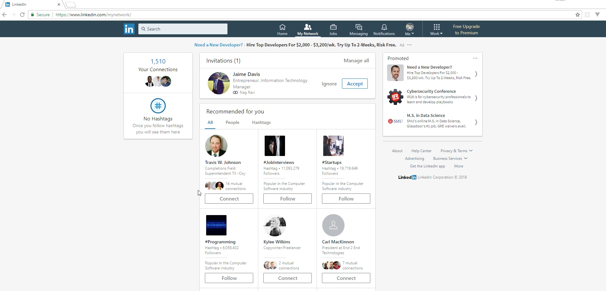
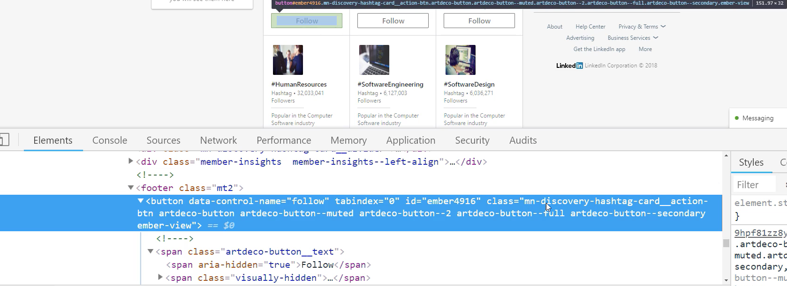
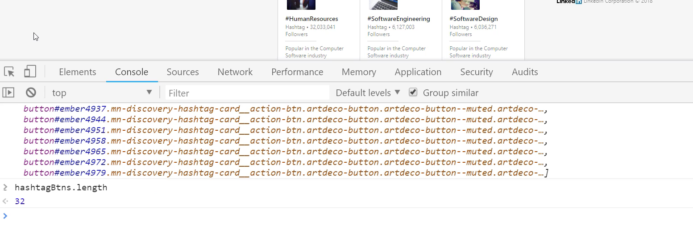
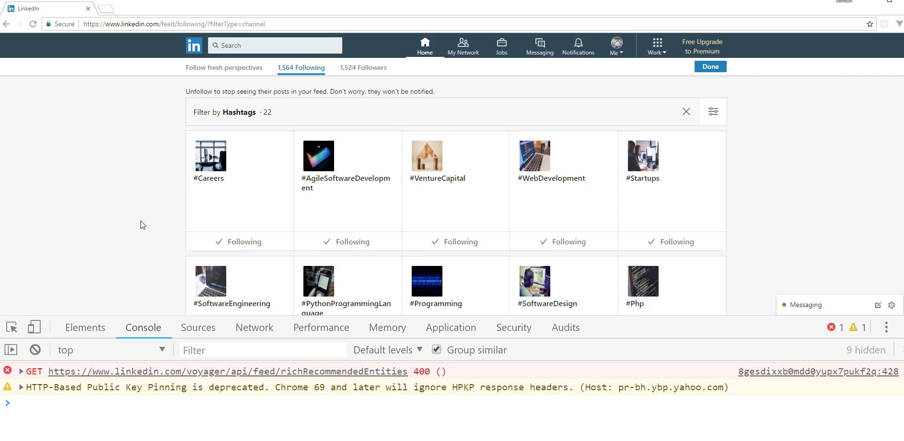
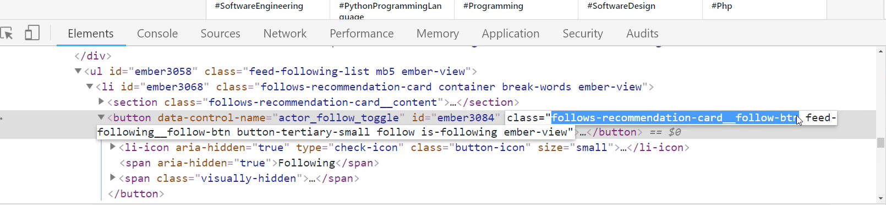
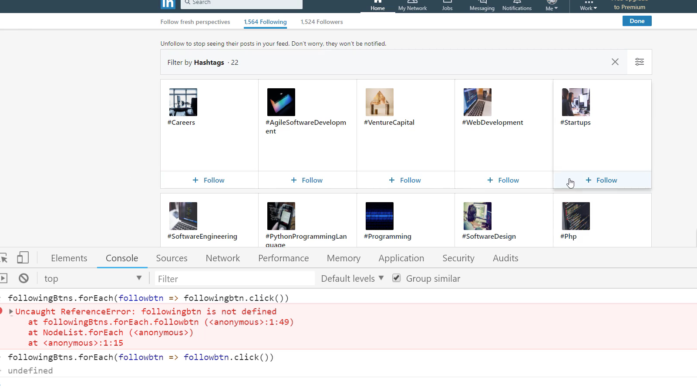

# MODULE 04 - 046: JavaScript

## Automating Tasks (3) - Autofollowing accounts on LinkedIn

****

---

## Video lesson Speech

Now let's walk through how we can automate tasks on LinkedIn. Now, this 
is a very popular way of using JavaScript. If you're wanting to build 
out your network then this is a great way to do it in a very quick 
fashion.

****

Right here you can see I've gone to My Network on [LinkedIn](https://www.linkedin.com/), and they give you all of these recommended items. Now you could also do this on a group page, and I'm going to use the hashtag page for this. 



The reason why I'm going to be doing that is that if I did it for all: it would send it to a bunch of people, and I am not 100% sure if I want to add all of these recommended people. However, I know there are a lot of people out there and developers out there, who are trying to build out their network, and they simply want to run through and add a bunch of connections. 

That's perfectly fine, but I'm going to show you how to follow a bunch of hashtags. The process is completely identical. I knew that because I ran a small test before filming this, and it did send out the **connect messages** and **connect invitations** out to everybody. 

So this will work for people, for all, or for hashtags. I'm going to switch over to hashtags, and we can walk through exactly how this works. So right-click on follow and `inspect`. Now, this is going to give me the actual text, because that's what I selected, but we need to move a little bit up further in the `DOM`. 

Right here you can see that we have the button. This button element is actually what we're looking for. So here in the button, this is going to be relatively straightforward, because we have a class that we can grab. 



All I have to do is grab this `mn-discovery-hashtag-card__action-btn`. That's a nice long name. Hit copy, and then come to the console. Let me clear out any errors that we had. Right here let's run a test, and make sure that we have access to everything that we think we have access to. So I'm going to say:

```javascript
let hashtagBtns = document.querySelectorAll('.mn-discovery-hashtag-card__action-btn')
```

Now what I can do is just run the selector, and now if I look for a `hashtagBtns` you can see it brings up all of the specific follow buttons that we have right here. If I wanted to check out the length. I can see I have `32` of those. 



Now what we can do is we can just automate the process of following all of those hashtags. So here, I can say: `hashtagBtns.forEach()`. For each in JavaScript takes a function. So I'm just going to say:

```javascript
hashtagBtns.forEach(btn => btn.click())
```

This is the `click function` that is available in JavaScript. Now if I run that you can see that it went and it followed every one of those hashtags. So now if I hit refresh on this page, you can see that I'm now following each one of the hashtags. So every one of those that was on there, I am now following. 



Now you could do the exact same thing here, and I'm going to. I want to show you both sides of it, so I showed you how you could do it for **following**. 

Now if you want to unfollow say all of these different elements. Let's see if we can do that. So I'm going to click `inspect` here, and so now you have this `actor_follow_toggle`. This is a control name. Then the `class`, you have `follows-recommendation-card__follow-btn`. This is what we're looking for, this class right here. 



I'm going to copy this, and we're going to do the same thing. So I'm going to say, this time it doesn't matter if you use `const`, `let`, or `var` for the variable. I'm not going to change it, so I'm going to say:

```javascript
const followingBtns = document.querySelectorAll('.follows-recommendation-card__follow-btn')
```

Run that, and now if I check to see all of those following buttons, you can see them right there. Now it can run the exact same process, so I can say:

```javascript
followingBtns.forEach(followbtn => followbtn.click())
```

Now you can see it went in it unfollowed each one of those hashtags. 



So with just writing a single line of code, we're able to follow all of those hashtags on the page, and then writing another very similar line of code we're able to go in and unfollow those. If that is something that you're looking to do, where you're trying to build your network or in that specific to LinkedIn, but these processes that just walk through this could be applied to any kind of page.

You could do this for Instagram, you could do it for Facebook, you could do it for anything that you want to automate. The thing that gave me this idea was the Bottega Code School CEO asked if I could help him build a script because he was trying to automate the process of going and following a bunch of people in some of these LinkedIn groups.

So that's what gave me the idea to do that because I assume that if he asked for that, other people were looking to automate the same process. Now you know how to, and as you can see, it's relatively straightforward. 

Remember, any type of script like this has two main steps. It first has the `query step`. That is where you go and you find what the class name is you're looking for, and then you query it and you store that value in a variable. 

Then from there, the second step is to `perform the process`. In this case, the process was simply clicking on the button. The process could be anything else. It could involve other steps if you need to say fill out form elements and then click or whatever it is that you need to do. 

As long as you have that element selected when you have `forEach` and you have the method like this what you're able to do is treat each element as if it was you who is going and you were clicking or you were filling out a form or whatever process you're looking to do. You can simply have the code do it. 

That's what this is all about, is being able to automate the entire process using JavaScript. Great job. You now know how to fully automate any kind of process that you need to do inside of a browser.  

****

## Coding Exercise

6 Snakes have made themselves at home in your boot. Use the query selector all to locate all of the snakes!

```html
<div id="boot">
  <div class="snake"></div>
  <div class="snake"></div>
  <div class="snake"></div>
  <div class="snake"></div>
  <div class="snake"></div>
  <div class="snake"></div>
</div>
```

```js
const nodeList = write-Your-Code-Here-to-select-the-snakes

```


