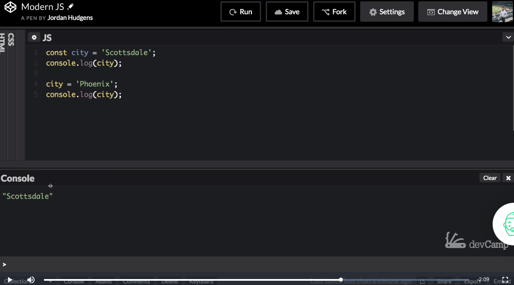
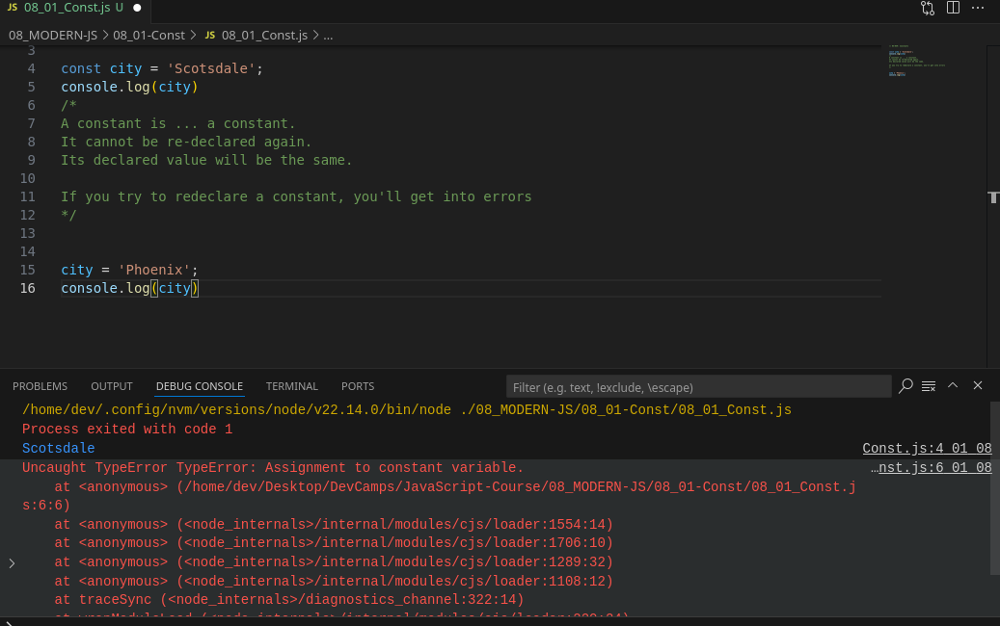

# MODULE 04 - 049: JavaScript

# Modern JS (1):    Constants

---

1. The Problem with `var`

2. Introduction to `const`

3. `const` vs `let` vs `var`

4. Immutability Nuances

5. Best Practices & Use Cases

****

## 1. The Problem with `var`

### Legacy Variable Declaration Issues

```js
var city = 'Scottsdale'; 

// Global scope → Potential conflicts
```

- **Pollutes global namespace**

- Function-scoped (not block-scoped)

- Allows accidental re-declarations

**Example of Vulnerability:**

```js
var status = 'active';

function checkStatus() {
    var status = 'inactive'; // Unexpected override
    console.log(status); // 'inactive'
}
```

****

## 2. Introduction to `const`

### Modern Block-Scoped Constants

```js
const API_KEY = '123-abc'; 
const MAX_USERS = 100;
```

- **Block-scoped** (only accessible within { })

- Prevents **reassignment**

- Requires initialization during declaration

### Key Features:

| Feature      | `const` | `let` | `var` |
| ------------ | ------- | ----- | ----- |
| Block Scope  | ✅       | ✅     | ❌     |
| Reassignable | ❌       | ✅     | ✅     |
| Hoisted      | ❌       | ❌     | ✅     |

****

## 3. `const` vs `let` vs `var`

### Declaration Comparison

```js
// Yep! - Valid

const ID = 'user_123'; 
let counter = 0;
var legacyVar = 10;


// NOPE! - Invalid
const ID; // SyntaxError: Missing initializer
ID = 'new_id'; // TypeError: Assignment to constant
```

****

## 4. Immutability Nuances

### What `const` **Doesn’t** Protect:

- **Object/Array Contents** (can modify internal properties)

- **External System State** (DOM elements, API data)

**Example:**

```js
const user = { name: 'Alex' };
user.name = 'Sarah'; // Allowed ✅

const colors = ['red', 'green'];
colors.push('blue'); // Allowed ✅
```

### True Immutability Requires:

```js
Object.freeze(user);         // Prevents modifications

const frozenColors = Object.freeze(['red', 'green']);
```

****

## 5. Best Practices & Use Cases

### When to Use `const`:

✅ Configuration values (API keys, URLs)  
✅ Imported modules/packages  
✅ DOM element references  
✅ React props/state variables

### When to Use `let`:

🔄 Loop counters  
🔄 Dynamic calculations  
🔄 Conditional reassignments

### Anti-Pattern Alert:

```js
// ❌ Avoid - const doesn't prevent this

const data = fetchResults();
data = process(data);             // TypeError: Reassignment


// ✅ Fix - use let for reassignments

let processedData = fetchResults();
processedData = process(processedData);
```

****

## Real-World Framework Usage

### React Example:

```js
function UserCard({ user }) {

    const { name, email } = user; // Destructuring with const

    return (
        <div>
            <h2>{name}</h2>
            <p>{email}</p>
        </div>
    );
}
```

### Vue Example:

```js
<script setup>
    const props = defineProps(['title', 'content']); // Immutable props
</script>
```

****

## Pro Tips

1. **Linter Rules:** Enable ESLint's `prefer-const` to auto-flag mutable variables

2. **Naming Convention:** Use UPPER_CASE for true constants (e.g., `const MAX_SIZE = 100;`)

3. **Debugging:** Chrome DevTools shows const variables in a different color in the Scope panel

---

> 🔗 **Further Reading:**  
> [MDN const Documentation](https://developer.mozilla.org/en-US/docs/Web/JavaScript/Reference/Statements/const)  
> [JavaScript Variable Guide](https://javascript.info/variables)

---

## Video lesson Speech

For years and years whenever you wanted to create a variable in Javascript you would use the VAR keyword.

****

I could say something like `var city = ‘Scottsdale';` and then if I wanted to run it can just do `console.log(city)` just so we can see something here.

Hit run and it's going to print out the Scottsdale value and there we go, and that has worked for years, but that is actually a very troublesome way of declaring variables. The reason for it is because whenever we're using the VAR keyword we're actually creating what's called a global variable which means that it might have conflicts with other variables. It pollutes the global namespace and it can be very challenging and buggy to be able to figure out exactly what's going on from a namespace issue, which is just a fancy word for saying that we want to know where our variable is declared and where we have access to it. With var that is a very difficult thing to do. 

Now in the introductory course we talked about the difference between var and let, and let came along a few years ago and let became kind of the better way of defining variables. Because it did not pollute the global namespace, so in other words, it was much more specific.

It was more confined if you created it, or added it to a function, then it was only going to be available in that function. You wouldn't have other times where it is available. I'm not going to go into the differences between var and let in this guide because we already did that in the introductory course. 

What I am going to do is talk about the newest member to the variable family in javascript and that is const and so const is one of the go-to ways of declaring variables now. 
In fact, if you look at modern development practices that this course is all focused on, you will see const is actually the type of variable that gets picked over all of the others. In the majority of the applications, I work on I either am declaring const, or I'm declaring let when I have to. 

The best rule of thumb is in modern programs especially if you're building in react or in angular or any of these frameworks, is always try to use const right away that should be your default go-to type a variable. If it is too specific then, and I'm going to show you when this is the case, then go and use a let. 
        It's very rare that you're going to use var in modern practices. It's still important to know about it. That's the reason why we teach it. You're going to see all three in different applications and there are plenty of times where you do need to create a global variable. 
For just a kind of day-to-day, you're run of the mill variable, you're going to try to want to use const as much as possible. That is because const gives us one very helpful little tool. 

So if I switch this back to let, I am going to leave everything else here the same and I am going to copy this down here. Say that I had a program that declared city with a  let, And then later on down the line I, or another library, used city again and redefined it but it didn't realize that city had already been declared. And so even though this is in the global namespace there may be a time wherein a function you're accidentally overwriting that variable. 
So imagine a program where you're printing out an address you're expecting it to say Scottsdale. But here you performed an override.

## Code

```javascript
    let city = ‘Scottsdale’;
    console.log(city);

    city = ‘Scottsdale’;
    console.log(city);
```

 And now let's see what the value is here and click save. And then if I run this it's going to run the program and we're going to see two different console log statements come out right here. And as you can see it starts with Scottsdale but then it gets switched to Phoenix. And this is not a good thing because, and I shouldn't say it's a good thing all the time there are plenty of times where you do want to overwrite a variable, but there are definitely circumstances where you need to protect against this happening. 

So that is where const comes in. And this is part of the reason why const is such a popular tool in modern javascript development. So now if I change this to contest and I'm going to save and let's run it again. And now let's see what kind of output we have. So when I click run you can see it only logs Scottsdale. And so right here even though we redeclared at it and also we even tried to console.log it. It did not work. 

## Code

```javascript
    const city = ‘Scottsdale’;
    console.log(city);

    city = ‘Scottsdale’;
    console.log(city);
```



This is where using code Penn. can be a little bit tricky because you'd think that it would at least show this city again, it just doesn't show it, If there is an error and so right here we do have an error because we have a time where we actually tried to redefine the value. 

So if you want to get even more specific on exactly what's going on here then I'm going to open up the javascript console here and switch and clear it out as well, and I’ll make it much larger so you can actually see it. 

Now let's try the same code. So I'm going to say `const city = ‘Scottsdale’;`. And everything will work there. So if I call city, I don't have to type console.log when I'm in the javascript console because I'm already there. Now let's try to do the same things as a city and set it equal to Phoenix, `city = ‘Phoenix’;`. 

Now if I try this Uncaught TypeError and this is what was happening but it gets hidden in code Penn which is why it's great to use tools like this, but you also sometimes have to switch and use other systems as well like just the pure console



So what is this error, it says Uncaught TypeError: Assignment to constant variable. So this is where the problem is and this is a very good thing for it to catch. We do not want to always have the ability to redefine our variables. So I'm going to close out of here. And so just in looking at this code I want you to get very used to typing out the const variable type because as you start looking through the documentation for React and Angular, and all of these other types of frameworks you're going to see const used very very much all over the place. 

So I want you to get used to it but also to see the difference between const let and var. 

## Code

```javascript
const city = 'Scottsdale';

console.log(city);
```

****

## Coding Exercise

Using the `const` variable type, make a variable called "wins" and set it to any number 
above 5. (When assigning a number to a variable, you cannot use quotes, `"5"`)
