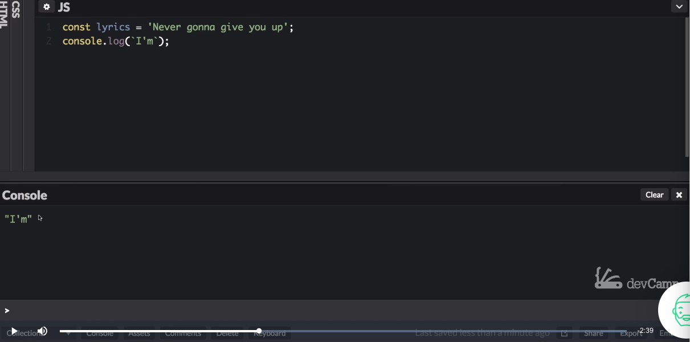
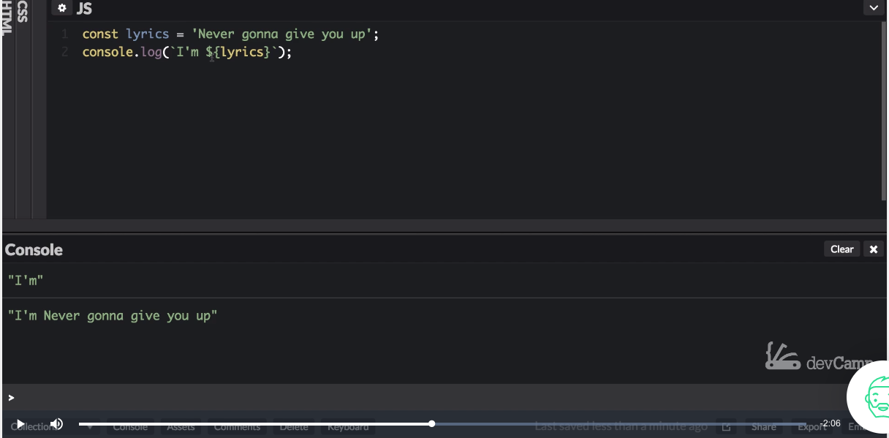
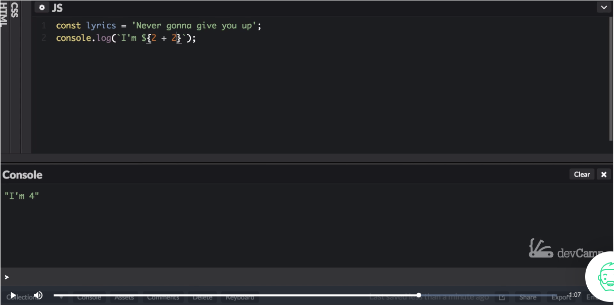
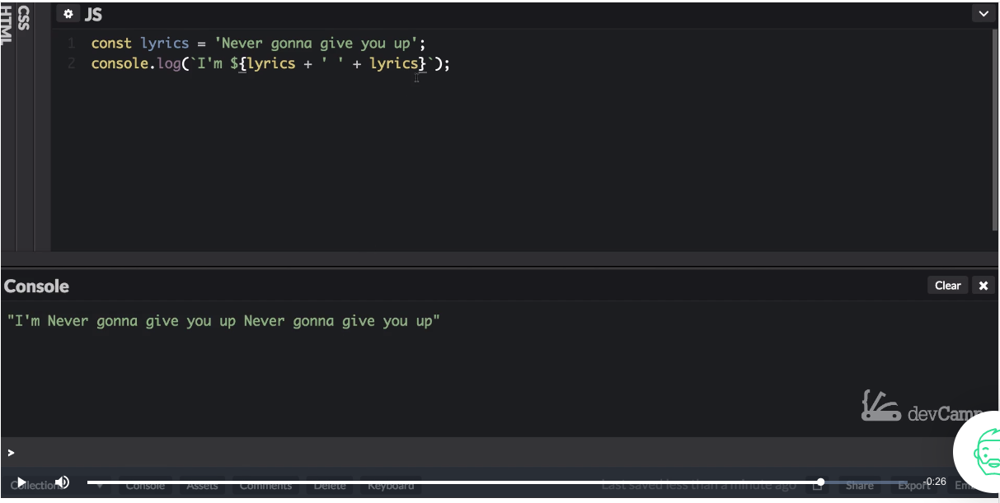

# MODULE 04 - 050: JavaScript

# Modern JS (2):    Backtip String Interpolation

---

---

## Video lesson Speech

This lesson is going to be all about modern approaches for using string interpolation.

****

Now a quick review of the old way of using string interpolation was something like this. We have our const of lyrics as a variable here, `const lyrics = 'Never gonna give you up';` And if I want to add anything to it, so if I want a console log say, I’m and then I'm going to have to add a space in here than a plus.
`console.log("I'm " + lyrics);`
 And then I can call lyrics. Now if I save and then run this everything is going to work. So you can see it prints out. I'm never going to give you up. 

This is fine, but the more modern versions of javascript give us a much better way of doing this and it uses the backticks. Now if you have never used the back before it's a little button right above the tab button on your keyboard. 
So instead of these double quotes, I'm going to use this backtick. Now when you're looking at documentation you may get confused and think that this is just a normal apostrophe. 


It is not. It is a backtick. So I'm going to do a backtick right here. And so now this is just considered a normal string and I'm going to clear this out. And just to prove that to you I'm going to run it again. And if you run it you can see it's converted it to a regular string.



Even though we're using the backtick. 
Now to start injecting javascript code all we have to do is now treat it as a single string, and we can use dollar curly braces and then place in any javascript that we want.  `console.log(I'm ${lyrics}); `So now if we run this code it's going to give us the exact same output. So it's giving us the I'm never going to give you up but now this is a much easier way of reading the code. 



Notice before how we have these plus signs, we had to inject spaces after a word, in order to make sure that it wouldn't just run in but upright against the lyrics that we're bringing in. It's just it wasn't a very pretty way of doing it, and also other programming languages have been using string interpolation, that looks much more like this for years. 
Ruby has a great way of injecting types of strings or any type of interpolation into strings. And the other thing that I want to show you here is that you are not limited to just this. So let's take for example if I want to run two plus two right here.



 Now if I clear and run this then you're going to see I'm four. 
So that is one of the most important parts of understanding how this works, is that there is nothing special inside of here that requires just a variable. 
What happens with this type of interpolation is it simply runs the code and treats it as pure javascript. This is the exact same as if you opened up the console and just ran Javascript code. Anything inside of here allows you to be able to do that. 
And so if I wanted to do something like lyrics and then a plus and then a space a plus and then lyrics again and hit save and run then it injects all of that in there.



So a lot of times I'll see students that see this syntax and they'll only see an example like this 


and they think that you can only place a single variable inside of there. But actually it can be anything you want inside of that spot and it's going to run it just like pure Javascript. 
So that is the modern way to using string interpolation in javascript. 

****

## Code

```js
const lyrics = 'Never gonna give you up';

console.log(`I'm ${lyrics}`);
console.log(`I'm ${2 + 2}`);
console.log(`I'm ${lyrics + " " + lyrics}`);
```

****

## Coding Exercise

Inside the below function, write a variable and give it a string that says "It's a trap!" Then on the `return` use string interpolation to finish the movie line

```js
function movieLine() {
    // Set your variable here

    return (`replace-this-with-something-clever ${}`)
}
```
