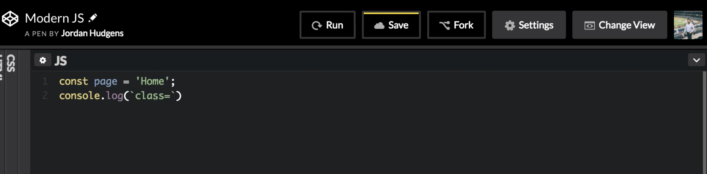
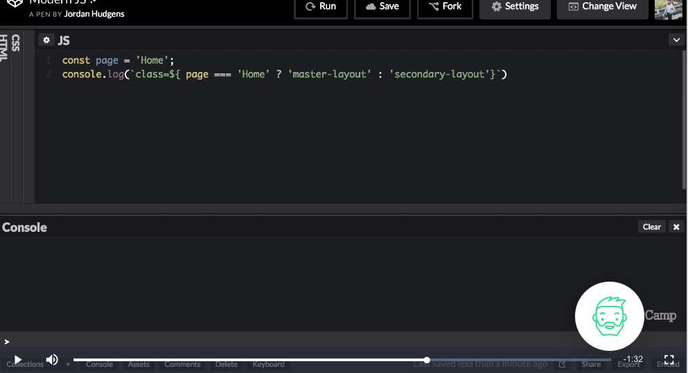
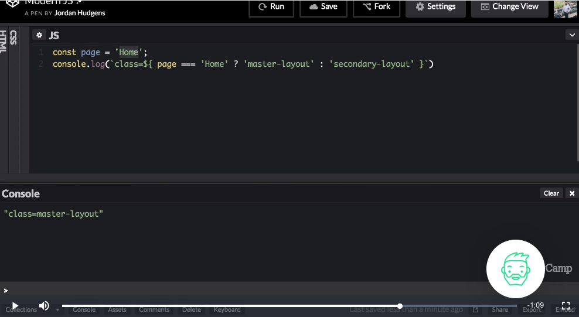
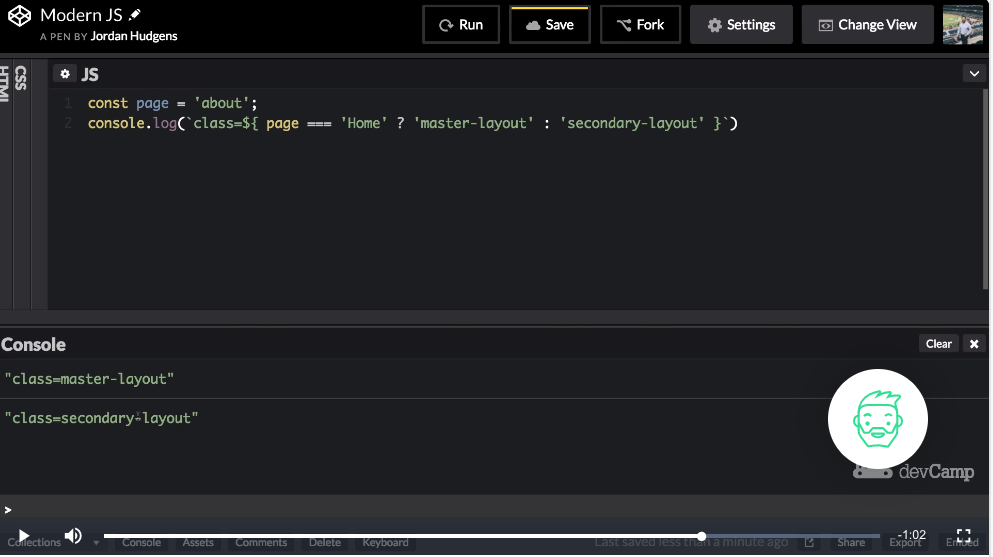

# MODULE 04 - 051:    JavaScript

# Modern JS (3):    Integrating Conditionals into JavaScript Strings with Ternary Operators

---

1. Ternary Operator Syntax

2. Conditional String Interpolation

3. Real-World Use Cases

4. Best Practices

****

## 1. Ternary Operator Syntax

### Basic Structure

```js
condition ? expressionIfTrue : expressionIfFalse;
```

### Embedded in Template Literals

```js
const status = `Score: ${isWinner ? 'Winner!' : 'Try again'}`;
```

****

## 2. Conditional String Interpolation

### Battleship Example Solution

```js
let ship = "hit"; // Test with "hit" or "miss"

function battleShip() {
    return `${ship === "hit" ? "1 point" : "You lost a point"}`;
}
```

**Key Components:**

- Checks `ship` value

- Returns "1 point" for "hit"

- Returns "You lost a point" for any other value

****

## 3. Real-World Use Cases

### Dynamic Styling (React Example)

```js
function Alert({ isError }) {
  return (
    <div className={`alert ${isError ? 'alert-danger' : 'alert-info'}`}>
      {isError ? 'Error occurred' : 'Notification'}
    </div>
  );
}
```

### API Response Handling

```js
const responseMessage = `Request: ${data ? 'Success' : 'Failed - Retrying...'}`;
```

****

## 4. Best Practices

### Do's and Don'ts

| Yep!                                | Nope!                               |
| ----------------------------------- | ----------------------------------- |
| Use for simple true/false logic     | Nest multiple ternaries excessively |
| Keep expressions short              | Use for complex branching logic     |
| Format with spacing for readability | Write unreadable one-liners         |

****

**Formatted Example:**

```js
const message = `Status: ${
  score > 90 ? 'A' 
  : score > 75 ? 'B' 
  : 'C'
}`;
```

****

## Common Errors & Fixes

| Error                   | Solution                      |
| ----------------------- | ----------------------------- |
| Missing backticks       | Use `` ` `` instead of quotes |
| Incorrect variable name | Check spelling (e.g., `ship`) |
| No ternary operator     | Use `? :` syntax              |

---

## References

* [Conditional (ternary) operator - JavaScript | MDN](https://developer.mozilla.org/en-US/docs/Web/JavaScript/Reference/Operators/Conditional_operator)

* https://javascript.info/ifelse#conditional-operator

* 

****

## Video lesson Speech

In the last guide we talked about string interpolation and how modern 
versions of javascript allow for a back tick syntax that makes it much 
easier to combine javascript development, with traditional just plain 
old strings.

****

That is a much better way of doing it and it's the way you're going to see in pretty much every framework and modern application that you'll run into. So it's very good to become familiar with that syntax. Now in addition to what we did, we built a string. We placed it inside backticks, and then we use the dollar curly bracket syntax for sliding in expressions. `${}` 

We saw that we could perform calculations we could put single or multiple variables in but another type of way that I'm seeing happening a lot in modern applications is to place conditionals. Now you can't place conditionals in the normal sense like where you have a full if else then if kind of block, and you wouldn't want to. 

That would look absolutely hideous you'd need to have all these different lines and you would not want to put that all inside of a string. What you can do is use what's called a ternary operator. Most programming languages have this type of operator and it's a way of checking to see if something is true then perform one action. And if not perform another action. 

You can only have an if and an else you can't have multiple layers so this is only for basic kinds of conditionals. You can only have one type of check. And so what we're going to do is do a pretty practical example here where we're going to change the class. 

You can think of this being something where we'd perform this type of action inside of a, say, a framework like angular where we want to change the class of a div or some type of HTML element on the page, based off of what type of page it's on. 

So right here what I can do is I can say that I want to create a class or I want to define a class and I want it to be dynamic based on the value of this variable right here and I'm not going to change it. So this should just be a const and not a let. 



So for a class right here this is just your normal string. This is what you'd find in the HTML document. And I'm going to use string interpolation with our dollar curly brackets, and now I'm just going to write a ternary operator. 



So I'm going to say page is triple equals to home. Then I want to render out this text so I'm going to say a master-layout. 
And if not then I say secondary-layout and that is all I need to do. 

So if I run and before we get into it we are going to walk through the syntax let's just run it and see what happens. So if I hit run now you can see down on the bottom it prints out it combined and it picked out Master layout because this was true. 



Now if I change this and I say we're on the About page now. Then I run this and now it says secondary-layout. 



So this is a great way of adding some dynamic behavior right into your system and you will see this a lot in modern frameworks like angular and react. So let's kind of dissect what we have going on here. 

A ternary operator is made up of three components. The first is the conditional. So that's right here that's where we're checking if Page is equal to home. And then you have this whole question mark and then the first component right after that is what happens if this conditional is true then you have a colon followed by what happens if this condition is not true.

So that is how you can build a turn for the operator. You have a condition followed by the result if it's true, followed by the result if it is not. It's a very basic conditional but it's nice because it's one that you can perform on a single line. 

****

## Code

```js
const page = 'about';
console.log(`class=${ page === 'Home' ? 'master-layout' : 'secondary-layout' }`);
```

****

## Coding Exercise

In the below function's `return`, use a ternary that returns *"1 point"*, when the `ship` variable is set to *"hit"*. Otherwise, have it return *"You lost a point"*. Then, set the `ship` variable to *"hit"* or *"miss"*.

```js
// Fill in the below code with your requirements

var ship = "";

function battleShip() {
  return()
}
```
