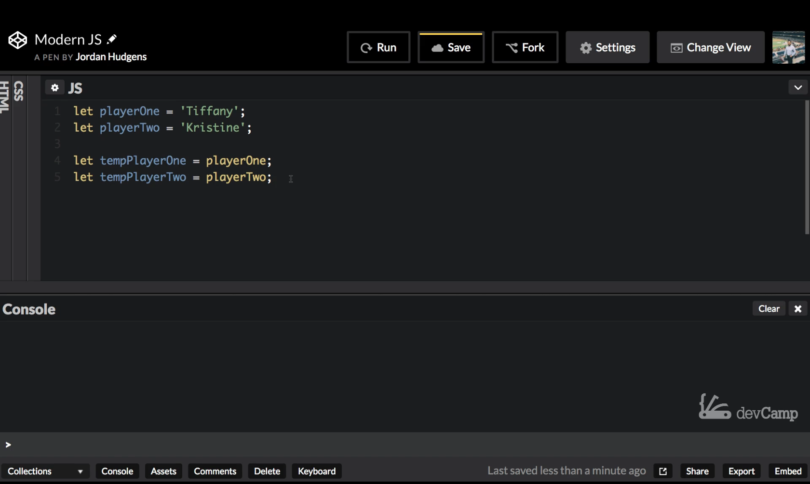
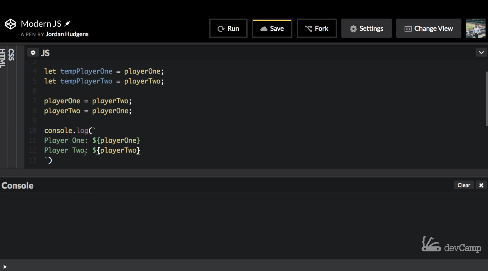
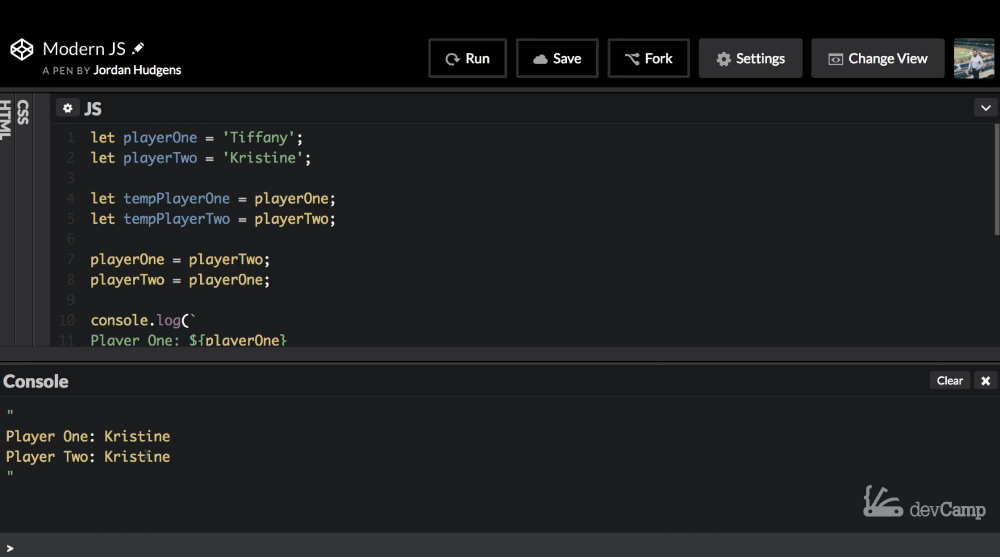
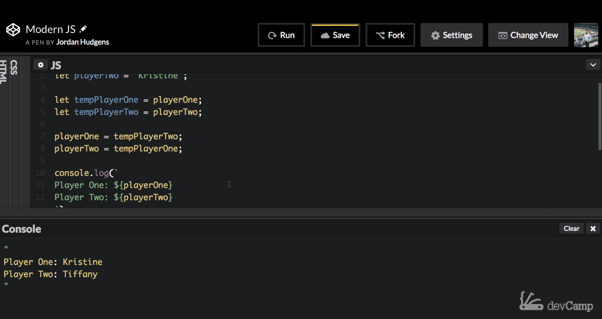
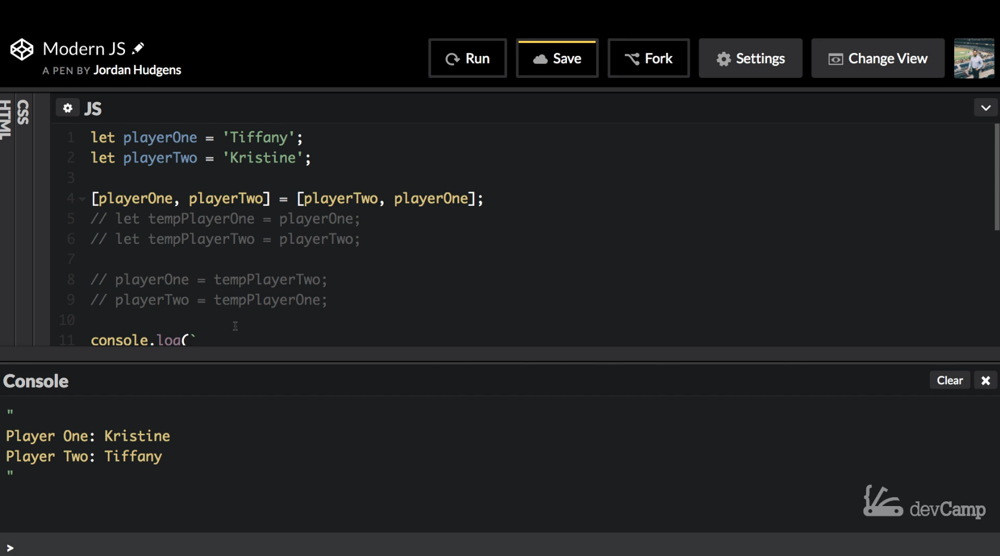

# MODULE 04 - 055: JavaScript

# Modern JS(6): Swap Variable Values in JavaScript with Variable Deconstruction

---

---

## Video lesson Speech

In this part of the course, we're going to get into the concept of 
variable deconstruction. Now that sounds like a very weird, over a 
complicated term. What I want to start off with is a base case, and that
 is the ability to swap variable values, and so in modern versions of 
javascript, you can implement a much faster way of doing this.

****

Then you had before, and so I'm going to start off by writing code the way that I used to write it. So I am going to use let variables because the whole point of this is I want the ability to swap values so say that you're building some type of a game and I say let player 1 and I say that is equal to Tiffany. Then I'm going to create another variable here called variable 2 and set this equal to Kristine. 


Now if they're playing a game a very common thing that you'd want them to do is to be able to switch back and forth. You may switch who the active player versus who they're playing. So you could change the variable names for the sake of this, It doesn't matter. I wanted to name them this, so it's very clear on which one is which. So the way that I used to have to do this was very annoying. I had to create temp variables, and so I had to do something like this where I said, temp Player 1 and I would set that equal to player 1 and then I had to do the same thing with Player 2. We'd have temp player 1 set to player 1, temp player 2 set to player 2. 



The reason why I had to do that was that when I performed the swap so when I said Player 1 when I set the player 1 I couldn't set this equal to Player 2 directly for the swap because then watch what happens if I swap them now. 



So if I do this and run this. I mean you have to create a console log statement here, and I'm going to show you another syntax for doing this. I did it so you can see multiple ways of using string interpolation. I can put this on multiple lines. I can say player 1 and set this equal to player 1 and then do the same thing for a player 2. So now if I try to run this it's going to be kind of interesting. Remember that we have Tiffany and Kristine. If I run this we have Player 1 being Kristine and Player 2 being Kristine. 



That is not what I wanted. So why in the world did that happen? Well right here if you just follow the data. Yeah. Player 1 is set to Player 2 which was Kristine and then Player 2 which was already Kristine was set to player 1 which just got turned into Kristine. So both player 1 and Player 2 are both Kristine. So that's why I had to create temp variables like this. 


Now, what would happen when I would run the code? Player one would go into this first temp variable. Player 2 would go here, and then we had this kind of intermediary step. So player 1 would simply be assigned to the value of the temp and it didn't have that same override. Now if I save and I run this they have now been right here we have Tiffany and Kristine, and I do need to separate these out. 



Now you can see that they are swapped with Kristine as Player 1 now and Tiffany as player 2. That all works. This is horrible code. This is part of the reason why for years I did not like writing javascript code was because I had to do things like this. In other programming languages, it is very common to have the ability to swap values in a much more efficient way. So typically I would say in Ruby or languages like that. I could do something like this where I do a mass assignment, and I could say player 1 and Player 2 and set it equal to the opposite so I could say Player 2 and then Player 1. Now if I clear this save and run now you can see that player 1 is still Tiffany. 


Well, javascript doesn't allow for mass assignment. You cannot dynamically assign and swap values with this kind of syntax. But the modern versions of javascript allow for something very close to it. You just have to remember to wrap it in brackets. So here you wrap these in brackets and then wrap these in brackets. Now you do have the ability, using variable deconstruction, and you can now swap these values. 



So I'm going to hit run here and right now we have exactly what we are looking for. They've been swapped; we didn't have to go through any of this garbage with temp variable names or anything like that in a single line of code. We were able to swap the values. Now, this is very helpful in a number of different situations. One of the top ones is when you're implementing algorithms. One of the most common processes that you come into when you're implementing a merge or quick sort or any of these more advanced algorithms. Is the ability to swap variable values and without variabilities construction., That's a very challenging thing to do. Thankfully because we now have this in modern versions of javascript, we can do this in a much more efficient way than just one single line of code. So this guide has been all about using variable deconstruction in order to swap variables and swap values of variables, and that's very helpful. In the next guide, we're going to get into where this becomes even more powerful when we can use this and actually perform the same type of actions with objects and even with objects within arguments and be able to connect those into functions.

```js
let playerOne = 'Tiffany';
let playerTwo = 'Kristine';

let tempPlayerOne = playerOne;
let tempPlayerTwo = playerTwo;

playerOne = tempPlayerTwo;
playerTwo = tempPlayerOne;

[playerOne, playerTwo] = [playerTwo, playerOne];

console.log(`
Player One: ${playerOne}
Player Two: ${playerTwo}
`);
```

****

## Coding Exercise

Inside the below function, swap the values of right lane and left lane.

```js
function roadRage() {
    let rightLane = "Chevy";
    let leftLane = "Honda";

    //Write your code here to make the cars switch lanes

    return (`That ${rightLane} and ${leftLane} won't pick a lane`)
}

roadRage();
```
