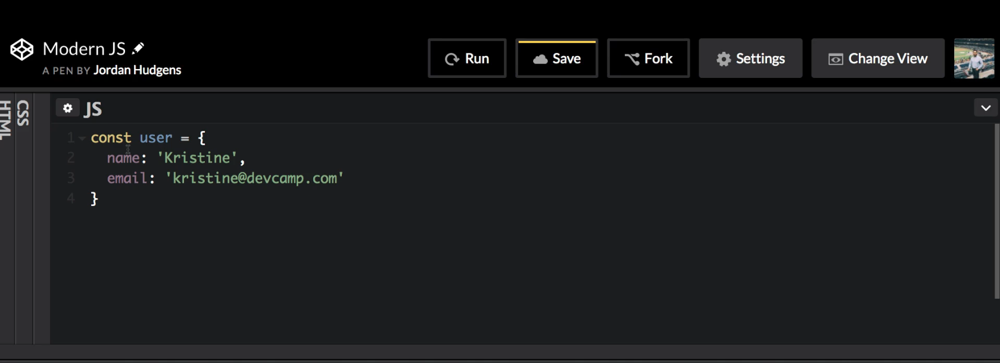

# MODULE 04 - 057: JavaScript

# Modern JS (7): Passing Objects as Function Arguments by Leveraging Deconstruction

---

---

## Video lesson Speech

Now that you know how to perform basic deconstruction in javascript and 
you know how to perform tasks such as being able to swap variable 
values. Now let's extend that knowledge, and we're going to see how we 
can perform deconstruction in using functions in javascript and more 
specifically how we can combine objects and functions, and have 
deconstruction connect those two for us.

****

So here is an example we're going to build out. So we're going to create an object here called user, and inside of this, we're going to have a few keys. One is going to be a name, and then we're going to have an email. 



The reason why I'm using this example is that I think this is very close to a real-world type of scenario. A time when you're going to use this type of deconstruction and what we're going to be talking about is when you may be performing a task such as querying some outside API. You might be given a user object like this with all kinds of different keys and values. In older versions of javascript what you'd have to do is you'd have to create some type of function, that could pull out each one of those values, you'd iterate over the keys, you'd grab the values you'd store them inside of other variables. Then you could pass that into the function you want to perform the task. But with modern versions of javascript what you can do is actually use deconstruction with the object. 

Right here I'm going to use the arrow syntax to create a function, and the function is going to be called render user. Inside of the argument, we're going to pass in an object. Now, this is very important when it comes to deconstruction. There may be times where you're building out types of functions, and you have arguments where the argument name doesn't matter. So if you had a name and an email you could do something like "N" and "E" that would be horrible naming. 


It would be difficult for people reading the code to see what you're talking about but it would still work in many cases. However, when it comes to deconstruction, it will not work. So the way that it operates inside of javascript is this type of key. So these keys have to be mapped exactly. So here, it does have to say "name", and it does have to say "email". What the function's going to look for when it's performing this deconstruction process, is it's going to run a check to see if it finds these types of attributes it finds these keys inside of the object that's being passed in. 


So now that we have that you use the arrow function and inside of the curly brackets we would just go to a console log. I am just going to say console.log and using string interpolation. Let's say that we have here the name and I just want a colon to separate that and the e-mail address. So here I'll say name and e-mail and that's it. 


The way that this is going to work is when we pass in the value instead of passing in user.name and user.email what we can do is pass in the entire object. Right here I can say just renderUser and then pass in the user itself. Right here what that's doing is it's passing in the entire object very similar to how it would work if you are working with an API or you're passing around objects, and now you don't have to worry about going in and explicitly typing in each set of values. 


This is a nice way of cleaning up the number of arguments that you're passing into a specific function call. Now I save this; this should print out the name and email. Now hitting run you can see it does, so we have our name right here. Followed by a colon followed by the e-mail address.


This is something you're going to see quite a bit out in the modern types of applications whether it be angular or react or these types of services anything that uses the latest versions of javascript. You're going to see this type of syntax, where you're going to see a function argument and you're going to see this list. But it's going to be wrapped inside of these curly braces and so whenever you see that you'll know that what it's looking for is instead of a variable being passed and looking for an object. And then you can simply pass in an object that has these matching keys and then from there you can access these, directly right side of the function body itself.

****

## Code

```js
const user = {
  name: 'Kristine',
  email: 'kristine@devcamp.com'
}

const renderUser = ({ name, email }) => {
  console.log(`${name}: ${email}`);
}

renderUser(user);
```

****

## Coding Exercise

You  need to check on your bank info but can't get the information to show 
up. Find the missing code and the one syntax error so the test can pass!

```js
const bank = {
  accountNum: 454812259,
  name: 'John Doe',
  balance: 1257
}

const bankInfo = ({accounNum,}) => {
  return (`Hi ${name}! Your current balance is $${balance}. Account#: ${accountNum}.`)
}

bankInfo(bank);
```
