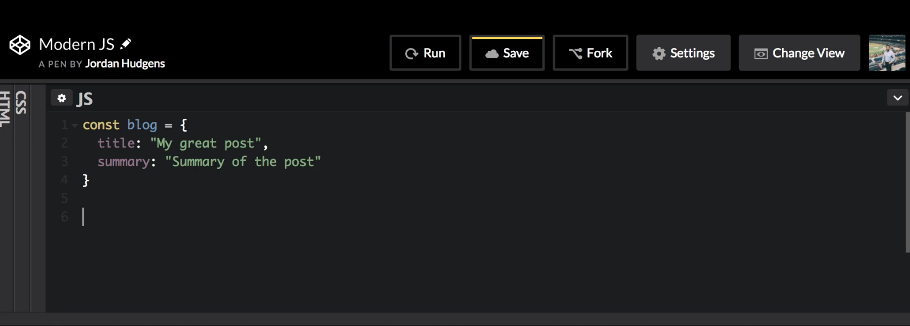
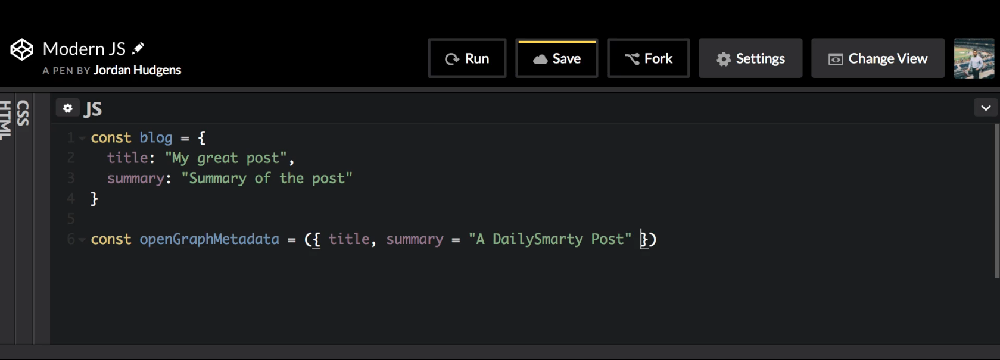
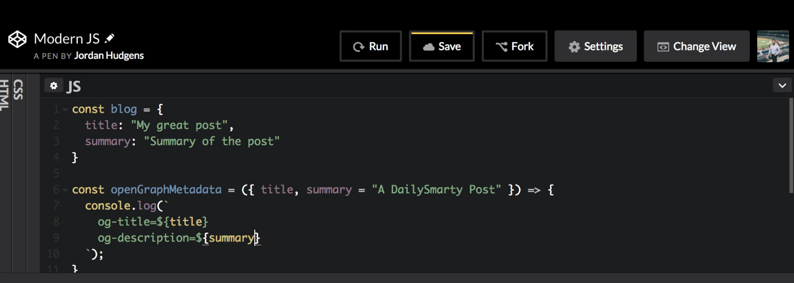
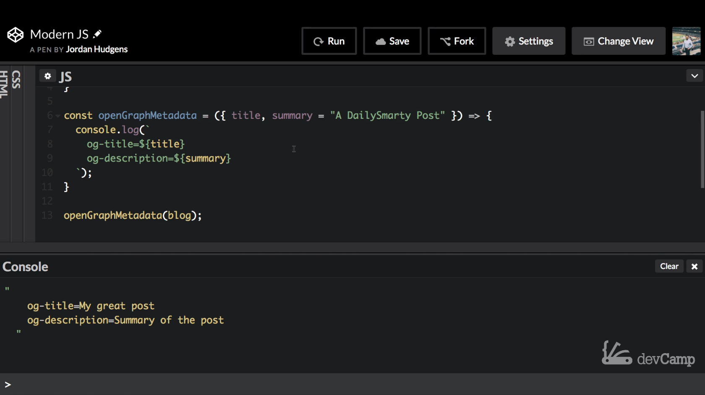
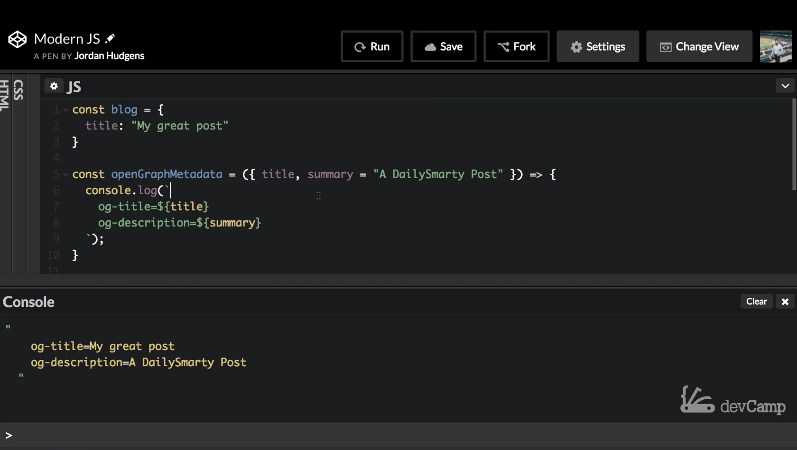

# MODULE 04 - 058: JavaScript

# Modern JS (10):     Adding Default Object Values to JavaScript Function Arguments

---

---

## Video lesson Speech

In the last guide, we walk through how we could pass objects as function arguments in Javascript and that works in many cases.

****

However, in this guide, I want to extend that knowledge just a little bit because as much as we would love to live in a perfect world where we always know the types of values that we're going to get. Whether it's in an API request, from data, or any type of situation where we're dealing with objects that is not always the case. There are going to be times where you only have portions of what you need. What I want to walk through now is how we can set default values for those objects, and the syntax is going to be very similar to how you can use default arguments. In just regular types of variable values when you're just passing a single argument item in but now we're going to embed that in an object. 

I'm going to create an object called Blog, and inside of that I'm going to pass in a title so this can be "my great post" and then a summary of it and this will be a "summary of the post" and that's it for that object. 



Now I'm going to create a function, so it's going to say const and OpenGraphMetaData and if you're wondering what that is. Let's say if you're building an application and you want links to be able to be shared on sites like Facebook or Twitter. If you want those sites to pull in the title description and image, openGraph is a way you can do that. That's something they've tied in with the daily smart application, Dev camp, and many other applications I've built. This is a very common real-world thing to build out. I'm going to build out an arrow function like before. And inside of it, we're going to use this object syntax for passing in the argument. The first one is going to be title, and this one is going to just be left entirely by itself. The title is required if they don't give a title and then there should be some validations that stop it from even getting to this point. So we can trust that title is going to be there. But let's imagine that a summary is optional. So we need to have some type of value to pass in we need a default argument here. We can say summary and then given equals and then just pass in a string. 



So here I'm going to say a "daily smarty post" just like this. Now what's going to happen is if we pass in our regular blog object then our value for summary is going to override this one right here. So these daily smarty posts that will get overridden if there is a summary argument but if not it's going to use a default value. So now let's give it an arrow function and console log this. Let's get some more practice in using the backticks with multi-line because you will see that a lot in angular and re-act type projects. So I'm going to say og-title which stands for open graph title. Now we can pass in our regular title using string interpolation, and then I'm going to just copy this, and the official name for this is a description, so you know say og-description, and we can just pass in the value for summary there. 



Now with all of that in place now we can call our function our openGraphMetaData function, and we're going to pass in our blog object. Let's see if this works. If I hit run here this is going to run; there you go, we have a string that says migrate post and summary of the post. 



Notice it did not show a daily smarty post. Now let's imagine that we get another blog sent in and they decided not to use that summary. If I hit save now and I'm going to clear the console and if I run now you can see that it prints out my great post and a daily smarty post for the description. 



This is something that is very handy if you were using older versions of javascript you would not be able to use this type of syntax. This is something that is very helpful whenever you're working with data where you may not be confident about every single key being in there because if you went through the last guide and I told you how we needed to have each one of these elements. That may have thrown a little bit of a red flag in your mind because the first thought I know when I saw that type of deconstruction was how am I going to manage it when one of these items is undefined? When nothing has been sent in, because in a production application you need to be able to take all of those kinds of things into account and if you didn't have a type of default setting like this. What you'd have to do is you'd have to set up all kinds of nested conditionals where you check to see if a summary there is? If it is, then just leave it alone. If not, then replace it with this value, and you'd have to do that for each one of these which would be incredibly annoying. Especially if you had a large number of keys and attributes. But with this type of syntax you can simply pass and what you want the default to be just in case of the value and that key is not found inside of the object. So that is how you can set default values for specific keys and objects when you pass them into functions in javascript.

****

## Code

```js
const blog = {
  title: 'My great post',
  summary: 'Summary of my post'
}

const openGraphMetadata = ({ title, summary = 'A DailySmarty Post' }) => {
  console.log(`
    og-title=${title}
    og-description=${summary}
  `);
}

openGraphMetadata(blog);
```

****

## Coding Exercise

Write an object called `user` with an attribute for `username` and `status`. You may set the `username` to whatever string you'd like but the status must be set to "away". Then, write a function called `loginEvent` that changes the users status to "active". *(Instead of a `console.log` use `return`)*. It must return **"your_username is active"**

```js
// Write your code here
```
