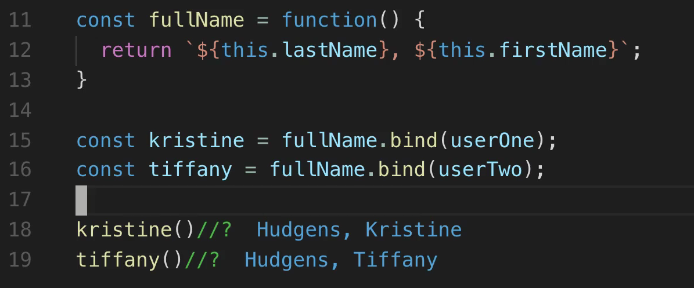

# MODULE 04 - 060: JavaScript

# Modern JS (10):     Bind function

---

1. Introduction to `bind()`

2. Understanding Function Context (`this`)

3. Syntax and Use of `bind()`

4. Why `bind()` Is Common in React

5. Case Study: Binding a Function to an Object

6. Why Arrow Functions Don’t Work with `bind()`

****

## 1. Introduction to `bind()`

In JavaScript, functions are **first-class objects**, which means they can be passed around and manipulated like any other value. The `bind()` method is a powerful tool that allows you to **permanently bind a specific value of `this`** to a function.

This is especially useful when working with **callback functions**, **event handlers**, or **component methods** in frameworks like **React**.

****

## 2. Understanding Function Context (`this`)

Every time a function is invoked in JavaScript, it gets a special value called `this`, which refers to the object that is currently executing the function.

However, the value of `this` can be **dynamic** and change based on **how** and **where** a function is called, not necessarily where it was defined.

```js
function sayHi() {
  console.log(this.name);
}

const user = { name: "Alice" };
sayHi();                 // undefined (or window.name in browsers)
```

Without an explicit context, `this` can refer to the **global object** (`window` in browsers or `global` in Node.js), which is often not what you want.

---

## 3. Syntax and Use of `bind()`

The `bind()` method creates a **new function** with the same body as the original function, but **permanently binds `this`** to the object you pass in.

```js
const newFunction = originalFunction.bind(context);
```

Example:

```js
const user = {
  name: "Kristine",
};

function greet() {
  return `Hello, ${this.name}`;
}

const greetUser = greet.bind(user);

greetUser();         // "Hello, Kristine"
```

Once bound, calling `greetUser()` will always refer to `user` as `this`.

****

## 4. Why `bind()` Is Common in React

In older class-based React components, you often see:

```js
constructor(props) {
  super(props);
  this.handleClick = this.handleClick.bind(this);
}
```

This ensures that `this` inside `handleClick` refers to the component instance, not to the DOM element or another object.   

Without `bind()`, the method loses its context when passed as a callback, e.g., to an `onClick` event.

****

## 5. Case Study: Binding a Function to an Object

Let’s say we have two users and a function that prints their full name:

```js
const userOne = {
  firstName: "Kristine",
  lastName: "Hudgens"
};

const userTwo = {
  firstName: "Tiffany",
  lastName: "Hudgens"
};

const fullName = function() {
  return `${this.lastName}, ${this.firstName}`;
};

const kristine = fullName.bind(userOne);
const tiffany = fullName.bind(userTwo);


console.log(kristine());         // Hudgens, Kristine
console.log(tiffany());         // Hudgens, Tiffany
```

By using `bind()`, we **inject** the user context into the `fullName` function without passing arguments or restructuring the function.

****

## 6. Why Arrow Functions Don’t Work with `bind()`

Arrow functions behave differently with `this`. They **do not have their own `this`**; instead, they inherit it from their surrounding lexical scope.

```js
const fullName = () => {
  return `${this.lastName}, ${this.firstName}`;
};

const bound = fullName.bind(userOne);


console.log(bound());         // undefined, undefined
```

Even after using `bind()`, the arrow function continues to use the `this` from the outer scope (usually the global object), **ignoring the bound object**.  

**Conclusion:** To use `bind()` effectively, you must use **regular function expressions** (not arrow functions), as they have dynamic `this` context.

****

| Concept               | Details                                                              |
| --------------------- | -------------------------------------------------------------------- |
| Purpose of `bind()`   | Permanently sets the `this` context for a function                   |
| Common Use Case       | Used in callbacks and class methods, especially in React             |
| Function Required     | Must be a **regular function expression**, not an arrow function     |
| Output                | Returns a **new function** with `this` bound to the specified object |
| Arrow Function Caveat | Arrow functions ignore `.bind()` and inherit `this` from outer scope |

---

## References

* [Function.prototype.bind() - JavaScript | MDN](https://developer.mozilla.org/en-US/docs/Web/JavaScript/Reference/Global_Objects/Function/bind)

* https://javascript.info/bind

* [JavaScript Function bind() Method](https://www.w3schools.com/js/js_function_bind.asp)

About using React and Bind:

* https://react.dev/learn/responding-to-events

---

## Video lesson Speech

As you're building out JavaScript applications, sooner or later, you're most likely going to come across the bind function.

****

Now, bind is something that can be a little bit confusing to grasp, especially in the beginning, but what I want to do is I want to be able to simplify it for you so that you can understand what it does and how it's used in applications.

Now, typically how people usually encounter the bind function is in React. So, you might have a constructor function, and the constructor function is going to say something like this inside of it. It'll say like, "`this.handleClick =` ..." and then it'll say, "`handleClick.bind(this);`" so you'll see something like this in a React application.

```javascript
constructor(){
    this.handleClick = handleClick.bind(this);
}
```

So what exactly is bind doing? Well, that's what we're going to walk through in this guide, and we're going to take a very straightforward case study approach. So, I'm going to create a couple user objects here. I'm going to say, "const userOne," and then inside of here, I'll say this user has a first name of Kristine and a last name of Hudgens, just like this. And I'm going to create another object, just so you can see how this is used with multiple objects. This next one is going to have a first name of Tiffany, just like this. So this is a basic set of JavaScript objects.

```javascript
const userOne = {
    firstName: "Kristine",
    lastName: "Hudgens"
}

const userTwo = {
    firstName: "Tiffany",
    lastName: "Hudgens"
}
```

Now I'm going to create a function. I'm going to be using a function expression, which means that it's going to be an anonymous function that is stored inside a variable. I'm going to say, "const fullName," and set that equal to the function, and we cannot use an arrow function here, and I'm going to show you why here in a second, but I'm going to say, "function," and inside of here, I'm going to say, "return," and then to use a string literal syntax, I'll say "back ticks dollar", and then "this.lastName," close off the curly braces, comma, and then dollar curly brace, "this.firstName," and then that is going to be what's returned.

```javascript
const fullName = function() {
    return '${this.lastName}, ${this.firstName}';
}
```

So, what we want to accomplish is I want to be able to inject and bind ... Spoiler alert, that's where the keyword comes from. I want to bind the function and the objects together, so I want to be able to call this.lastName and have it reference one of our objects. So how we can do that is with the bind keyword. I can say, "const," and then I'm just going to create a variable called Kristine, in here, I'll call our function of fullName, and then bind userOne.

And I'm going to be able to do the same thing here with Tiffany, so I'll say, "`fullName.bind(userTwo)`," and now, if I want to call this function, so I'm going to call Kristine, then you can see that it returns, "Hudgens, Kristine," so it has connected, and has bound together, the fullName function and then the userOne object, and if I do the same thing here with the Tiffany function, this is going to bind the userTwo object, also with our function.



So that, if you've never gone through it before, that may seem a little bit odd, but this is a way that JavaScript allows you to connect a function with an object, so instead of having to create a function and pass in arguments, where you would say something like, "`fname`," and, "`lname`," for first name and last name, and then calling that inside of it, we're able to actually bypass that process and bind the function directly with the object, and whenever you see the bind function inside of React, or any of the JavaScript frameworks, that's exactly what it's doing.

Now, I want to add one more little caveat here. I'm going to comment this out right here, and let me show you what happens and why we can't use an arrow function. So, if you've seen a lot of arrow functions around, you may be curious about why I didn't use one. I'll copy this, and right here, with fullName, instead of using a function expression, I'm just going to use an arrow function, so I'll say equals, and then an arrow just like this. You can see that now, this is no longer working. We're getting undefined for both of these functions.


The reason for this is because whenever you use an arrow function, remember the key difference between a function expression, like what we have here on line 11, and an arrow function is that the arrow function changes the way that `this` works. 

So, you need to be careful, and if you run into any bugs where you are trying to bind an object with a function, and you're getting undefined, the issue may be that it is referencing the wrong scope of `this`, so this right here, when you use an arrow function, is actually supposed to be referencing only the scope of this single function right here, not what is bound to it. 

So that's the reason why this will not work, and so if you're wanting to use bind, you need to be able to use it with the kind of function expression as we have here. So in review, that is a basic introduction to how the bind function works in JavaScript.

## Code

```javascript
const userOne = {
  firstName: "Kristine",
  lastName: "Hudgens"
};

const userTwo = {
  firstName: "Tiffany",
  lastName: "Hudgens"
};

// Function expression
const fullName = function() {
  return `${this.lastName}, ${this.firstName}`;
};

// Nope!
// const fullName = () => {
//   return `${this.lastName}, ${this.firstName}`;
// };

const kristine = fullName.bind(userOne);
const tiffany = fullName.bind(userTwo);

kristine();
tiffany();
```
