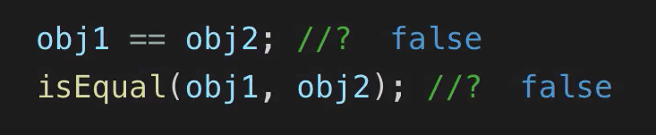

# MODULE 04 - 061: JavaScript

# Modern JS (11):     Check if Two Objects Have Equal Values

---

1. **Why Objects Can’t Be Directly Compared**

2. **Building a Shallow Equality Check Function**

3. **Limitations of Shallow Checks**

4. **Deep Equality with Libraries (Lodash)**

****

### 1. Why Objects Can’t Be Directly Compared

In JavaScript, objects are **reference types**. When you compare two objects using `===` or `==`, you’re checking if they point to the **same memory location**, not whether their properties/values match.

**Example**:

```js
const obj1 = { name: "Alice", age: 30 };
const obj2 = { name: "Alice", age: 30 };


console.log(obj1 === obj2);         // false ❌
```

Even though `obj1` and `obj2` have identical properties, they are stored in different memory addresses, so comparisons fail.

****

### 2. Building a Shallow Equality Check Function

To compare objects by value, create a custom function that:

1. Checks if both objects have the **same number of keys**.

2. Compares **each key-value pair**.

**Implementation**:

```js
const isEqual = (obj1, obj2) => {
  const obj1Keys = Object.keys(obj1);
  const obj2Keys = Object.keys(obj2);

  // Check key count
  if (obj1Keys.length !== obj2Keys.length) return false;

  // Check each key-value pair
  for (const key of obj1Keys) {
    if (obj1[key] !== obj2[key]) return false;
  }

  return true;
};
```

**How It Works**:

- `Object.keys()` extracts keys from objects.

- A `for...of` loop iterates over keys to compare values.

- **Limitation**: Only works for **shallow comparisons** (no nested objects/arrays).

****

### 3. Limitations of Shallow Checks

The custom `isEqual` function fails for **nested structures**:

```js
const obj1 = { data: { score: 90 } };
const obj2 = { data: { score: 90 } };


console.log(isEqual(obj1, obj2));         // false ❌
```

**Why?**  
Nested objects like `data` are compared by reference, not value.


****

### 4. Deep Equality with Libraries (Lodash)

For deep comparisons, use libraries like **Lodash**, which handle nested structures, arrays, and edge cases.

**Example with Lodash**:

```js
import _ from 'lodash';

const obj1 = { data: { score: 90 } };
const obj2 = { data: { score: 90 } };


console.log(_.isEqual(obj1, obj2));             // true ✅
```

**When to Use Lodash**:

- Complex objects with multiple nesting levels.

- Projects where reliability and edge-case handling are critical.

****

### References

* [Object.keys() - JavaScript | MDN](https://developer.mozilla.org/en-US/docs/Web/JavaScript/Reference/Global_Objects/Object/keys)

* [Lodash Documentation](https://lodash.com/docs/4.17.15#isEqual)

* [JavaScript Object Definition](https://www.w3schools.com/js/js_object_definition.asp)


---

## Video lesson Speech

In this JavaScript programming tutorial, we are going to walk through how we can build out a function to test to see if the values of two objects are equal or if they're not.

****

Now, you may think that this doesn't actually need a function, because if you're coming from another programming language or just from a pure common stance standpoint, what we're going to walkthrough seems like it should happen automatically. But this is one of the more tricky parts of JavaScript, and so, I'm going to walk through first why this type of process is needed. 

So I'm going to create a couple of objects. So I'm going to say, "const obj1" and then this object is going to have a name property, and then let's also give it an age. Now, if I copy this and simply name it something different, we can see that these values are completely identical, every part of them. The data type, the number of keys, and their values are identical. 

So you would think that if you did something like this where you said, "obj1 === obj2," you would think that this would come and say that these items are equal, but they're not. And if you think that, okay, maybe this is one of those problems where you need to only use the double equals for equivalents because remember, in JavaScript, three equals means full complete equivalents, and the two is a little bit of a lighter equivalent, this is still false. 

The reason for this is because when you compare objects, the way that JavaScript looks at them is it takes the object as a whole. It actually ignores the value when it comes to equivalents. It simply looks at these objects, and it says, "Okay, this is object one, we have it stored in one spot in memory, and its name is obj1." Now we have object two, this is stored in a different place in memory, and it has a different variable name. So there's no way of looking at these and saying that they are the same thing. 

So this can be a very tricky kind of concept, and the reason why I'm creating this video is that later on I'm going to be creating another video that needs to know if, and it's a part of a larger algorithm and a coding interview exercise. And you need to know if two objects have the same values or not, and so, we need to build a function that tests for that, and if you have two objects like this, it needs to say that they're true. So that's what we're going to build out in this guide.

Now the first thing I'm going to do is I'm actually going to call the function that we're going to be building so that we can debug it as we're creating it. So I'm going to call this function isEqual, and it's going to take two arguments. It's going to take the object one and object two. 

Right now, it's giving an error obviously because we haven't created the function. Let's come up to the very top of the file and let's start doing that. So I'm going to give us some space right here and I'm going to create an arrow function. So I'll say, "const isEqual" and this is going to take the two arguments, so we'll just call them object 1 and object 2, you can name these anything you want, but I think that's nice and descriptive, and this will be an arrow function.

Now, the very first thing I want to test for here, or I should say the first thing that I want to grab, is the set of keys. So inside the object, we have these keys of name and of age, so let's grab those for each one of the objects. So I'm going to say, "const obj1Keys," and we'll set this equal to the object class .keys and then pass in object one. Then we're going to do the same thing or object two, and if you want to see what these values are, you can see right there. 

We get an array back for name and age, and we know that both of these are identical. We're getting the same name and the same age because we have two objects that are passing in right now that have the same keys. Now, if you were to change one of these, so instead of age, if you were to say something like height, now you can see that object two now is showing height instead of age. So that's what we're looking for right there, and let me get rid of the debugging output. 

Now, let's add our first test. We're going to put in a conditional here, and the most logical approach, if I were approaching a question like this, would be to first see if we have the same number of keys. Because if these numbers are different at all, then it means that our objects are not the same. So this is a way of quickly getting rid of any objects that are not going to be the same. 

So in other words, if the first object here actually does include height just like this, and we're going to say, okay, the height is five feet or something like that. Then, we want these to immediately, and we want this function to immediately, say that these objects are not the same because we have one object that has an extra key.

So, let's first test for that because that's a nice, easy thing to check for. So if I say, "if obj1Keys.length," if that is not equal to the "obj2Keys.length", then we want to return false. So what this means is this is going to break out of the entire function no matter what else we put down below it, and it's going to say, nope, we know that these objects are not the same. 

So let's save this, come all the way down to the bottom and you can see right now we're getting undefined. We have object one and object two not being the same, and that's because I have a little typo here, that needs to be obj2Keys. Now if I hit save, come back down, there we go, we're getting false because these two are not equal. 



Now I'm going to just get rid of this and we're getting undefined now because we're not returning true or anything. This first condition is simply going to return false based on the length, and this is an approach that I take as I'm building out pretty much any kind of function, I put the easiest kinds of conditions right at the top, especially the ones that are probably going to be triggered the most often. 

So if you're building this type of function out, then what's most likely going to happen is that the items are not going to be equal. And so, you want to be able to check for that right away, so you don't waste any other processing time or power for any of the other conditionals. 

Now, this next one is a little bit trickier. So now that we know that we have two objects that are of the exact same length, now we need to go and check the values. So the way I'm going to do that is I'm going to use a "for of" loop. So I'm going to say, "for", and then, "(let)", and you can name this variable anything you want, you could call it I or X. 

I personally like to be more descriptive, so I'm going to say objKey. So this is just a variable name, so I'm going to say, "for (let objKey of obj1Keys)". I'm going to loop over this and I'm going to place another conditional in here. So I'm going to say, "If obj1 and then objKey,".

```javascript
for (let objKey of objKeys) {
  if (obj1[objKey])
}
```

So what exactly am I doing here? Well, this is an object and you know that you can grab an object's key by passing in that key name. So all I'm doing right here, and let me just comment this out really quick. So, all I'm doing is it's the same thing as if I said, "obj1," and I passed in "name" just like that. That's returning that object with the key of names. 

So that's all I'm doing, is I'm checking to see if I pass in a key such as "Name" and if that key or I should say if that value is not equal to object two, and obj2Key, then I want to return false. 

Okay, so let's test this out coming down here. If I change object two to be Tiffany, now you can see that this returns false because the name is different. And you could test this on the other items as well, so if this age was 33, you can see that that is false. 

Now, we have both of our checks in place that we are looking for. Now, there is one other item at the very end. If it passes both of those tests, we want to say that we return true. So now if we come down, we can see that these objects in this equivalents test are working and it's working perfectly. So the double equals and triple equals will not work, but our little isEqual function here works very nicely. 

Now I want to add a caveat because I'm assuming if you're watching this video, there's a chance that you came to it because you're trying to debug a situation where you have two objects and you're testing to see if they're equal and then you discover that double equals and those kinds of tools are not working, and so that's why you're going through this. 

Well, what we just built, this function right here, does work for shallow conditionals. And so what that means is that objects like this where we have only one level, such as having a name, age, and the value is just going to be something like a string, an integer, a Boolean, anything like that, this function will work for that. 

Now, where it will not work is if you have other data structures, so let's go through an example of that. So let's say that we have something new added here. So what if we had favorites, and favorites we might have "food" here and then we have "pizza". 

So now we've added another object, a nested object, and if I add this, then you're going to see that we're getting false. Even though these two do have the same values, we're actually running into the exact same situation we had at the beginning where we had the equivalent that was not triggered when it should be. 

So how do you circumnavigate that? Well, there's a couple of ways. One, you could keep on adding to this function. So, you could check to see all of the other data structures. You could check to see if the key represents a value that's an array or if it represents another object or anything like that. 

And that would be fine, but it's not what my recommendation would be, because as you can see, we've already had to cover a number of edge cases just in building out this small example. So what I would recommend is, if you are using something where you just need shallow equivalents, and there are many times where that is the case. 

And in fact, when I implement and call this function in a future video, all we need to know is if a shallow object is equal to another shallow object. But if you do need something a little bit more comprehensive, then I recommend using a library for that.

So the library that would work perfectly for that is the `lodash library` because they actually have a function that does everything we've talked about plus it works for deeply nested types of situations. So they have this isEqual function, and then you can pass it to objects and it will tell you if they are equal by value even if they have multiple levels of nesting. 

So I'll even show you, we can test this out. I'll click try in REPL here, and let me come, and let's copy our objects. So I'm going to copy both of these objects and we'll paste them in. So get rid of these ones that they had, and now let's use our own. 

So we'll say object one and object two, and if you run this you can see ... Oh, we have a reference error. Oh, it's because I didn't get rid of all of their output, hit run now and you can see it's true. So what we're doing here is we're calling the Lodash library, it brings in isEqual. 

Now, we can simply pass two objects, and you could have as many levels as you want here, and it will perform what we talked about. It will cover all those edge cases. 

So if you're trying to do this in a react project or view or any kind of JavaScript application, my recommendation would be to use a tool like this. 

Now, if you're trying to pass a coding interview question, and you're trying to do something such as build out some kind of counting object, and that's what I'm building this for, for a future video. If you want to do that, then this situation and this solution will work perfectly for you.

So in review, we have built out an isEqual function here in JavaScript that can check to see if two shallow objects are equivalent to each other.

## Code

```javascript
const isEqual = (obj1, obj2) => {
  const obj1Keys = Object.keys(obj1);
  const obj2Keys = Object.keys(obj2);

  if (obj1Keys.length !== obj2Keys.length) {
    return false;
  }

  for (let objKey of obj1Keys) {
    if (obj1[objKey] !== obj2[objKey]) {
      return false;
    }
  }

  return true;
};

const obj1 = {
  name: "Kristine",
  age: 13,
  favorites: {
    food: "Pizza",
    vacation: "Disneyland"
  }
};

const obj2 = {
  name: "Kristine",
  age: 13,
  favorites: {
    food: "Pizza",
    vacation: "Disneyland"
  }
};

obj1 == obj2;
isEqual(obj1, obj2);
```
