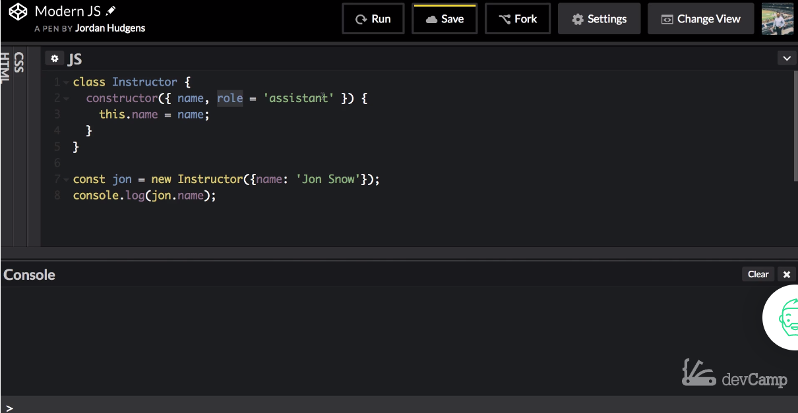
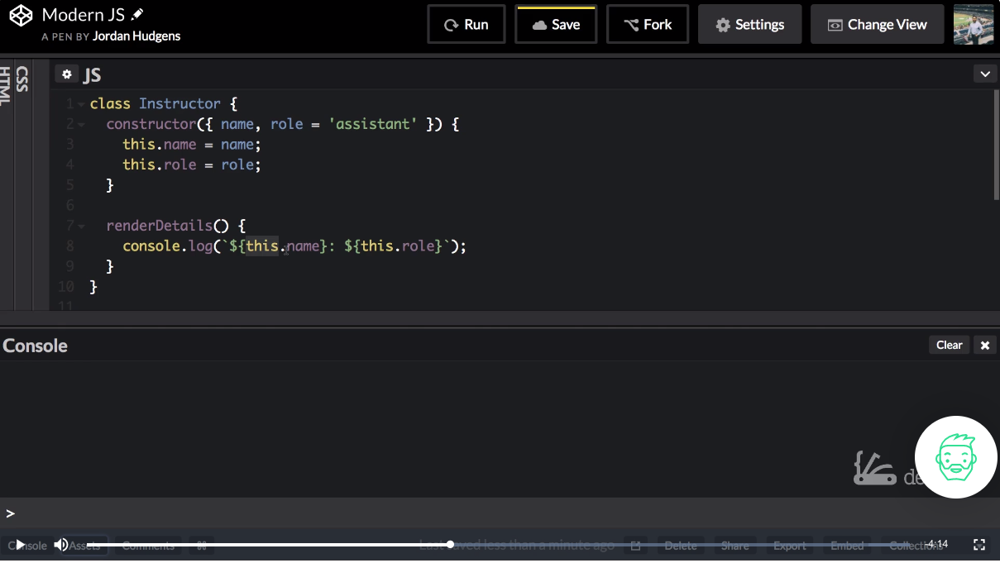
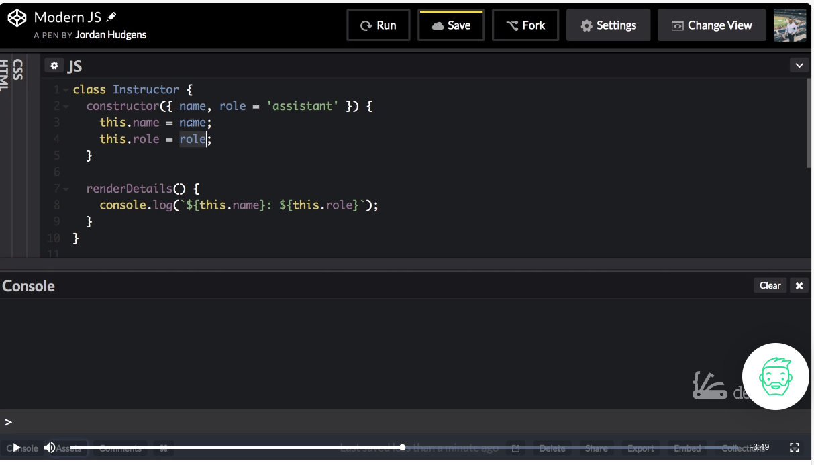

# MODULE 04-064:     JavaScript

## OOP programming (2)    Instance Methods

---

1. Instance Methods Overview

2. Adding Behavior to Classes

3. The `this` Keyword

4. Default Parameter Values

****

## 1. Instance Methods Overview

Instance methods are functions defined within a class that can be called on individual instances. They:

- Define object behavior

- Have access to instance properties via `this`

- Are called on specific instances

```js
class Instructor {
  // Instance method example
  renderDetails() {
    console.log(`${this.name}: ${this.role}`);
  }
}
```

****

## 2. Adding Behavior to Classes

### Method Definition Syntax

Methods are defined similarly to object methods, but within the class body:

```js
class Instructor {
  constructor({ name, role = 'assistant' }) {
    this.name = name;
    this.role = role;
  }

  // Instance method
  promote(newRole) {
    this.role = newRole;
    return `${this.name} promoted to ${newRole}`;
  }
}
```

### Calling Methods

```js
const instructor = new Instructor({ name: 'Sarah' });
instructor.promote('lead-teacher');  // "Sarah promoted to lead-teacher"
```

****

## 3. The `this` Keyword

`this` refers to the current instance and is crucial for:

- Accessing instance properties

- Calling other instance methods

- Maintaining object context

**Common Pitfall:** Losing `this` context in callbacks. Solutions:

- Arrow functions

- `.bind()`

- Storing reference to `this`

****

## 4. Default Parameter Values

Default values can be specified in the constructor:

```js
constructor({ name, role = 'assistant' }) {
  this.name = name;
  this.role = role;
}
```

**Usage Examples:**

```js
const defaultRole = new Instructor({ name: 'Alex' }); // role = 'assistant'
const customRole = new Instructor({ name: 'Jamie', role: 'teacher' });
```

****

## 5. Practical Implementation

### Complete Class Example

```js
class Instructor {
  constructor({ name, role = 'assistant', courses = [] }) {
    this.name = name;
    this.role = role;
    this.courses = courses;
  }

  addCourse(course) {
    this.courses.push(course);
    return `${course} added to ${this.name}'s courses`;
  }

  getInfo() {
    return `${this.name} (${this.role}): ${this.courses.length} courses`;
  }
}
```

### Creating and Using Instances

```js
const jsTeacher = new Instructor({
  name: 'Maria',
  role: 'lead-instructor'
});

jsTeacher.addCourse('JavaScript 101');
jsTeacher.addCourse('Advanced React');
console.log(jsTeacher.getInfo());
```

****

## Common Patterns & Best Practices

### Method Chaining

Return `this` to enable chaining:

```js
class Instructor {
  // ...

  setName(name) {
    this.name = name;
    return this;
  }

  setRole(role) {
    this.role = role;
    return this;
  }
}

// Usage
new Instructor({})
  .setName('Taylor')
  .setRole('mentor');
```

### Private Methods Convention

Prefix with underscore (convention only - not truly private):

```js
class Instructor {
  // ...

  _validateRole(role) {
    return ['assistant', 'teacher', 'lead'].includes(role);
  }
}
```

****

## Resources

* [Classes -> Method Definitions - JavaScript | MDN](https://developer.mozilla.org/en-US/docs/Web/JavaScript/Reference/Classes#method_definitions)

****

## Video lesson Speech

So far in this section we've learned about how to design a class and 
then how to instantiate that class how to pass attributes and then how 
to call those attributes and that is all very helpful.   

That's some very important foundational knowledge when it comes to learning about object-oriented programming in Javascript.

****

Now let's take that knowledge and let's extend it and let's see how we can add what are called instance methods to a class. 

Now what instance methods are, is they are a way of adding behavior. They are just traditional functions, and you can add those functions into your classes, and then whatever you perform whatever types of, whether, it be a method call or adding attributes or something like that then that object can have those instance methods called on it. 

Right, you're going to create a basic example of this. I'm going to start off by adding more than a name. If you remember back to our deconstruction type of tutorial then we're going to add a role here, and I'm going to set a default value of assistant so whenever we create a new instructor they're automatically going to have a role of assistant. 



Then we have the ability to override that. If this is a little bit fuzzy for you I recommend you go back and you look at that guide that shows you how to add default values from within these type of object calls. Now with that in place now we need to say `this.role = role` So that is setting up our attributes.

Now we don't even have to change anything here in our instructor instantiation call, because it will by default have this roll. What I'm gonna do is create a couple of different types of instructors and see how we can override those values. 

Now what I'm going to do is create this instance method. So this is going to be called render details. It's not going to take any arguments. And this is one of the really nice things about using these types of methods inside a class. Because one of the things you may be wondering about is why can't I just use a function. 

Well, you can and that's what people have been doing for years in years with javascript development. But if you have come from another language this is going to seem much more common. This is going to be more of a standard way of implementing and building classes and then instantiating those classes because once you have set up these attributes now inside of the other instance methods you have access to these values. 



So if I simply `console.log` this so I'm going to do some string interpellation. and say `console.log(`${this.name}: ${this.role}`);` 

Then it's going to print out the details of the instructor. Now a very important point to note right here. You need to use `this` in order to reference this value. If you remember the way the data flow works when you instantiate a new version a new object of instructor and you pass in these values.
It goes right from here right to this instantiation call up into this object comes right here gets passed in as an argument it gets redirected to these two values here.



 But we do not have access to these in these other methods only the constructor function does. So what we need to do is say that included inside of this class, we now have these attributes so for this specific version, which in this case is the John object then his name is going to be whatever he got passed it in here. 

Then his role is going to be whatever role he passed in or in this case what the default is. So it just is another point to understand how important the understanding of this is when it comes to any type of javascript development. 

Now that we have all of that instead of this call right here I can now just say `jon.renderDetails();`  Because this is a method so you're going to call it just like you would have a function. And now if I hit save and hit run then this is going to say John Snow with the role of assistant. 


Now let's create another instructor right here.
So here we're going to say `const brayden = new Instructor({name: 'Brayden', role: 'teacher'});`
His role is going to be different than assistant, his role is going to be teacher. 

Now we have 

## Code

```js
class Instructor {
  constructor({ name, role = 'assistant' }) {
    this.name = name;
    this.role = role;
  }

  renderDetails() {
    console.log(`${this.name}: ${this.role}`);
  }
}

const jon = new Instructor({name: 'Jon Snow'});
const brayden = new Instructor({name: 'Brayden', role: 'teacher'});
jon.renderDetails();
brayden.renderDetails();
```

One is John Snow assistant. The other is Brayden teacher. So right here we have now effectively created an instance method they can work with all different types of input. So whether we simply are using defaults or we are using the full set of objects that are available then what we can do is then, call that instance and then call the instance method on that. And so this is something it may still seem very basic. That's good because we want this to be a very common thing for you to be able to understand because this is something you're going to be doing quite a bit. 

I remember working with a student one time who was having a number of issues and what it came down to is they had skipped the part of understanding, on what instantiation meant and so what they kept on doing was performing tasks such as just calling the instructor class and the different methods inside of it directly, without understanding the first part. Without understanding right here that you need to first instantiate that class turns it into an object. Once it's an object you can do anything that you need to with it.

So once that student was able to understand exactly that process, that process of using the blueprint of the class turning it into an object then they're able to use it call the methods on it and then their program started working properly. So I want to make sure that you have that right understanding because that is a very big part of the object-oriented type of technique. So here just to review what an instance method is it's a function inside of a class. And whenever you create a new instance of that class you can then call those instance methods on it.

## Code

```js
class Instructor {
  constructor({ name, role = 'assistant' }) {
    this.name = name;
    this.role = role;
  }

  renderDetails() {
    console.log(`${this.name}: ${this.role}`);
  }
}

const jon = new Instructor({name: 'Jon Snow'});
const brayden = new Instructor({name: 'Brayden', role: 'teacher'});
jon.renderDetails();
brayden.renderDetails();
```

****

## Coding Exercise

You're in the market for a new car but want it to be electric. Create an instance of the Car class called `model3`. The `year` must be a number *(so don't wrap it in quotation marks)*. Set the `brand` to "Tesla" and change the `poweredBy` to "electricity".

```js
class Car {
    constructor({ year, brand, poweredBy = 'gas' }) {
        this.year = year;
        this.brand = brand;
        this.poweredBy = poweredBy;
    }

    carSpecs() {
        return(`The ${this.year} ${this.brand} runs on ${this.poweredBy}`)
    }
}

//Write your code here
```
