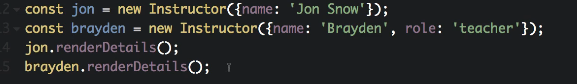

# MODULE 04-065:     JavaScript

## OOP programming (3)    Static Methods

---

1. **Introduction to Static Methods**

2. **Defining Static Methods**

3. **Practical Use Case for Static Methods**

4. **When to Use Static Methods**

5. **Static Methods vs. Instance Methods**

****

### 1. Introduction to Static Methods

**Static methods** are functions defined within a class but **not tied to class instances**.

Instead, they are called directly on the class itself. They are used for utility or helper functions that relate to the class’s purpose but don’t require access to instance-specific data.  

**Key Differences**:

- **Instance Methods**: Require an object instance (e.g., `obj.method()`).

- **Static Methods**: Called on the class (e.g., `ClassName.method()`).

**When to use:**

- Use **static methods** for class-level utilities.

- Use **instance methods** for behavior tied to object state.

- Avoid cluttering classes with unrelated logic; follow the Single Responsibility Principle.

****

### 2. Defining Static Methods

Use the `static` keyword to declare static methods.

**Syntax**:

```js
class ClassName {  
  static methodName() {  
    // Logic  
  }  
}  
```

**Example**:

```js
class Instructor {  
  static helloWorld() {  
    console.log('Hi there');  
  }  
}  

Instructor.helloWorld(); // "Hi there" ✅  
```

**Note**: Attempting to call `static` methods on instances throws errors:

```js
const jon = new Instructor();  
jon.helloWorld();             // ❌ TypeError: jon.helloWorld is not a function  
```

****

### 3. Practical Use Case for Static Methods

Static methods are ideal for **utility functions** that process class-related data but don’t depend on instance state.

**Example**: Check if an instructor can teach:

```js
class Instructor {  
  constructor({ name, role = "assistant" }) {  
    this.name = name;  
    this.role = role;  
  }  

  static canTeach(instructor) {  
    return instructor.role === 'classroom';  
  }  
}  

const alice = new Instructor({ name: 'Alice', role: 'classroom' });  


console.log(Instructor.canTeach(alice));         // true ✅  
```

****

### 4. When to Use Static Methods

1. **Helper Functions**: Tasks like data validation, calculations, or formatting.

2. **No Instance Dependency**: When logic doesn’t require instance properties.

3. **Single Responsibility Principle**: Ensure the method aligns with the class’s purpose.

**Consider**:

- If a method doesn’t fit the class’s core responsibility, it might belong in a separate utility module.

****

### 5. Static Methods vs. Instance Methods

| Feature            | Static Methods                             | Instance Methods                          |
| ------------------ | ------------------------------------------ | ----------------------------------------- |
| **Invocation**     | Called on the class (`ClassName.method()`) | Called on instances (`instance.method()`) |
| **Access to Data** | No access to `this` or instance properties | Access to `this` and instance properties  |
| **Use Case**       | Utility functions                          | Behavior tied to specific objects         |

```js
class Instructor {  
  // Instance method  
  renderDetails() {  
    console.log(`${this.name} - ${this.role}`);  
  }  

  // Static method  
  static canTeach(instructor) {  
    return instructor.role === 'classroom';  
  }  
}  
```

****

## References

* [static - JavaScript | MDN](https://developer.mozilla.org/en-US/docs/Web/JavaScript/Reference/Classes/static)

* https://javascript.info/static-properties-methods

* [Single-responsibility principle - Wikipedia](https://en.wikipedia.org/wiki/Single-responsibility_principle)

****

****

## Video lesson Speech

Now that you're familiar with instance methods in classes in javascript,
 we're going to extend that knowledge and we're going to talk about 
static methods.

****

Now an `instance method` to review is a method that can be called on a specific instance just like we were able to call render details on the Jon instance and the Brayden instance. 



And so now we're going to use what's called a `static method`. And I think one of the easiest ways of understanding what static methods are is starting off with a base case.

So I'm going to give us a few lines right here and we're going to start with the most basic one possible the `"Hello world"` static method. Call static and then helloWorld() and we're not going to pass anything into this method. And then inside of here, we'll just say console.log('Hi there'). Now if I come down to the bottom I can call instructor.helloWorld(); And then what I'm going to be able to do here is actually call it directly. So all together our code looks like this

```js
static helloWorld() {
  console.log('Hi there');
}

Instructor.helloWorld();  //"Hi there"
```

So now I'm going to save and then run it. If I run this you're going to see it prints out `"Hi there"`. And what this means is a static method does not require an object in order to work if you remember we had with our instance methods we could only call renderDetails on an instance that had been created of instructor. Now a `static method` doesn't require that instance and in fact an instance will not even work and so we can test this out if I comment Instructor.helloWorld(): out and I say Jon right here and I should put it as a let variable named jon. You know say new instructor and let's just pass in a name. So have a name and then pass in Jon. So just like this, just like we've done before. I'm going to create that and say jon helloWorld. 

```js
let jon = new Instructor({ 'name': 'Jon' });
jon.helloWorld();
```

And now watch what happens, I'm going to clear this and press save. And now if I run this nothing happens and there would be an error in the console. The reason is because the `method helloWorld` is a `static method` which means you have to call it with the syntax in the image above, where we're calling it on the class itself. So you may be curious on when would you ever want to do something like this? Well, where it becomes handy is whenever you have that concept of a helper module or you want to have some methods that maybe do not specifically target the instance of the class, so they don't really care about the data but they do have something to do with the class as a whole. 

Now whenever you are tasked with building something and you feel led to use a `static method` the very first thing that you should do is ask yourself `"Does this method really belong inside of the class?"` And the main reason that that should be your first response is because there is a principle called the `Single Responsibility Principle` in object-oriented programming. And what it means is that a class should only have a single job to do. So whenever you get in using static methods there is a very fine line between what you should put inside of the class and what should potentially be an outside helper module.

That's the reason why that should be your thought. Now I'm going to come down here and I'm going to show an example of a static method that really could be used in this type of instance and this is something that I personally built out in a number of applications. 

This is one that is a practical use of `static methods`. So I'm going to say static and inside of it I'm going to say canTeach. So what this is going to do is it's going to analyze whatever type of instructor that we're dealing with and it's going to decide on if that instructor is able to teach or if they are only an assistant. So canTeach can actually take an instructor as an argument. So technically we could build this without using `static methods` and we could use `instance methods`. But this is a good example on when you would want to choose a `static method` just because we can encapsulate all of the behavior that we're looking to do. And we don't have to deal with calling this or anything along those lines. So in this `static method` here just kind of like our "helloWorld" one the syntax is the same except we're passing an instructor and now we're going to simply return a value. So I'm going to say return and then it's going to return true or false. So I'm going to call instructor.role and then triple equals(===). And if it says that they are able to do it. So let's say their role is a classroom role which means that they truly canTeach in the classroom. It's going to return true and if not it's just going to return nil and so it will return false. 

Now I'm going to come down here and what I'm going to do is use a console.log statement where we're going to use our Jon and I'm going to do it on a few lines here and we're going to use templating. So I'm going to use backticks and then inside of it let's do our dollar curly braces, jon.name and then can teach. And then let's call our actual `static method` here. So I'm going to do our interpellation again. Call instructor.canTeach and then pass in Jon. And after that's done we're going to end it here with a semi-colon.

```js
static canTeach(instructor) {
  return (instructor.role === 'classroom');
}

let jon - new Instructor({ 'name': 'Jon' }_;
console.log(
  `${jon.name} can teach; ${Instructor.canTeach(jon))}`
);       //"Jon can teach: false"
```

Save it, and now let's see what this tells us, so I'm going to hit run. And Jon can teach false and that's good because Jon remember, that we're using our default value of assistant. So Jon cannot teach. 

Now let's come here. And change this up you're going to say Alice and then call Alice instead of Jon. But instead of only giving a name now we can also pass in a roll. So I'm going to pass in a roll and it's going to be a roll of type classroom so what they can teach now with all of that done. Now, this should be able to give us the results we want. Save it.

```js
let alice = new Instructor({ 'name': 'Alice', 'role' : 'classroom' });
console.log(
 `${alice.name} can teach; ${Instructor.canTeach(alice)}`
);
// "Jon can teach: false"
// "Alice can teach: true"
```

Run again and you can see John can teach false. Alice can teach. True. And so what we've essentially done is we have leveraged both instance methods and our normals or our static methods here. 

And so if you come up to the top, what's going on is we've created an instructor we've leveraged the constructor method which initializes all of these data values such as name and role and then down below. We created this method canTeach. And so what this method allows us to do is to simply pass in an instructor and we can call that directly. So notice at the bottom how we called alice.name and jon.name? What that allows us to do is simply call the attributes and work with setters and getters to pull out the data. 

Then with the `canTeach method`, we're not actually communicating at all with the instance of the Jon class or the Alice class. What we're doing is we're calling our helper method of canTeach and then we're just passing in the object. So this object was already created. We're not calling on the object itself. We're just passing this into our helper method of canTeach. And that may seem like a very subtle kind of difference but it is important and it's definitely important because the more that you get into more advanced types of topics in Javascript you are going to see `static methods` quite a bit. And so it's important to become familiar with how they work. But the most important thing for you to get out of this guide is to understand the difference between a `static method` and an `instance method`.

## Code

```
class Instructor {
  constructor({ name, role = "assistant" }) {
    this.role = role;
    this.name = name;
  }

  // Instance method
  renderDetails() {
    console.log(`${this.name} - ${this.role}`);
  }

  // Base case static method
  static helloWorld() {
    console.log('Hi there');
  }

  // Static method
  static canTeach(instructor) {
    return (instructor.role === 'classroom');
  }
}

let juniorInstructor = new Instructor({ 'name' : 'Brian' });
let seniorInstructor = new Instructor({ 'name' : 'Alice', "role" : "classroom" });

juniorInstructor.renderDetails(); // "Brian - assistant"
seniorInstructor.renderDetails(); // "Alice - classroom"

Instructor.helloWorld(); // "Hi there"

// "Brian can teach: false"
console.log(
  `${juniorInstructor.name} can teach: ${Instructor.canTeach(juniorInstructor)}`
);

// "Alice can teach: true"
console.log(
  `${seniorInstructor.name} can teach: ${Instructor.canTeach(seniorInstructor)}`
);
```

****

## Coding Exercise

Now you're in the market for a new home and need to compare some things first. Instantiate an object called `choice1` and set the `type` to *"house"*. It must return true. Instantiate another object called `choice2` and the `type` must be set to *"apartment"* and that must return false.

```js
class Home {
    constructor({ type, payment = "renting" }) {
        this.type = type;
        this.payment = payment;
    }

    static homeImprovement(yourHome) {
        return (yourHome.payment === 'mortgage')
    }
}

//Write your code here
```
