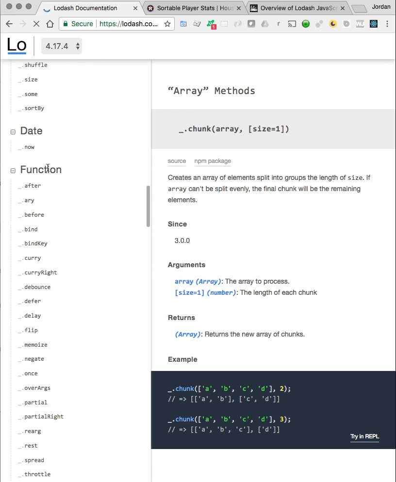
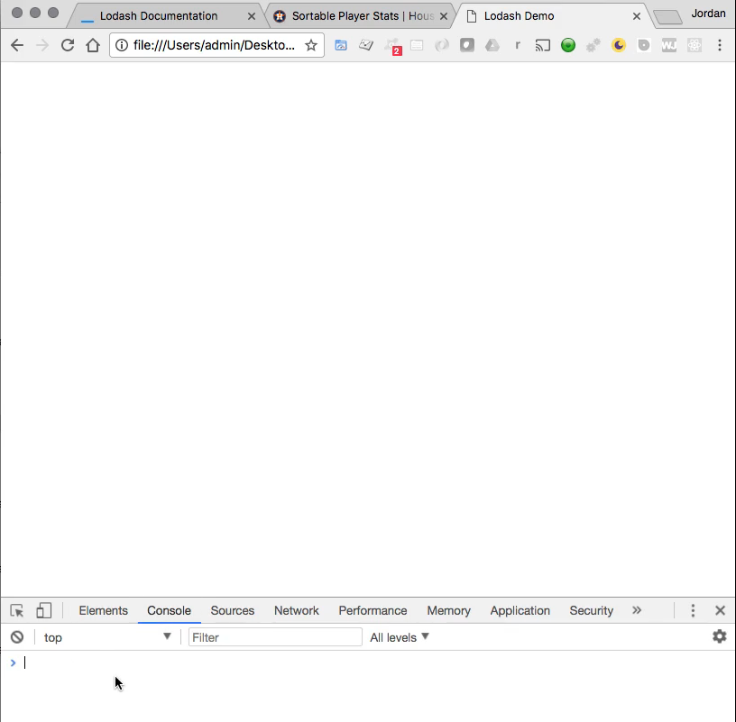
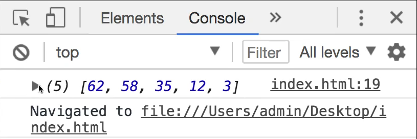
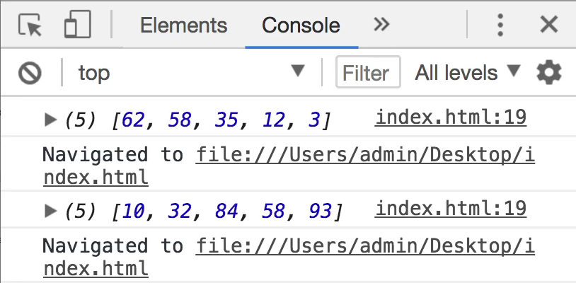
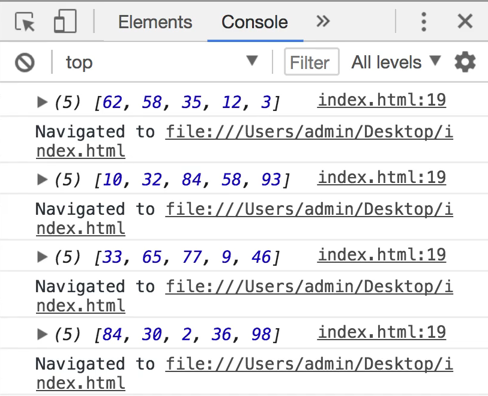
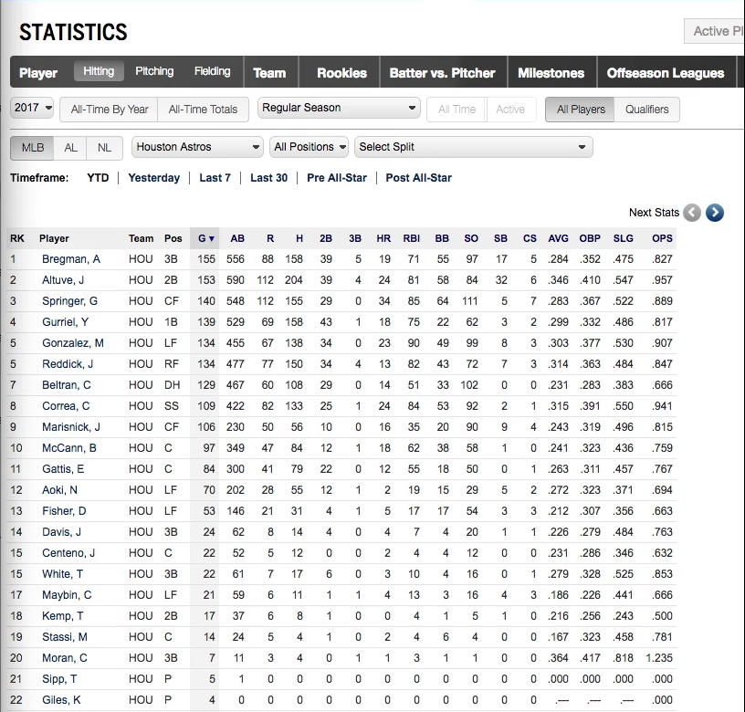
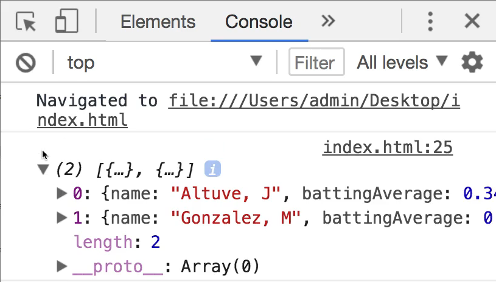
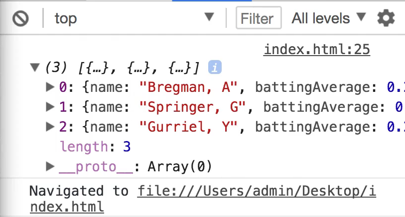

# MODULE 05 - 079:   ModernJS Tools (2)

## Lodash (1)

****

1. Introduction to Lodash

2. Setting Up Lodash in a Project

3. Core Lodash Functions
   
   - `_.times()`
   
   - `_.filter()`

****

## 1. Introduction to Lodash

Lodash is a modern JavaScript utility library that provides **modularity, performance, and extras** for common programming tasks.  

 It offers over 200 functions for operations on arrays, objects, strings, and more, reducing boilerplate code.

### Features:

- **Functional Programming**: Methods like `filter`, `map`, and `reduce` support **immutable** operations.

- **Performance Optimized**: Faster than vanilla JS for many operations.

- **Modular**: Import only the functions you need (e.g., `lodash.times`).

> **Why Use Lodash?**  
> Instead of writing manual loops or complex logic (e.g., filtering an array), 
> Lodash provides concise, readable methods.   
> 
> For example, `_.filter(array, predicate)` replaces a `for` loop with a `if` condition.

****

## 2. Setting Up Lodash

### CDN Setup (Quick Start)

Add Lodash via CDN in an HTML file:  

```html
<!DOCTYPE html>
<html>
    <head>

        <script src=" 
            https://cdn.jsdelivr.net/npm/lodash@4.17.21/lodash.min.js
         "></script>  

    </head>   
    <body>

        <script>
          console.log(_.VERSION); // Check for loaded version
        </script>

    </body>
</html>
```

### NPM Setup

In modern frameworks (React, Vue), use `npm install lodash` and import specific functions (e.g., `import { times } from 'lodash'`), or import all lodash functions by `import _ from 'lodash'`.

****

## 3. Core Lodash Functions

## `_.times(n, function)`

Like using a `for... in` it executes a function `n` times and returns an array of results.

**Example: Generate Random Numbers**

```js
const randNumber = () => Math.round(Math.random() * 100);
const randChoices = _.times(5, randNumber);

console.log(randChoices);       // [ 69, 19, 59, 26, 44 ]


// Same try without Lodash advantages
let randChoiceVanilla = [];
for ( let idx = 0; idx < 5; idx++) {

    randChoiceVanilla.push(Math.round(Math.random() * 100))

}

console.log(randChoiceVanilla)  // [ 24, 82, 91, 25, 32 ]


// Same try but using Array() methods
const randChoicesVanillaConciso = Array(5).fill().map(() => Math.round(Math.random() * 100) )

console.log(randChoicesVanillaConciso)      // [ 59, 24, 87, 68, 30 ]
```

****

## `_.filter(collection, func)`

Filters a collection based on a condition.

**Example: Filter Baseball Players by Batting Average**

```js
const players = [
    { name: 'Altuve, J', battingAverage: 0.346 },
    { name: 'Bregman, A', battingAverage: 0.284 }
] 

const over300 = _.filter(players, player => player.battingAverage > 0.300)

console.log(over300);
/*
[
  {
    "name": "Altuve, J",
    "battingAverage": 0.346
  }
]
*/
```

**How It Works**:

1. Iterates over `players`.

2. Checks `battingAverage > 0.300` for each item.

3. Returns a new array with matching items.

**Key Benefit**: No manual loop or temporary array needed.

### Filtering without using Lodash

```js
const over300vanilla = players.filter(player => player.battingAverage > 0.300);

console.log(over300vanilla)
/*
{
  "name": "Altuve, J",
  "battingAverage": 0.346
}
*/
```

**Now, what are the benefits of using Lodash?**:

Both, Lodash and vanillaJS provide powerful ways to filter data, but:

|                              | Lodash (`_.filter`)                                     | Vanilla JS (`Array.prototype.filter`)                                          |
| ---------------------------- | ------------------------------------------------------- | ------------------------------------------------------------------------------ |
| **Works with arrays**        | ✅ Yes                                                   | ✅ Yes                                                                          |
| **Works with objects**       | ✅ Yes — <br/>`_.filter({ a: 1, b: 2 }, val => val > 1)` | ❌ No — only works on arrays                                                    |
| **Requires import**          | ❌ Yes — you need Lodash (`import _ from 'lodash'`)      | ✅ No — built into JavaScript                                                   |
| **Modern, readable syntax**  | ✅ Yes — clean, chainable                                | ✅ Yes — also modern and clean                                                  |
| **Great for large projects** | ✅ Yes — predictable and consistent across data types    | ❌ Yes, but logic can get verbose in places, making scalability more difficult. |

---

### 💡 Why Lodash `.filter()` is powerful

1. **Handles both arrays and plain objects**  
   Native `.filter()` is limited to arrays. Lodash expands this by allowing object filtering, which is extremely useful when dealing with key-value stores or maps.

2. **Functional consistency**  
   Lodash's methods (like `_.map`, `_.filter`, `_.reduce`, etc.) all follow a consistent functional style. This makes it easier to compose logic, especially in data transformation pipelines.

3. **More defensive and robust**  
   Lodash handles `null`, `undefined`, and edge cases more gracefully, reducing the need for manual guards in your code.

4. **Better readability in chained operations**  
   Lodash supports chaining (`_.chain()`), which is helpful when you need to apply multiple operations on a dataset in a readable and declarative way.

5. **Cross-environment support**  
   Lodash smooths over inconsistencies between JavaScript engines or versions. It behaves the same whether you’re in Node.js, old browsers, or modern frameworks.

---

### ✅ Example: Object Filtering with Lodash

```js
_.filter({ a: 1, b: 2, c: 3 }, val => val > 1)
// Result: { b: 2, c: 3 }
```

⛔ **Not possible with native `.filter()` — it throws a TypeError.****

****

## 4. More Practical Examples

### Dynamic Data Generation

Use `_.times` to mock datasets:

```js
const mockUsers = _.times(10, () => ({
    id: _.uniqueId('user_'),
    score: _.random(1, 100)
}));
```

### Complex Filtering

Chain Lodash methods for advanced queries:

```js
const highScorers = _.filter(players, player => 

    player.battingAverage > 0.300 && player.name.includes('A')

);
```

**** 

> Pending to be expanded with:    
> 
> - `_.map`/`_.filter` over `_.chain` for better performance in large datasets.
> 
> - `_.get`, `_.debounce`, and `_.cloneDeep` for advanced use cases like safe nested property access or event throttling.
> 
> - [FP Guide · lodash/lodash Wiki · GitHub](https://github.com/lodash/lodash/wiki/FP-Guide)

****

## Resources

* [Lodash Documentation](https://lodash.com/docs/4.17.15)

* [GitHub - lodash/lodash: A modern JavaScript utility library delivering modularity, performance, &amp; extras.](https://github.com/lodash/lodash)

****

## Video Lesson Speech

In this guide, we're going to walk through an overview of the popular 
Lodash JavaScript library. So what Lodash gives us is a very large set 
of functions that allow us to simply call a specific method as opposed 
to having to write all of the code yourself.

****

Now obviously that doesn't mean it'll write all your code for you. However, it does have some very helpful functions and in the show notes, you will see a link directly to the lodash system, and then if you click on documentation right here you can see all of the different functions that are available inside of lodash.



This is a very useful library it is something that I utilize on pretty much every project that I have because it brings quite a bit of power and robustness when it comes to functions such as chunk, or compact, or the full list of all of these things and so what we're going to do in this guide is we're going to walk through five of the most popular ones and the ones that I use the most often. 

However, an entire course could be created that went through the entire set of lodash functions so I highly recommend after you go through this specific guide to check it out and see other functions that you may find helpful in your own projects. 

Now in this guide, we're going to take a little bit different approach. We're not going to be in code pen because I wanted you to see how I typically will work and so what I've done is I've created a starter HTML file here and you have access to it on the show notes so if you go to the show notes provided you'll see the starter code right here. 

```html
<!DOCTYPE html>
<html>
  <head>
    <meta charset="UTF-8">
    <title>Lodash Demo</title>
    <script src="https://cdn.jsdelivr.net/npm/lodash@4.17.4/lodash.min.js"></script>
  </head>
  <body>
  </body>

  <script>
  </script>
</html>
```

You can simply copy all of this and create a file and simply paste it in. Now I created a file called index.html you can call yours anything you want. You simply have to make sure it's an HTML file because this is HTML boilerplate here and then we are making a call to the CDN that stores this lodash code. 

Now in a real-world application such as a react application than you wouldn't do it this way, you would import the module, and then you could use it throughout your program. However, that requires quite a bit more setup and so we're going to get into how we could do that later on when we talk about how we can import 3rd party modules into our projects so for right now what I wanted to do was just give you the fastest way where you could start working with lodash so this is a really nice and easy way of doing it. 

So now that we have this set up now I want to go and let's see how we can start writing this code. And also because what we're going to be doing is we're going to be outputting this to the browser console. So just open up that file so wherever you save that file open up in the browser and then so right here mine is just index I'm going to open that up and you'll see it's blank. So just open up your javascript console which you can hit command option J if you're on a Mac you can also just right click then click on inspect and then click on console and this is going to actually be where our output is shown. 



I'm going to bring our console up because all of our output is going to be right here we're not to render anything on the page itself. And now that we have this I'm going to zoom in just so you can see everything a little bit easier. Okay so with all this setup in place now we can actually start building out the program and the very first function that we're going to analyze is going to be the Times function. 

I'm going out some comments here and so what times is going to allow us to do is Times is going to let us very quickly and easily say how many times that we want a process to run. And so this may seem a little bit odd especially if you come from languages such as Ruby or any languages that already have this built-in JavaScript by default doesn't and so lodash makes it possible for us to use it. So this is going to be our most basic function and so what I want to do is build a function and use an arrow function for it where I can generate as many random numbers as I want. This is a very common pattern I do this in a large number of my applications when every need to have sample data so this is going to make it so we can do this quite easily.

I'm going to start by creating a function expression here I'm just going to call it randNumber and then I'm going to create an arrow function and inside of this arrow function I'm simply going to return a random number and the way I can do that in JavaScript is just say `return Math.round(Math.random());` and random as a function and let's just multiply it by 100. So these are going to be various numbers between 1 and 100 and so that is not right there that is not anything dealing with lodash later on actually with are very last example I'm going to show how we could make this process even more efficient. But for right now just know we're calling the math library we're rounding a number and then we're looking for a random number somewhere between 1 and a hundred.

```html
randNumber = () => {
  return Math.round(Math.random() * 100);
```

So from there what I can do is I can create a variable and say const and let's say sampleNumbers and set this equal to and this is where we're going to get into the lodash part this is if you've never seen this syntax before this is going to look weird but the way that it works whenever you're calling lodash this is how you need to do it if you're using the CDN call. 

But it also has a standard convention even if you're importing it in a different way you call an underscore. So you call this underscore and what that's going to allow you to do is have access to this entire library so lodash has a set of modules and then they are namespaced with this underscore the first few times you're going to see this it's going to look very weird and if you're wondering why this is why there is this weird underscore and that's how we have to call it. 

Because a number of years ago one of the most popular libraries out there for JavaScript was called underscore and so lodash is kind of a modern version of underscore so much so that they even use an underscore in order to call the library. So I'm going to say underscore and then dot and now I can call any of the lodash function so, in this case, we're going to call times and times takes in two arguments it takes in however many times that you want to do something.

So let's just say we want to create 5 random numbers and then the second argument is the function and it's just the function name. I'm going to show you something that might look a little weird but we're just calling randNumber. Notice how we're not actually calling randNumber and so we're not using our parens because we don't technically want to call our randNumber function right here we simply want to pass it in and then times knows that the second argument is going to be a function. 

So this is a function right here and we're simply passing it in as an argument. What times is going to do is it's going to look through the entire javascript program and it's going to say OK is there a function named randNumber and right here randNumer is going to raise its hand. And so it's going to be called but it's going to happen inside of this process. 

And so this is essentially us simply calling randNumber five times and then the nice thing and this is something lodash does quite a bit. It's going to store it as an array. So our sample number right here this variable is going to have an array of five random numbers and we can check this out by just console logging it. So I'm gonna say console.log sampleNumbers hit save now I come here and hit refresh in the browser. You can see that I now have our output. 

```html
  <script>
    // times
    randNumber = () => {
      return Math.round(Math.random() * 100);
    }

    const sampleNumbers = _.times(5, randNumber);

    console.log(sampleNumbers);
```



So this is console logged and you can see we have five random numbers of 62, 58, 35, 12, and 3. Now if I hit refresh now you can see we have different numbers. 



So what we are essentially doing is we're running this process but it is different each time. So you're going to have a different set of numbers theoretically every once in a while from a probability perspective every once in a while you will have a duplicate but for the most part, you should be pretty safe and you should have a new and nice set of random numbers every time. 



If we didn't do this, if we didn't call times what we'd have to do is create a loop and then we'd say OK for X number of times I want you to loop through either with a while loop or some type of for loop I want you to iterate and then call this function each one of those times. 

But then it also makes it a little messier to store it in a variable. What we can do here and this is what's so nice and this is part of the reason why lodash is so popular is you get to store all of that inside of a single variable it's very clean and one of my favorite parts it also is very easy to read. I can simply look at this code right here and see that five times we're going to call a random number. 

It makes a much more straightforward and if you're coming back and looking at your code a few months or a few years later down the road you'll know exactly what it's doing. So that is the Times function I'm going to clear all of this out and we're going to move on to our next function and what this function is going to be is filter. 

Now, this is a very cool function this is a function that if you use this or you tried to build this yourself you would have to write a lot of boilerplate code that you really do not want to do.

And so we're going to also do something pretty fun here where we're going to see how we can look at some baseball statistics and we can group our people into which types of batting average so we can say that I only want to have the people who have a batting average of over 300.

Now if we were to do this without a tool like filter that would take a lot of codes so let's actually bring this in. And so before the show started I went and I wrote this so you wouldn't have to watch me manually type all of this. And so what we have here is we have a player's array and in this player's array we have a set of five objects and these are matched exactly to the stats I just showed you. So you can see we have a name of Bregman and then we can see they have a batting average of .284 and that maps perfectly right there. 

Then I created five other ones and they're all mapped here. 



If you look you can see we have batting averages for two of the players Altuve and Gonzalez that are over .300 and everyone else was under 300. So what I want to do is imagine a scenario where I'm building out some type of top player report or say I'm working on the MLB website and I've been hired to do that and I want to show all of the players that are above .300 or maybe I want to highlight them how can I go in and grab that? Because that's not the most intuitive thing. 

It may sound like a simple thing but if you think so feel free to pause the video right now and go trying to do this without any tools like lodash just go try to write it in completely vanilla javascript with no outside libraries you're going to end up having to write a decent amount of code.

So let's see how we can do that and leverage the filter function in lodash. So I'm going to come here and create a new variable called `const over300` and I'm going to set this equal to the dash so the underscore right here and then a dot followed by filter and so what filter does is it takes in a few different items so it's going to take in our players array here and then it takes in a function I'm going to use an arrow function. It's going to have one argument and remember with how this works whenever we're using any kind of loops or anything like that when I want to have that argument that is going to be simply the first item that I list out and then followed by the arrow and then curly brackets. 

And just because I know if you are new to writing modern javascript then this is going to look weird. We'll circle back and see exactly how this works later on. So now that we have this all we have to do is a filter we simply have to do this function here and the function starts at this point and it ends right here at the curly bracket. All we have to do is tell filter exactly which players we want to filter by. So in order to do that I can say `return player.batting average >0.300` and I can I could just use zero point three but just to make it clear we want them for over .300  I'll say 0.300 and then I put a curly bracket here and let's print it out. 

```html
const over300 = _.filter(players, player => {
  return player.battingAverage > 0.300;
});

console.log(over300);
```



Now, if we come back here to the browser and hit refresh you can see that we get an array of two items and if I open this up you can see there are the two players that were over .300 we could flip this if we wanted. And I could say that I want everyone below .300 and then it's going to switch it up so it clear and then refresh. Now you can see we have three items and they are the people who were under 300 



Obviously, you could do greater than or equal to or anything like that and it would all work so you can see after making that change we're back to having Altuve and Gonzalez so this is working. 

Let's take a step back though because I know that looks weird and I know when I was originally learning this more modern syntax this type of code was very difficult to read. And so let's kind of circle back and then we'll take a break after that before we go through the rest of the library. 

So what are we doing here? We have a list of objects so we have a list of these five player objects. They have a name and a batting average. Then here we're creating a new variable called over300 and we're calling the filter function on that. So we call _.filter and the first argument the filter needs is the collection so we say I want you to filter this collection, in this case, it's this collection of players but it could be a collection of anything that you want to filter. From that point what filter does you can almost think of filter in a sense like a traditional loop so if you go and reference our videos and our guides on looping remember how when we looped through an array. 

Every time we loop through we had access to that element in the array. So the first time player is going to be the first object the second time player is going to be the second object so on and so forth. So the very end where Player is the last object so that is how this syntax works where the very first item is what our representation is of that element each time it goes through. So it's going to change every time it goes through the loop then we have our error function which says I want you to start this process. 

Now inside of this, the way filter works is that you need to say returns so you need to say this is what I want you to return if we have a player and because we have remember how player each time it goes through it's one of these objects? Because of that, we have access to call any of the attributes inside of it. So that's how we have access to call player.battingAverage because we have access because it's an object and objects in JavaScript we can call DOT and then call that and then from there we can say what the condition is.

So what filter is looking for is some type of condition you could use any of the conditional operators you could do greater than less than, you could do equals 2. So if you only wanted to find the players say that had exactly .300 batting average right here you wouldn't have anybody. But if that's what you were looking for then you could just do double equals and then it would return it. 

So what this does is filter is a functional approach to filtering data. So what that means whenever you hear someone say Oh this is a functional type of method. It means that it is most likely going to return a set of values a new set of values. So what it's doing is each time that the condition is met what filter does is it says okay, that one pass this condition I want to keep track of that one so let me put that in my little bag here called over .300 

And then let's go and let's look at the next item and if it does not match it just ignores it moves on to the next item in the array and then it just keeps on going. And then once it's done going through the list it says Okay we're done. Let's see now what do we have that met the condition. And then it simply stores it in this variable and that's the reason why we have access to that data. 

I know that was a lot of code all in a pretty short period of time if you've never used a functional approach to programming or you've never used tools like lodash this might look very weird and that's perfectly fine. I'm going to take a break in this because I know we've been going for a little while now and then when we come back we're going to go through some more popular lodash functions.

[Lodash Documentation](https://lodash.com/docs/4.17.15)

## Starter Code

```html
<!DOCTYPE html>
<html>
  <head>
    <meta charset="UTF-8">
    <title>Lodash Demo</title>
    <script src="https://cdn.jsdelivr.net/npm/lodash@4.17.4/lodash.min.js"></script>
  </head>
  <body>
  </body>

  <script>
  </script>
</html>
```

## Guide Code

```html
<!DOCTYPE html>
<html>
  <head>
    <meta charset="UTF-8">
    <title>Lodash Demo</title>
    <script src="https://cdn.jsdelivr.net/npm/lodash@4.17.4/lodash.min.js"></script>
  </head>
  <body>
    <!-- http://houston.astros.mlb.com/stats/sortable.jsp?c_id=hou#playerType=ALL&elem=%5Bobject+Object%5D&tab_level=child&click_text=Sortable+Player+hitting&game_type='R'&season=2017&season_type=ANY&league_code='MLB'&sectionType=sp&statType=hitting&page=1&ts=1516406323861&sortColumn=g&sortOrder='desc'&extended=0 -->
  </body>

  <script>
    // times
    randNumber = () => {
      return Math.round(Math.random() * 100);
    }

    const sampleNumbers = _.times(5, randNumber);

    // filter
    const players = [
      { name: 'Bregman, A',  battingAverage: 0.284 },
      { name: 'Altuve, J',   battingAverage: 0.346 },
      { name: 'Springer, G', battingAverage: 0.283 },
      { name: 'Gurriel, Y',  battingAverage: 0.299 },
      { name: 'Gonzalez, M', battingAverage: 0.303 }
    ];

    const over300 = _.filter(players, player => {
      return player.battingAverage > 0.300;
    });
  </script>
</html>
```

## Resources

- [Lodash Homepage](https://lodash.com/)
