# MODULE 05 - 080:   ModernJS Tools (3)

## Lodash (2): Functions -> `keyBy`, `reduce``random`

---

1. `_.keyBy()`: Transforming Arrays into Keyed Objects

2. `_.reduce()`: Aggregating and Transforming Data
   
   - Summing Values
   
   - Calculating Totals from Nested Objects
   
   - Generating HTML Strings

3. `_.random()`: Simplified Random Number Generation

****

Lodash provides powerful utilities for data manipulation. This guide focuses on three key functions:

- **`keyBy`**: Converts arrays into lookup-friendly objects.

- **`reduce`**: Aggregates data (sums, averages) or transforms collections.

- **`random`**: Generates random numbers with clean syntax.

****

## 1. `_.keyBy(collection, keyProperty)`

Transforms an array into an object keyed by a property value, enabling O(1) lookups.

### Case 1:     Baseball Roster Lookup

```js
const roster = [
  { position: '3B', name: 'Bregman, A' },
  { position: '2B', name: 'Altuve, J' }
];

const positions = _.keyBy(roster, 'position');

console.log(positions['2B']); 
// { position: '2B', name: 'Altuve, J' }
```


### Case 2:     Handling l

```js
const library = [
    {isbn: '978-84-415-4776-6', title: 'React Practico'},
    {isbn: '978-84-905-6394-6', title: 'Tu cerebro y la música'},
    {isbn: '978-18-965-9789-8', title: 'Pyongyang: A journey in North Korea'}
]

const titlesKeyBy = _.keyBy(library, 'title');
/*
{
  "React Practico": {
    "isbn": "978-84-415-4776-6",
    "title": "React Practico"
  },
  "Tu cerebro y la música": {
    "isbn": "978-84-905-6394-6",
    "title": "Tu cerebro y la música"
  },
  "Pyongyang: A journey in North Korea": {
    "isbn": "978-18-965-9789-8",
    "title": "Pyongyang: A journey in North Korea"
  }
}
*/
const ISBNKeyBy = _.keyBy(library, 'isbn')
/*
{
    "978-84-415-4776-6": {
      "isbn": "978-84-415-4776-6",
      "title": "React Practico"
    },
    "978-84-905-6394-6": {
      "isbn": "978-84-905-6394-6",
      "title": "Tu cerebro y la música"
    },
    "978-18-965-9789-8": {
      "isbn": "978-18-965-9789-8",
      "title": "Pyongyang: A journey in North Korea"
    }
}
*/


console.log(titlesKeyBy);
console.log(ISBNKeyBy);

```

There's no built-in analogue function in vanillaJS, but `.reduce()` can supply this

```js
const titlesReduce = library.reduce( (objects, item) => {

    objects[item.title] = item;

    return objects;

},
// empty {}
{}); 

console.log(titlesReduce);
/*
{
  "React Practico": {
    "isbn": "978-84-415-4776-6",
    "title": "React Practico"
  },
  "Tu cerebro y la música": {
    "isbn": "978-84-905-6394-6",
    "title": "Tu cerebro y la música"
  },
  "Pyongyang: A journey in North Korea": {
    "isbn": "978-18-965-9789-8",
    "title": "Pyongyang: A journey in North Korea"
  }
}
*/
```

### Comparison Table

|                          | Lodash (`_.keyBy`)                 | Vanilla JS (`.reduce()` custom logic)  |
| ------------------------ | ---------------------------------- | -------------------------------------- |
| One-liner                | ✅ Yes                              | ❌ No (requires `reduce()` boilerplate) |
| Readable and declarative | ✅ Very                             | ⚠️ Depends on developer’s familiarity  |
| Chainable                | ✅ Works with `_.chain()`           | ❌ No native chaining                   |
| Requires import          | ❌ Yes                              | ✅ No                                   |
| Handles edge cases       | ✅ More robust (e.g., missing keys) | ⚠️ You handle edge cases manually      |
| Use in large projects    | ✅ Recommended                      | ❌ Yes, but may get verbose             |

**Efficient Access**: No need for `Array.find()` to locate items.

- **API Data Handling**: Ideal for converting API arrays into key-value maps (e.g., by `id`).

- **Performance Tip**: Use `_.reduce` for large datasets instead of chaining `map` + `filter`.

> **Pro Tip**: Combine `_.keyBy` with `_.get` for safe nested property access (e.g., `_.get(positions, '2B.name')`).


### Why use Lodash `.keyBy()`?

1. **Clarity**: Expresses intent directly — "key this array by property X".

2. **Less boilerplate**: Avoids `.reduce()` syntax noise.

3. **Safety**: Handles `null`, `undefined`, or missing properties more gracefully.

4. **Better for chaining**: Works seamlessly with other Lodash methods.

5. **Consistency**: Same behavior across platforms and environments.


### When to use which?

Use **Lodash `_.keyBy()`** when:

- You need to transform arrays into object maps often.

- You care about readability and consistency in team code.

- You're already using Lodash or working in a complex data pipeline.

  

  

Use **Vanilla `.reduce()`** when:

- You want zero dependencies.

- It's a one-off case and performance is not critical.

- You’re working in a lightweight script or microservice.

****

## 2. `_.reduce(collection, function, initialValue)`

**Iterates over a collection, accumulating a result*** (e.g., sum, concatenated string).

### Case 1:     Summing Numbers

```js
const sum = _.reduce([12, 24, 36], (total, num) => total + num, 0 );

console.log(sum)        // 72
```

### Case 2:     Totaling Nested Object Values

```js
const homerunStats = [
    { name: 'Bregman, A',  hr: 19 },
    { name: 'Altuve, J',   hr: 24 },
    { name: 'Springer, G', hr: 34 },
    { name: 'Gurriel, Y',  hr: 18 },
    { name: 'Gonzalez, M', hr: 23 }
];

const totalHomeRun = _.reduce(homerunStats, (total, player) => total + player.hr, 0)

console.log(totalHomeRun);      // 118

```

### Case 3: Generating HTML Strings

```js
// Case 3:  Generating HTML strings

const links = [
    'https://google.com',
    'https://basque.devcamp.com'
]

const webLinks = _.reduce(links, function(html, link){

    return `<a href="${link}">${link}</a><br>`.concat(html);

}, '');

console.log(webLinks);    
 // <a href="https://basque.devcamp.com">https://basque.devcamp.com</a><br><a href="https://google.com">https://google.com</a><br>
```

****

## 3. `_.random([lower=1], [upper=0])`

**Generates random numbers within a range, inclusive of bounds.**

### Example: Random Number Generator

```js
/*
 * 5.  _.random([lower=1], [upper=0])
 *
 * Generates random numbers within a range, inclusive of bounds.
 */

const randNumberLodash = _.random(1, 100);

console.log(randNumberLodash);

const randNumberListLodash = _.times(5, () => _.random(1, 100));

console.log(randNumberListLodash)   
```

### Advantages Over Vanilla JS:

- No manual rounding or scaling (`Math.random() * 100`).

- Inclusive bounds (unlike `Math.random()` which excludes upper bound).

****

## Practical Applications

- **`keyBy`**: User databases, inventory systems (e.g., `productsById`).

- **`reduce`**: Analytics (summing sales), dynamic UI generation.

- **`random`**: Mock data, game mechanics, A/B testing.

****

## Resources

* 

---

## Video Lesson Speech

Excellent job going through the last guide. In this section, we're going
 to extend our lodash knowledge and the very first item we're going to 
go into is the keyBy function.

****

Now as you may see on the screen right here I added some new content. This is also from the baseball players list here. And here though what we have is a list of positions and then their corresponding names. And so you can just copy that from the show notes. 

```html
<!DOCTYPE html>
<html>
  <head>
    <meta charset="UTF-8">
    <title>Lodash Demo</title>
    <script src="https://cdn.jsdelivr.net/npm/lodash@4.17.4/lodash.min.js"></script>
  </head>
  <body>
  </body>

  <script>
    // keyBy
    const roster = [
      { position: '3B', name: 'Bregman, A' },
      { position: '2B', name: 'Altuve, J' },
      { position: 'CF', name: 'Springer, G' },
      { position: '1B', name: 'Gurriel, Y' },
      { position: 'LF', name: 'Gonzalez, M' }
    ]
  </script>
</html>
```

And what we're going to be going on here is, let me add a comment and say we're going to work on the keyBy function. 

Now inside of the documentation if you go to [lodash.com](https://lodash.com/) and you click the documentation button then you're going to be taken to this page and you can search for all of the functions and get examples and the documentation is very nice. And so I can just start typing and it'll auto filter down. And as you can see right here I have the keyBy function. 

Now notice that it's keyBy so the comment that I added right here it should technically have an output of keyBy it should be like that and I'm not sure this is if you have anything like this popping up they are just some linting messages and you can ignore those so don't worry about those at all.

Now that I have keyBy I can just click on it and what is going to return is a full set of instructions on how to use the function and they have this for each one of the functions inside of lodash which is very helpful. 

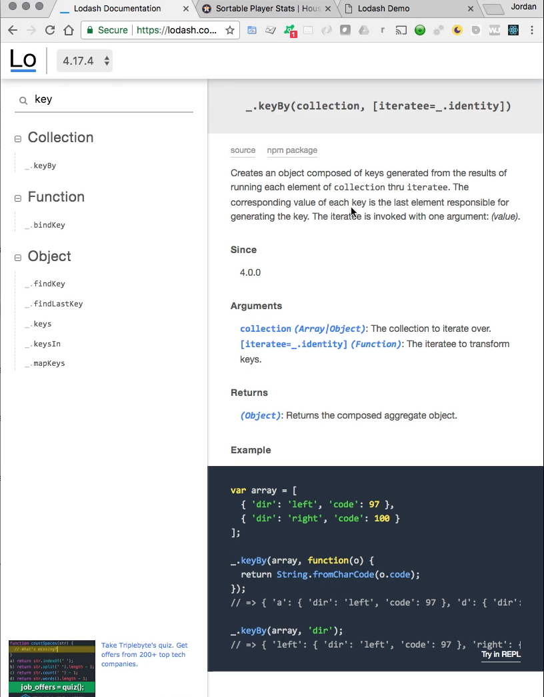

It also shows when the function was available so it's version

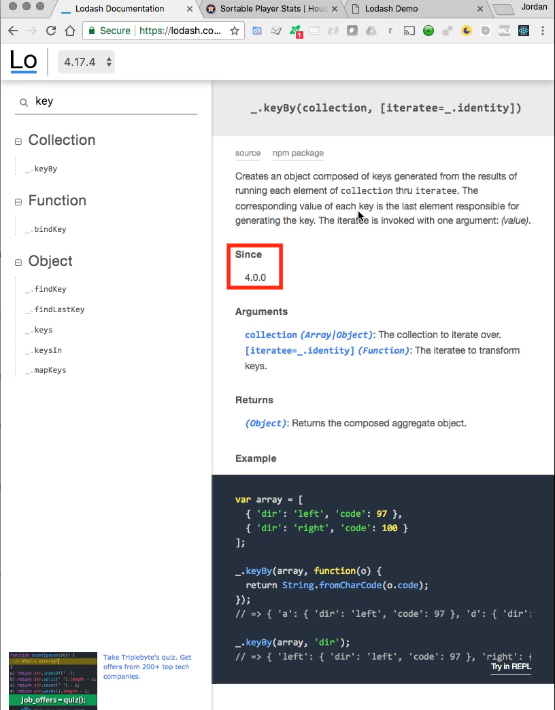 

and then it lists the arguments that are needed

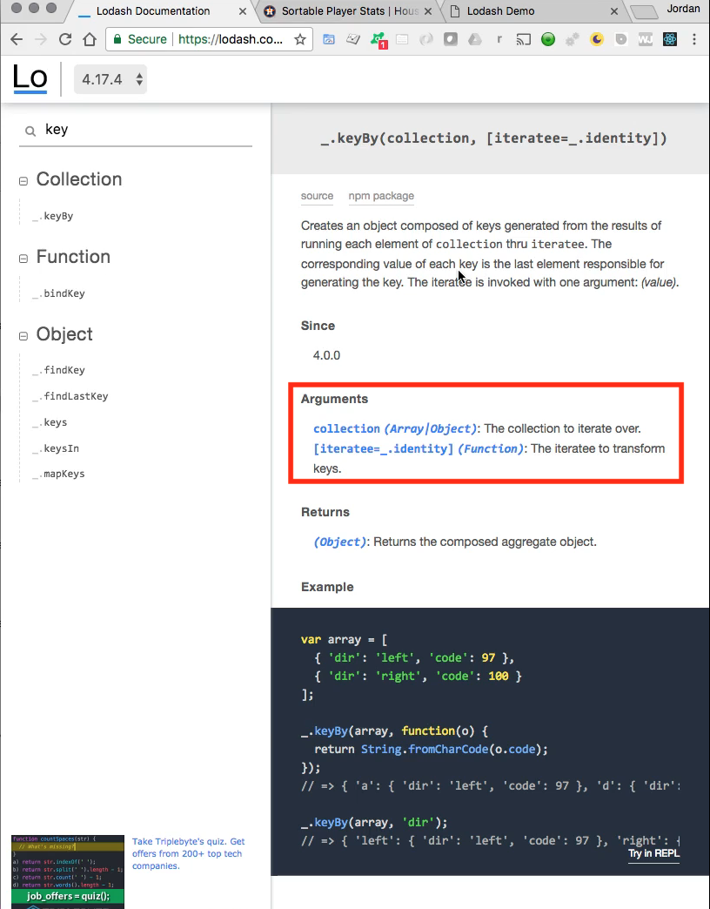 

and what it returns 

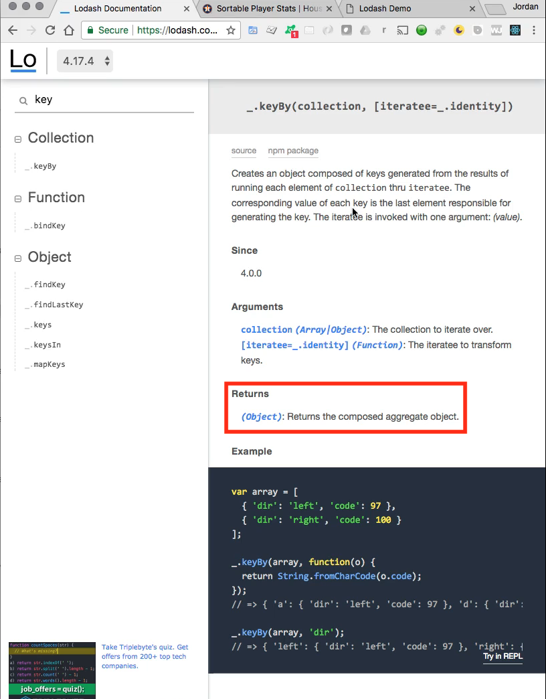

Right here you can see that it returns an object and the arguments it expects as a collection and then the iterator that you want to use to transform the keys. 

Now that may be very vague and that may make no sense at all, that's perfectly fine. They also have a summary here that reads a little bit closer to just standard English. 

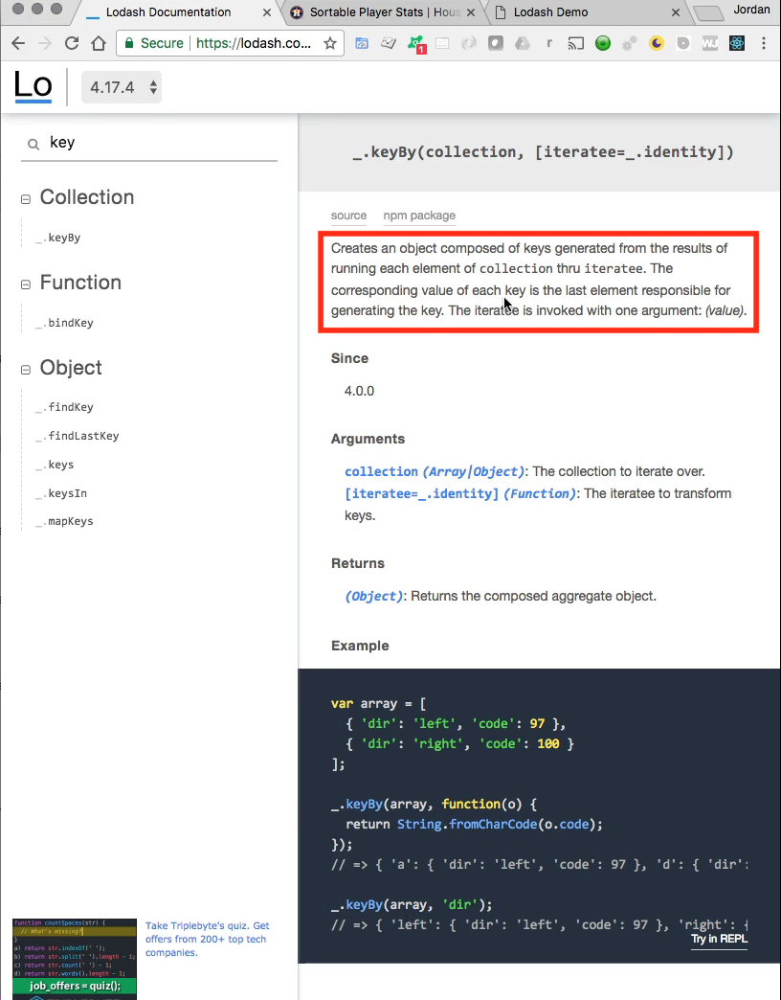

So it says it creates an object composed of keys generated from the results of running each element of collection through the iteratee. Now that still probably unless you are very accustomed to reading documentation that still might be a little vague. So let's get into our example and you'll see that this is actually a very powerful function and we'll see how we can use it. 

So right here we have the set of positions and then we have a set of names. 

```html
 const roster = [
      { position: '3B', name: 'Bregman, A' },
      { position: '2B', name: 'Altuve, J' },
      { position: 'CF', name: 'Springer, G' },
      { position: '1B', name: 'Gurriel, Y' },
      { position: 'LF', name: 'Gonzalez, M' }
    ]
```

Now, what happens if you want to actually use the value instead of the key? With our roster here we have an array and that's fine that's what we're expecting to have but each one of these objects they don't really have a way that we could use to distinguish them from one another. As you can tell all the keys are identical for all of these and so what that can mean is it can make it very hard to tell which value is which. 

Another very good example and I've had developers tell me that they actually use keyBy more than any other lodash function and the reason is because if you're working with API's imagine getting a set of blog posts back and you get them as an array and then the blog posts are objects and instead of possession it could say something like ID and then it could have a unique ID right here and the issue is that you want to actually work with the ID over the key. 

You want to treat it like it's your own type of database query or something like that. And so that's what keyBy allows you to do it allows you to reach into a nested set of objects like we have right here and it allows you to instead of having to worry about the key and then grabbing the value for the key. It allows you to just immediately go and grab the nested element. 

So in this case what I want to do is I just care about the position values and so let's see what this could look like to implement. So I'm going to say const positions is equal to underscore dot keyBy and then I'm going to pass in our variable so this is our array which is roster and then what you pass in next a second argument is the key name. Now you have to pass it in as a string so wrap it in quotation marks and I'm going to say position and that is literally all I have to do. 

```html
 const positions = _.keyBy(roster, 'position');
```

So let's see what this looks like so I'm gonna say console log positions. This isn't everything that I want to implement but it's part of it so I'm going to come back to the webpage hit refresh and see what it prints out it's still loading and looks like a little time out error because in the background I after I finish a video I actually upload it while I'm filming the next one so the issue is I'm trying to pull the CDN call in and the internet is slow so let me just hit refresh one more time and now it's working.

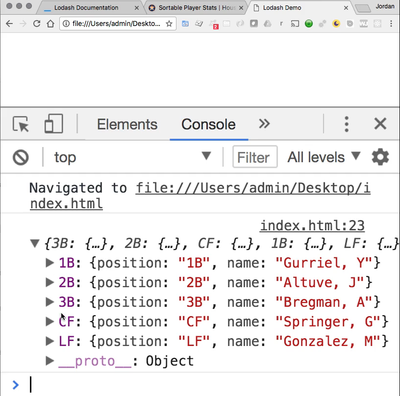

So what you can see here is we have a set of objects so this shouldn't surprise you but what might surprise you is. Notice how now we have a new set of keys so I think it may help to print out our roster right next to it. So let me just duplicate this. So I'm going to put the roster up top, save, hit refresh and now we're going to have two items. 

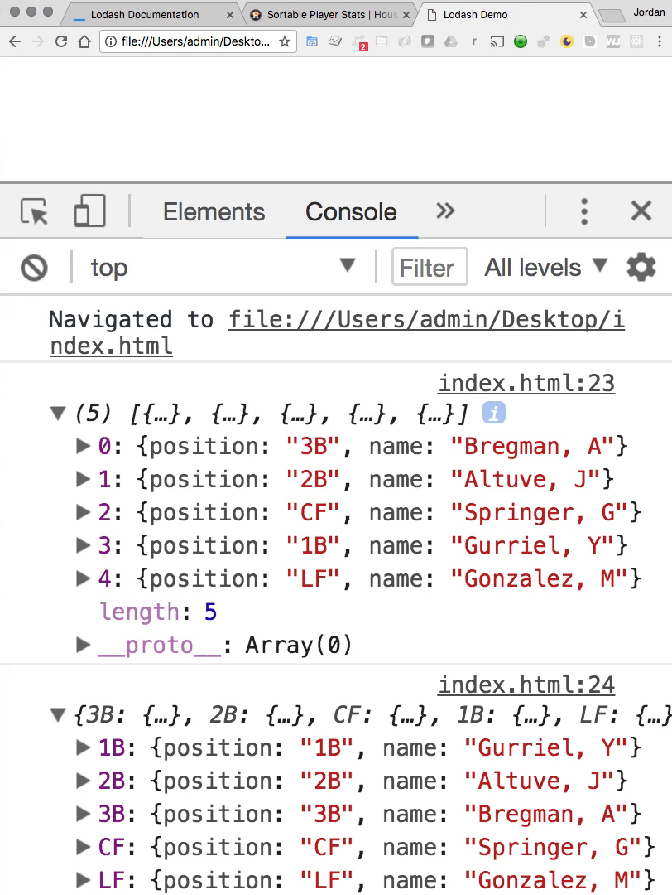

First is a list the other set is actually, it's not a list, it is an object so we have these to our list has these different index items so we have zero through 4. That's because if we look at our roster this is an array element this whole element is an array element it's the one at the zero index. Then we have one at the one index and so on and so forth. Now if we close this off and look at our new positions ones that had keyBy run over them. 

Now you can see we have an object and this object it has a whole different set of keys. Now we've essentially cloned our keys or I should say are key values for position. So when we pass them position it went into roster and it went into each one of these objects and it said OK for this position I want you to grab the value and I want you to make this entire object have a key of whatever the value was here. I know that that may sound a little confusing so let's continue with this example and that may help clarify it a little bit. 

Let's say now that I want to do something such as grab only the second base position so I could say const and just a second base set it equal to positions. And now what I can do is I can pass in 2B just like this. 

```html
 const secondBase = positions['2B'];
```

And so if you notice I'm no longer treating this like an array like I had to here now I can treat this like a traditional object and so I can say positions to be with this type of syntax and it's going to bring me my 2nd base object. So I'm going to clear this hit refresh and let's see. I didn't save the file clear one more time.

Hit refresh and I forgot to console log second base there you go. That would help. One more time and now we have what we want. 

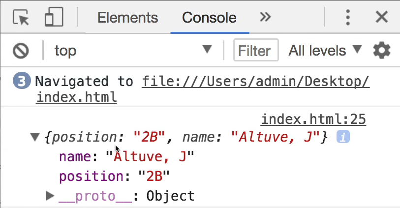

So as you can see right here we have a new object. So this is going in. It's grabbing the second base spot here. So everything that was at the second base position the entire object. We now have access to it and I cannot tell you how much this helps. Whenever you're working with a collection such as something that you get in from an API. 

So this gives you the ability to instead of having to build all these workarounds for going in and trying to filter down and find the values that you want inside of these nested objects. You can simply say you know what, don't even worry about that. I simply want you to change the structure up and I want to have an object and I want to have the position as being the new key. And so now from that point, I can call it just like anything else.

So if I want to say that I want to have the third base object here I can go in grab it and then say a third base save hit refresh here. 

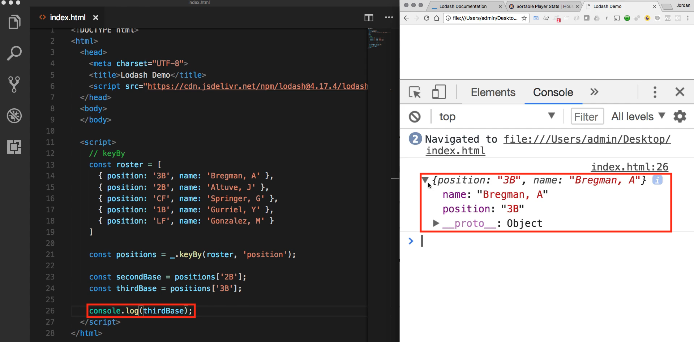

And as you can see we have so we have our third baseman with the name of Bregman and it also still does bring back that position value because it brings back the entire object, so that is the keyBy function. 

I'm going to clear all of this off and now we're going to go through a different example so now we're going to go through the reduce function so say reduce and reduce is very handy whenever you need to either total something up or run some type of calculation over a collection or also when you want to dynamically build a collection. And so we're going to go through three different examples because reduce is one of the functions I personally use the most and I find it very handy. 

So I think you will as well, I'm going to first give us a base case scenario this is going to be the ability to just sum up a collection of numbers so I'm going to say `const sum = _.reduce()` and then reduce expects and let's just very quickly open up the lodash documentation and say reduce click it and you'll see a full set of examples right here.

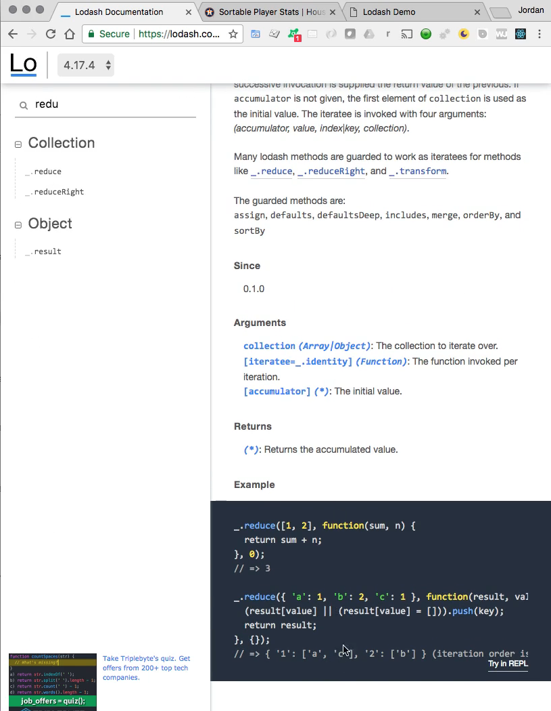

So I definitely recommend for you to check those out and then I'm going to walk through some of my own examples that I've pulled off from other projects I've worked on in the past. 

So I'm going to say reduce and very basic I'm just going to pass in an array called 1, 2, 3 and what it expects next is a function so you can use an arrow function. I've been using those a lot. So let me show you the other option where you just declare a traditional anonymous function here so I'm going to say function and this function needs two values and I'm getting some help from vs code right here where it says what it's expecting is the previous value and then the current value. 

I'm going to name them total and then just num and then from there, I'm going to set up my function. 

```html
const sum = _.reduce([1, 2, 3], function(total, num) {

})
```

So from a syntax point of view, I know this might look a little bit strange because we have all of these different parens but the way it works is we're calling reduce then we start in with a set of arguments to reduce the first set is this collection its this array of integers and then the next function argument is going to be a function so we're going to say function and then this function expects a total. So this is going to be your running total. It's also called an accumulator. 

So this is going to keep track of our total each time reduce iterates and it's going to much like the filter function did and much like the each function will do is just going to iterate over this. And so the very first time it's going iterate it's going to make it one so the total is going to be one. 

Then it's going to take one plus two get at it together and then you're going to get three and so on and so forth. So now that we have that now all we have to do is tell reduce exactly what we want so we're going to say `return total + num;`. So like I already walk through this is going to find num at each value and then it is going to add it. Now the last thing it takes one more argument and that last argument is whatever you want the start to be. 

If you want to say that you want to start counting from 100 you could start it at 100. I'm going to start it right at zero because in this case, that's the most logical approach. And now let's just print some out. So the way that you could do that is by saying `console.log(sum);` and just print it out just like that save it come back to your index file and the browser. And there you go. We have six so this works perfectly. 

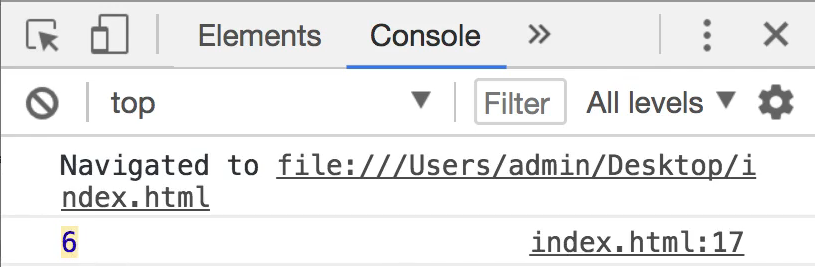

So we are what we're doing is we're leveraging reduce in order to tally up a collection and it does that very nicely if you were to do this manually much like how we walk through with filter and keyBy there would be a lot of manual looping that you would have to do and so reduce does that automatically. 

Now that we have that let's go through a little bit that was kind of a base case example let's go through something that is a little bit less trivial. Now I'm going to go and grab some stat code once again this is going to be from our baseball roster example. And so I'm just going to paste this in and if you want to look at the roster it's going to be now the objects or the name and then they're associated home run counts. 

And so what I want to do is this one is a very practical one in my opinion because what you have is if you were building a program that say, was a scoreboard or some type of roster system, then you might very well want to total up all of the home run counts coming in and so that is what reduce can do very well. 

In the first example, we took a kind of introductory look and we simply passed in an array of integers, but what happens when you have nested collections? 

We can't just pass home run stats because that's just an array of objects we wouldn't be able to treat it like we did with our some function. So how can we work with this? Well, what I can do here is create a variable say const total home runs equals and now call underscore dot reduce once again we're going to pass in homerunStats and then function and once again just like with our sum we're going to pass and total but instead of number we're gonna say this is our player and then use our curly brackets and I have the font zoomed in here so just so if you want to review the exact syntax. 

```html
const totalHomeruns = _.reduce(homerunStats, function(total, player) 

})
```

We have const totalHomeruns equals so we are assigning that to that entire functions we're calling reduce, we're passing in homerunStats and I'm going to walk through how we can access these values in a second. And then the second argument once again is a function. It's an anonymous function that expects to have a total and then a player. So right here inside of it, now what we can do is I can say return total and I can't just call homerun. I have to call my player object and then say player.hr and once again the third argument is where we want it to start and we want it to start at 0 and so let's now just console log our total home runs hit save and so now if I hit refresh you can see we have a 118 and that is accurate if you add each one of these homeruns up that is 118.

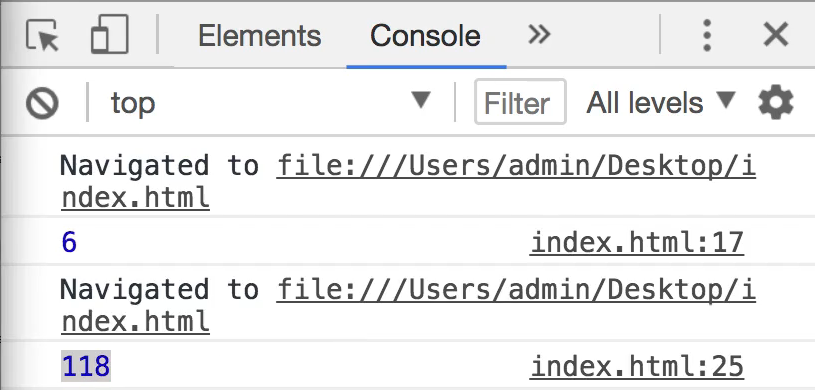

Just looking back at this code I know the syntax might look a little bit strange if you've never used it before. This is a very small amount of code for building something that is pretty non-trivial. We're going into multiple nested collections here and different types of data types. We're going into an array followed by a nested set of objects and from there just a couple of lines of code we're grabbing the values from one of the keys. 

Just like we're doing here and we're telling them all up. So reduce if you've never used any kind of function like this before. Essentially what you can think of it as is an ability to keep track of things and so that's what it's doing. So it allows us to accumulate values and then the function itself is keeping track of it and then at the very end, it just stores whatever the final value was inside of our variable whatever you assign it to. 

Now will have one more example on reduce just because it is so important and so I'm going to get rid of that code and bring in one more sample data set right here and paste this in. 

So here we have I'm changing it up, we're not going to a baseball example right here we're going to go with some links. And so what I want to do is essentially I want to build out what is called a view helper. So imagine a scenario where you get all kinds of links from an API and these links are fine but you actually want to convert them into HTML type links. 

What you want theoretically, say that we come up to the body tag up here I would want to have an a followed by href and then that is where I would want the whatever the URL is and then I would want to have the value of the URL so I can just copy this and then I need to end the tag and I need to and this one as well and this is what I want to generate. 

```html
<a href="https://google.com">https://google.com</a>
```

So say I'm getting these links in from an API or some type of source like that. I want to convert them into a set of these HTML friendly tags and so we can use our reduced function to do that. Now that may sound weird because so far we've used reduce simply to perform addition. And the reason why I wanted to include this last example is because reduce is very powerful and you can actually leverage it not just to perform addition or multiplication or those kinds of tasks. You can use it to build out entire sets and documents and different things like that anytime you need to keep track of some type of value and then build on top of that reduce is a great option for that. 

So let's come down here and start building it out. I'm going to say `const webLinks = _.reduce();` and hopefully this is starting to get a little ingrained in your mind since this is the third time we've done it. And so from here, I'm just going to pass in those set of links and once again we're gonna pass in a function that expects a total. Now I want to show you that totals is not a reserved word or anything so I'm just going to say the first our accumulator is going to be content. And then I know these tool tips are helpful when you're developing not so much though when you are giving tutorials.

I'm going to clear that off say content and then link and then from there we're just going to start our curly brackets once again. So in review we are passing in our collection a function an accumulator and then the iterator variable so this is the value each time that we iterate through the collection and then from here what we want to do is return something a little bit different than we've done before so we're going to use our string literals. So using back ticks and here say a and we're just going to build out a full HTML a link. 

I'm gonna say a href equals and then inside of single quotation marks, I'm going to say dollar sign and then curly brackets because this is going to give us our link and then end that right here so we're essentially building exactly what I typed up here. So we're building just a regular a tag which is a link tag in HTML and we're sliding in the link so we're using string literal syntax and we're just sliding in that link. 

And then from here what I want to do is just pass in the link once again so I can just copy that and then I'll paste in here and then I want to close this tag and I'm just going to add a break point. Not that we're actually rendering this on the screen but just so you can see exactly how we would do this. And now this is going to be a little bit different. Before we were just using addition we were using the addition operator. What we need to do here because we're dealing with strings is we're going to say concat. So I'm going to say I want you to take the content. So whatever was there before and I want you to concat this new string that we've just built. So we've just built this string. That is a tag we've slid our links inside. 

I want you to concat which means to add to the whatever the content was. And then for our argument here we're not going to have a zero. Because we're not dealing with strings. Instead, we're going to start off with an empty string. And that should be all we need let's say console.log webLinks  

```html
 const webLinks = _.reduce(links, function(content, link) {
      return `<a href='${link}'>${link}</a><br>`.concat(content);
    }, '');

console.log(webLinks);
```

So console webLinks and if everything I did is right there we should have a set of three a tags so clear hit refresh and there we go that worked. 

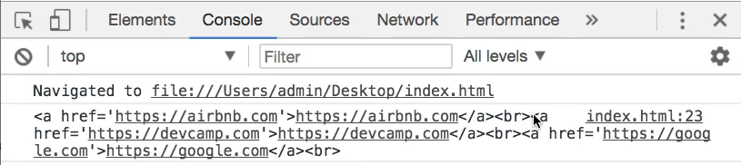

You can see we have an a tag that says href airbnb. And then it has the link has the end closing tag has a <br> and then it immediately goes right into the other tag so this is working perfectly. And so this is how you could build out an entire set of these links that are actually HTML worthy so if you're building something say you're building a widget that takes in links and then it makes some clickable then this is a way that you could do that and we used reduce for it. 

Now one last example we were going to do. And this is going to be a very quick one and I'm sure you're very happy to hear that because I know these last few guides have been pretty long. Hopefully, you see some of the power that you get from using these types of tools. And so what we're going to talk about now is the random generator. Now if you remember back and I'm going to pull in some of the code that we did we implemented before. 

If you remember back to the very beginning of the last guide and you remember how I used randNumber right here. And we had to call math.round followed by math.random times 100. 

```html
randNumber = () => {
  return Math.round(Math.random() * 100);
}
```

And that's just not a very fun way to live. So let's see how we can actually refactor this with lodash. And so what I'm going to do is I can get rid of all of this code after the return and just say `return _.random` so random is the name of the function and then random takes in two arguments and it's the start of the first type of value that you want and followed by the last one. And so what this means is we now will have a range of 1 to 100 types of values here. So the value every time randNumber is called is going to fall somewhere between 1 and 100.

```html
randNumber = () => {
  return _.random(1, 100);
}
```

Notice how we didn't have to do anything like we did before like how we had to round items and do those kinds of things random does all of that for us. And so now we can call the same exact code like we did before so if I say `const lodashSampleNumbers = _.times(5, randNumber);`now I can console.log this.

LodashSampleNumbers and if I don't have a typo's this should give us exactly what we had before but now in a much easier to read and much easier to remember kind of syntax so hit refresh and look at that. We have a full set of random numbers and a very nice random number generator. 

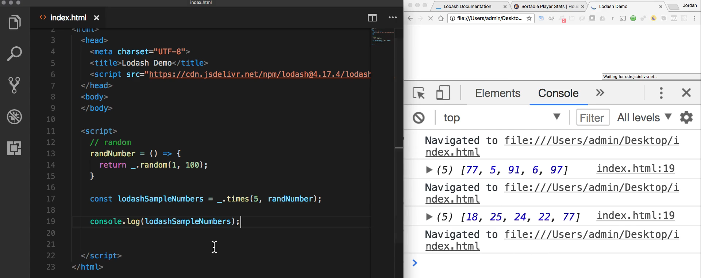

So this is I think a much easier way to write a random number generator. And here you can see we've combined a couple of different lodash functions all in one. 

So very nice if you went through that! I know that this guide and the last guide have been much longer than I typically like to build in my different tutorials but I think it's worthwhile for you to get a very nice overview of how lodash works what you have available to you. 

Like I said this really only touches the surface of all of the different features that lodash provides so I highly recommend after you finish this video to go through that documentation and pull down and play with some of the other functions and they have some great examples. You can literally copy and paste them right into your code to see exactly how they perform.

## Code

```html
<!DOCTYPE html>
<html>
  <head>
    <meta charset="UTF-8">
    <title>Lodash Demo</title>
    <script src="https://cdn.jsdelivr.net/npm/lodash@4.17.4/lodash.min.js"></script>
  </head>
  <body>
  </body>

  <script>
    // keyBy
    const roster = [
      { position: '3B', name: 'Bregman, A' },
      { position: '2B', name: 'Altuve, J' },
      { position: 'CF', name: 'Springer, G' },
      { position: '1B', name: 'Gurriel, Y' },
      { position: 'LF', name: 'Gonzalez, M' }
    ]

    const positions = _.keyBy(roster, 'position');

    const secondBase = positions['2B'];

    // reduce
    const sum = _.reduce([1, 2, 3], function(total, num) {
      return total + num;
    }, 0);

    const homerunStats = [
      { name: 'Bregman, A',  hr: 19 },
      { name: 'Altuve, J',   hr: 24 },
      { name: 'Springer, G', hr: 34 },
      { name: 'Gurriel, Y',  hr: 18 },
      { name: 'Gonzalez, M', hr: 23 }
    ];

    const totalHomeruns = _.reduce(homerunStats, function(total, player) {
      return total + player.hr;
    }, 0);

    const links = [
      "https://google.com",
      "https://devcamp.com",
      "https://airbnb.com"
    ];

    const webLinks = _.reduce(links, function(content, link) {
      return `<a href='${link}'>${link}</a><br>`.concat(content);
    }, '');

    // random
    lodashRandNumber = () => {
      return _.random(1, 100);
    }

    const lodashSampleNumbers = _.times(5, lodashRandNumber);

    console.log(lodashSampleNumbers);
  </script>
</html>
```
