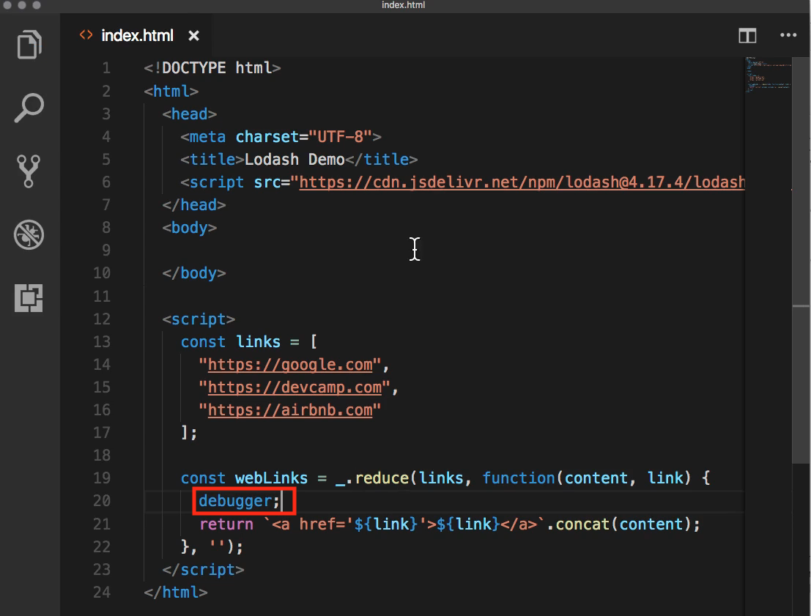
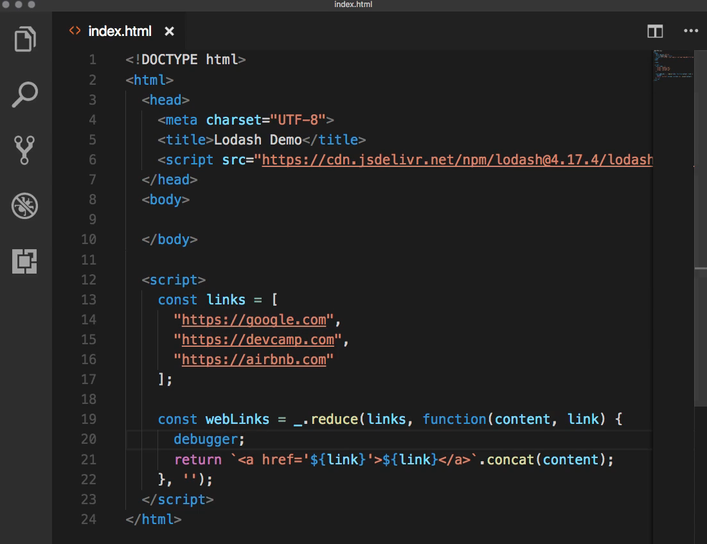
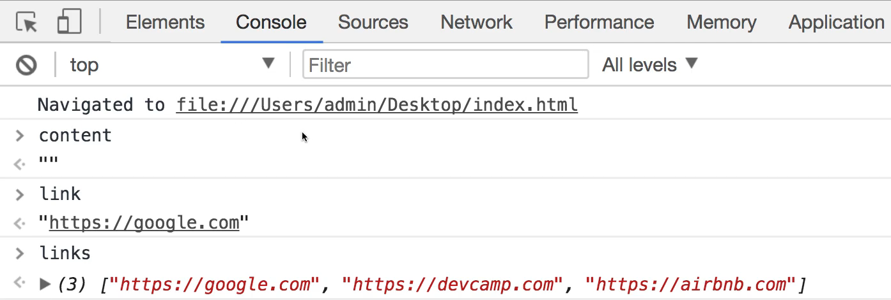
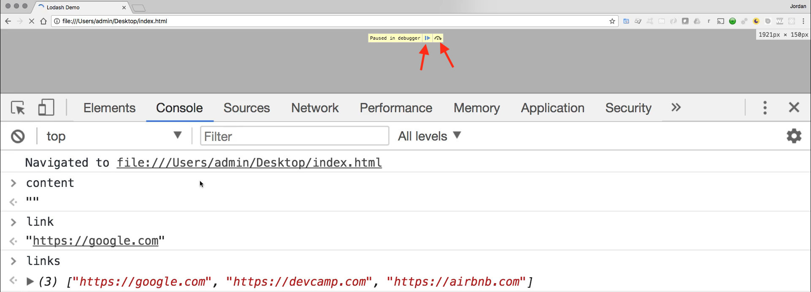
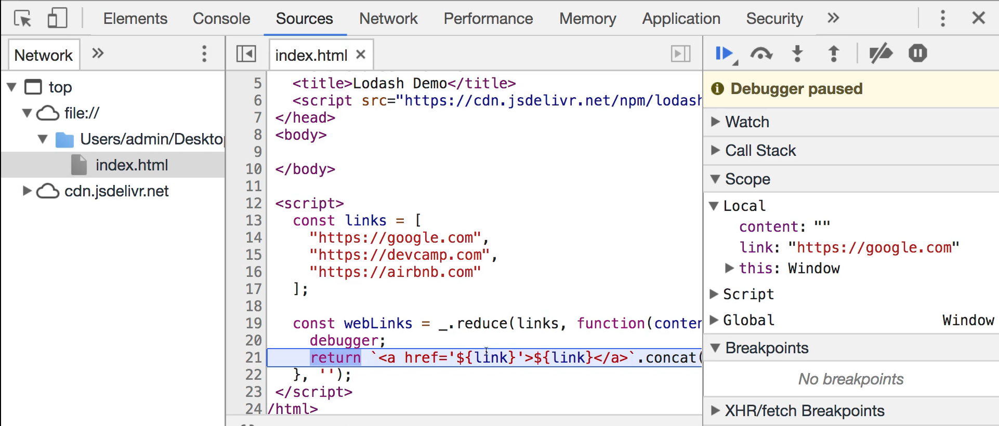
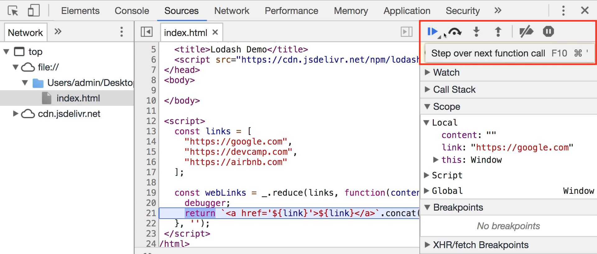
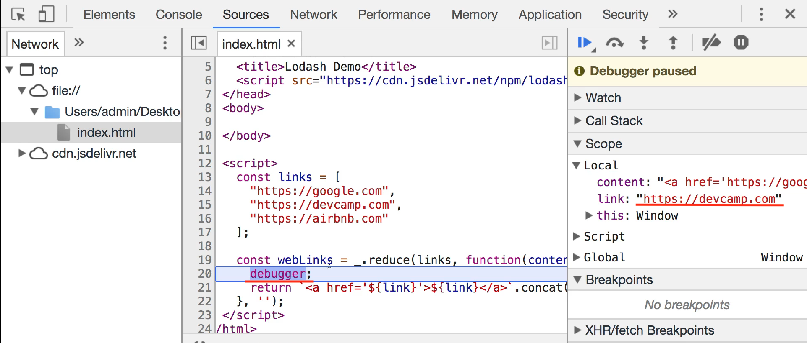
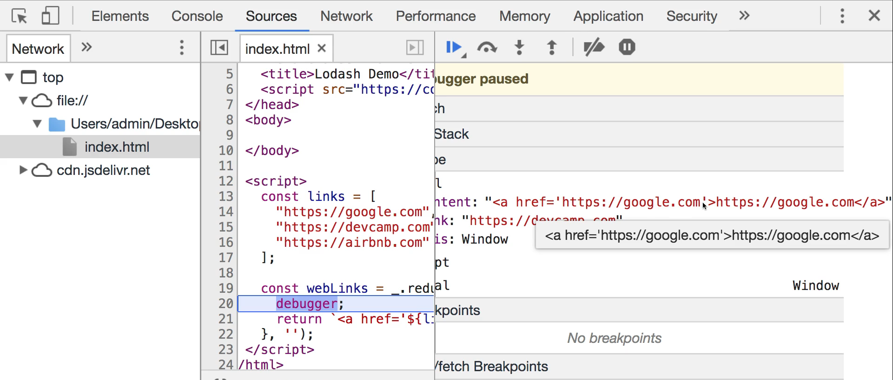

# MODULE 05 - 081:   ModernJS Tools (4)

## Debugger

---

---

## Video Lesson Speech

In this guide, we are going to walk through a very important concept and
 tool which is the debugger. And so what a debugger is, is it gives you 
the ability to stop your program in different parts of its execution 
life cycle

****

So, in other words, imagine the ability to instead of loading an entire page load all of the page or all of the script until a certain point and then at that point we're going to tell the program to stop so that we can ask questions. 

And so a very common use for this is whenever you're building out some type of piece of functionality and you're not getting the desired output. So say that you're building out some type of program and you expect to get a certain set of data back and you're not. And so I have right here an example from our last guide on lodash and specifically on our reduce function and this is where we built the links. 

Now imagine a scenario where we are not getting the desired output. So I took out the   tag and the way that you can use the debugger is anywhere in your script. Just type in `debugger;` and then hit save. 

So what the program is going to do now is it's going to load this entire file but as soon as it gets to line 20 here it is going to stop and so let's see exactly how that is going to run here and I'm going to hit refresh. You can see that the loader is still going. And it says paused in debugger and I'm going to stretch the screen out so that we can see it because there are some very helpful tools that are a good idea to become acclimated to. 

You can see that what this did is it opened up this debugger console where it showed exactly where we stopped and then also we have this set of debugger items. So we have a watch which we're not using right now it has a call stack simply letting us know that we're calling it in the index page we don't really care about that but here is where it starts to get pretty cool. 

Our scope allows us to look in and see what data is available so you can see if you reference back to the code right here. We have our content and we have a link and then we have a links. 

In the debugger, we can actually see all of that. So here we have content remember how reduce works. Content starts off as an empty string the first time around. So this is good, content is empty. Then we can see how what the value of link is. And now this is a very cool and part of the reason why I wanted to include this guide in addition to just learning about the debugger is also so it can give you a very clear glimpse into how these types of functional methods work. 

Notice how right here we're calling reduce and reduce iterates over this collection each time it iterates link is one of these values. So it is Google the first time as we can see right there then it's going to be devcamp then it's going to be airbnb and so we can see exactly how that works. 

Now we can also ask questions of our data. So if I come here to console and type in content you can see that we actually have access to the data I can type link I can type links and it gives us all of the different data in our application. 

I cannot tell you how helpful this is when it comes to building out applications. There are so many times where I am not getting the output I want and I immediately jump into the debugger and to find out exactly at what stage the program is either braking or it's not building out the types of behavior that I want. So we have a couple of little tools up here that are helpful. So the very first one allows you to resume the script execution. The next is to step over into the next function call. 

So let's press that and as you can see what it now does is it's moved down one line and now it's at return and it's on our string literal. 

And you can see also if you hover over what the value of the string literals are so one of the best parts of using the debugger is it gives you some of the best transparency you're going to have into what your program is doing while it is executing. Now you also have some other ways of navigating so you can resume. You can step over again from here. You can step into the next function calls so on and so forth.

I'm going to click on resume script execution and notice this doesn't just run the program. It simply goes through and iterates again. And this is what I wanted to show you because this is pretty cool it came back to debugger and now we are on the link of devcamp. 

And so hopefully this helps. 

If you did have any issues understanding how functions like reduce work and really any of those functional methods work. Hopefully, this gives you an idea of what some of these values represent because right here as you can see they're changing with each iteration. 

So now we're at a devcamp and now we can see if we look at content exactly what it is. So you can see it's already generated our google link. 

Imagine this is a scenario where we're not getting those breakpoints at the end right here. We'd be able to see and say OK I forgot to put the   tag right here at the end. And so I can fix that by coming down and then simply adding a   I can then get rid of the debugger save the file and if I hit refresh now everything is just working like before. 

So the debugger is only going to run whenever we have placed that inside of the code so hopefully that was a good introduction to you on how you can use a very powerful tool which is the debugger inside of your javascript programs.
