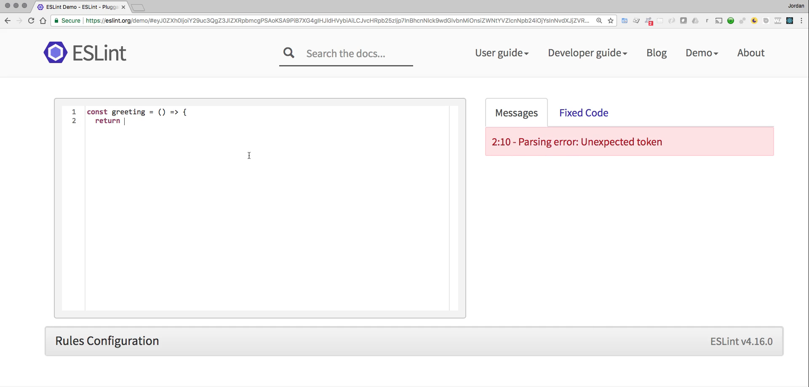
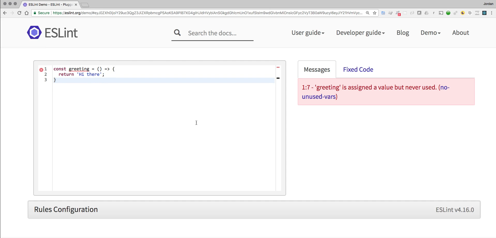
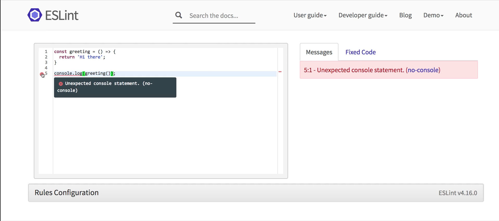
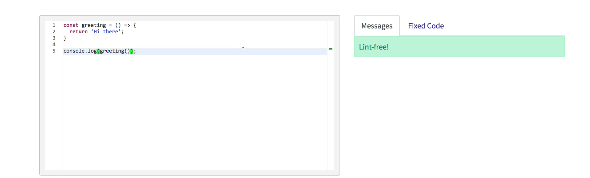

# MODULE 05 - 083:   ModernJS Tools (6)

## ESLint - Linting tools

---

---

## Video Lesson Speech

In this lesson, we're going to walk through a tool called Linting and 
specifically we are going to look at the ESLint tool. However the 
concepts that we're going to discuss can really be applied to just about
 all of the different lint tools that are out there for JavaScript.

****

So before you go into that what exactly is a Linting tool. Well Lent is the process by which a library goes through your code and it gives recommendations and the recommendations can be as straightforward as saying I think that you have structured this improperly all the way through realizing that your program won't even run. 

So there is a very wide selection of different Linting tools and settings. And so what I want to walk there is more just to introduce what Linting is and then, later on, we may choose to implement it into a project. But for right now I just want to kind of give you the high-level concept. So let's walk through a basic example I'm going to create a greeting function here so I'll say const greeting and then I'm going to create an arrow function and then inside of it I'll just say return. And one thing you may notice as I'm typing it shows that there are error messages here and it says exactly where it is.

and it makes sense because I haven't closed off the curly brackets I haven't added what the return value is going to be and you'll keep on seeing new errors popping up which is perfectly fine. So say hi there. Close it off and now you see another error.

Now, this is more of a warning and it's very helpful, imagine that you have a very large program common best practice is to make sure that you don't build any functions that are not being used. And so if I hover over this it says greeting is assigned a value but never used. This may seem kind of like a trivial thing if you have one single function like we have here. 

However, if you have a large legacy application I can tell you from experience that if you have functions that are simply sitting around and not being used at all. Maybe they used to be used very early on in the project's lifecycle but since then new functions are created new modules are brought in and you have what are essentially these orphaned functions and those can be very confusing. I've had times where I was working on a legacy application thinking that I was working on the correct function only to find out that the function I was working on was not being used by any other part of the project and that is not fun. I promise that you do not want to experience that. 

So what this is saying is hey you have this function you're assigning a value but you're not using it so I can get rid of this by just saying greeting and then just calling it. And now you can see we are lint free. 

Now there are also some best practices that are integrated into these types of things so if I were to type in console log it is going to throw an error and it says an expected console statement. If I hover over it said unexpected console statement no console. 

Now the reason for this is, imagine a scenario where you have a production application and you are performing debugging, and so you add some console log statements as you are building out the program or fixing a bug and then you push that to production so you push your new fixed patch up to production and you forget to take out your console logs statements. What that could lead to is imagine that your console logs statements were making available certain security kinds of elements so your secret keys or something like that and that's a security vulnerability that you may not think of at first. 

But I have seen applications where the developers did not have a Linting tool in place and they simply push code up to production and if you open up the javascript console I would see database records and different things. They were console logging and they were doing it in development it made sense why they were doing it but you don't want to have those kinds of things in production. 

Now you have a full set of rules configurations here and if I scroll down and actually can call out if you notice right when I hovered over it gave this little no console. That is their official name for the rules so if I just search for no console on the page you can see that it's right here and if I take this off each one of these things each one of these elements is a rule that I can remove. And so if I remove this then it's no longer going to have that error so here I can see that we are now completely lint free.

And so what you may choose to do depending on how you have this type of service integrated into your project. You may choose to have console log statements be perfectly fine in your development environment and then create another set of rules for production to make sure that you wouldn't do something like push that up to a production application. And so this is a cool set of options where you can just go pick and choose all of the kinds of elements that you want to allow or not allow with these rules 

After you're done you can actually download an entire configuration JSON file 

And we're not going to do that now because you really only need to do this when you're building now a full project. Right now we're learning concepts and those kinds of things but we don't need to integrate this. This is more for what you would do with the project but I did want to show it to you one because it's pretty cool and I think it can be helpful for when you do get the point where you're building out projects. 

But also because if you are learning Javascript in order to go out into the world to become a developer then you need to know about these kinds of tools because these are going to be used in all kinds of different organizations and they're very popular it's very rare that you'll run into a production application that doesn't have some kind of Linting tool so I want to give you a brief introduction to it and then later on then you can incorporate them into your projects.

## Resources

- [ESLint Demo](https://eslint.org/demo/)
