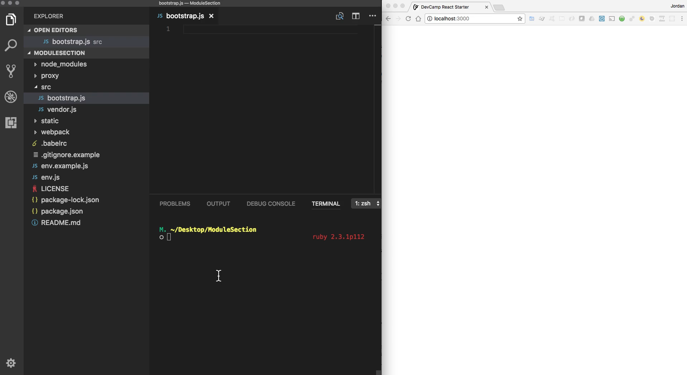
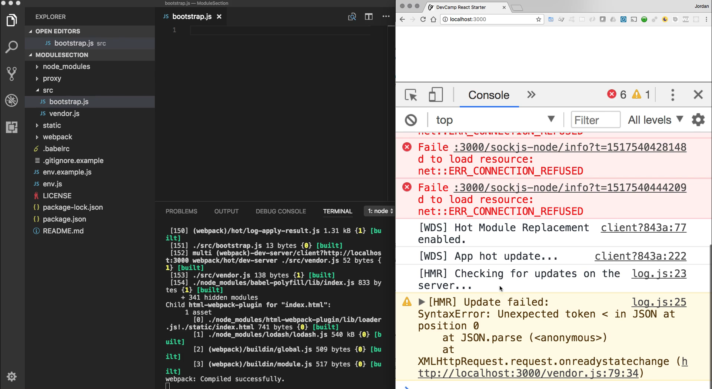
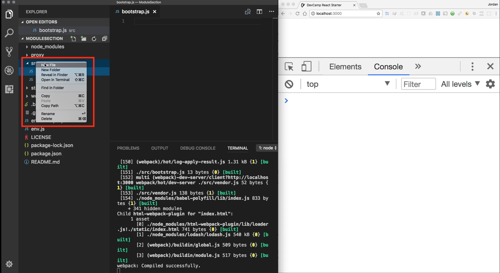
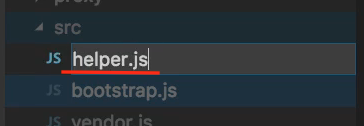
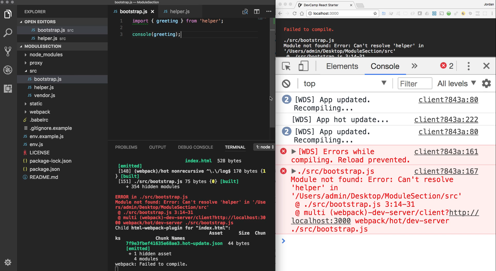
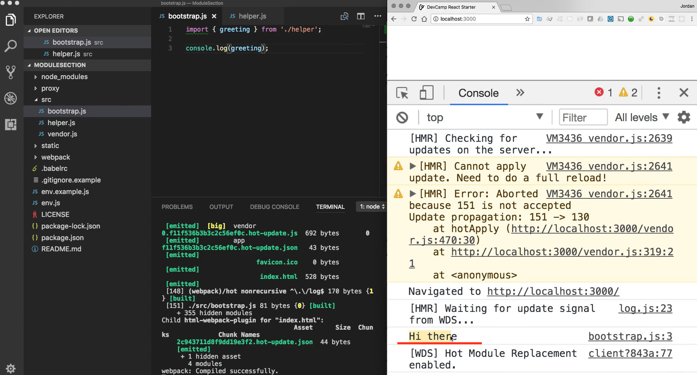
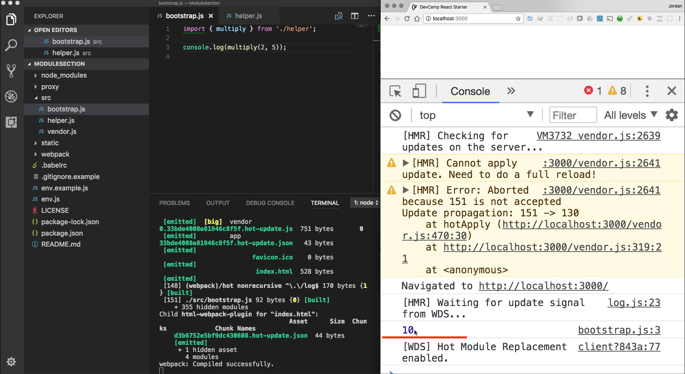

# MODULE 05 - 094:   JS Modules

## Modules (3) - Importing / Exportin code

---

****

## Video lesson speech

Now that you have the initial set of ES6 tools installed, now we can 
actually learn about how we can build modules into our javascript 
programs.

****

So to start off I have our set up here where I have the text editor, the terminal, and then the browser are all open 



and in future guides, I most likely will simply have the server running here but for the sake of repetition so that you can get used to running these commands I'm going to run npm start. That is going to start up the server for a module section program and then I can open up the javascript console right here. And for right now it's just giving us some errors from earlier. And there isn't anything showing up because we don't have any code. 



I'm going to clear that off and now let's talk about the syntax we need in order to add imports into our programs. So far throughout this course, we have for the most part kept all of our code in one file. Now there were times where we learned about say the lodash library in that case we were importing the lodash code but we were doing it from a completely different server and so what we're going to do now is separate code snippets out into different files and then our system is going to put them together. 

So our bootstrap.js file is going to be able to import code files from anywhere else in our project that we are going to call and then it is going to be able to use them. This is going to follow a pattern you are going to see a lot if you're building Vue or React or Angular applications and so that's part of the reason why one I built out the entire node module so it'd make it very easy to start implementing these kinds of tools. But also why I'm spending an entire section simply dedicated to this because when I first started learning angular and I saw some of these import statements my initial idea was that these types of tools were simply available in the framework.

And then I started to diving into vanilla javascript into the modern syntaxes and this is a number of years ago and I saw that this was something simply baked into ES6 and had nothing to do with the framework and so I wanted to give this to you so that there's no confusion. Whenever you do start building now more advanced programs and using tools like react and view and these kinds of things that what you're going to see when you see that you're going to recognize that it's just pure Javascript and it's not going to intimidate you. 

So first and foremost I want to create another file so I'm going to show you a few different ways you can import code so I'm going to come into the source directory here I'm going to right-click click and select new file 



And here I'm just going to say something such as helper.js

 

you can call this whatever you want and here I'm going to start off with the most basic example I can think of so I'm going to say const and we'll say greeting. We're going to stick with our greeting function here or a greeting variable in this case. I'm going to say 

```js
const greeting = 'Hi there'; 
```

So this is a pretty basic example. So what do I have to do in order to get this variable from our helper.js file into our bootstrap file?
Well, there are a few steps. The first step is that this const greeting variable by itself cannot be ported over into bootstrap directly we have to actually be very explicit and say that we want to export this variable so I'm going to say 

```js
export const greeting = 'Hi there'; 
```

So everything here is the same except we've placed the export right in front of our variable definition. So now that we have that we can now use our modern version of import so I can say import and then in curly brackets I can pick out what I want to pull in so I can say I want to import that greeting variable and then from because I have to tell javascript where to go and pull this from and now I have to pass in a path to where this file is. 

Now you may think that I could simply do something like helper.js but as logical as that looks that's not actually the way that it works there's a couple issues with it. First, we don't have to put js at the end javascript knows because we're pulling in this type of import statement that by default we are going to be pulling in JavaScript files so we don't have to put that in. But the other issue is that we can't simply pass in this type of path. And so what we have to do is type `./helper`. And so what that is going to do is it's actually going to find the path and instead of going straight for helper because what that's going to do is it's actually going to give the incorrect path. 

And let me show that to you right here just so you will believe me. If I tried to console.log out greeting from here you're going to see we have an error. 



It says that the module could not be found. We cannot resolve helper in and this is the key `/Users/admin/Desktop/ModuleSection/src`. So the issue here is that if we do not essentially tell the javascript that we want to find this helper function or this helper module inside of the directory it's actually going to simply look at source and instead of looking at source like it's a directory it's simply going to try to find it inside of source and so that's not going to work. So what I can do is say ./helper and now this is going to actually work. 

**so in our bootstrap.js**

```js
import { greeting } from './helper';

console.log(greeting);
```

**and in our helper.js**

```js
export const greeting = 'Hi there';
```

So I have called import greeting and let me just click on our helper and pull and pulling that and so I'm importing greeting and then I simply want to console log out that value. I'm going to hit save. And let me come here and I'm going to clear all of this out and we will hit refresh. And OK we still have an error. So it says console is 0. That would probably be a big mistake console and you as you were following along you probably saw that. So console.log and here you go. Now we have Hi there. 



So this is working properly. This is your base case for understanding import and export statements. So far just in review the way that this works is any time that you want to export some variable or some function or even a class from one file to another you have to explicitly say that you want to export this value.

And then on the other side of this on whatever file you want to bring this into you say I want to import this value. So, in this case, we're importing a variable of greeting and then you say I want to do this from this './helper' path and that will bring in this. It's going to call this helper file and it's going to pull in this variable so that all works. 

Now let's see if we can extend this a little bit. I'm going to get rid of our greeting here and now let's see if we can apply the same logic to a function. So here I'm going to say export function and now we can just say something like multiply. And so for multiply, I'm going to pass in a few different arguments I'm going to say export function multiply numOne and numTwo and then from there, we're simply going to return numOne multiplied by numTwo. So numOne multiplied by numTwo 

**our helper.js looks like this**

```js
export function multiply(numOne, numTwo) { 
  return numOne * numTwo;
}
```

Nothing here is too complex whatsoever, we're simply creating a very basic function that multiplies 2 numbers together. 

So now I'm going to get rid of this console log statement and instead of importing greeting now I'm going to import our little multiply function so I'm going to say import multiply the path remains the same. And so now what I can do is I can simply call this out so I can say console.log multiply and because this is a function I'll pass in a few numbers or pass and 2 and 5 

**our bootstrap.js file will look like this** 

```js
import { multiply } from './helper';

console.log(multiply(2, 5));
```

Hit save and as you can see on the right-hand side right here this works.



So I have the hot reloading built directly into the code base that you're working with so you don't even have to come and hit refresh it auto loads here in the browser so as you can see here in the javascript console that we now have a fully functional module so we have a file here of helper that we can pull in to any other file. So imagine a scenario where you're building out an application and you have one piece of code that needs to be shared across many different files. By leveraging this syntax, this ES6 import syntax. We can quickly import this multiply function anywhere else in the application we need it without having to duplicate that code. 

So this is going to make for a much more scalable application it's going to be an application that has a code base that follows best practices and it's going to be something that's going to work much better in production. So that is a high-level view of two different ways that you can import and export code in JavaScript.

## Resources

- [Project Source Code](https://github.com/jordanhudgens/modern-javascript-module-section/tree/293ef0ebf9ce4c15c0e16ee2b03be807858bb8ca)
