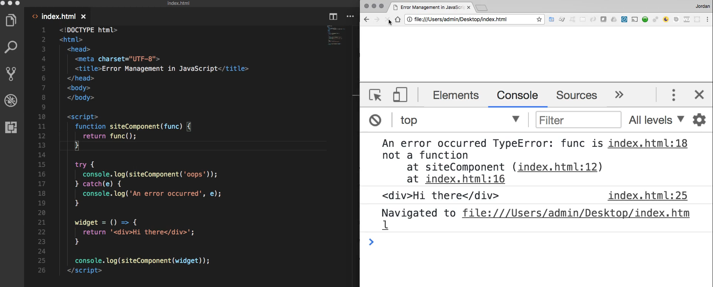
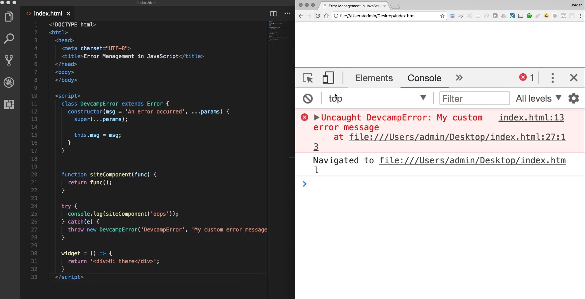
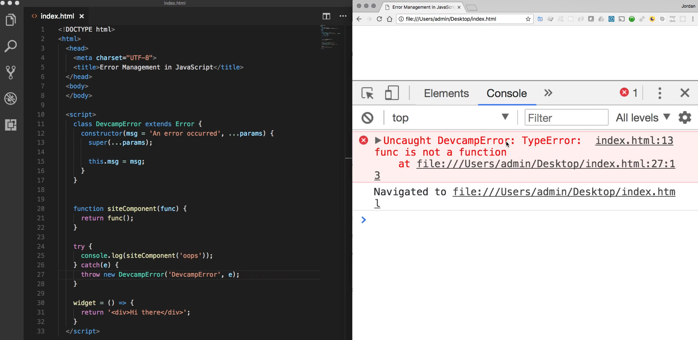
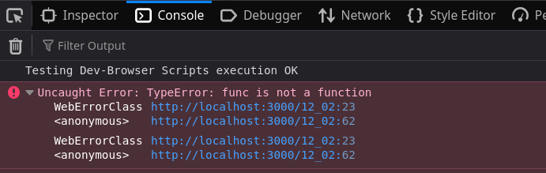

# MODULE 05 - 089:   JS Error Handling

## Error Handling (2) - Custom Error `class`

---

---

## Video Lesson Speech

In the last guide, we walked through a basic introduction to the syntax 
for error management in JavaScript, and in this guide I want to extend 
that knowledge.

****

Now we're going to build out a custom error class that can manage any of our errors that we want to add any custom metadata to. So right now in review, if we run our code exactly like how we have it where we have just a basic try and catch block where we're simply logging out an error, this is good but we can do even better. 



Imagine a scenario where you have a large application. This type of error may not give you all of the details you really need in order to understand what happened when this error occurred and in order to help you go and fix the problem. And so what we can do is we can create a custom error class where we can customize this message. So right now we can simply say an error occurred and we say that it's a type error. But what if we wanted to actually create a name for our error. So we want to create our own error and we want to be able to catch that. Well we can do that and I'm going to come right up to the top of our script tag and I'm going to create a class. 

And so I'm going to call this class our DevcampError and the syntaxes we need to extend and the naming for this is extends the error class in JavaScript and then we can replace some curly brackets and everything inside of this error class is going to be what we want to add any time we want to call our new custom error. So I'm going to add a constructor function and the first thing that I'm going to pass it is a message and so I want to have a default message and I'm just going to say an error occurred. And so this is going to do is any time that I do not pass my own custom message it's going to default back to this an error occurred in one. 

And then from there if I want to take in any other programs I can use the rest operator and say prams and then inside of the constructor I need to call super. And if you remember back to when we talked about object-oriented programming in JavaScript you know that this super function right here is calling the error class and so we are inheriting from the error class. And so we were calling super which means we're bringing down all of the other constructor functions and the basic behavior for error and inside of this. I'm simply going to pass in the params with the rest operator and then I'm going to set this message equal to message. 

So this is the exact same message which is our first argument in the constructor and for a basic error class, this is all you have to do. So we've now created our error class and so with that in mind I can come here and delete this console log statement and now what I want to do is actually want to throw an error so I'm gonna say throw new and I can call it DevcampError and then pass in the actual error.

So I'm going to pass in rate here I'm just going to pass in as a string DevcampError and then I can pass in any message as a second argument that I want. So I can say my custom error message and now let's see exactly what gets printed out and also just so we don't have any confusion. I'm going to get rid of the second console log statement just because we already know that it works. If we pass in the correct value. So I'm going to clear this and hit refresh and this worked. 



If you notice right here we actually have a real error. So instead of just console logging it out like we did in the last guide here as you can tell we raised our own exception and that is perfectly fine. Just about every major code library that you're going to find are going to have times where they want to truly raise an error. So if the system is not doing its job it's doing something wrong then you may want to raise an error like this. And this comes in very handy whenever you're building your own code libraries or building code that other people are going to utilize and so you can see it says uncaught DevcampError. So right here we're getting the exact error that we created we're getting this class and so it's saying Uncaught DevcampError. And then my custom error message and so this is giving us exactly what we passed into our DevcampError class.

Now we could also make this much more useful if we passed in the error itself so I can pass in the E variable that we caught. And now if I clear this and run it again now you can see it says uncaught DevcampError 



(Firefox 2025 debugger-console may vary as shown here:



)

and then it gives the type error it gives the exact error that actually occurred. And you may really wonder why in the world are we doing this? Because technically it kind of seems like we're back to where we started where we have a TypeError which is exactly what we would have gotten if we wouldn't have even had these try and catch blocks at all and we simply called our console log siteComponent function here and passed in the wrong value.

And this really speaks to best practices when it comes to JavaScript development. So if you're working on a large project there are going to be times where you want to catch very specific kinds of errors. So in this scenario right here if you have for example and this is something that I've personally come across in the past if you are building out a feature such as a CSV uploader where you allow users to upload a file but you have some specific requirements such as what you want the columns to be named or something like that. 

Then if you are building that in then you might want to have your own custom error message because you know that the most common errors are users who upload the wrong type of file or they upload a file that has the wrong headers and you want to be notified of that. And so what you can do is in your uploader place this kind of code and then build out a custom error class that's called something like CSV error class or something like that. And then inside of this, you can have more than just what we implemented here. So I just implemented a basic constructor but you can put other elements you can put other functions and processes in this error class.

A great example of one would be let's go back to our CSV example if you want to be notified or you want the user to be notified if an error occurred that was related to that CSV uploader you could create a function here that emails the user any time that takes place. And so there you have called your specific error the log for your server is going to be able to keep track of that and you'll be able to see when those errors occurred. 

But you can also build in those types of processes such as user notifications or admin notifications and then all of that can be done within your custom error class. And as you can see that would be much different than simply allowing errors to occur there are all kinds of different processes and customizations that you can build in when you are using your own custom air classes.

## Code

```html
<!DOCTYPE html>
<html>
  <head>
    <meta charset="UTF-8">
    <title>Error Management in JavaScript</title>
  </head>
  <body>
  </body>

  <script>
    class DevcampError extends Error {
      constructor(msg = 'An error occurred', ...params) {
        super(...params);

        this.msg = msg;
      }
    }


    function siteComponent(func) {
      return func();
    }

    try {
      console.log(siteComponent('oops'));
    } catch(e) {
      throw new DevcampError('DevcampError', e);
    }

    widget = () => {
      return '<div>Hi there</div>';
    }
  </script>
```

****

## Coding Exercise

Write a class called `SocialMediaError` that extends **Error**. It will also need a constructor with 2 arguments, one for the `msg` and the params. Be sure to create the `msg` property within the constructor. (**Don't worry about writing the `try` and `catch`, etc. Just write the class**)
