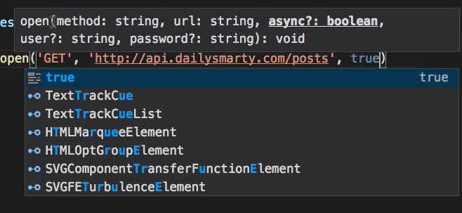
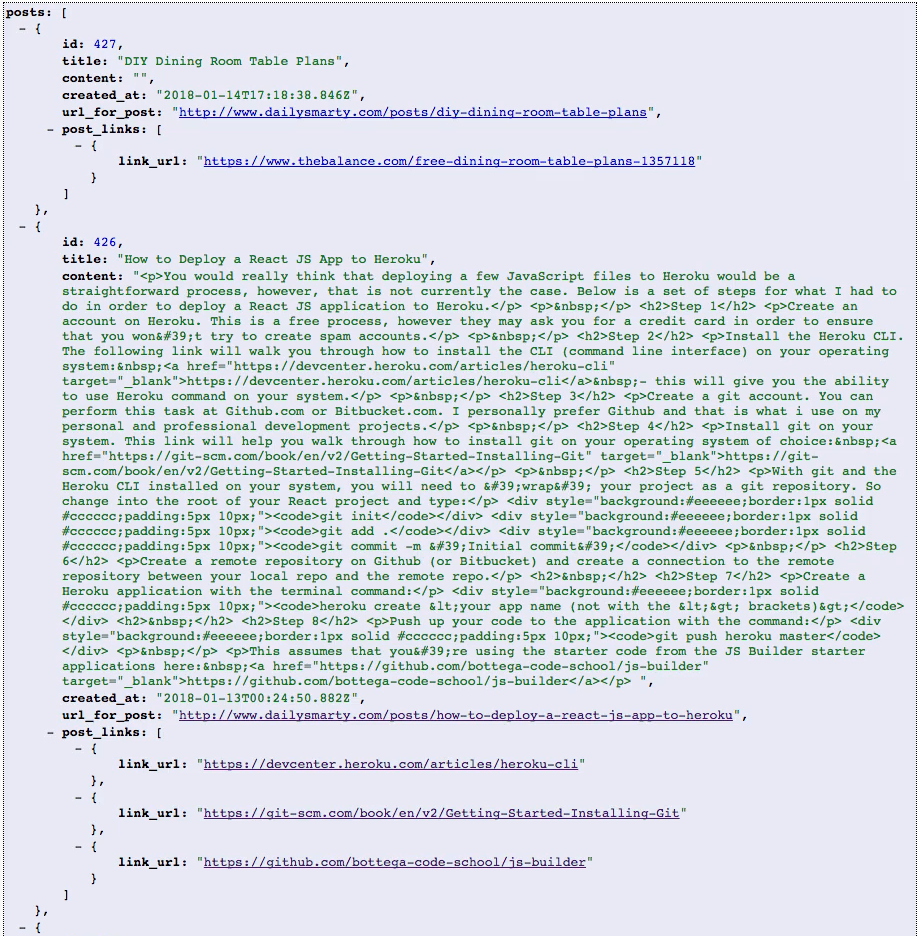
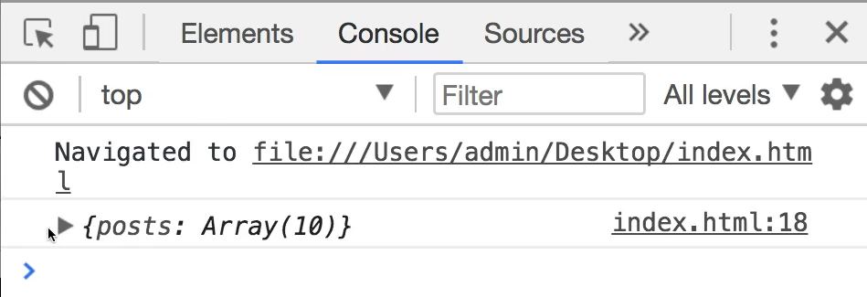
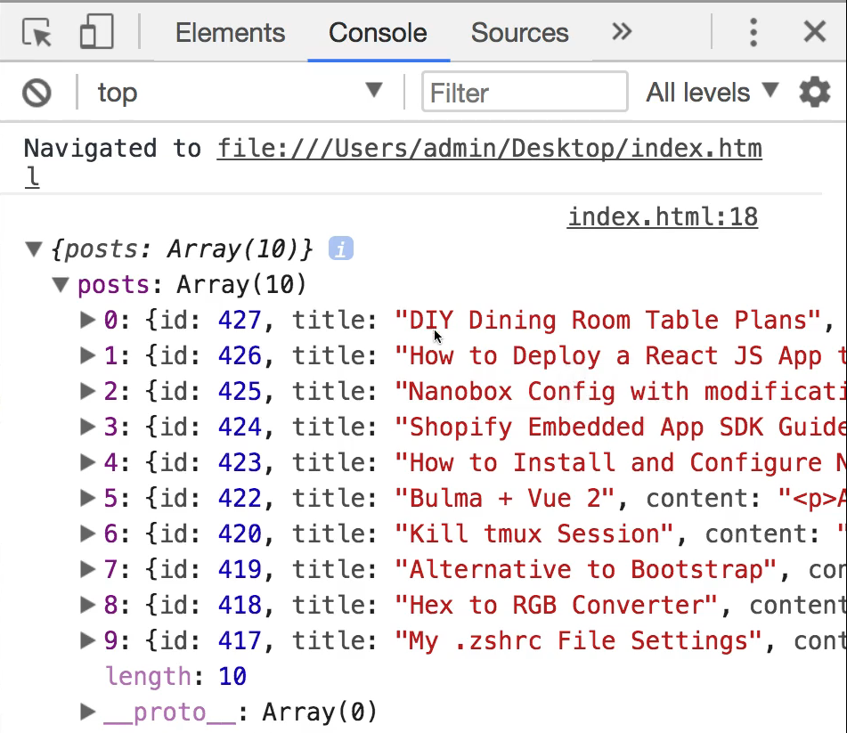
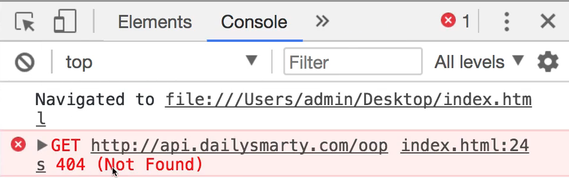
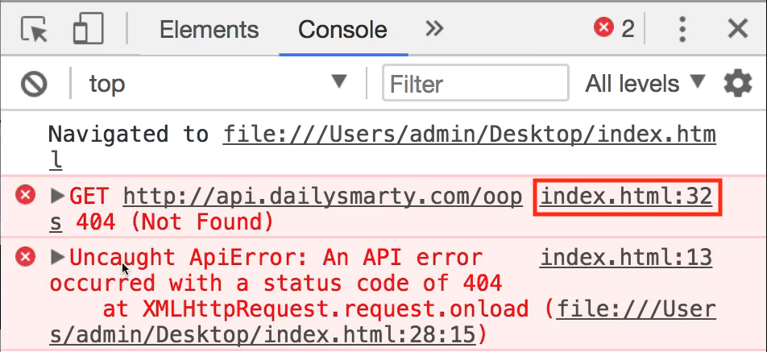
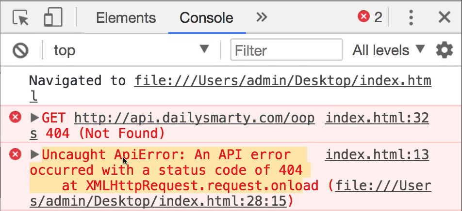
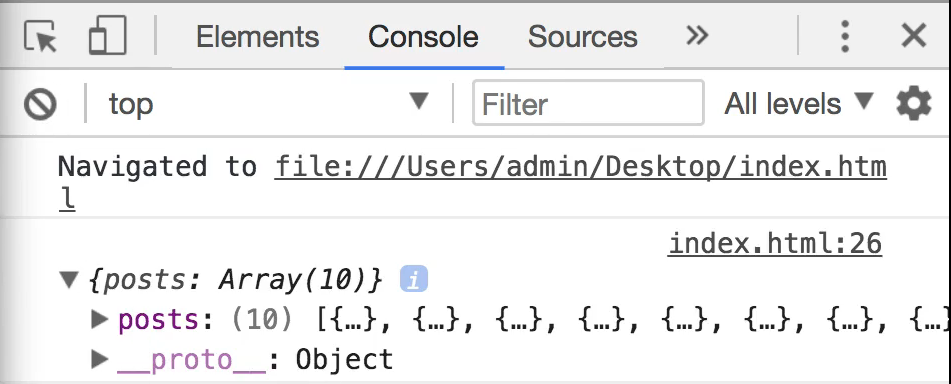

# MODULE 05 - 090:   JS Error Handling

## Error Handling (3) - Error Handling into API calls

 ---

1. Core Concepts: XMLHttpRequest & Status Codes

2. Implementing Custom Error Classes

3. Practical API Workflow

4. Use Cases

****

Proper error handling in API communication is **essential** for:

- Gracefully handling service outages

- Providing user-friendly error messages

- Maintaining application stability

- Debugging network issues efficiently

This guide uses vanilla JavaScript's `XMLHttpRequest` and custom error classes to demonstrate robust error handling.

****

## 1. Core Concepts

### XMLHttpRequest Basics

```js
const request = new XMLHttpRequest();

request.open('GET', 'https://api.example.com/data', true);

request.send();
```

### HTTP Status Codes

| Code Range | Meaning       |
| ---------- | ------------- |
| 200-299    | Success       |
| 300-399    | Redirection   |
| 400-499    | Client Errors |
| 500-599    | Server Errors |

### Custom Error Class Template

```js
class ApiError extends Error {

    constructor(msg = 'API error occurred', ...params) {
        super(...params);
        this.name = 'ApiError';
        this.msg = msg;
        this.timestamp = new Date();
  }
}
```

****

## 2. Practical API Workflow

### Full Implementation Example

```js
class ApiError extends Error {

    constructor(status, url, ...params) {
        super(`API request failed (${status})`, ...params);
        this.name = 'ApiError';
        this.status = status;
        this.url = url;
    }
}

const request = new XMLHttpRequest();

request.open('GET', 'https://api.dailysmarty.com/posts', true);


request.onload = function() {

    if (request.status >= 200 && request.status < 400) {

        try {

            const data = JSON.parse(request.responseText);
            console.log('API Response:', data);

        } catch(parseError) {

            throw new ApiError(500, request.responseURL, 
            'Invalid JSON response');
        }

    } else {

        throw new ApiError(request.status, request.responseURL);

    }

};


request.onerror = function() {

    throw new ApiError(0, request.responseURL, 
        'Network connection failed');
};

request.send();
```

---

## 3. Use Cases / Best Practices

1. **Status Code Checks**  
   Always verify HTTP status before processing responses:
   
   ```js
   if (request.status >= 200 && request.status < 300) {
   
       // Handle successful response
   
   }
   ```

2. **JSON Validation**  
   Wrap `JSON.parse` in try/catch to handle malformed responses:
   
   ```js
   try {
   
       const data = JSON.parse(rawResponse);
   
   } catch(error) {
   
       throw new ApiError(500, url, 'Invalid JSON format');
   
   }
   ```

3. **Custom Error Enrichment**  
   Include contextual data in errors:
   
   ```js
   class ApiError extends Error {
   
       constructor(status, url, body) {
           super(`API Error [${status}] ${url}`);
           this.status = status;
           this.url = url;
           this.responseBody = body;
   
       }
   
   }
   ```

4. **Network Error Handling**  
   Implement `onerror` handler for connection failures:
   
   ```js
   request.onerror = () => {
   
       throw new ApiError(0, url, 'Network failure');
   
   };
   ```

## Error Handling Pattern

```js
try {

    // API call logic

} catch (error) {

    if (error instanceof ApiError) {    
        console.error('API Failure:', {
            status: error.status,
            url: error.url,
            time: error.timestamp
    });

    showUserAlert(`Service error: ${error.status}`);
    } else {

        console.error('Unexpected error:', error);
        showUserAlert('System malfunction');
  }
}
```

****

## Resources

* [XMLHttpRequest - Web APIs | MDN](https://developer.mozilla.org/en-US/docs/Web/API/XMLHttpRequest)

* [HTTP Status Codes Glossary - WebFX](https://www.webfx.com/web-development/glossary/http-status-codes/)

****

## Video Lesson Speech

This is going to be a fun guide. We're going to learn a lot about API 
management, about error handling, and how we can bring all of those 
kinds of skills together in order to build an entire feature.

****

And so what I have here on the right-hand side is the [dailysmarty API](http://api.dailysmarty.com/posts). And you can access it by going to api.dailysmarty.com/posts. And what this is going to do is it's going to give you access to the API and show you the latest posts that have been created and added to the DailySmarty platform. 

And it provides all these in JSON format which is a very common data protocol that you are going to use whenever you're communicating with outside APIs. So what we're going to do is we're going to build out a feature where we bring in these posts from the API and we're also going to see how we can check for errors and then we're going to build our own custom error class to be able to handle those properly. So the very first thing I'm going to do is I'm going to build out our request and what this is going to do is it's going to make an HTTP request of the API. 

Now I want to give you one little caveat. What we're going to be doing right here is a little bit different than anything we've done in the course so far. We're going to be using a library that you probably will not be using when it comes to your own API development because it's pretty low-level.

And so the steps you're going to see are going to be a little bit more work than you usually are going to have to do. But we're not going to get into how we can bring in outside libraries to work with APIs such as Axios or some of those other API HTTP libraries. 

So instead I'm going to keep this pure 100 percent vanilla javascript and we're going to work with the XML HTTP request library it's built directly into the language so we don't have to worry about bringing in any extra code we can simply do all of this in pure Javascript. So I'm going to create a variable here called request so I'm gonna say var request new and then I'm going to say XML  and then you can see that we have a recommendation right here for the correct library which is XMLHttpRequest

```html
<script>
  var request = new XMLHttpRequest();
</script>
```

in an order to instantiate this I'm simply going to have it run so I'm going to add parens to the end of the request. And now let's actually work with our new request object. 

So I'm going to say request.open and you're going to pass open a few different parameters. You're going to pass it what type of action that you want it to perform and without diving too far into HTTP protocol. The GET request allows you to do pretty much what it sounds like it will allow you to go and get different data elements and in this case, we're going to go get the API posts for daily smartie. So I'm going to say 'GET',  and then the next argument I'm going to pass and is going to be this API URL and also place this in the show notes for you so you can just copy and paste it yourself. 

So we're going to pass this in as a string and then the last argument is we're simply going to pass in true. And so what this is going to do is if you see our little IntelliSense here 



you can see open takes in a number of arguments. The first is the method which is get, the next is the URL we want to contact, and the third is if this is going to be asynchronous or not and so for this case, I'm just going to say it's going to be asynchronous. It doesn't really matter too much for this specific example but we're just going to do that and now we're going to implement the onload function so I'm going to say `request.onload`. 

Which means when we're actually receiving this data I'm going to create a function so this is going to be an anonymous function and so just call it without any arguments an inside event. I want to implement a conditional so I'm going to say if the request dot status is greater than or equal to 200 and so we do double ampersands the request dot status is less than 400. Then I want you to perform these tasks. 

```js
 request.onload = function() {
      if (request.status >= 200 && request.status < 400) {
  }
}
```

So what this is essentially doing these are HTTP status codes whenever you make some kind of outside call you are going to get a status code. A 200 means everything worked properly anything from 200 to 400 essentially means that it worked it may not have worked perfectly but it did communicate with an outside service. Anything that is 400 or above is an error. And so that's what we're checking for this is a very basic like I mentioned earlier whenever you're working with API's javascript has some incredible libraries and we are going to get into those later on in the course. But for right now I want the focus of this to be on error management and so part of the reason why I wanted to use this library in addition to only wanting to use vanilla javascript is I also wanted it to be very explicit on what we're doing. So right now we are making sure that there were no errors when we made this call. So if this worked I'm going to just create a VAR and typically you're going to probably use a const or something here. But once again I'm just wanting to illustrate how this can work with error messages so I can say 

```js
var data = JSON.parse()
```

So this is because we're working with JSON data here we are calling it and saying I want you to parse the request.responseText. So all this means is I'm wanting to query the URL then as long as there are no errors. I want you to take in these parameters and I want you to transfer it and now I want you to parse it as JSON. Now if there was an error, what do we want to do? Well, this is where we're going to implement our error handler so I'm just going to say to do right here and let's just make sure what we have worked so far and in order to make sure of that we have to actually call it so I'm going to say request.send

```js
 request.onload = function() {
      if (request.status >= 200 && request.status < 400) {
        var data = JSON.parse(request.responseText);
        console.log(data);
      } else {
        //TODO
      }
    };
    request.send();
```

And now this should theoretically work so you can see these are the latest posts right here



and now if I call this and let me make sure everything is saved and come and hit refresh. Oh and I suppose it would probably help if I actually came and console logged out the data. So I'm gonna say `console.log(data);` obviously are going to be rendering this on the screen or on a web page or in some kind of component if you're using react or view or something like that but for right now we simply want to put it in the console so I'm gonna come here. Hit refresh again and you can see that this worked. 



So we contacted the outside API and it brought in our posts and it brought in as this post object. If you click on this and you can see that we have all of those items that we want. So we have all of the titles we have the content we have their IDs. All of those kinds of elements so this is working.



Now, what happens if I come up here, and let's say that here I go to the wrong URL?

So if we're calling this `https://api.dailysmarty.com/oops` which could also mimic if it was a down or something like that and I hit save and come hit refresh you can see that we get just a generic get error and it says get and then says 404 Not Found. 



This is okay but imagine an application that you have that is massive and you're making API calls all over the place. You may be making API calls to Facebook, Twitter, Instagram, any kind of outside service like that you probably want some more detail and so that's what we can do.

If I come back into the code now let's come and create a custom class, so I say class ApiError, and then say this extends err, and then from here I can add a constructor with a message. And so the default one here is going to be an API error occurred. And then once again we're going to pass in with rest parameters are just our regular extra params that are needed by the super functions. So I say super params so that we have access to all of the different elements that are inside of the error class that JavaScript provides. 

And then once again I'm just going to say 

```js
this.msg =msg;
```

and that is all that we have to do here. And so now if I come down instead of just having to do, I say throw new API error and pass in the name of the error that I want and then I'm going to use a string literal so using backticks I'm gonna say an API error occurred with a status code of and using string interpolation, I'm gonna say requests.status. 

```js
    request.onload = function() {
      if (request.status >= 200 && request.status < 400) {
        var data = JSON.parse(request.responseText);
        console.log(data);
      } else {
        throw new ApiError('ApiError', `An API error occurred with a status code of ${request.status}`);
      }
    };
```

And so this is going to give us our actual data and our real status code. So that is going to print out a much better message. So now I'm going to come here and hit refresh and now you can see that we still get our 404 for error and if you look to see, this is on line 32. 



So let's see what line 32 is. This is at the very end. So this is part of the other reason why I don't like this first generic error message because notice how it doesn't actually tell us where the issue occurred it just said a 404 error message was found, that is not very helpful. But now come right here and you can see that we now have a much more descriptive error message. 



So it says uncaught API error which is our constructor class and it says an API Error occurred with a status code of 404 and it was on the request on Load function so now you can see that. 

Imagine you have this gigantic application with all of these code files. If you were to get two different error messages one like this where one length of this second one with our custom API class is going to help you find much faster. Exactly what went wrong so that you can go and you can fix it. 

So, in this case, we know that the issue was we were calling the wrong API endpoints. If I come here hit save clear it out and hit refresh. You can see everything is back in working. 



So once again our API Error is only going to get thrown if the status error message is something above 400 or 400 and above and so that is how you can implement a custom error class in conjunction with an outside API call.

## Resources

- [DailySmarty API](http://api.dailysmarty.com/posts)

## Code

```html
<!DOCTYPE html>
<html>
  <head>
    <meta charset="UTF-8">
    <title>API Communication Demo</title>
  </head>
  <body>

  </body>

  <script>
    class ApiError extends Error {
      constructor(msg = 'An api error occurred', ...params) {
        super(...params);
        this.msg = msg;
      }
    }
    var request = new XMLHttpRequest();
    request.open('GET', 'http://api.dailysmarty.com/oops', true);
    request.onload = function() {
      if (request.status >= 200 && request.status < 400) {
        var data = JSON.parse(request.responseText);
        console.log(data);
      } else {
        throw new ApiError('ApiError', `An API error occurred with a status code of ${request.status}`);
      }
    };
    request.send();
  </script>
</html>
```
