# MODULE 05 - 093:   JS Modules

## Modules (2) - ES6 Project Generator

---

# Node.js, with NVM, for Debians, simply:


# Node.js Isolated Installation & VS Code Debugging Guide

## 1. Install NVM

```bash
# From https://github.com/nvm-sh/nvm


curl -o- https://raw.githubusercontent.com/nvm-sh/nvm/v0.40.2/install.sh | bash
```

### 2. Reload Shell Configuration

```bash
source ~/.bashrc # or ~/.zshrc if using Zsh or whatever you use
```

### 3. Install Node.js

```bash
# As 2025 March, 22.14.0 is the LTS


nvm ls-remote # Check latest versions available


nvm install 22.14.0 # Install specific version (This, the latest LTS version)


nvm use 22.14.0 # Use this version
```

### 4. Verify Installation

```bash
node --version


which node # Note this path for VS Code configuration
```

## Configure VS Code Debugging

Create `.vscode/launch.json` in your project:

```json
{

"version": "0.2.0",

"configurations": [

{

"type": "node",

"request": "launch",

"name": "Debug Current File",

"skipFiles": ["<node_internals>/**"],

"program": "${file}",

"runtimeExecutable": "/home/youruser/.nvm/versions/node/v22.14.0/bin/node",

"console": "integratedTerminal"

}

]

}
```

> **Note**: Replace `/home/youruser/...` with the path from `which node`

## Usage Instructions

1. Open any JavaScript file in your project

2. Set breakpoints by clicking left of line numbers

3. Press `F5` or:
- Open Run and Debug view (`Ctrl+Shift+D`)

- Select "Debug Current File"

- Click green play button


---

## Video Lesson Speech

In order to start working with javascript modules with the ES6 syntax, 
we need to have a few more tools at our disposal than we've been working
 with throughout this course so far.

****

In order to make that possible and also to streamline the entire process I've built out a node module that we're going to be able to utilize and I'm going to give you the link in the show notes. And so you can also go to [npmjs.com](https://www.npmjs.com/) and search for the [devcamp-js-builder](https://www.npmjs.com/package/devcamp-js-builder). And this is going to give you exactly what you need in order to install this on your system.  

Essentially what this is, is I've gone through all of the sets of requirements and dependencies that you need to implement ES6 syntax along with some of the more advanced kinds of concepts such as being able to integrate Web pack and a number of other dependencies. 

And if none of those words make any sense to you and you've never worked with them before do not worry we're going to walk through them. But what I've done is I know the complexity when it comes to implementing these kinds of tools. I don't want you to get stuck on configuration steps. And so I wanted to build something that lets you dive straight into the code and so that is what this node module does. 

Now before you can install it we need to make sure that you have NPM on your system. So if you open up the terminal and if you're using visual studio code you have the terminal built right into your system you can type control and then Tilda right here and this will pop open the terminal. 

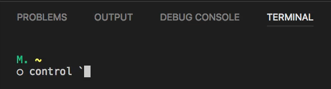

So if I do control Tilda it will put it down and you can see right here we have the ability to toggle our terminal. 

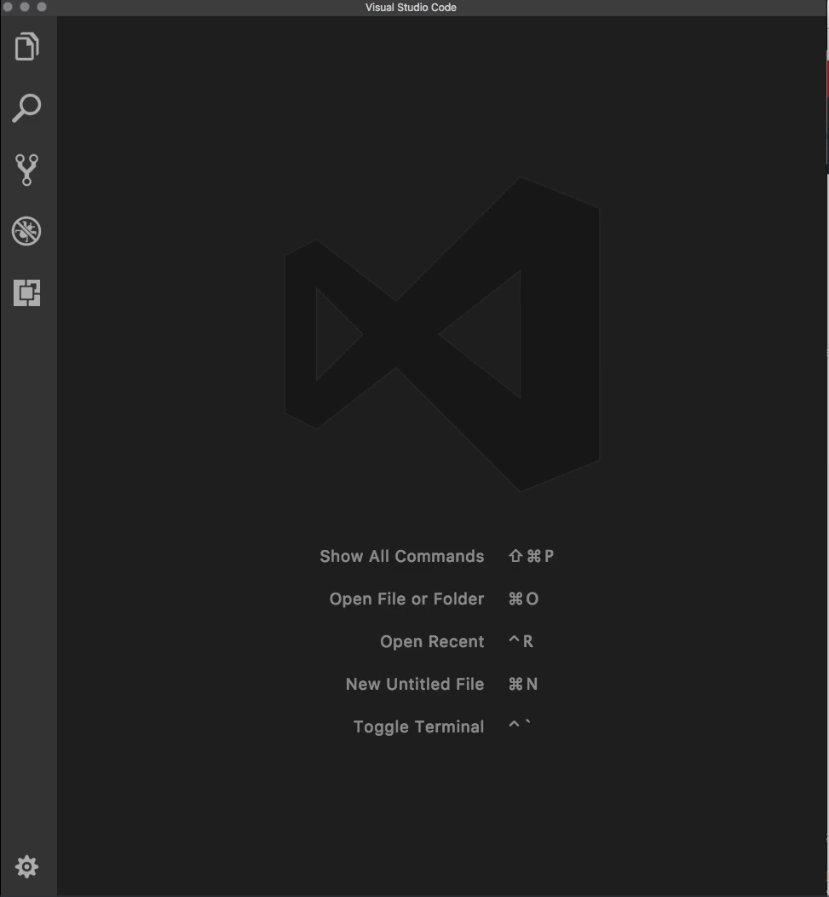

And if I press it again it'll pop right back up. 

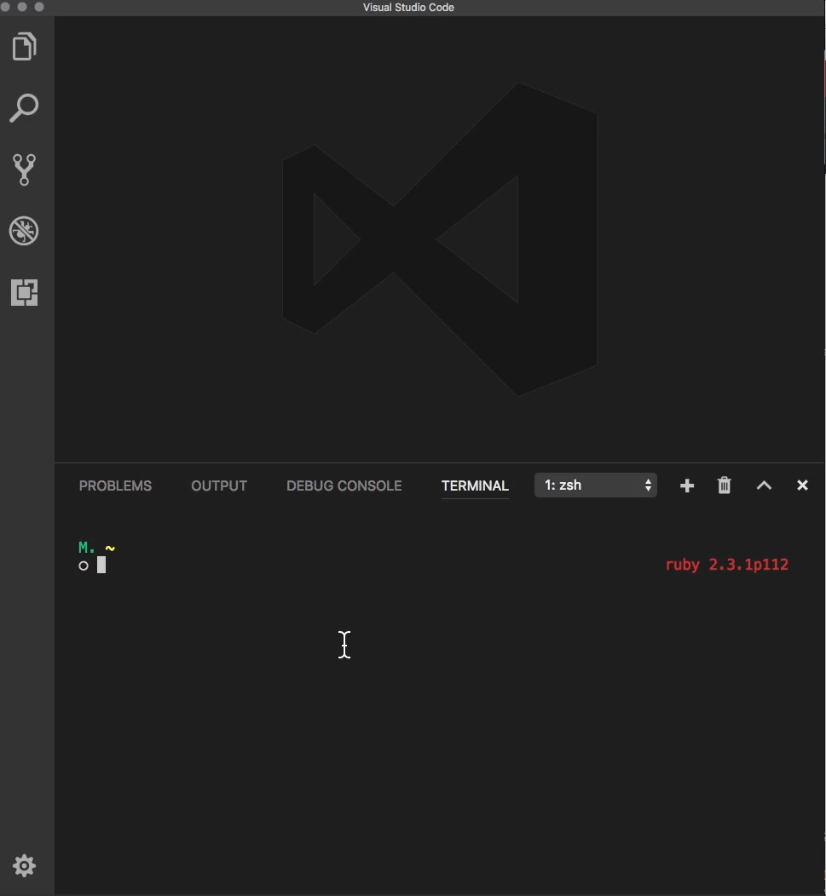

Now if you're not using visual studio code if you're using a tool such as sublime text or something like that then you can simply open up the terminal. If you do not already have it open what you can do is type command and then the spacebar and just start typing terminal 

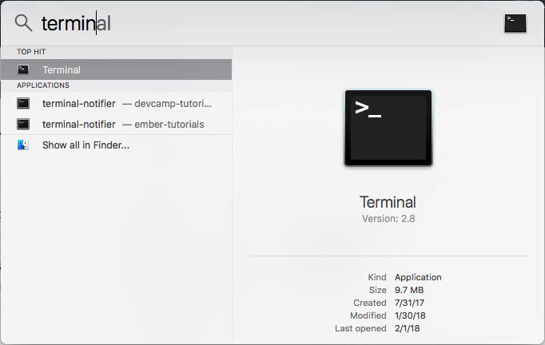

and then you can just hit return and it'll pop it open and then you can type these commands. 

If you're following along on a Windows machine then you can type pretty much these identical commands right into power shell or the command prompt and I'm going to tell you the one difference that you're going to need in order to follow along with windows when you get to that point. 

Now when you open up the terminal then what you will need to type out is npm -v and type return. If you have node and the node package manager which is what NPM stands for then you should get some output right here such as five point six point zero. 

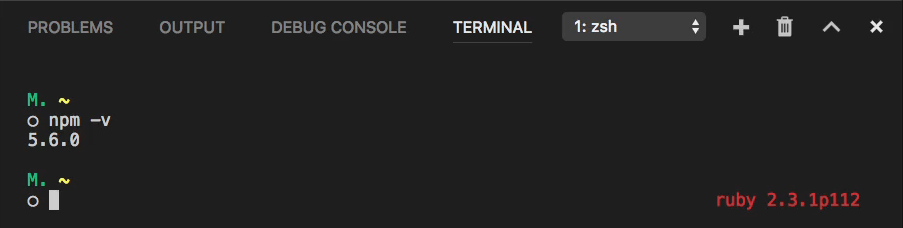

Now your numbers do not have to line up with what I have. But as long as you don't get an error that means that you have node installed on your system.

Now if you do get an error where it says that it can't find NPM or something like that then come up to [nodejs.org](https://nodejs.org/en/) and this is going to allow you to download this on your system. 

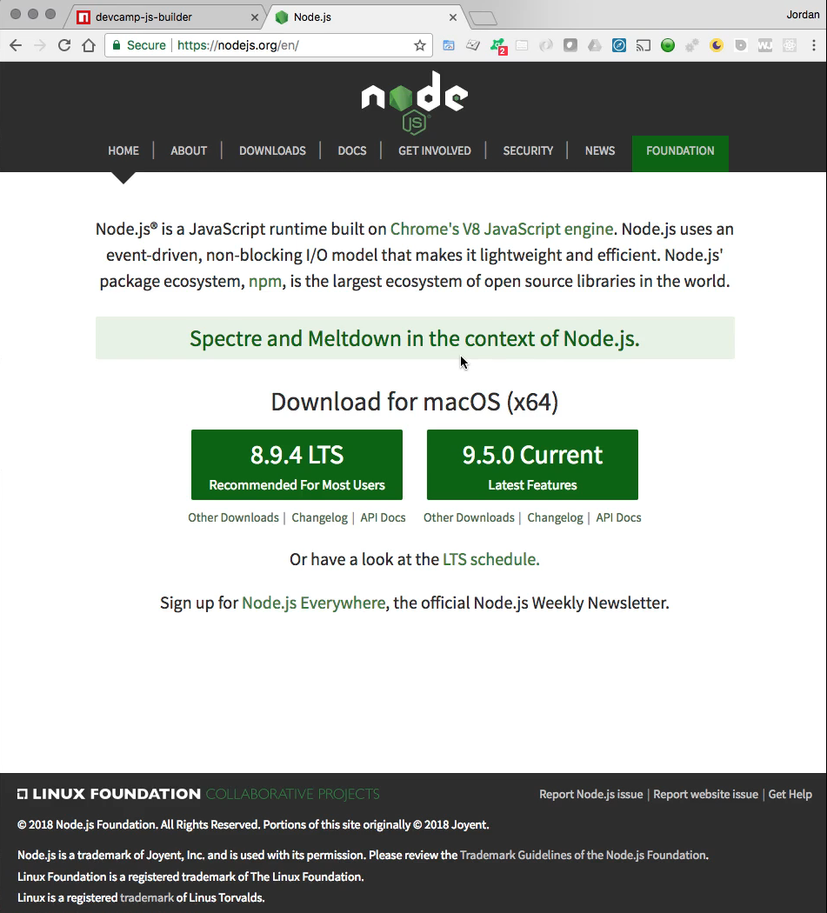

Now if you're on Windows I recommend to simply click on the download button and then you can download it directly onto your computer. If you are on Mac I recommend using homebrew and so if you go to homebrew and which is [brew.sh](https://brew.sh/) then what you can do is install the homebrew dependency by clicking and selecting all of this 

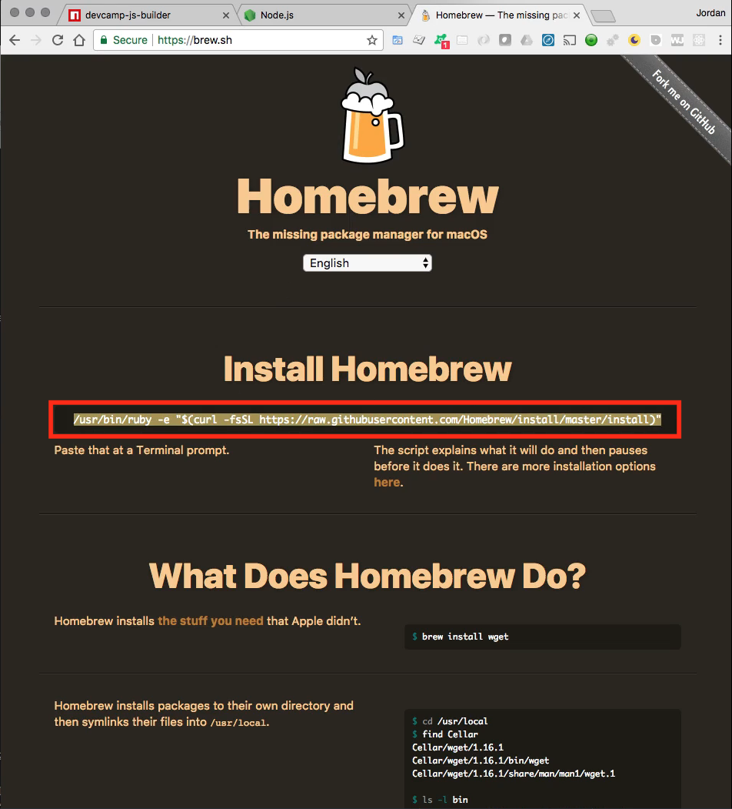

pasting this in the terminal and then from there, you can type in brew after you have run this command. You can type `brew install node` that will install node along with the NPM package manager. 

Now if you think I went through that a little bit fast part of the reason is because I've covered this whole installation of node in many of my other courses and so if you're following along after performing those kinds of tasks I don't want to waste your time. If you are not I want to kind of reiterate that we're in a more advanced JavaScript course and so many of these kinds of tasks are going to be things you're going to have to do on a regular basis. So being able to have these tools at your disposal and to being able to install package managers and dependencies is all part of the process. So if you're on a Mac just a review you can install homebrew by simply going to [brew.sh](https://brew.sh/) pasting this in the terminal. It's going to install it on your system. You then type `brew install node` you will be good to go. 

On Windows, you simply have to go to [nodejs.org](https://nodejs.org/en/) click on the download link and then it will install it on your system and that will give you what you need. 

Now in order to get this template generator, all you have to do is after you make sure that you have node. Then you come and right here you can see that we have our package manager. This is on the NPM registry so this is available for you to use. And so all you have to do is follow the instructions that I have here. 

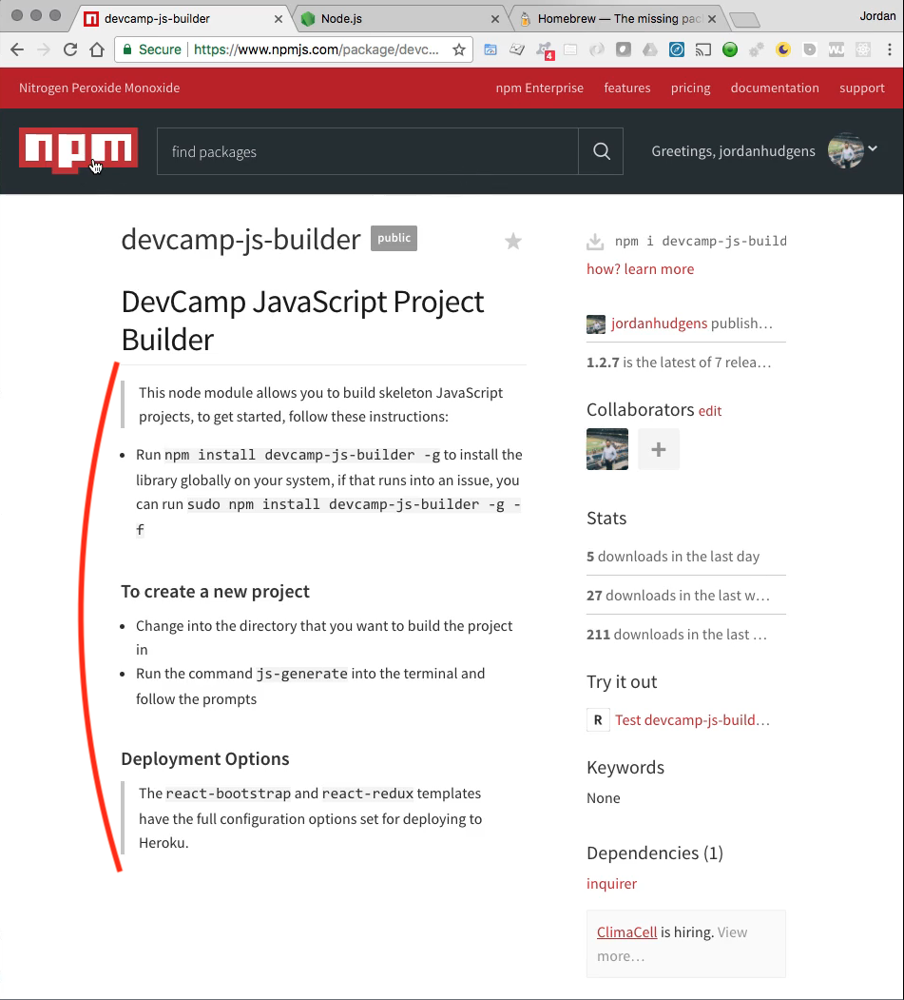

So I have the instructions and all you have to do is type npm install devcamp-js-builder space -G (`npm install devcamp-js-builder -g`) so I can simply copy this paste it right in the terminal. If you're on Windows you can paste this right into power shell and then you can run it. The dash G means that you're going to be installing this globally now because of that your system if you are on a Mac and this is where the difference is if you're on a Mac or a Linux machine versus if you're on Windows machine

If you are on a Mac, if you try to run this and it gives you an error then type the word sudo right in front of this command and then it's going to ask you for your system password and what you're essentially doing is you're going to be running this command as an admin user. So because you're installing this library globally that may be required so if you hit return right here it's going to ask you for your password and then it's going to install this on your system. 

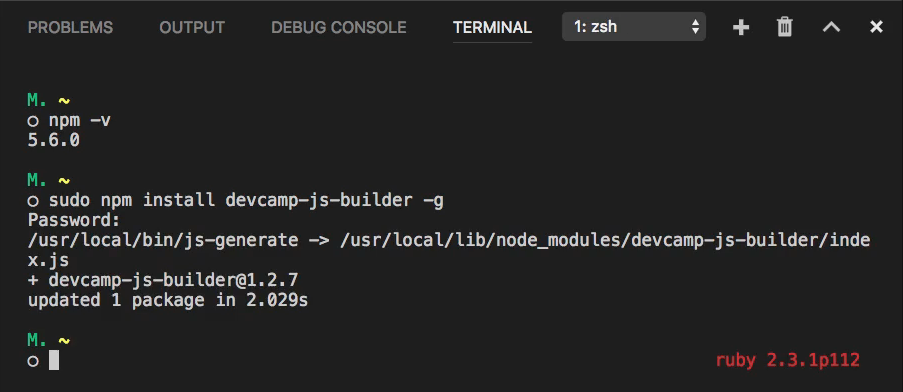

What you're going to now have is the ability to run this other command. So if you come down here you can see them after you've done this. You can simply run the command. `js-generate` and it will give you the full list of projects. Now one quick caveat is I have had one student, in particular, I have not had happened to anyone else but because it happened to one student it may happen to others so I added it to the instructions that he had to add after the -g he had to add a -f and so this -f command would look something like this. So it would look like this. 

```bash
sudo npm install devcamp-js-builder -g -f
```

That will force the install. I've only had that happen one time but I did put in the documentation just in case that happens to you if you run the command we just ran and you still get an error. You may have to pass -f and then that will install it for you.

So now that we've done that I'm going to extend my visual studio code because we don't need to look at the browser anymore or we're not going to have to do it for at least a minute and what you can do now is change into whatever directory you want to build your project in. 

I'm going to put mine on the desktop so I'm going to type CD which stands for change directory Tilda(~) and a slash(/) followed by desktop 

```bash
cd ~/Desktop/
```

and so what this is going to do is it's going to change my directory instead of being in the root part of the system. I'm now going to be in the desktop and you can see that my command line change right here. 

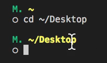

Yours is most likely going to look a little different but as long as it says something in this area that says you're in the desktop. That means that you're fine. Now if you have another directory you want to put it in change into that directory and place the code in there. 

Now all you have to do to get this running is to type the command js-generate and now because you installed that node package what you can do is simply type return and it's going to ask you what project template would you like to generate?

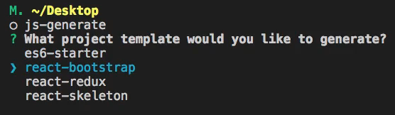

and you can use these arrow keys in order to pick out any of the starter projects and I'm going to continue to add new starter template.

So right now I've been building the reactor course that I have and I've been adding a number of templates for that but for what we need we simply need the ES6 starter it's going to be much more lightweight than these other code bases and so we don't need what they have and so simply use the arrow keys and select ES6 starter and from there type whatever the project is that you want to name.

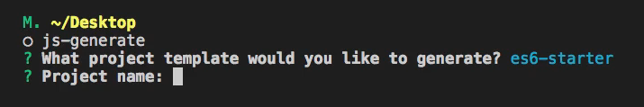

So, in this case, I'm going to call mine module and we'll say a ModuleSection because all of this code is going to be for the module section and after I hit return you can see that everything worked. We didn't get any errors. And now I can cd into the ModuleSection and if I type LS and this is a command specific to Mac. Every PC has a slightly different command but in Mac, if I type LS it's going to show all of the various code packages and different elements that were generated when we use this template. 

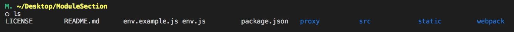

And if I type command O,  I can bring up all of the code that I have. 

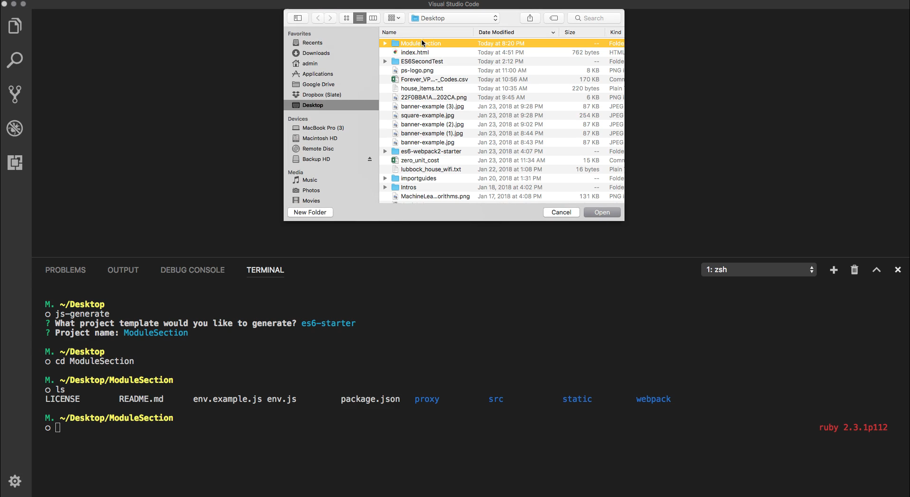

I'm simply going to select that folder of module section hit open and now as you to see what visual studio code is going to do it's going to reload and it's going to bring all of these files right here. 

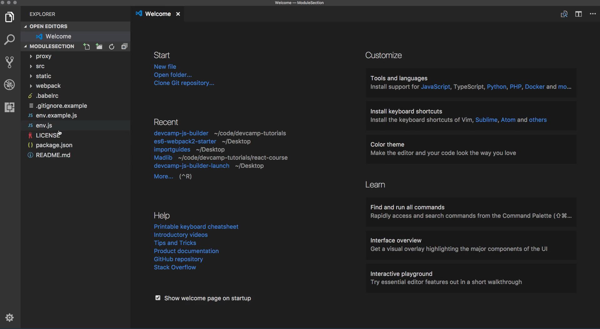

And so everything here looks like it's working. If I type control Tilda once again then you can see that we're in the module section. And now we have access to all of these different code elements that our generator had. Now the way that you are going to write to your code files is click on src and then bootstrap.js and as you can see I put a comment here that says your ES6 code should go here.

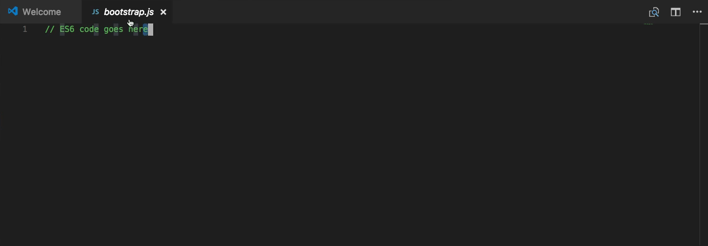 

Now I want to give one little comment about the naming convention. If you've already been performing some level of front-end development you may have heard of the bootstrap framework which has an HTML and CSS framework built by Twitter. When I call my JS file in bootstrap I am not referencing the root bootstrap framework. One of the common conventions in JavaScript development is to call your starter file either index.js or bootstrap.js and I personally wanted to go with bootstrap.js so that is the reason for the name. 

Now let's make sure that everything here is working. The very first thing we need to do is to install all of our dependencies so I'm going to say npm install and this is going to go out and I'm not going to go too far into the weeds on this because in the next section we're actually going to talk about package management and so we're going to dive into everything that's happening right here. But just at a very high level what the npm install is doing is it's going into our package JSON file and it's going through this full list of dependencies that I created for you. 

So I created this full list of dependencies here and do not worry if this looks really confusing. Just know that what this means is there is a slew of code packages that is going to make it possible for us to use modern JavaScript in our browser and locally on our machine. And so if you remember part of the reason why I started this course out with us using code pen is because I didn't want you to get confused by all of this weird looking code with all of this crazy long list of dependencies and I wanted to get right into the syntax.

But now we're getting closer to the spot where you need to start building these types of programs right on your own machine and so I want to slowly get us there. So do not worry if this looks confusing or doesn't make sense but just know what a high level when we ran that npm install command it went into our package.json file and installed all of these different code packages for us and you can see that we now have a new module here a new directory called node modules and these are all of the code files that are needed to run our programs. 

So now with all of this in place what we can do is I can open my bootstrap.js file all over again and let's just make sure that this is working. So I'm going to say `console.log` and I'm just gonna say hi there just to make sure we don't have any syntax issues or anything like that. 

```bash
console.log('Hi there');
```

Now, this is going to be a little bit different than before. You remember before I'm not referencing when we were using code pen but before when we were opening up an index.html file we did all of our development right in the browser so we just added all of our javascript code straight into an HTML page and then the browser rendered it because we called a CDN file and so we were statically bringing in our javascript code. 

Now we're actually going to be using our own server so hopefully this is starting to make a little bit of sense in the way that I've constructed the course in the very beginning we used code pen where all of our tasks were taken care of for us the javascript code simply worked we didn't have to worry about preprocessing or ES6 syntax or anything like that it simply processed it for us. Then we move down and we started integrating our code into an HTML file that was still static. 

Now we are actually going to be building out an entire node server so that it can process our code and we can run it in the browser that this is taking us all the way to a modern kind of development where we are going to be compiling our javascript code the same way that a large production application is going to be. So in order to start our server in the terminal type, `npm start` and this is going to start up the server. Now if all of this works so if we don't have any bugs or anything like that what we'll be able to do is go to the page that it tells us to which you can see where it says right here in the terminal project is running at local hosts 3000. 

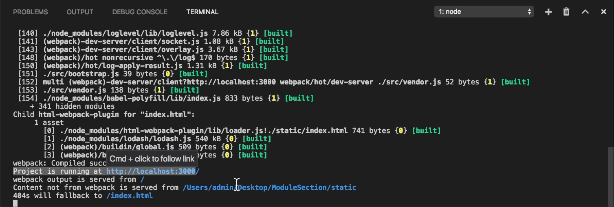

I can simply copy this code right here and let me slide this to the right and we can open this up in the browser and we should be able to see our console log statement so I'm going to go to localhost:3000. It's good. We don't have any errors. If I open up the javascript console you can see it says Hi there. So everything is working. 

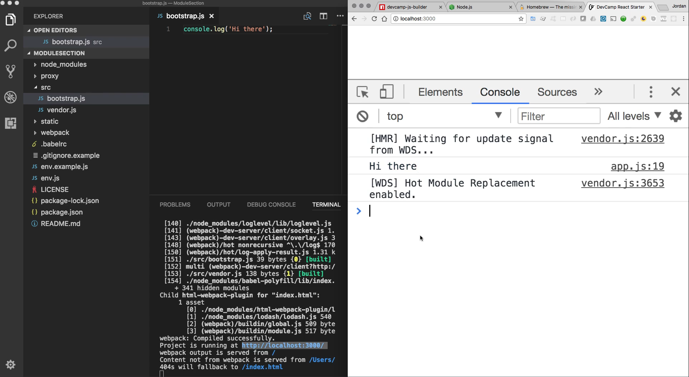

We have all of our entire set of dependencies our server and now our javascript code where we can write full ES6 syntax right in this file and it's going to be able to be processed directly here in the browser.

So if you followed through with all of those steps and you have your system working exactly like how I have mine here that means you are ready to start moving on and start building javascript programs locally. So instead of having to worry about having an internet connection and pulling in your code from outside types of services. 

Now, you can encapsulate all of those dependencies exactly like how we've done here into a true project. And so now you're not relying on anything except the code in this project and it is doing all of the hard work for us. And so now that we have all of that in place we can start building out our module code.

## Resources

- [DevCamp JS Project Generator](https://www.npmjs.com/package/devcamp-js-builder)
- [NodeJS](https://nodejs.org/en/)
- [Homebrew](https://brew.sh/)
