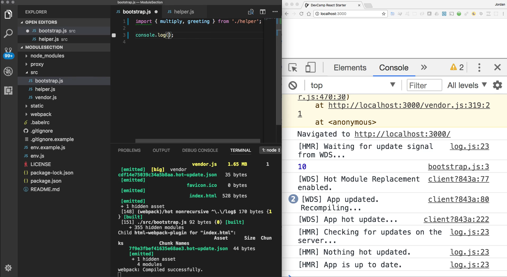
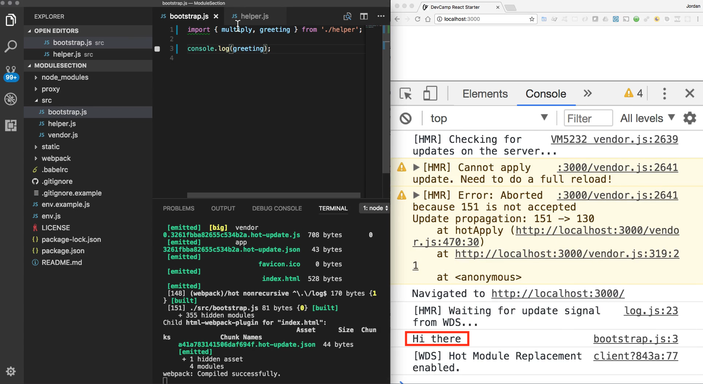

# MODULE 05 - 095:   JS Modules

## Modules (4) - Importing multiple objects `import * as x from './y'`

---

## Key Syntax

### Wildcard Import

```js
import * as namespace from './module';
```

- Imports **all exports** from a module

- Groups them under a namespace object

- Usage: `namespace.exportedItem`

## Practical Examples

### Example 1: Basic Usage

```js
// math.js
export function add(a, b) { return a + b; }
export const PI = 3.14;


// bootstrap.js
import * as math from './math';

console.log(math.add(2, 3));         // 5
console.log(math.PI);                // 3.14
```

### Example 2: With Default Export

```js
// config.js
export default 'API_KEY';
export const TIMEOUT = 5000;


// bootstrap.js
import * as config from './config';

console.log(config.default);     // 'API_KEY'
console.log(config.TIMEOUT);     // 5000
```

## When to Use

1. **Multiple Utilities**: Importing many functions from a utility module

2. **Avoid Naming Conflicts**: When imported names might clash with local variables

3. **Library Integrations**: Some libraries recommend this pattern

> **Note**: **For most cases, prefer named imports (`import { x, y }`) for better code readability** and tree-shaking benefits.

---

## Video lesson speech

In the last guide, we walked through how we could integrate both a 
variable and a function and pass it and export it from one file into 
another. We utilized a syntax where we were able to use curly braces and
 then place the variable name or the function name right inside of those
 curly braces.

****

In this guide, I want to add a few syntax options. One because you may need to use them but also because you may find them in other projects and so I want you to understand exactly what is going on. So I'm going to come down into this helper.js file and I'm going to add back our greeting. 

So I'm going to say export and then here I'm going to say const greeting and I'm going to add Hi there back in. 

**helper.js**

```html
export function multiply(numOne, numTwo) {
  return numOne * numTwo;
}

export const greeting = 'Hi there';
```

If I want to have access to this 'Hi there' variable inside a bootstrap the way that I can do it is I can simply list off all of the different elements that I want. So I can say multiply and now I can also say greeting and as you can see on the right-hand side I don't have any errors. 



And if I come over here and instead of multiply if I say greeting instead on the right-hand side you can see that this is logged out perfectly. 



So we now have access to both multiply and to greeting inside of our bootstrap.js file. 

Now, this is going to be a syntax that you see quite a bit with some of the popular frameworks such as react, view, and angular and I want to show you one slight change on this that you may also see. I don't personally see it quite as much but it may be something that you will want to use so I want you to get familiar with this syntax as well. 

So instead of listing all these items out imagine that you had a helper set of JavaScript scripts and you simply wanted to bring all of them in. Well, the way you could do that is instead of using curly brackets like we're doing here you can say import star(*) and say as and then give a name for this so I'm going to say import * as helper from helper. 

```js
import * as helper from './helper'
```

And so what I can do now we're going to get an error because we don't have access to greeting directly 


but instead what we have access to is the ability to call helper.greeting. And as you can see now everything is back and working and high there is now functioning properly. 


And let's just test this out and make sure that we can call our multiply function too. So I can say multiply and then just pass and 2 numbers so say 5 and 6 so we should get a console log of 30 here on the right-hand side. And as you can see right here we get that. 


So those are two different ways of pulling in multiple named exports. One is to list them all out manually inside of curly brackets and then the other is to use star and then from within that star then you have to give a specific name for what you want to call these because you wouldn't simply want to call star and then have all of these different variables and functions available globally because they could cause conflicts with your functions and your variables inside of this bootstrap file. 

But instead when you say import star as you're essentially giving a namespace which means that all of the different functions and variables inside of this helper.js file they now can only be called when you give the prefix of helper right in front of them and then you can call them exactly like we did before.

## Resources

- [Project Source Code](https://github.com/jordanhudgens/modern-javascript-module-section/tree/0e16d2439c90cb8ede9b2908088b6e2e52856ec6)
