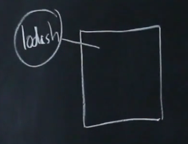
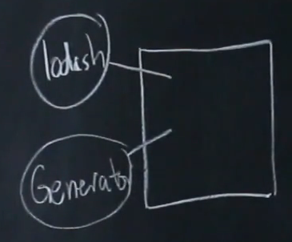
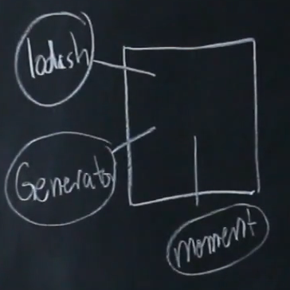
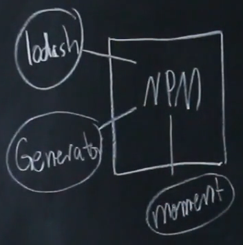

# Module 05 - 098:    JS NPM

## Package Management (0) - Intoduction

****

****

## Video Lesson Speech

In the last section of the course, we discussed modules and we learned 
how we were able to import code from one javascript file into another 
one so that we could use it for that specific program.

****

Now in this section, we're going to talk about packages. This is going to be a very nice segue into our package of knowledge because the way that packages work is there essentially modules they just happen to be much larger modules typically and in the way that we're going to learn them we're going to see how we can leverage a package manager.

So let's see a little visual on this. The package manager we're going to be working with is `npm` and that stands for node package manager. So the npm registry, the npm server, is a server that has this large collection of modules so it has modules like you've already seen like [Lodash](https://lodash.com/). 

It has a module that I've created that is a react and JavaScript generator app so it allows you to launch your React, or really any kind of JavaScript project, with just a few commands. 

It has at the moment JS package. And so this allows you to work with time in a much easier way than if you were to write all of your date and time modules by themselves. 

And so this is npm

What we're going to learn how to do is we're going to see how we can find these packages and then how we can pull them down into our own application. 

So if we have an application that needs to be able to manage a calendar let's say that we're building a calendar app right here then we know that we need to call npm. So we're going to make a request and we're going to ask it to install the moment J S library and so it's going to return back to our system moment. And then we can import that and use it in our system. 

So now that you have a high-level overview of packages and what they are and how you can use them let's dive into the syntax and start actually building into our projects.
