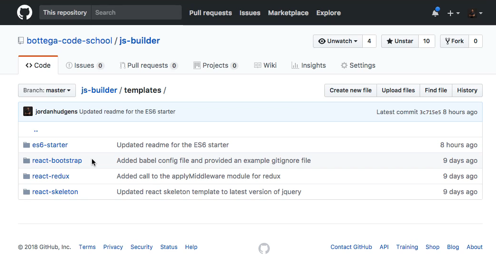
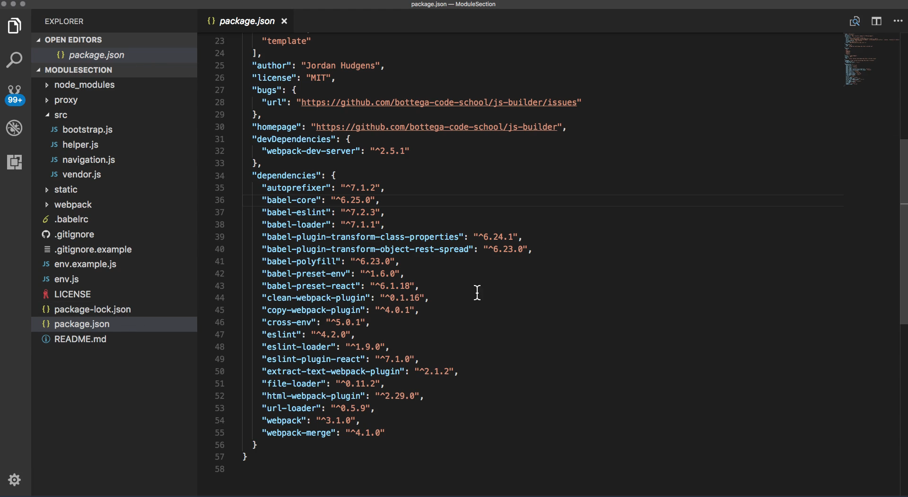
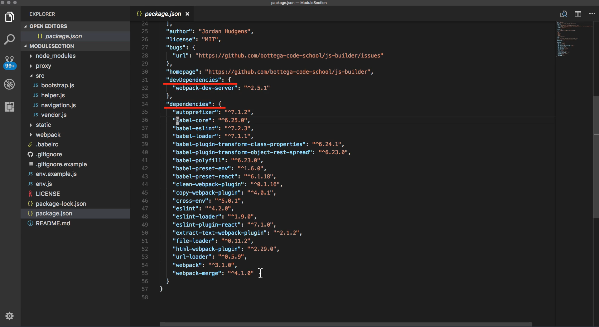
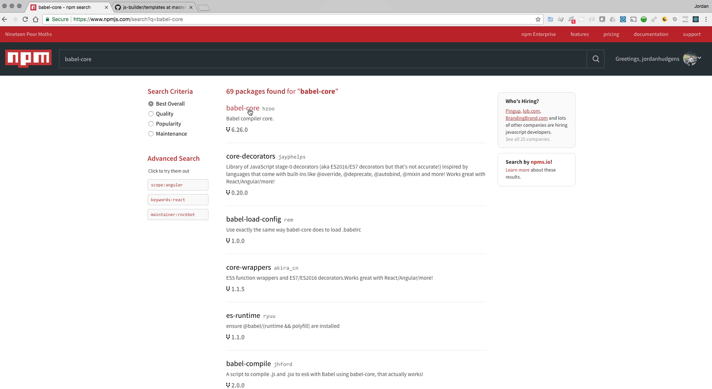
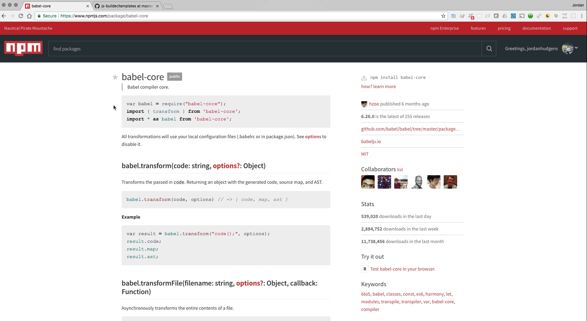
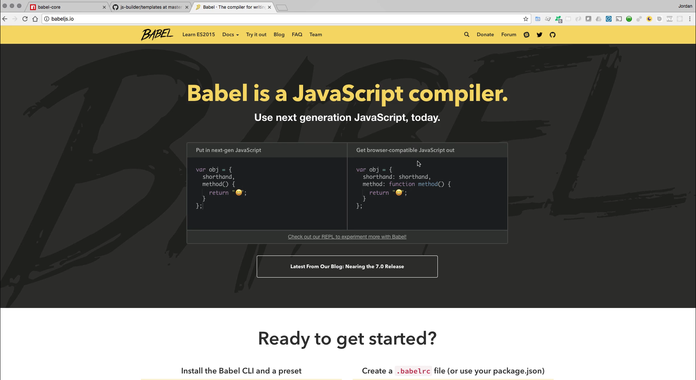
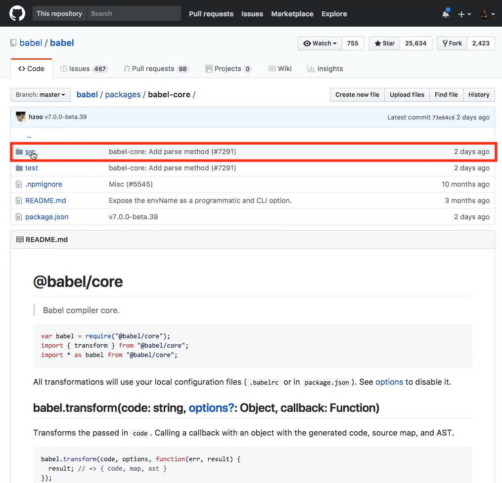

# Module 05 - 099:    NPM

## Package Management (1) - NPM

---

---

## Video Lesson Speech

This section of the course is going to be all about packages. Now 
packages when we are talking about them in reference to JavaScript 
development, typically are referring to code packages and these are some
 groupings of code files typically of JavaScript code files that you can
 use to add additional functionality to whatever type of application or 
program that you're building.

****

Now if you went through the last module where we saw how we could integrate tools such as importing and exporting modules inside of JavaScript then you've already been working with a package and it's a package I personally created for all of the students that go through all my courses and that is the Devcamp JavaScript Project Builder package and this is hosted on the npm registry and it's relatively new. 

It is a set of code files that you can download and instead of simply downloading the code files you wrap them up inside of a javascript package and using the NPM registry it makes it very easy for you to receive updates to integrate additional dependencies and different kinds of tasks like that. But one of the biggest takeaways I want you to have for this entire section is that a package even though it may seem a little bit intimidating if you've never used it before or you've never built one of your own. A package is really just javascript code, that's all it is. And so I want to kind of bring a level of transparency to you so that you don't have to think about packages as just these magical little snippets of code that you run to add all kinds of additional functionality into your programs. 

Instead, I want you to think of packages as just as pure Javascript code and it's just like you added your own code and you're importing into your program but instead of importing it locally. You actually pull it down from this third party registry like we have right here with NPM. Now just to give a little clarification and so you know that I'm not lying. There is no magic going on here. If you want to look the js-builder is completely open-source and so you can come to this link and I will share it in the show notes and you can come and access it and see exactly how this is accomplished so you can come and see all of the code files. You can click on the main index. J.S. file 


and see that this is pretty much all it takes in order to build out the templating engine. And so essentially I'm pulling in one dependency called Inquirer. And with that, I'm able to ask you questions are the systems able to ask you questions in the terminal. You can answer them such as the project name and the type of project you want to build and then it will go. It will iterate through the list of templates which you can come and see right here 



and I'm always adding to this list and it goes in it copies all of these files whatever template you pick out onto your system. 

That is really it. It is just a set of JavaScript scripts that run on your system and then will copy these files directly onto your computer so you can use them yourself. So that is one node module and it's one I put together.

Now if you want to see all of the node modules that you have on your own system then what you can do is come to the terminal and type ls and then the little backtick character npm root -g and another backtick character and then type return 

```js
ls `npm root -g`
```


This will only work on Mac, power Shell has a different command. Just feel free to google list all NPM modules on windows and It'll bring up that command. So it's just one line that you can type in and you'll bring these all down. So this list right here. All of the different packages that I have installed globally on my computer and so if you do the same thing on your Mac or Linux machine and or if you're on a Windows whatever command that is, then you can run this and see everything that you have installed. 

If you are new to node development or javascript development you may only have a couple. You may only have NPM and then the devcamp-js-builder or if you've been doing this for a while you may have a long list of these. And so this shows all of the packages. But once again all this is a set of JavaScript files that have been packaged together nicely so that you can use them. So far we've looked at two different types of packages. We've looked at or I should say two different places you can find packages. One is on the NPM registry and also on GitHub. And then also on your local machine. 

Now I want to show you how pretty much every node based application has what is called a package.json file. I'm going to close out of the terminal here and I've opened up the package JSON file from the template. 



So you should have access to this code here. And so if you look on the left-hand side in the module section. So the project that we worked on the entire last section this is the package.json file and it has quite a bit of content here. What I want to focus on are these sets of dependencies. 



So we have dev dependencies and we have regular dependencies that difference between the two is these set of dependencies. If you're building a production application. So in other words, if you're building something and you're going to deploy it to the Web the dependencies in this list will also get wrapped up and deployed. Now the devDependencies are simply tools that you are going to use locally. 

Right here I have for us the webpack-dev-server. This allows us to run our local development server and there's no reason for us to have that on a third party server or else there would be a conflict. But some of these other packages are very helpful and they're the reason why we're able to perform all the tasks that we do. So I want to show you how you can research how these work. So if I click and select babel-core, for example, this is an incredibly powerful package. I'm going to switch over to Google Chrome, go here to the NPM registry and I'm simply going to look for babel-core hit return and this is going to bring up all of the different repositories for babel-core. 



Click on the very top one and here you can see it even give some examples for what babel-core brings to your application. 



So you can think of these as plugins as just different code libraries that you can import directly into your own program and then use them just like you wrote them. And that's what I absolutely love about using these kinds of tools is this is almost like you spent all of this time but instead of you having to do it you're able to leverage all of the hundreds upon thousands and thousands of hours of development time from the open-source community and pull in and use these kinds of tools right in your own systems. So babel-core is one of the most popular NPM tools that you are going to find. It is the reason why we're able to use syntax such as the import syntax that's specific to ES6 but will not work in all the browsers. What babel does is it actually allows you to use that new modern syntax and then it converts it for us. 

So if I open up and go to the [babeljs.io](http://babeljs.io/) library you're going to see that what this is and this is exactly what we were just looking at. So when we're looking at babel-core what we're doing is we're bringing in this compiler and if you want to get an idea of what this actually does you can see it if you go to their home page and they have a number of live examples here where they're typing all kinds of different examples that are using ES6 syntax and what babel does is it actually takes all this code that you write with the modern syntax and then it comes and it converts set into older versions of JavaScript.



And this is incredibly powerful because remember the entire reason why javascript has become so powerful is because it can be rendered in the browser. But one issue is the modern versions of JavaScript can't be rendered by all browsers. And so what babel does is it allows you to pull in and utilize all of your modern syntax and all of the power from the latest versions of the language. But then it can then be run on all of the browsers so that your site when you're cool react or view site, loads up on some browser that maybe hasn't been updated in five years. It still is going to work and it's all because of tools like babel.

Now if you want to see exactly how this works if you come back to their homepage on the [npm registry](https://www.npmjs.com/package/babel-core) you can click on their link and just like we saw on my [js-builder](https://www.npmjs.com/package/devcamp-js-builder) you can come and look at babel-core and come see for one all of their different documentation and guides but you can also see how they wrote it. So if I click on source 



here I can come to their index.js file and see all of the different packages that they've built out and all of the ways that they were able to build their parsing engines and all of the tools that make babel possible. 

So in review What we've discussed is a very high-level view of what an NPM package is. It is a set of JavaScript code libraries so you can bring into your own projects and use them just like you built them yourself. We also walked through how you can see all of the various packages that you have installed on your own system by running

```js
ls `npm root -g`
```

Here to be able to see all of these different packages that you have locally on your system. And then lastly we analyzed a package json file. Now, this is going to be one of the most common files you're going to see throughout all of your javascript development pretty much every one of the major frameworks uses a package json file because it's a great way of listing out every one of the dependencies which are packages and it also allows you to install them. 

In the next guide that's exactly what we are going to do, we are going to find a new package we're going to add it to a package json file and then we're going to install it onto a project. 

## Resources

- [DevCamp JS Builder](https://github.com/bottega-code-school/js-builder)
- [Babel Homepage](http://babeljs.io/)
- [Babel Core GitHub](https://github.com/babel/babel/tree/master/packages/babel-core)
