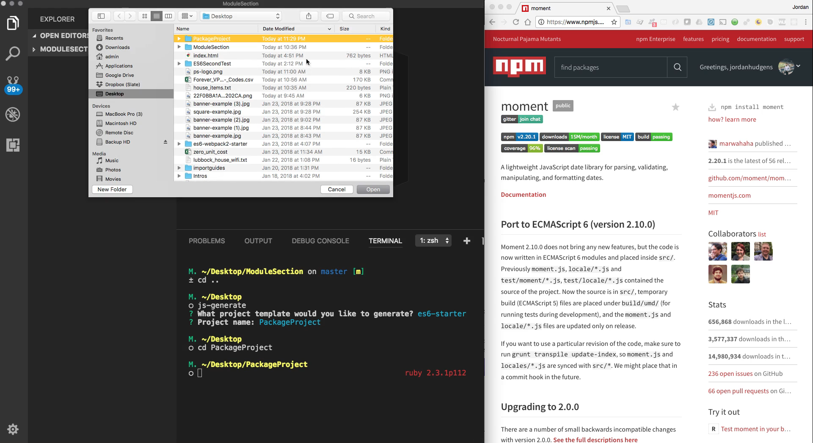
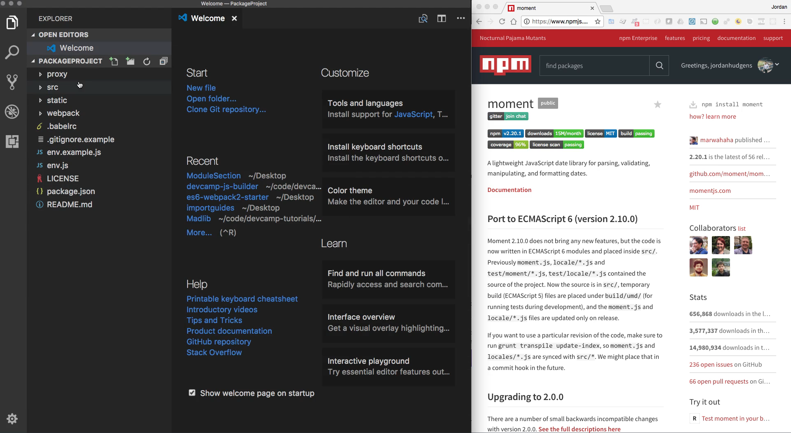
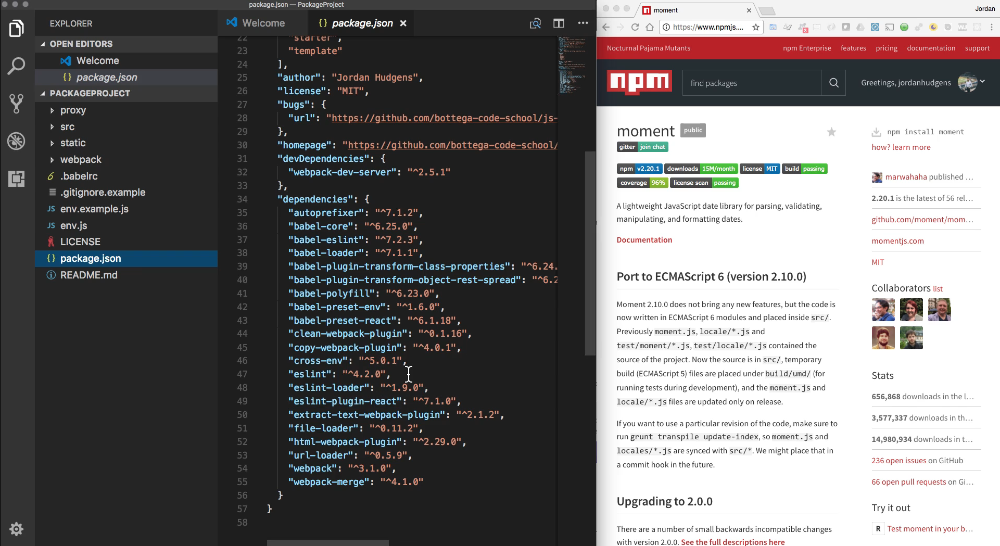
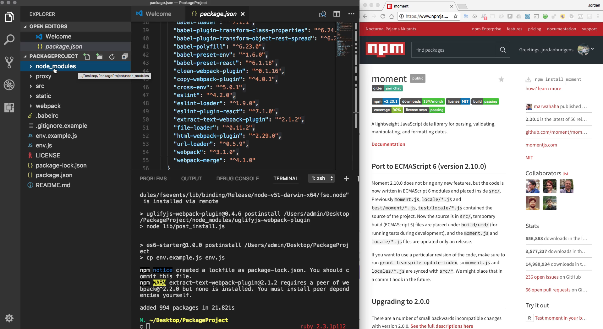
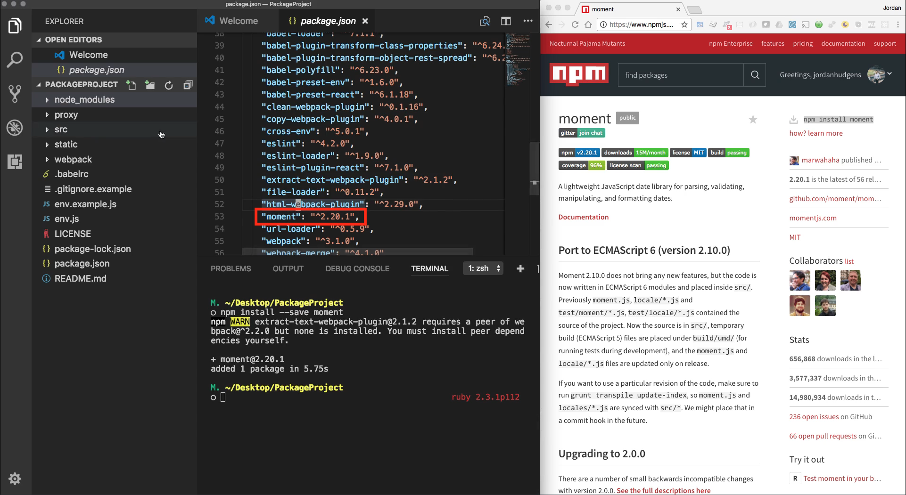
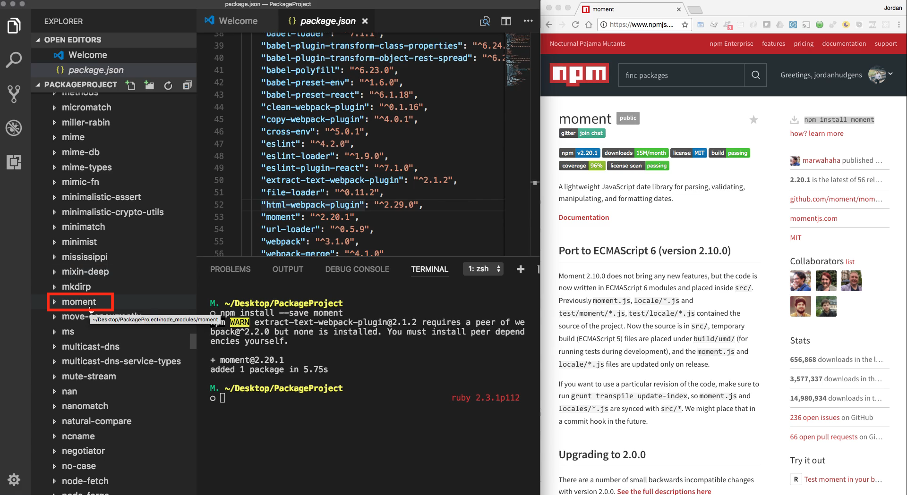

# Module 05 - 100:    NPM

## MomentJS (1) - Intro

****

****

## Video Lesson Speech

In this guide, we're going to extend our knowledge on the packages in JavaScript by actually integrating one into a project.

****

The first thing I'm going to do is I'm going to change back into the desktop. And so if you're in the terminal simply go to whatever directory that you want to use it via the code directory or projects directory go to wherever you want to create your new project and we're going to go through the process on building another project and generating it from scratch. 

So I'm going to type in `js-generate` and this is going to ask me what kind of project I want. Once again I want the es6-starter and for this one, we're simply going to call this PackageProject and that is all we have to do. Now I'm going to CD into that directory and now that I'm there and let me also open that up inside of Visual Studio Code so I'm gonna hit command o click on PackageProject, simply click open 



and then it is going to open the entire project and you can see we have all of our code right here. 



Now I want to first go into the package.json file and you'll see all of the dependencies that we currently have. Now notice we do not have a dependency called momentjs listed here and that is going to be the one that you can see here in the browser that we were going to implement. 



But before we do that I'm going to open up the terminal and type npm install. Now what is going to go on here is it's going to go through this process is going to go through our package.json file. It's going to go through all of our dependencies both our dev dependencies and are our regular production dev dependencies right here. And as you can see it's going to create node modules directory. And each one of these different packages is going to be brought down in your application and all of the code is going to be stored in this node modules directory. 



Now one thing I want to point out about how this works and it's very important because if you plan on doing any real-world javascript development you're going to run into this, your node modules directory can be a completely thrown away kind of tool which means that because it can be generated on the fly if you run into any kinds of dependency issues or bugs where say one of these packages interferes with another one it is no problem at all to simply delete this file from your computer and then run npm install once again and it will create this new modules directory. 

So even though it has all of this code that you can simply get rid of it and just so you do not think I'm lying to you I'm going to open this up and as you can see we have node modules right here. I'm going to delete it and I'm also going to go and empty my trash. Now it's going to be quite a few items as you can see there so many files it's over 10,000 or so files. And as you can see node_modules is gone. 

But if I run npm install once again the same process is going to occur. It is going to go through the entire set of dependencies and as you can see it's already doing it and it's going to pull down from the NPM registry. All of those various code libraries and those packages. And it's already done. It's brought all of those in. And the reason why I went through that exercise is because this is something I've had to do constantly. There are sometimes where on a daily basis I will need to delete a note module directory from one project or another one depending on how big they get and how many conflicts that might arise. 

And so I simply wanted to show you that you should think about these as temporary and when we get into topics such as version control a very important concept is you should never check in your node modules into version control. Now that is complete aside from everything else we're going to go into. But I did want to point that out. So now that we have that I want to come down to our list of dependencies and see once again that we do not have a dependency here called momentjs and that is what we are going to do is we're going to install that into our system. 

Now there's a couple of ways we could do it technically we could come right inside of our package.json file and find where to put it and that's perfectly fine and you could do that. Typically the best practice is you want to make sure that your packages are in order, alphabetical order so you'd want to come here and figure out where you should put something that starts with M which is right above url-loader and right below html-webpack-plugin. 

However, there is a better way of doing that and it's also considered the better practice and that is from installing it directly from the command line. 

And the way you can do that is by running `npm install --save` and what that is going to do is instead of installing this package simply on your local computer by itself it's actually going to go into the package.json file for us and it is going to add it this entire code library in there. It's going to go into package.json and it's also going to go in and it's going to be added into our node modules. 

If we look at the momentjs documentation we can see that is simply called moment. So if you see npm install moment that means that that is what we need to type in. So I'm gonna say moment run 

```bash
npm install --save moment
```

**Note: Since NPM 5+, running `npm install <package_name>` implicitely run the flag `--save`**

and this is going to go through it's going to reach up into the NPM registry and then it is going to pull down the momentjs Library and as you can see we have it right here. 



And if we open up our node modules directory and scroll all the way down to the M's you will see that we have the moment directory inside of there as well somewhere. Let me see where is that. Oh yes if you are in Visual Studio code you might have to hit refresh and then scroll back up and then you will see it. 



There we go. We have the momentjs library right here and that means that because it's there that means we can start to import it and use it directly in our project.

## Resources

- [Project Source Code](https://github.com/jordanhudgens/modern-js-package-section/tree/f6d6d3e12bb7075ef4c65b944ed9cf37227cc8a3)
- [MomentJS Documentation](https://www.npmjs.com/package/moment)
