# Module 05 - 102:    NPM

## NPM - Building / Deploying new modules

---

1. What Is an NPM Module

2. Project Initialization (`npm init`)

3. Creating a Module (Basic JavaScript Export)

4. Using the Module Locally (via `npm link`)

5. Preparing for Publishing

6. Publishing to NPM

7. Module Versioning (SemVer)

8. Using a Published Package

****

In this guide, we walk through the entire lifecycle of building and deploying a JavaScript module as an NPM package. 

This includes:

* Creating a module from scratch.

* Testing it locally.

* Preparing it for publishing

* Finally, deploying it to the NPM registry using modern standards and conventions.

****

## 1. What Is an NPM Module

An **NPM module** is any reusable piece of JavaScript code packaged in a way that it can be distributed and used through the [Node Package Manager (NPM)](https://www.npmjs.com/).   

Modules can export one or multiple functions or objects, and they follow the [CommonJS](https://nodejs.org/docs/latest/api/modules.html) or [ES Modules](https://developer.mozilla.org/en-US/docs/Web/JavaScript/Guide/Modules) syntax.

---

## 2. Project Initialization (`npm init`)

To begin creating a module, create a new folder:

```bash
mkdir module-name
cd module-name
```

Then initialize the project:

```bash
npm init -y
```

This generates a `package.json` file, which holds metadata about your module, including name, version, main entry point, scripts, dependencies, etc.

You can also manually customize it later or re-run:

```bash
npm init
```

**Ensure your module name is unique if it’s **not scoped**, otherwise use an **NPM scope** (E.g., `@yourname/your-module` )

---

## 3. Creating a Module (Basic JavaScript Export)

Let’s say you want to export a function that uppercase any text in, for example, `index.js`:

```js
// Main

export function prettyTexts(text) {

    return text.toUpperCase()

}

// console.log(prettyTexts('Hola que tal'))
```

In your `package.json`, make sure to use **ES6 Modules syntax** :

```json
{
  "name": "@yourname/your-module",
  "version": "1.0.0",
  "type": "module",
  "main": "./index.js",
  "exports": {
    ".": "./index.js"
  }
}
```

****Using `"type": "module"` allows you to use `import/export` syntax instead of CommonJS (`require`).****

***

## Create a `package.json` file

1. To create a `package.json` file, on the command line, in the root directory of your Node.js module, run `npm init`:
- For [scoped modules](https://docs.npmjs.com/about-scopes), run `npm init --scope=@scope-name`

- For [unscoped modules](https://docs.npmjs.com/creating-and-publishing-unscoped-public-packages), run `npm init`  
2. Provide responses for the required fields (`name` and `version`), as well as the `main` field:
* `name`: The name of your module.

* `version`: The initial module version. We recommend following [semantic versioning guidelines](https://docs.npmjs.com/about-semantic-versioning) and starting with `1.0.0`.

****

## 4. Using the Module Locally (via `npm link`)

You can test your package locally before publishing:

1. In the module’s root folder:
   
   ```bash
   npm link
   ```

2. In another local project (e.g. `test-app`):
   
   ```bash
   npm link @yourname/your-module
   ```

3. Now you can import and use your module:
   
   ```js
   import { prettyTexts } from '@yourname/your-module';
   
   console.log(prettyTexts('Hola que tal));    // HOLA QUE TAL
   ```

**`npm link` creates a symlink, so you can develop and test the module live without publishing.**

****

## 5. Preparing for Publishing

### a. Ensure you have an NPM account

Create an account at [https://npmjs.com/signup](https://www.npmjs.com/signup) 

```bash
npm login
```

### b. Add a README

A good `README.md` is **critical** for documentation, example usage, and discoverability.

### c. Add `.gitignore`

Any file/folder included here will be ignored for pushing/fetching repo. You can also use regex syntax, wildcars, and so on:

```gitignore
**/node_modules/          
**/dist/
.env
```

### d. Add a `.npmignore`

As seen with `.gitignore` you can also create a `.npmignore` to prevent publishing files you don’t want in the package.

****

## 6. Publishing to NPM

To publish a **scoped** package publicly:

```bash
# Scoped packages default to private, hence the need for --access public.

npm publish --access public
```

To publish a **non-scoped** package:

```bash
npm publish
```

****

## 7. Module Versioning (SemVer)

NPM follows **Semantic Versioning (SemVer**; this concepto will be expanded in further guides from this module:

```
MAJOR.MINOR.PATCH
```

Example:

- `1.0.0` → initial release

- `1.1.0` → new feature, no breaking change

- `2.0.0` → breaking change

Update the version in `package.json`, or use:

```bash
npm version patch
npm version minor
npm version major
```

This updates the version and creates a git commit and tag automatically.

****

## Test your module

1. Publish your package to npm:
   
   - For [private packages](https://docs.npmjs.com/creating-and-publishing-private-packages#publishing-private-packages) and [unscoped packages](https://docs.npmjs.com/creating-and-publishing-unscoped-public-packages#publishing-unscoped-public-packages), use `npm publish`.
   - For [scoped public packages](https://docs.npmjs.com/creating-and-publishing-scoped-public-packages#publishing-scoped-public-packages), use `npm publish --access public`

2. On the command line, create a new test directory outside of your project directory.
   
   `mkdir test-directory`

3. Switch to the new directory:
   
   `cd /path/to/test-directory`

4. In the test directory, install your module:
   
   `npm install <your-module-name>`

5. In the test directory, create a `test.js` file which requires your module and calls your module as a method.

6. On the command line, run `node test.js`. The message sent to the console.log should appear.

****

## 8. Using a Published Package

At this point, anyone can now install your module:

```bash
npm install @yourname/your-module
```

And then, import it:

```js
import { prettyTexts } from '@yourname/your-module';

console.log(prettyTexts('Hola que tal));    // HOLA QUE TAL
```

****

## Best Practice

* **Always prefer using ES6-7 Module syntax** (ES modules):  
  `"type": "module"` + `export` / `import`

* **Use named exports** for flexibility:  
  Avoid default exports in reusable libraries.

* **Document your API** clearly in `README.md`.  

* **Include `exports` field** in `package.json` for proper tree-shaking support.

* **Test your module locally** using `npm link`.

* **Use `.npmignore` or `"files"` field** in `package.json` to limit what's published.

* **Use GitHub repo** + `"repository"` and `"homepage"` fields for visibility.

* **Include a license** (`MIT` is common for open source).

* Use [np](https://www.npmjs.com/package/np) or [changesets](https://github.com/changesets/changesets) for advanced release workflows.

****

## References

* [Modules: ECMAScript modules | Node.js v22.14.0 Documentation](https://nodejs.org/docs/latest-v22.x/api/esm.html)

* [import - JavaScript | MDN](https://developer.mozilla.org/en-US/docs/Web/JavaScript/Reference/Statements/import)

* [export - JavaScript | MDN](https://developer.mozilla.org/en-US/docs/Web/JavaScript/Reference/Statements/export)

* https://docs.npmjs.com/cli/v10/using-npm/scope/

* https://docs.npmjs.com/creating-node-js-modules/

****

## Video Lesson Speech

This is going to be a very exciting lesson and it is also going to be 
quite a bit longer than most of the guides that we typically go through 
and it's because we're going to build out a full NPM package. Everything
 from building it right from scratch all the way through deploying it to
 the NPM registry.

****

Now before we get going I want to add a couple of caveats because it may determine how you choose to follow along. And so what we are going to do is we're going to build an NPM module that will generate a footer so that it can be called and rendered from some other javascript application. So, in other words, we're going to create an NPM package that anybody can take, download into their react or their view or angular project. 

It will create a dynamic copyright for them, it'll have a year that updates, it will allow them to declare what name their company is. All of those kinds of things that's basic in its functionality but it is something useful it is something that pretty much every application you're going to build is going to be able to use so I wanted to give you something that would be practical. 

Now with all that being said, there are a number of technologies that you're going to have to be able to either already have on your system or be able to work with, in order to make this happen. And I put together a cheat sheet that you can reference and I'm going to add this into the show notes and you're going to have the show notes it's going to have the full transcript of everything I discuss. 

However, this [cheat sheet](http://www.dailysmarty.com/posts/steps-for-creating-and-publishing-a-npm-package) is the steps and the kind of boiled down list of tasks that you need to do in order to build and deploy an NPM package and starting at the very top, I list off the different things that you're going to need, either of the two accounts and then also the tools. So the very first thing is an NPM registry and then also a GitHub account and signing up for a GitHub account is pretty easy. But this also means that you need to be familiar with using GitHub and those commands. And if that's not something that you're familiar with I don't want you to get bogged down in doing that.

If that's the case, if you've never used git or GitHub and you don't have it on your system you're not familiar with the commands you may want to simply watch this video see what's possible and then after you've learned that so you can go and very quickly create a GitHub account and go through some starter guides then you may want to come back and build this out. That is really I would say the main step that you want to make sure that you have before you could start on this because if you're not familiar with GitHub and how version control works then you might get tripped up in some of the more complex tasks that were going to implement. So that's all I wanted to say on that side. 

Signing up for the NPM registry is pretty straightforward and we'll talk about that and then you also need to have a text editor which I'm assuming you do have if you followed along in the course so far. And then you need to have node on your system which if you have the package or generator that we've already walked through then you have node and you have NPM on your system and so you will have all of these. 

Now with all of that being said let's get started! The very first thing that you want to do is create these accounts. Now I already have one. So right here you can see my profile 

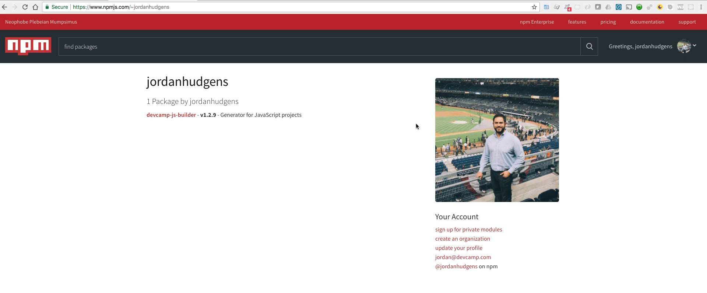

and you can see my list of public packages right here. And we've already talked about these but if you want to create your own you can just go to the NPM site which you can access from the notes at the bottom of this guide. And I'm going open up in incognito mode because I don't want to be logged in since I already have an account and simply come to sign up and then fill out all of your information here. And once you sign up that's going to be all that you need. Make sure you have your e-mail or your username and your password memorized not only to sign in here but you're also going to have to sign in, in your terminal in order for this to work, so that's the first thing. 

Next thing is to sign up with GitHub. I already have an account as you can see right here and you can just go to [GitHub.com](https://github.com/) if you do not have one.

But once again like I already mentioned if you've never used GitHub before or git there are a number of tasks that you need to have in order to do those. And so you may want to go through a quick course. It could be something as quick as 20 minutes or so. In fact, on YouTube, you can go and search for my name and get GitHub and I actually have a few deep dives into GitHub that you can learn how version control works. And it would give you all of the various skills you'd need in order to go through this guide. 

So with all of that in place, we have our NPM account. We have our Github account and we have a text editor and we have node we're ready to get started.

First thing is to set our name and our email and then our author url with NPM. 

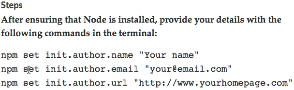

So what you can do is take these commands in the above image and then open up the terminal. So I'm going to simply come to Visual Studio code. You could also do it in the terminal itself. Hit control and then the Tilda(~) which will open up the terminal or you can like I said go into the terminal and that's going to give you the same exact access point.

Then just paste in each one of these commands and then replace your own details so here type in your name and then perform the same task for each one of these so performs the same task with the e-mail and then the author URL. 

```bash
npm set init.author.name "Your name"
npm set init.author.email "your@gmail.com"
npm set init.author.url "http://www.yourhomepage.com"
```

What that is going to do is it's going to set the metadata associated with you inside of NPM and then when you connect with the registry it's already going to know some things about you. Now that we've performed that task now we need to log in. And so what we're going to do is we are going to connect our system with the NPM registry. And all you have to do is type in npm login and I'm going to do it right here in the terminal, and simply type npm login and hit return and then it's going to ask you for your username and then your password, so simply type that in. 

I am already logged in and so I don't need to do it on my side but simply type your username and password that you just used to sign in and you will be good to go and that's going to give you your push or ability to push to the registry. 

So now that we've done that now let's create a GitHub repo for the package so I'm gonna type github.com, if you're logged in when you go to GitHub you should see something like this and then click on the plus icon to create a new repo.

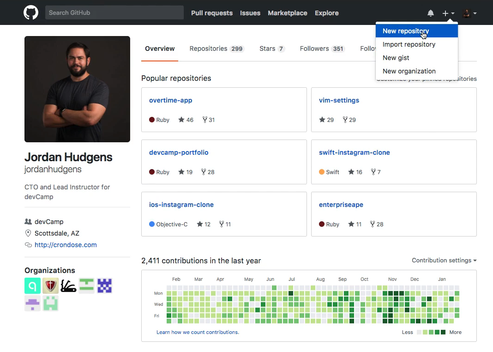

So for this, I'm going to call this the devcamp-js-footer and so I definitely recommend giving something like either your company name or your initials or something right in front of the repository name just so it is very unique because when we push this up to NPM you don't want to have a conflict and use a name that's too generic and then it could potentially either already be taken from another NPM package or it might confuse other developers. So whenever you're building out something small like this make sure that you name it in a way that makes sense and is specific to you. 

I'm going to click on the green Create repository button and I'm just going to leave it for right now. We are not going to push up to it until later but the reason why I wanted to create it at this step is because we are going to need this URL and I will show you why here in a second. So now with all this in place, we are actually ready to generate the package. So I'm going to come down into the visual studio code and change into whatever directory that you want to do your work in. So I'm going to go to the desktop and I'm going to create a directory. I want to call this by the same name of the npm package. This is going to be devcamp-js-footer so you switch back and `mkdir` stands for make directory. 

So we have that and now I'm going to change into this directory. And from here all I have to do is type NPM init and this is going to create an empty package json file and it's also going to start asking me questions about the package we want to create so I'm gonna say npm init and I'm going to go with the default package name and that's part of the reason why I said to create the directory first and change into it. 

Because the way npm init works is it will by default use whatever the enclosing directory is so it automatically assumed we wanted to call the package devcamp-js-footer. So I'm just going to hit return and it's going to keep that name. The version is something that I want to talk about. So let me hit clear here and let's talk about what version numbers represent to the open-source community. I don't like starting at version 1 to me version 1 means that we have a finished product and it is good to go it should be used by thousands if not millions of users.

I don't think we're quite at that point and so any time that we are going to have a change in this number all the way to the left what that means is we've reached a major milestone. And also if I am at say version 1 and then I move all the way up to version 2.0.0 that will also tell other developers is that if they had version one of this package that version 2 most likely is going to have breaking changes which means that if you continue to use it then you're going to have to actually make some code changes on your side.

If you already had it installed on your system so naming and this specific number format is very important. So I'm going to start off with zero followed by a dot. Now the second number represents large features so whenever you add a significant feature to your application but it's not something that has breaking changes and it's not so significant to have a full version number change then that's what I use the second number for. And then lastly this third digit is for small things like security patches or maybe some reorganization of code that doesn't really affect the user but is something that you want to add, that is what I use the third digit for and that's the common convention in the industry. 

So I'm gonna hit return with that version number and add a description. So this description is important because it is how your package will be found on the NPM registry and it's one of the first things outside of the name that people are going to see.

So I'm going to say that this package or you could say module that may be better. So this module allows for a dynamic footer to be generated, not rendered I think generated is a better word, generated for js applications with an updated year and name. That is going to be our description. You can do anything you want on yours. You could just give it a couple of words if you want. 

The better the description the more professional your package is going to look. So the entry point I'm going to keep the default index.js and so what this is going to do is it's going to tell the package that the very first file that they should look at is this index.js file. You could customize it, I'm just going to keep the default one for right now. I'm not going to leave a test command this would be if you're adding automated tests which if you're building out a large package is going to be something that you want to do. 

I'm just going to leave it blank and hit return the git repository if you remember when I said the reason why I created this repository right away was because we needed the URL and this is the reason why is because the get repository is going to be used throughout the package configuration file. 

So simply paste that in and hit return 

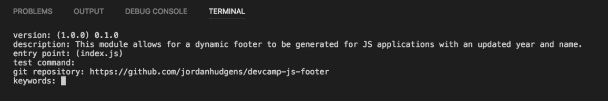

and then you can type keywords if you want. I might just type in one so I'll say footer and hit return that simply doesn't do anything except provide some metadata for the NPM registry.

For author, you're going to put your name. License, this is important. The default license is ISC. I usually go with an MIT license you can go with whatever you want. The one caveat here I'd say is make sure you always have some kind of license whenever you're working with open source software and the reason for that is if you leave a license completely off of your package file or off of any out of your repo, what this means is that legally the entire code package would revert to the default copyright laws and the default laws mean that no one can use your code without you giving them access. 

That means that anyone who goes to the NPM registry and downloads your module is going to technically be breaking copyright law if you do not provide this and that is a very bad practice you need to make sure you always provide some type of license. And that's it. 

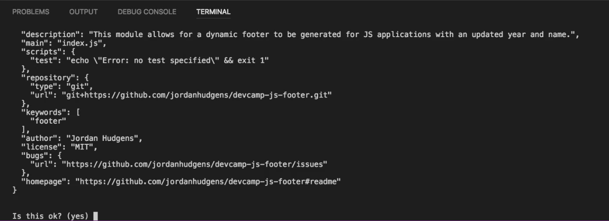

So it has generated this file, it asks if this is OK and we can review it. But everything here is pretty standard so I'm just going to say yes which you will do when you just hit return and it's done. 

So now if I open this up I can click on devcamp-js-footer here and in Visual Studio code 

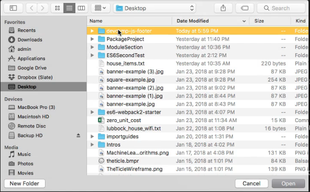

It's going to pull up a directory that only has one file in it which is good because this is the file that we just generated. And notice how it has our name, our version, our description, the entry point, all of those elements. 

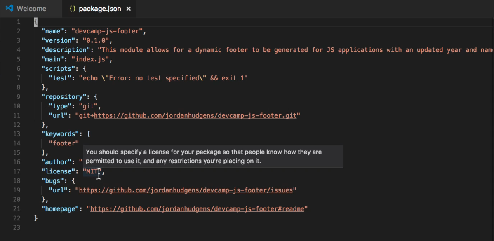

It even creates a few cool ones like any spot where bugs should be rendered. So if a user runs into a bug it tells them to go to this URL 

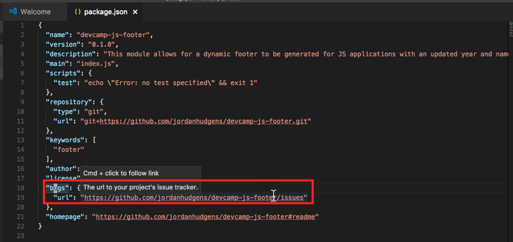

which is our GitHub account slash issues and they can add the issue right there. So this is all working and I think this all looks good. So let's come back to our cheat sheet. And see what the next steps are. 

Now that we have that, it's time to create an index.js file and I provided the code for it

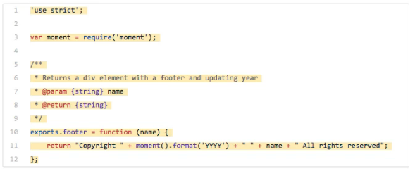

the functionality is relatively straightforward but we're going to walk through it anyway just to make sure it's clear. 

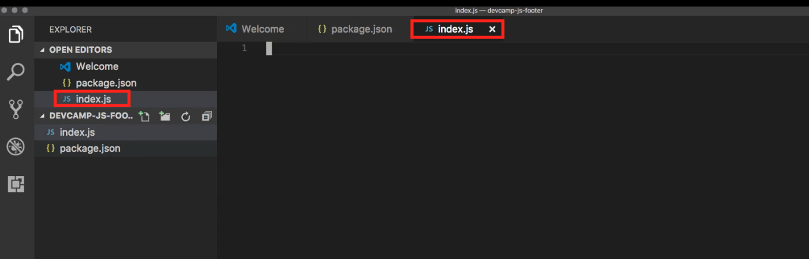

So I'm gonna say index.js and I'm just going to paste this in and hit save. 

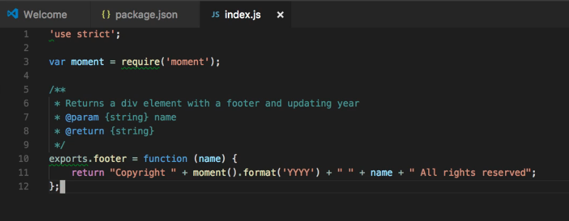

So we have a few things going on here that may look a little bit different. First, at the very top I'm saying use strict and what this means is that all of the code we write has to follow not only best practices but it has to follow the very letter of the JavaScript law. So you have to have things like your semicolons at the end of the line they're no longer optional. You have to have all of the various syntax options all in place and working, that's what use strict means. 

The reason why you do it is because you don't know the other types of packages and applications that might be using your code and if you do not do this and you have some optional things in your code that would not work under strict conditions. If a developer pulls in your package here and puts it in their application then it might break their application and so you have to be cognizant of that.

That's the reason why you should always put that at the top. And now here you might notice that I'm using the older version of a required statement. 

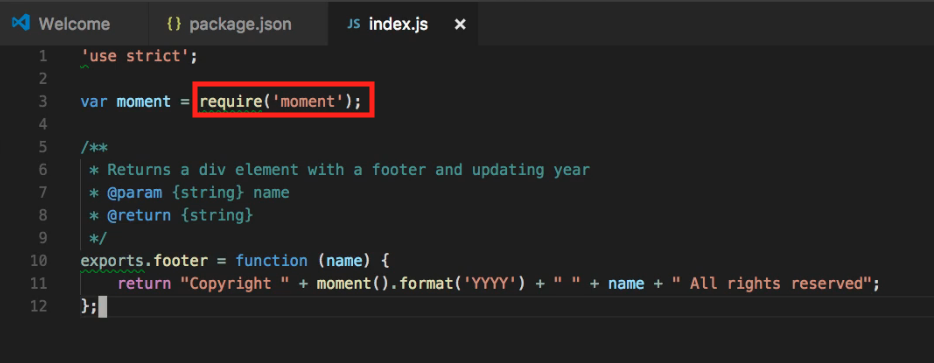

If you remember back before to our import when we talked about importing things with the es6 syntax we could do things like this where I could say import moment from moment, and that would work perfectly fine, but we are not using that syntax. This is the older version of JavaScript and even though we were expecting that most people who are pulling this in are going to be using the most modern versions we need to be cognizant of the fact that they might not. And so we want to process it and make sure that this will work across all of the different platforms and development environments. 

So we're bringing moment in, and one of the things you may be wondering is how in the world do we have access to moment? And that's a great question because technically right now we do not, so we're going to have to bring this in. If you look at our package json file there are no dependencies here. And so the way we can add moment is by opening up the terminal and simply typing in npm install --save and then moment and then what this is going to do is it is going to go up to the NPM registry and it's going to pull in the dependency of moment like you can see right here. 

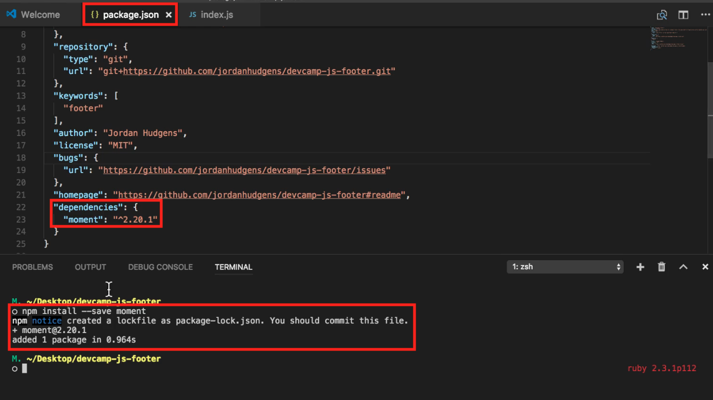

Now that we have this in our package json file we actually can use it. So when we require it, it is now going to work. 

Now, what is this long line? 

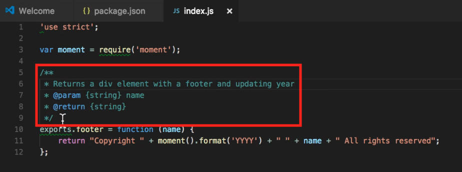

Because this looks pretty weird. Well, this is a comment and it is giving a very clear set of instructions on how to work with and also how to understand the code that we're going to be exporting and I need to update it a little bit.

When I originally created the guide I was going to return a div but I changed my mind and instead were simply going to return a String element. And so what we were going to essentially do is what we've discussed we're going to return a String element with a footer and an updating year. So in addition to our little summary here we also have some other documentation items so when I say @param what this means is that the function is going to expect a parameter, it's going to expect some type of function argument. 

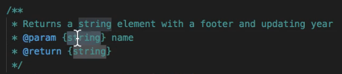

It should be of type string so we're providing the data type so that someone doesn't try to slide in a number or an object or anything like that. And the name of the argument is actually name in this case. And so all we're saying is that if you're working with this function you need to pass it this argument for it to work, then we also talk about the return. So this is going to be the output of the function. 

Now if you have heard me talk before or gone through some of my other courses you may have heard me say the phrase that if you can understand a program's inputs and outputs you can understand anything about that program and it is very true right here. Whenever you're working with outside code libraries and packages one of the hardest things to understand is simply what do you need to provide to that function? And then what is the expected output?

And so whenever we're working with outside code or whenever we're building a library like this that others are going to use we want to make it as easy as humanly possible for them to understand exactly what the parameters are. So if there were other parameters here. So if we allowed them to pass in some secondary name or a message or anything like that we would add it in the next line. So we would do something like this where we say param and then it's also a string and this may be called a message, something like that. 

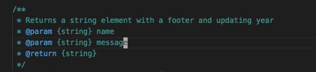

and it's simply a really nice way to document exactly what is needed from whoever else is using this code library. And then also what this return statement means is that we are returning a string type I cannot tell you how frustrating it is when I'm working with some type of package that was not documented properly. And I call a function from the package expecting to get a string data type and then I end up getting an array or some type of collection like that or anytime it's something different than I'd expect it can cause bugs in my application. 

I can tell you from experience that other developers feel the same way. So right here we're making it very explicit on exactly what you need to provide and also what you need to return and so that goes to best practices in development just in general. 

Now let's get into the actual code itself. So right here we have the word exports 

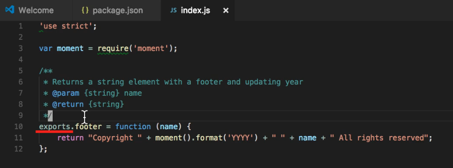

Exports is an object that is available to JavaScript and its whats used to export packages and we're using the slightly older syntax here once again. Remember back to when we were exporting files directly we could say something like export default and you know give some type of you know function here. 

```js
export default function
```

And that would all work. 

Well with this syntax what we're doing is slightly different. We are calling the exports function that's this object right here and then we are simply adding on the footer attribute. So you can imagine that when all of this gets processed the way JavaScript's going to look at it is javascript is going to come and see this object. So its going to look like exports and then inside of it is going to be this footer attribute and we can call it and we can call it just like a function.

Now, this is not valid javascript code whatsoever. 

```js
exports = {
    footer()
}
```

It is simply a visual to show you that exports, in this case, is an object and we're simply right here adding on to that object and if you don't do that you or anyone else who calls this system whoever calls this package is not going to have access to our footer function. So we need to make sure you do that. 

Now everything inside of here is actually relatively straightforward compared to everything else. And so I know I spent a lot of time talking about really just 10 lines of code but it's important because this goes straight to the fact on why I wanted to include this guide in the curriculum and it's because the concepts like packages like node packages and really any kind of thing. 

I ran into the same issue with teaching Ruby students. And they found the packages which are called Ruby gems in the Ruby language. They found those very intimidating and one thing that I discovered is that when I taught them how to actually build a package, how to build a ruby gem. 

All of a sudden they became much less intimidated by using them. And so in this case when we're talking about node packages I thought the best way to understand it and to take the mystery away from using them is actually to create your own because you're going to see now there's really no black magic behind it. 

We are simply creating a function exporting it and then we're going to be able to call it from any other application out there which is a pretty cool thing. And so the functionality inside of our footer is going to be a return statement and its simply going to be a string like we said right here.

So it's going to say copyright and then it's going to give a space and then we're going to add the moment library onto it. And if you remember back to our moment guide, we're going to call moment which is going to give us the exact day and time any time it's called, and then we're going to call the format function on it and I'm going to pass in for capital Ys and that is going to return four digits and it's going to return a 4 digit number. 

So right now when I'm filming this, this will return 2018, and then I'm concatenating onto that the name which is the function argument here and then adding on to that All rights reserved. So this is the full copyright that will get generated and you can put on a footer or any other spot that you need it and you're not going to have to worry about dates getting old. 

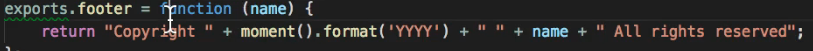

I've seen so many applications where I scroll down to the footer and I see that the date says the copyright is nineteen ninety-nine or something crazy old and then with the ('YYYY') what we're going to do is we're not going to ever have to worry about that. Any time a user accesses the site and any site that uses this the date is going to be auto-generated from the moment library. So that is going to be a pretty cool little thing. 

So now with all of this in place let's go back to our cheat sheet and see where we're at. So the next thing is our readme.

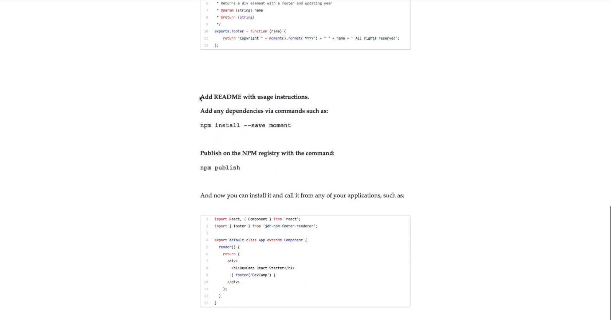

So the way the readme works is the readme is an important file and it has to be named exactly like this. So I'm going to come here type touch readme.md and this is going to create a ReadMe file. 

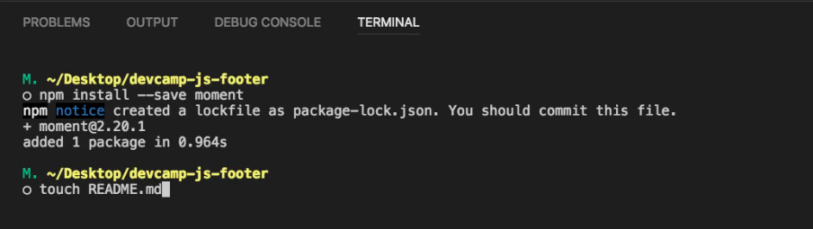

What a readme.md file is, is it's called a markdown file. And so what I'm going to type may look a little bit weird, I have created guides specifically walking through how to work with the markdown syntax. And so what I'm typing I don't want you to think it looks weird or that I'm going to fast. If you are ever curious about markdown down there are all kinds of resources you can switch to the browser and type in Markdown tutorial right here and walk you through all of the steps for learning markdown I'll include this in the show notes as well. 

And so essentially what I'm doing here is I'm creating a heading. So I'm going to call this the devcamp-js-footer and then you want to provide instructions so you can do something like say this should be used in the following manner. And then from here, I can add javascript code and I can even add syntax highlighting. Once again this guide is not on markdown so I am going to go kind of fast through this just so you don't think I'm wasting your time as we're going through it. 

It's simply giving you a set of instructions to anyone who wants to work with this. So I'm going to say you can use this in your application by saying import footer from and I need to use the name devcamp-js-footer and then simply calling footer and then some name and that is all that you have to do in order to get this working in another application. 

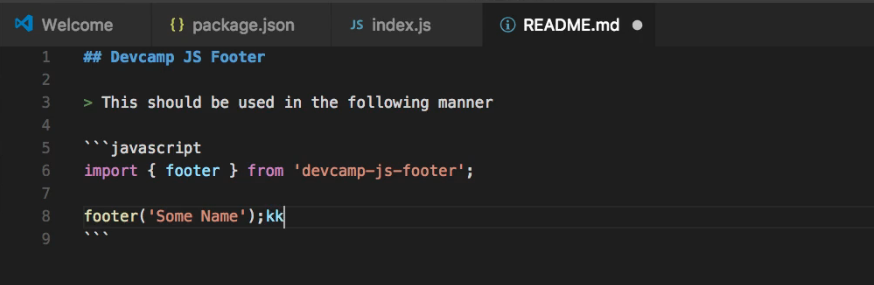

we should probably also do something like say this should be used in the following manner install with the command and here you give a command of NPM install --save devcamp-js-footer and then add it to a javascript project with the following code and there we have all of our instructions. 

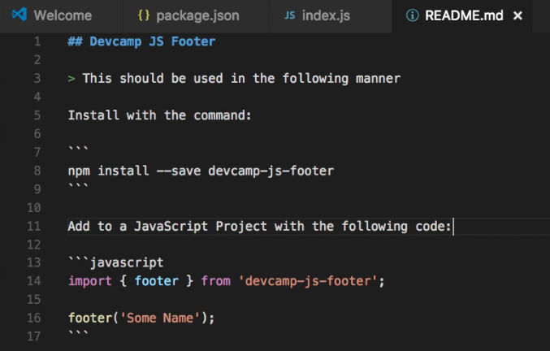

and once I push this up you're gonna see that this gets converted to some very nice looking HTML and it's a great way of being able to format your documentation. 

So we have our readme, let's see what else we have to do. So we've already installed moment so we can skip that step. And now we're ready to publish. So as long as you have logged in then you should be able to just type NPM publish and then this is going to appear in your list of packages. So let me type in npm Oh and actually you know what I went a little bit too fast. I'm sorry I just realized we haven't pushed it up to GitHub yet. So go to this page on GitHub 

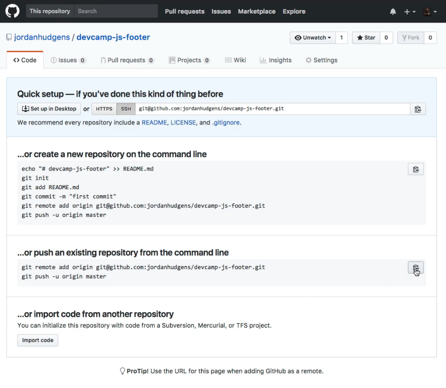

and click copy on this particular piece of code 


and come to your terminal type git init this is going to create an empty git repository and then you also need to do one other task. And so if I were to type git status right now we would have our node modules directory inside of our git repository which is not something we want. So add what is called a git ignore file. So say touch and then .gitignore.

```bash
touch .gitignore
```

And this is going to create a hidden file here it's any file that has a dot in front of it is considered a hidden file and inside of it just type in node modules. Hit save and now if you type get status you will see that node modules is no longer included. 

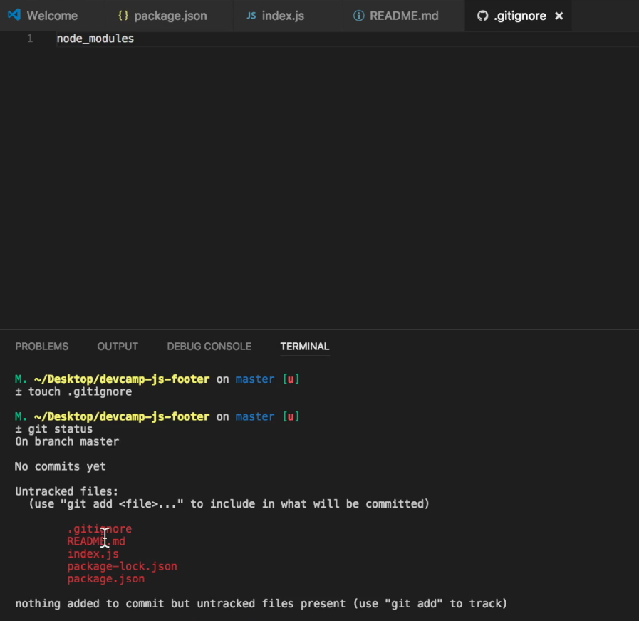

The reason why you do not want to include these is because if you remember back when I was talking about how node modules can get very stale and how you have to delete them on a regular basis well because of that you don't really want to push up your node modules to a spot where other people might be pulling it down. And so it's a better practice to simply keep it out of version control and then when they install it on their side it's going to automatically pull in the modules they need into their project. 

So the first thing I'm going to do is add this to the repository so I'm gonna say `git add .` which is going to add all the files and this kind of goes to why I added that caveat at the very beginning of the guide because if you've never worked with version control before some of these commands are going to look kind of weird. So I'm gonna say `git commit -m` and I'm just going to say `'First commit'`. And now we can paste in these two commands 

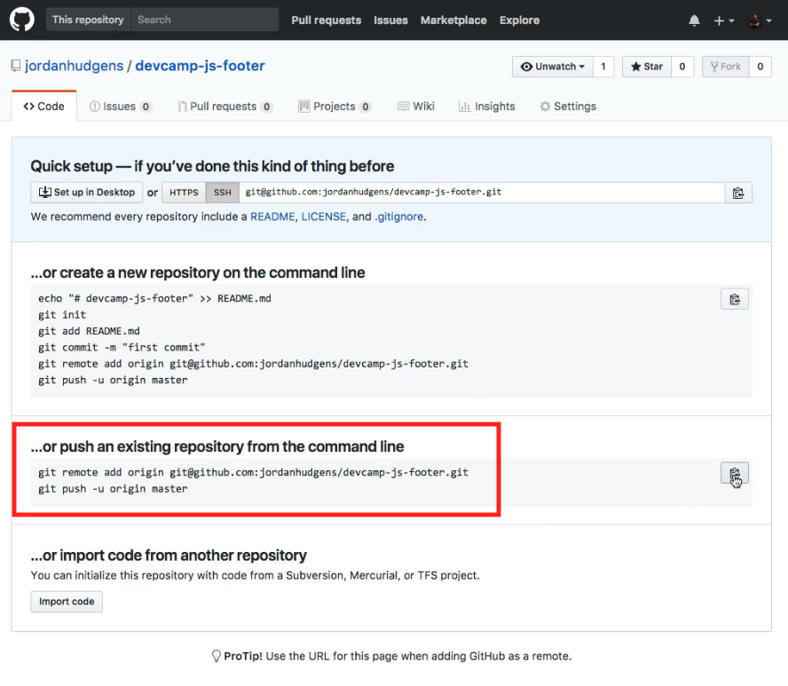

these are the commands I got from GitHub and so it has created the remote and this is going to allow us to push our code up to the repository 

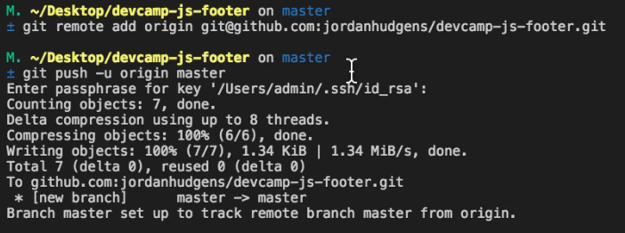

so that is now up there. So if I click on this name or just hit refresh you can see all of our code is here and you can also see the documentation that I created and I wrote in Markdown is also right here. 

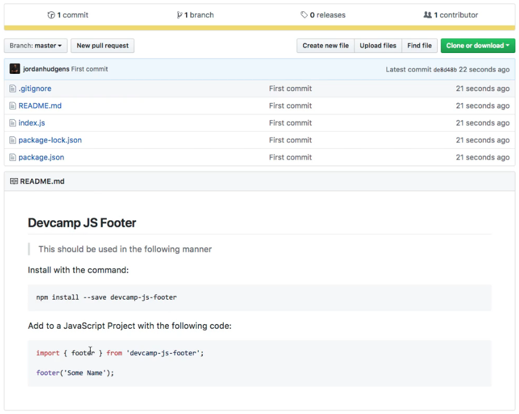

So this is all working very nicely! Now we are ready to publish it. Coming back to the terminal type NPM publish and this is going to deploy it to the NPM registry and it looks like that works. So if I come back to the npm registry website hit refresh. Now you can see that we have devcamp-js-footer and it is on the registry and other people will be able to find it. 

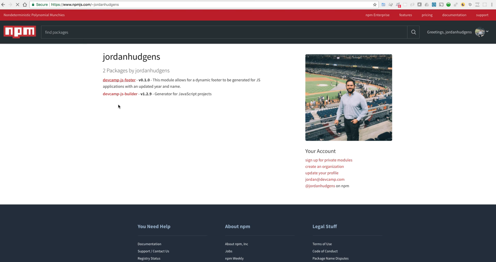

If I click on it you can see it pulls in the documentation. This is the reason why I said the ReadMe file is so important because this is shown not just on your GitHub home page but also on your NPM registry page. 

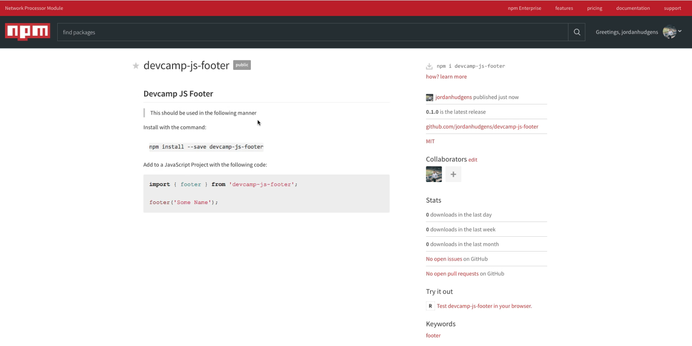

And then it's going to have other stats it's going to show how often it's been downloaded. It's going to show those keywords that I was talking about. And it's also going to list out the dependencies so see how it says a dependency is moment and it's going to have some of the other things like the home page and also the command people need if they want to install it on their own systems. 

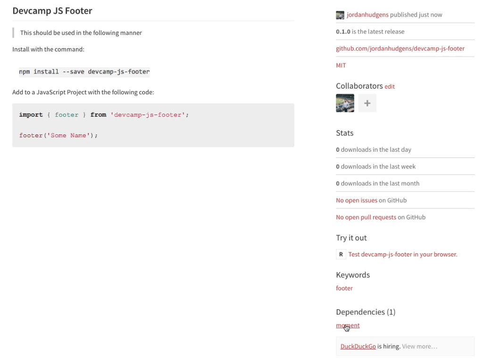

So, wow that was a decent amount of work but it is all up there and it is working. Our last step is to test it out and thankfully if you have the J.S. generator application or the node module that we walk through before we can actually use that here to test it out.

So I'm to switch back to the desktop and I'm going to generate a very basic react application. Now you do not need to know any react at all. In order to test this out, you can simply use js-generate and lets go with the react bootstrap application template and call this TestingFooterApp or something like that. It doesn't really matter we're just going to turn away right afterwards. 

So this is just to make sure that we can pull down our new package and run it in a javascript application so change into that directory and now hit open so we can actually open up the entire project in Visual Studio code. So this is going to pull in the full react application and I'll open up the terminal and type npm install and so that's going to go through it's going to install all the react dependencies and everything needed to run a react web application. 

The one thing it's not going to have is our package yet, which is a good thing because I want to show you that we can add this to a preexisting application. So it looks like everything here is working properly. If I type NPM start this is going to startup the react web server and I want to first make sure that everything here is working properly. So if I type localhost:3000 you can see devcamp react starter is working. 

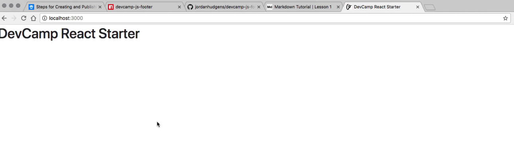

So now let's go and follow our own instructions.

So I'm going to copy this 

```js
npm install --save devcamp-js-footer
```

come down turn off the server by typing control C and then I can run this exact command here. 
But before I do that I'm gonna open up the package json file just so you can see we do not have the devcamp js footer application module here yet. So if I run this this is going to go out to the NPM registry and it is going to pull down this particular package that we created and it's going to add it to our package json file and it looks like that all worked so we're good. 

You can see it's been added here 

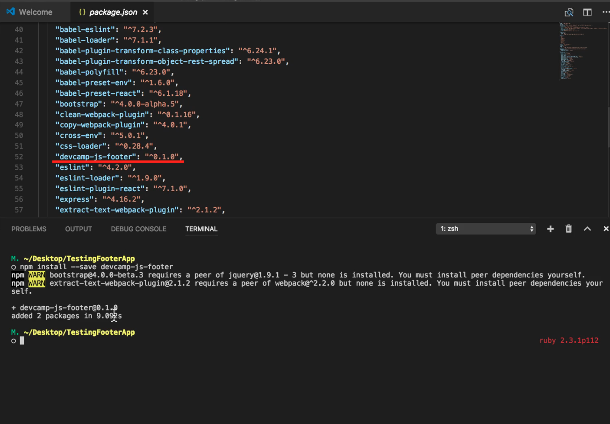

and now let's go and go back one more time to our set of instructions so we've published. And now I'm just going to copy all of this code and pull it into the application.

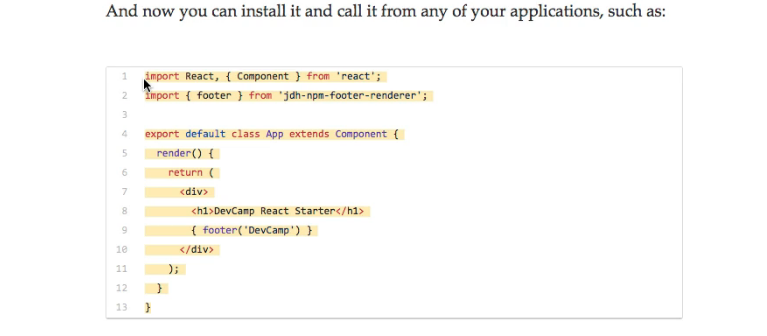

So if I go to src and then components and then app I'm going to get rid of all of this 

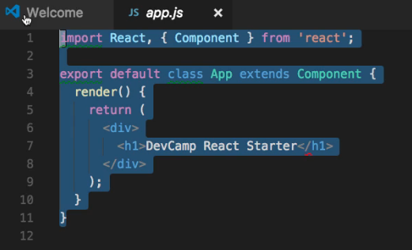

And let's paste in what I copied. 

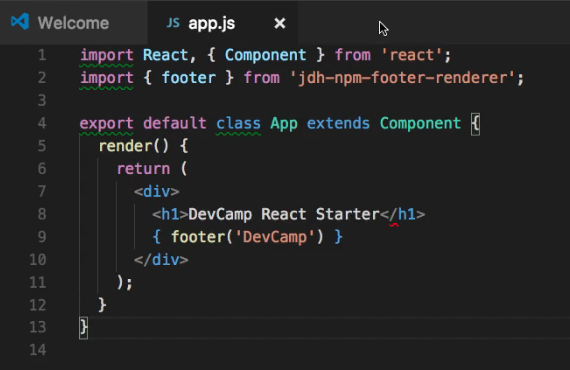

So it's pretty basic and it's following our other instructions so I'm importing the footer from and this is the name has to change. This is one of the older versions I did of this. So we can just copy our new package name here and let me delete all of this, paste it in. So make sure you have the exact name of your package and this should map exactly to what you have in your package.json file. 

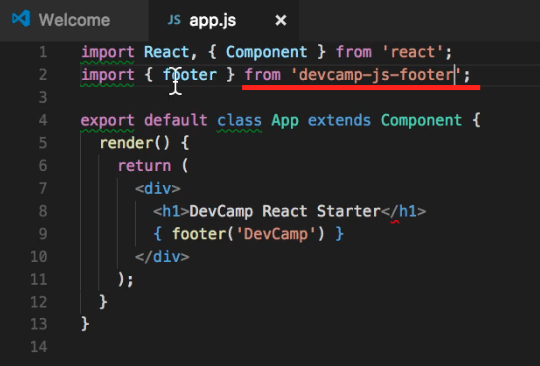

And then from there in our application we can call our footer function. So I can call footer pass in the devcamp in my case, you can pass in your name, you can pass anything you want and then this is going to go through our code and it is going to generate our copyright. So this is the moment of truth, let's see if all of our hard work is going to work and pay off. It looks like so far everything is starting up. It says it compiled successfully, so far so good. 

Let's come back online and now if I hit refresh there we go. It is working and we have a copyright 2018 devcamp. All rights reserved. 

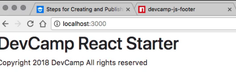

Now, this may seem like a little bit of functionality for a ton of work but what you have now is you have the skill and the knowledge in order to build your own NPM packages and even deploy them on the registry. So what this means is any kind of functionality that you want to build that can be leveraged by other javascript applications you can do, and you can share with the community, you can use it in all of your own types of projects so you don't have to duplicate code or copy and paste code from one project to another.

This is definitely on the more advanced side and so I definitely commend you for staying with this if you're relatively new to JavaScript development. But this will pay you some very large dividends in the future if you can build out applications and modules like we've done here.

## Resources

- [Steps for Creating and Publishing a NPM Package](http://www.dailysmarty.com/posts/steps-for-creating-and-publishing-a-npm-package)
- [NPM module deployed](https://www.npmjs.com/package/devcamp-js-footer)
- [Project Source Code](https://github.com/jordanhudgens/devcamp-js-footer)
- [Markdown Tutorial](https://www.markdowntutorial.com/)
