# MODULE 05-005:    Git (2)

### Git Security: Using .gitignore

****

1. **Purpose**
   
   - Excludes sensitive files/directories from version control
   
   - Prevents accidental commits of secrets (API keys, credentials)
   
   - Reduces repository size by ignoring generated files

2. **Basic Syntax**
   
   ```bash
   # Ignore specific file
   .env
   
   # Ignore entire directory
   node_modules/
   
   # Ignore any directory with the same name
   **/node_modules/
   ```

3. **Common Patterns**
   
   - `*.env` - All environment files
   
   - `*.log` - Log files
   
   - `/dist` - Build output
   
   - `.DS_Store` - macOS metadata

****

## Workflow

1. **Create .gitignore**
   
   ```bash
   touch .gitignore
   ```

2. **Add exclusion rules**
   
   ```bash
   # Example contents
   
   .env
   node_modules/
   *.key
   ```

3. **Handle cached files**
   
   ```bash
   git rm -r --cached .          # So useful, clearing cache if needed
   
   git add .
   git commit -m "Add .gitignore"
   ```

****

## Security Best Practices

- Never commit sensitive data

- Add .gitignore early in project setup

- Review staged files (`git status`) before committing

- Use environment variables for secrets

> **Note**: Once committed, sensitive data remains in Git history - consider rewriting history if secrets are accidentally committed.

---

---

## Video lesson Speech

In this lesson, we're going to discuss a very important topic when it 
comes to using get and version control in general and that is security 
and how you can hide or show certain secure elements inside of your 
repository.

****

So take for example our git project right here. 

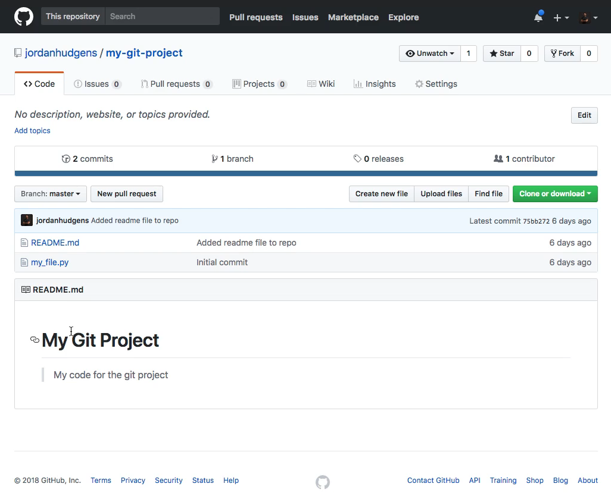

If this was a full application then you may have a few items that you don't want everyone else in the world to see. So this could be API keys this could be passwords to connect to other applications different things like that. And if you push those up to this repository then everyone in the world would have access to them. And there are even hackers who go through Github and they have scripts that look for different keywords such as secret or password and then they can hack your accounts based off of that. 

I actually had a developer that was working for me that accidentally pushed up our AWS credentials one time to Github and it caused all kinds of issues. Within a couple of hours the hackers had already racked up over sixteen thousand dollars worth of charges and so that is not something that you want to do. So we're going to have an entire guide dedicated to how you can protect your and secure credentials or anything that you don't want to push up to version control. 

So I'm going to switch over to the terminal and the way we're going to start this is git looks for a very specific file called a git ignore file. And so if I come here and you can see I just have my file the git directory and then the readme but if I add a new file and I'm just going to call it secrets.yml and I'll put my AWS secret right here. And this is not my actual AWS secret just FYI.

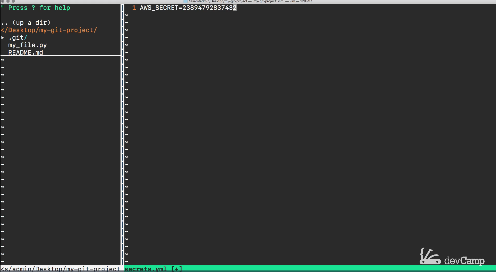

This is just something where you can imagine this is something that you do not want everyone else in the world to have access to. And so now this is at the root of the application. So if I quit out of both of these if I quit and type git status you can see that we have an untracked file for secrets and this is exactly what you would expect to see. 

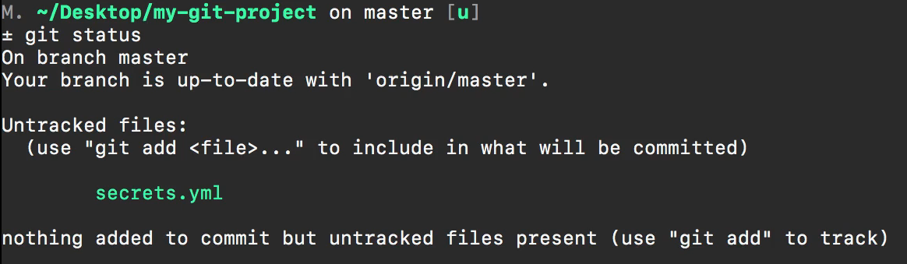

But we don't want if we added this to our history and we push this up our secrets would be pushed up to Github and that would be a very bad thing. And so what we're going to do is we're going to create a git ignore file. So I'm going to open up the text editor and then create a new file and the name of it has to be very specific it has to be `.gitignore` just like that and I'm going to save it come over here. And so you see the way it is spelled just `.gitignore`. 

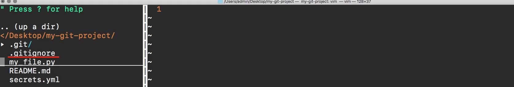

And anything that we put inside of this file is going to be ignored. So if we want to hide our secrets I can just type secrets.yml and then if I save the file close it and then now type git status you're going to see that the secret's file that used to be an untracked file is now gone. And now we only have our git ignore files so this is working absolutely perfectly. 

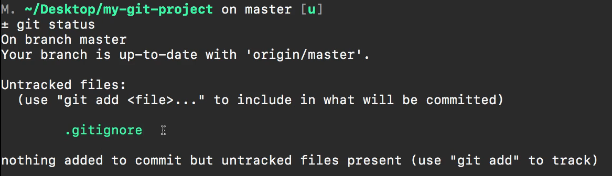

Now one thing I will say as a caveat is if you run through that entire process and that didn't work so if you see the git ignore file and you see the secret file that's happened to me as well. And what that usually means is either that you misspelled the file name in your git ignore or that you may have in your cache. What it does to help with performance is it uses a cache where it tries to keep a brief history of everything that you've done and so you simply can delete that cache and so the command you can run is `git rm -r --cached .` and if you run this then it's going to remove all of the cache changes on your local machine and then it should work for you assuming that everything is spelled correctly. 

Now you can see that it shows the elements that were deleted and then the Untracked files. You shouldn't do that on a regular basis obviously, it's there for a reason but it is helpful in case you run into an error where you've already cache that file and you want to remove it. That's a command you can run but if it was working fine for you with the first step then don't worry about it. I did want to give that to you in case you ever run into that in the future you'll know what to do.

So I'm going to create a new commit message here so I'll say added gitignore file and deleted git cache. And now if I type get status everything here is good. 

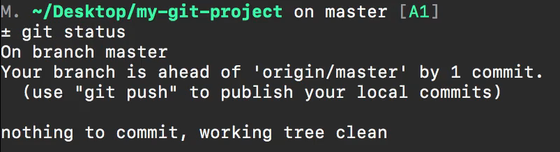

Now that's how you can add a single file. Let's imagine that we have another file or actually that we have a directory. So I'm going to create a directory here called node_modules and then I can even add some files to it so I can say inside of this node_modules is going to be one.js and two.js and just for good measure three.js 

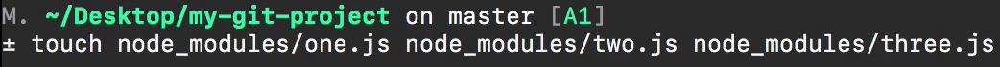

so if we look at our file system now you can see we have this node_modules and it has all kinds of different files inside of that. 

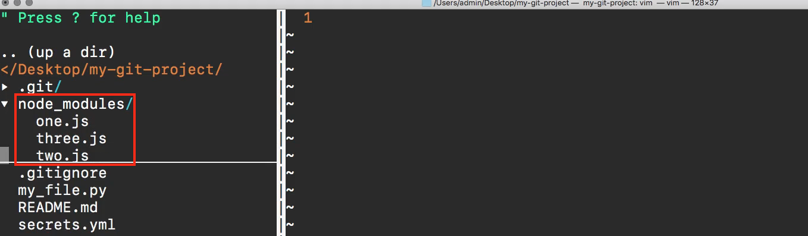

Well now if I type git status 

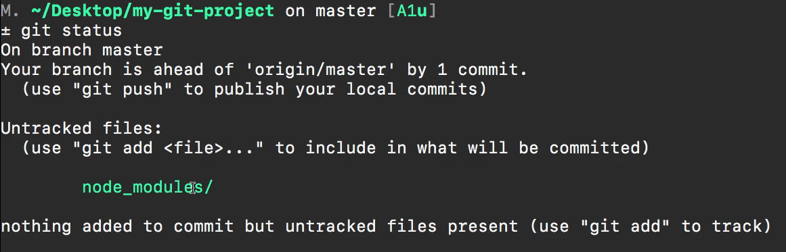

you can see that the entire directory and because you see this little trailing slash at the end what this means is that all of the contents for the node modules everything there is now inside and is going to be tracked if I add it to the repository and then I commit it. 

But in a number of applications and JavaScript applications like react are a great example you actually want to hide the entire directory and so we can do the same exact setup. So if I come down to git ignore and then give a couple of lines you don't have to give another line could put it right here and say node_modules and pass in that directory flag right there that slash. That is what tells git that we want to ignore everything inside of there.

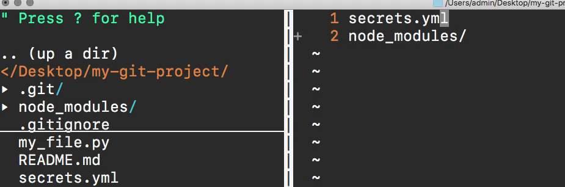

And now if I type git status you can see the only thing that has been changed is the .gitignore file 

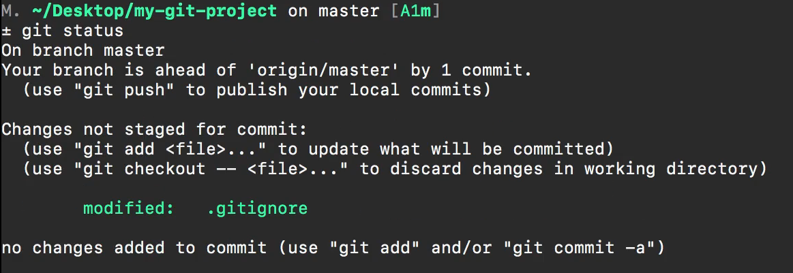

and let's say that we want to test this out. So and I'm sorry I am using a shortcut where I say ac that's something I've built into my system it adds and it commits everything all at one time to save time. Let me go through the whole process because you probably do not have that on your system. So git add . and then git commit -m we'll say "Updated gitignore file to include node_modules directory". 

Now if I git push and push this up to the repo 

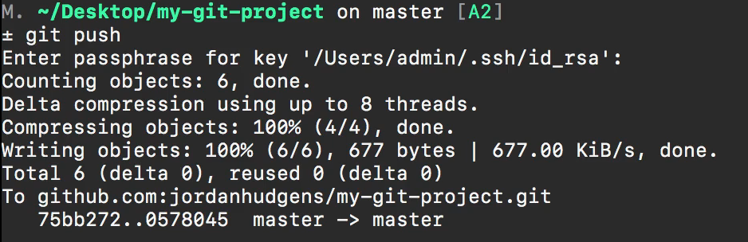

what we should see is our regular project and it shouldn't have the secrets file and it shouldn't have the node modules directory so let's test this out and see if it's working. So if we come to git project and refresh it you can see that node_modules and the secrets file have not been uploaded and pushed only they git ignore file. 

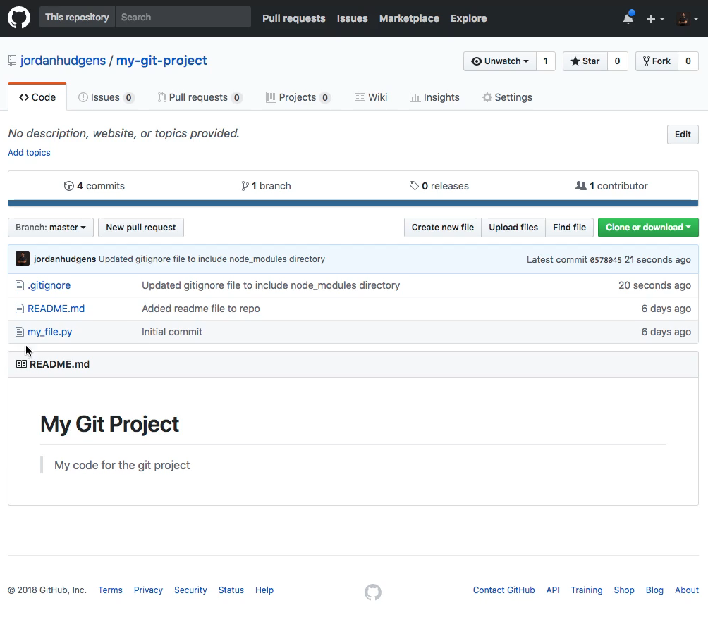

So if I click on this you can see that we're hiding secrets and node modules 

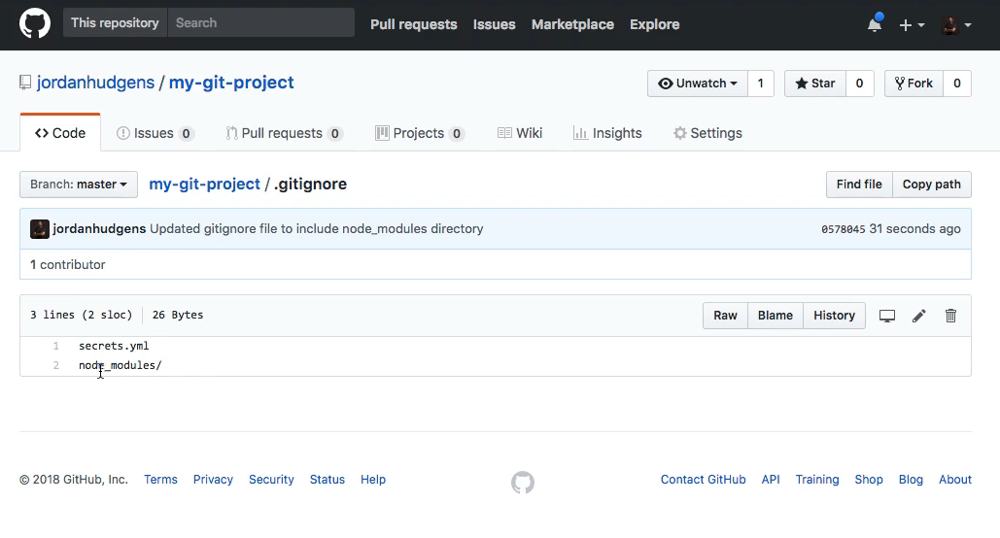

and this is exactly what we were looking to do. 

So if you get all of your passwords in your API keys that you wanted to only use locally then you can use your git ignore file and if you push it up then no one else no hackers or anyone else will be able to steal your credentials so that is how you can leverage git ignore in order to protect yourself and security to your version control system.
