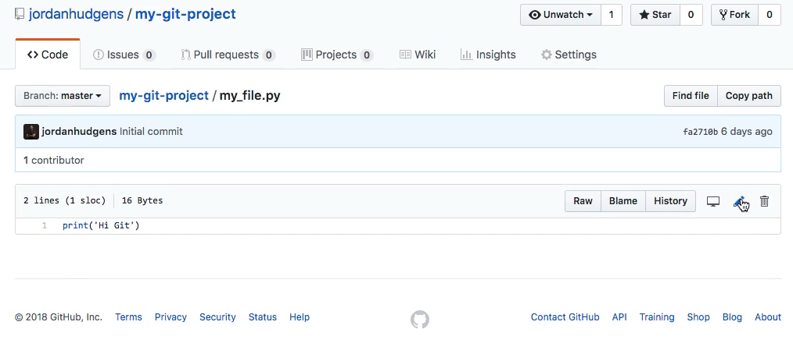
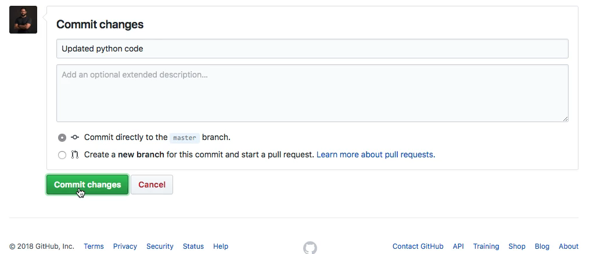
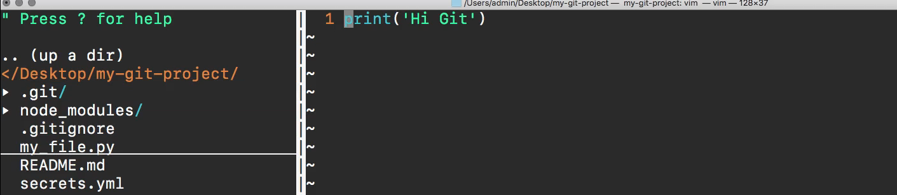
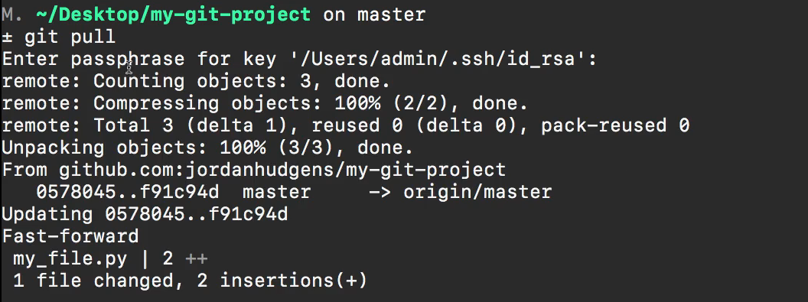
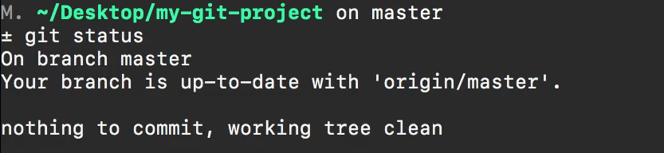
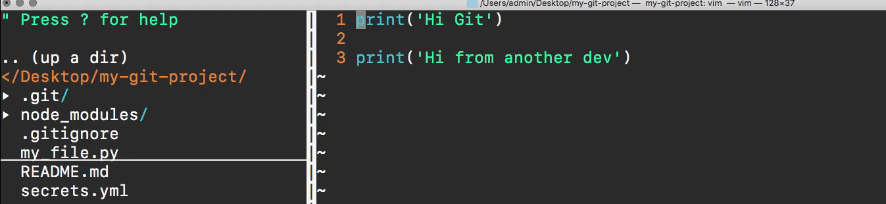

# MODULE 06-007:    Git (3)

### Pull

****

****

## Video lesson speech

And if you're working on your own so you have a project and you're the only developer that's working on it then that's actually going to carry you a very long way in terms of what you're going to be doing with git on a day in day out basis. 

However, if you're working with a team then that adds a whole nother component and it adds in some different complexities that have to be aware of. Specifically, if you have another developer on your team that is pushing code up you need to be able to sync the most up to date version of the application with your current local version and I will show you how that works and that's what we're going to walk through in this guide. 

So if I come up to my_file.py right here 



you have the ability to come and to make changes directly in Github. 

Now, this is not recommended for your day to day development but instead what I'm going to be doing is I'm going to be mimicking what it would look like if you had another developer on your team who made a change. So say we have print out hi git and then a few lines below that we say print out hi git from another dev.

```github
print('Hi Git')

print('Hi from another dev')
```

And now if I come down here I can update the changes so I'll just say updated python code and then from there I can commit changes 



and it gives you a few options. But like I said you're very rarely ever going to be making changes directly on GitHub what you usually want to make sure that if you're personally making changes to a repository you're doing it on your local machine and then pushing it up but right here we're just pretending that there is another developer who made a change to this file. 

Now if I come down to my local repository so if I open this up in the text editor and look at my file you notice I do not have those changes. 



So we need to walk through how we can pull down the latest version of the application. So the way we can do that is with the term git pull. So if I type in git pull this is going to bring down after I type in my password the latest version of the application. 



So if I come and see that it is calling the remote it is comparing the objects and then from there, it is updating the current version so it's giving the new version with this new commit ID. And then you can even see it tells you which file was changed and it had two lines that were added. 

And so now if I type status there are no changes because we brought down the newest changes 



and if I open the file up you can see that the file has been updated 



and so that is how you can pull down someone else's changes onto your local machine.
