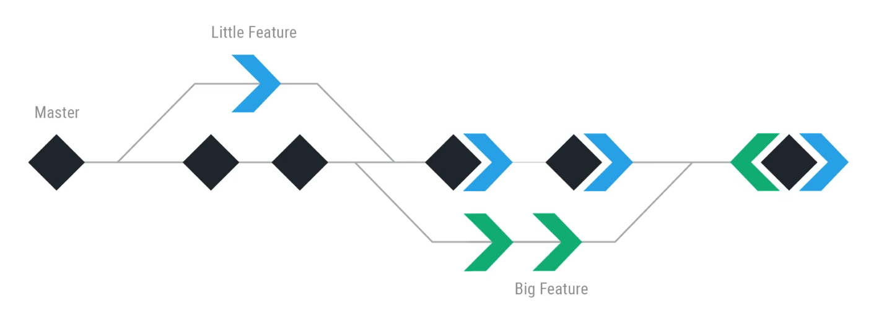
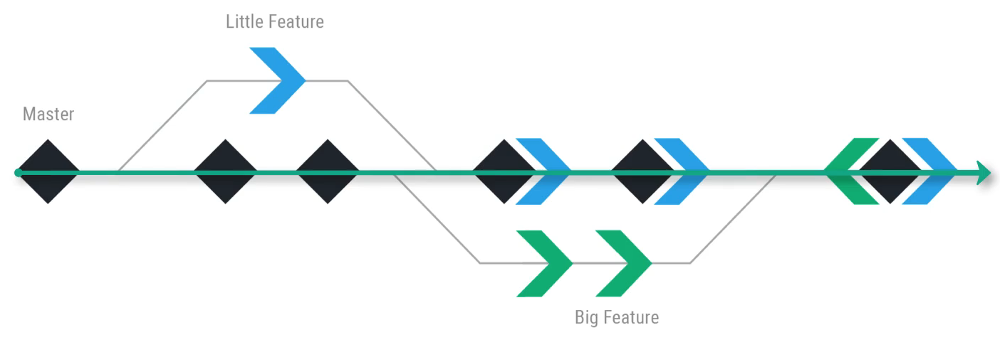
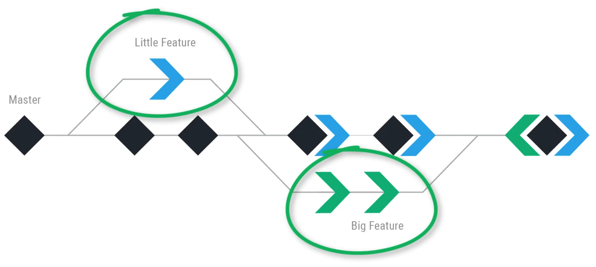

# MODULE 06-009:    Git (3)

### Branches

---

****

## Video lesson speech

As you can see right here in this diagram we have a set of diamonds. Each one of these diamonds represents a version of our application and the one on the far left shows that the long line going to the center is what is called the master branch. 

You can think of this branch as being the live version of your application. Now there are times where you need to go and build some features and you don't want to immediately place all of your changes directly in the master branch. What usually causes you to use a branch is to build something that maybe isn't just a quick fix it might be something that requires multiple files in the codebase to be changed and you don't want to make all of those changes directly on the live site. 

What you can do is you can branch off of the entire code base and this is typically called a feature branch. So as you can see here we have a couple of different branches we have our little feature and then down below we have our big feature. 

What you can think of this process is the ability to break the entire code base out and then work on some type of feature. And while you're working on your feature other developers, other team members, or even yourself will still have the working version of the code until your entire new feature is done. 

Which that could be a couple of hours a couple of days or even a couple of weeks and you could do all of your work completely separate where you're not interrupting the other developers, you're not going to push something up to the live application that will break it and it gives you the time to really isolate and focus on the feature that you're wanting to build out. 

And then once you're done with it then you can merge whatever your feature branch was directly into the master branch and then everyone else who's working on the application can then update their own local version and then have your new feature directly built into it. 

I think this is a really helpful visual when you can look at this from a linear perspective where you can see each one of these versions and these new changes that have occurred. And then you can see how you can simply branch out and that is the genesis of the name so that you can branch out work on special features and then merge your new features back into that master branch. 

So in this section, of course, that's what we're going to do we're going to examine all of the different kinds of ways that you can utilize branches how you can build other features into your projects and then bring them back in merge them in with the master repo so that everyone else can have access to them.
