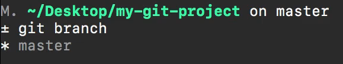
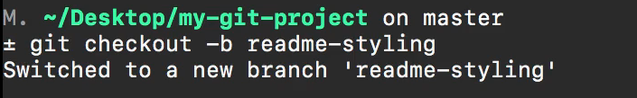
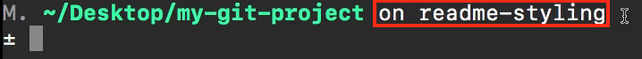
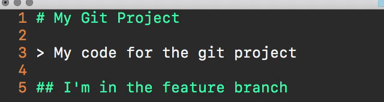
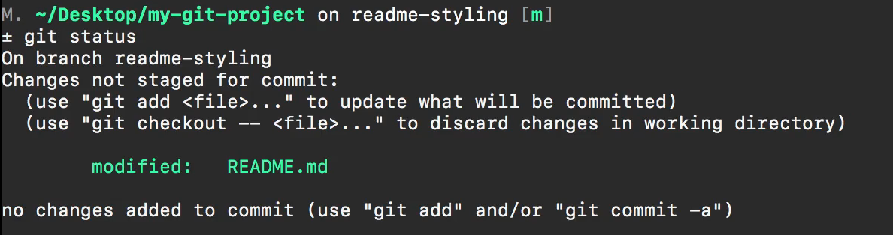
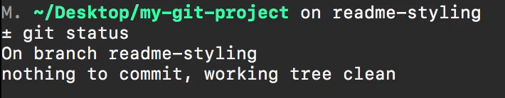
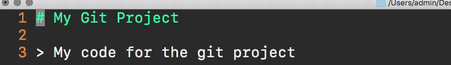
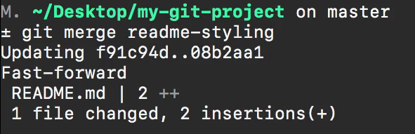
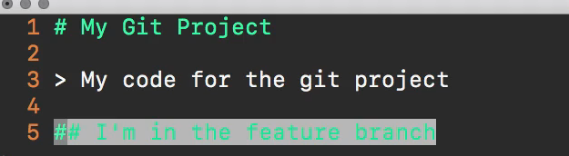

# MODULE 06-010:    Git (3)

### Basic Branching Workflow

---

****

## Video Lesson Speech

So if you just type the keywords git branch this will show you what branch you're on. So right now you can see that we're on the master branch right here and you can tell because as an asterisk by it and you will also see the full list of branches in your local project. 



This doesn't show you all the branches that you have on GitHub or that your other team members might have, it only shows what is on your local machine. 

So let's create and check into our very first branch and the syntax for doing that is typing `git checkout -b` and then give a name for anything that you want. So I'm going to say something like `readme-styling` and if I hit enter you can see that it says switched to a new branch readme-styling 



and a few things to note you can see that my text editor or my terminal right here shows what branch I'm on 



Yours most likely if you don't have any kind of configuration settings or anything like that yours may not show that and that's perfectly fine. Remember you can always see what branch you're on by just typing git branch and now you can see that we are on the readme-styling branch and so if I make a change here so this one's all about the readme so I'm going to open up the readme.

You can open it up in your own text editor. And here we're going to add some more code to it so I'll say I'm in the feature branch



and I can save this and if I type git status you can see that it shows that I've modified the readme 



I can add the ReadMe file and then I can commit it. So I'll say 

```bash
git add .
git commit -m "Updated README" 
```

and now if I type git status you can see everything is good to go we don't have anything else to commit. 



It also tells us that we're on the branch readme-styling and if I want to switch back into the master branch so say that something came up and I want to see what the line of code looks like. I can type

```bash
git checkout master
```

So the syntax for this is the keyword git followed by checkout and then whatever branch that you want to check out. 

When we created the new branch we added the dash B flag that created and then checked us directly into it. But if we simply want to switch back to a different branch we can type git check out master and now if we look at the readme you can see it does not have our change. 



So the way that this works, is the master branch is not touched whatsoever until we merge that new code in. And until we merge that new branch directly into it. And so that's what makes us so powerful because imagine a scenario where you go through and you're right in the middle of some big feature and then you find out there is a bug in the application and you need to quickly go switch into the master branch, fix the bug put it up into the production server and then you can come down and switch back into your feature branch and then finish that feature out. That is a very common workflow I can't tell you how many times that that has happened.

Imagined that I didn't use the branch so imagine that I went through and I had 20 new files created on master and half of them weren't working properly. Well, that would be a problem if I had to go and push up my code in order to fix a bug and it was something that had to happen right away. And that's really where the power of branching comes in because you can isolate your code and you don't have to worry about any kind of issues with the master because the master is not going to be touched until you've merged it in. 

And so now that we have that let's imagine that our entire feature is done the way that we can merge it in is with the command `git merge` and then we give the `name of the branch` so I can say 

```bash
git merge readme-styling
```

and now you can see that it fast-forwarded it. 



It said that a few new lines were added to the readme notice we're still on Master now and so if I go and I look at the readme file here you can see that now it has our changes 



so everything that we built into that feature branch has now been merged in. If we would have added 20 files all 20 files would have come in but it didn't happen until we explicitly said I want you to bring in all of those changes. So that is the basic workflow for how you can work locally with feature branches and then merge those in your main master branch.
