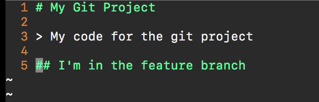

# MODULE 06-012:    Git (3)

### Rebase

---

Rebase is a Git command that **allows you to integrate changes from one 
branch into another by moving or "replaying" your commits on top of 
another branch's history**.


Imagine this initial branch structure:

```
A---B---C---F---G (master)
     \
      D---E (feature)
```

After rebasing feature onto master:

```
A---B---C---F---G (master)
                 \
                  D'---E' (feature)
```

1. **Rewrites History**:
   Rebasing creates new commits (notice the apostrophes on D' and E') - 
   these are similar but not identical to the original commits

2. **Linear History**: Results in a cleaner, linear project history

3. **Golden Rule**: Never rebase commits that have been pushed to a shared repository


****

## When to Use Rebase

- To incorporate the latest changes from main/master into your feature branch

- To clean up a messy commit history before merging

- When working on a local, private branch

## When NOT to Use Rebase

- On shared branches (branches others are working on)

- On commits that have already been pushed to a shared remote

****

## How to use

1. Create a feature branch and make changes:
   
   ```bash
   git checkout -b feature-branch 
   
   # make changes
   git add .
   git commit -m "Feature work"
   ```

2. Meanwhile, main branch gets updates:
   
   ```bash
   git checkout main
   git pull
   ```

3. Rebase your feature branch onto main:
   
   ```bash
   git checkout feature-branch
   git rebase main
   ```

4. Resolve any conflicts that arise during rebase

5. Continue development or push your changes (if working alone)

## Common Commands

- `git rebase <branch>`: Rebase current branch onto <branch>

- `git rebase --continue`: Continue rebase after resolving conflicts

- `git rebase --abort`: Abort rebase operation

- `git rebase -i`: Interactive rebase (for editing commits)

****

## Important Notes

- Rebasing changes commit SHAs, which can cause issues if others have based work on your original commits

- The commit timestamps will reflect when the rebase occurred, not when the original changes were made

- Always pull the latest changes before rebasing

## Best Practices

1. Only rebase local branches

2. Communicate with your team if you need to rebase pushed branches

3. Consider using `git merge` for shared branches

4. Use interactive rebase (`-i`) to clean up commits before sharing

 ****

## Resources

- [Git - git-rebase Documentation](https://git-scm.com/docs/git-rebase)

- `git help rebase` for command line documentation


****

## Video Lesson Speech

So if you look right here


 you can imagine that we have a master branch and then we have a feature branch. So imagine that you are on a team and you're working on a special feature branch and you decided to check out and create that branch right here at commit E. And that's where this little branch comes out and you've created a number of commits on your own feature branch and while that was occurring you or some other developer kept on adding other features and other commits along the master branch. And so what that means is that the commits for F and G and all of those code changes are not inside of your special topic feature branch and there's nothing special about the topic name that's just an example. So this is a feature branch and you may have all of your changes but you're missing all of the changes that occurred on F and the G versions and so what you can do is you can leverage the rebase tool so you can pull down all of those changes to your local repository. 


They'll be on the master branch and then from there what you can do is you can rebase those directly into your own feature branch. And so it would change the diagram from looking like this 


into looking like this. 


And so theoretically what you will do is you'll have D, E, F, and G. So these two commits that you are missing all the code for they have now been pulled into your feature branch and now you have access to the most up-to-date version of the codebase. Now so far that's pretty straightforward. But I want to point out that right here you may notice that the documentation adds these little dashes so it is no longer A, B, and C. You may notice that it's A apostrophe, B apostrophe, and C apostrophe. Now, this is not a mistake in the documentation. This is a note from the creators of git to let us be aware that these commits are not technically the same commits that we had before and so this is where it starts to get a little bit more complicated. 


And I know a number of developers who simply refused to rebase at all because they don't really understand the concept and I don't want you to be like that I want you to be able to use all of the tools available at your disposal so hopefully shedding some light on the process that's occurring will make a little bit more sense. So what rebasing does is it can't just move your pointer so it can't simply say okay we have this A, B, and C set of commits and then we're just going to take those and we're going to move it so that we have brought in all the code and now we simply branch off and it's like you created your branch right after G was made. Git can't work like that because you're essentially changing history. You're changing a set of timelines and so that's where this can be a little bit hard to understand because the way git works is, that these comments are almost like duplicates of the commits that you hand right here. So git takes all of these and then it moves them to the front of the line. So it looks like you made all your code changes and everything after the G commit was created and so this typically is not an issue. 

If you're working on your branch just by yourself now there is a very important rule to keep in mind and that is that you should never ever perform a rebase on a shared feature branch. And so there are a number of various reasons for that and some of them go into some very advanced topics with git and the way that commits are formed and we don't really have to go into that in order to understand that you simply shouldn't do that. So in other words, if you have a big feature branch you're working on it and you're working on that same branch with a few team members never perform a rebase as long as you do that then you're going to be perfectly safe. And the reason is that notice how we created these new 3 commits right here how git did that for us. 


If we rebase and then someone else that's working on the same feature branch tries to pull down all of the latest changes to the branch they're going to end up with all kinds of conflicts and they are going to really really despise you and in fact I know people who've been fired for a job because they perform to rebase on a shared branch so just know not to do that and you will be perfectly fine. I'm going to put in the show notes a very good description on why you wouldn't want to do that for right now with your current understanding of git just know we shouldn't do that so we're going to walk through an example on the right way to perform a rebase so you can do that in the future. 

So I'm going to come here and I'm going to create some kind of change it really doesn't matter what the change is. 


It can be in the readme and here I will make this change where I just add some new line under the headings so I'll say `Another code change` and I'll save this as the commit message. 


We can pretend that this is someone else on the team who has made a change but instead of just running git pull what I'm going to do is I'm going to create a new branch so I'll say `git checkout -b testing-rebase` and it would help if I spelled checkout correctly. And so this is going to create our new branch here called testing-rebase 


and I'm going to make a few changes so I'm going to come into the git ignore,  let me see I'll just add it to our python code right here so I'm going to add some new function and it doesn't matter what it does. And that is all we need to do on that side.


So if I come and I type `git status` you can see that we have our changes 


and you can imagine that you made a hundred changes at that part doesn't really matter. We just know that we've made changes and our current repository. So if we look at our readme file it does not have the changes in master. 



So if we want to do that so that our local branch has access to all of the latest code the way we can do that is I'm going to first 

```bash
git add .
git commit -m "Added new python code"
```

And that's all I have to do on that side. So I'm going to check out into the master branch and from here I can run `git pull`. This is going to bring me down the latest version if I can type the password right. This is good to bring down the latest version of the application. So now if I look at the readme you can see, whoops did I not put that in. Oh and this is a problem. I added that to the feature branch. So let's switch here. Make the change to master. And that's the reason why it was missing so added to master we can update this and now when I run git poll this will actually pull this down. So run `git pull` now and the passphrase. Now you can see we have our change. So let me run vim, see the readme and we have our updated change now. 


If I go in I take a look at our other branch so if I say a `git checkout testing-rebase` right here. 


If I look at our readme I am missing that code. 


So imagine that this is a big feature that got added to the application and you need to have access to it in your current branch. Well, that's what we can use our rebasing process for. So what I can do is say `git rebase master`. So if I run this you can see it says "first rewinding head to replay your work on top of it" and then "applying added new python code". 


So I'm still in testing-rebase if I type `git status` everything is good and now if I come to look at the readme file you can see everything is up to date. So if I now want to start working on the feature I am perfectly fine now if I type `git log`. Now right here what you can see is this is where it can get a little bit messy because I've added the new python code right here and you can see this is that this is exactly what got added. 


And this is what happened afterward and here we said added to master. So everything here seems like it kind of makes sense but let's try another test on this. This is going to show where it can be tricky. So this has been added to master but this all followed the workflow where I made the change here on GitHub first and then I pulled it down. But now watch what happens if I reverse the order. 

So here let's open up the python code again and I can just add something else. So we're adding some more code 


and then let's 

```bash
git add .
git commit -m "Updated python code for rebase test"
```

So I've made that change and if I type `git log` here you can see that's exactly what it shows as the most recent one and then added new python code was the second one so far so good. 


Let's pull this down. So this is going to be the very latest change from a time perspective so added to master again and I'll add another commit message to share and I'll even say to test rebase we're going to commit this change and after this is done. 


Now I can switch to the master branch, let me just verify don't have anything here. So yeah we have committed everything if I say `git checkout master` and now run `git pull`. This is going to bring down the very latest change and we can verify that. You can see it says "added to master again". 


And now if I say git rebase and actually make the change into the correct spot so `git checkout testing-rebase` and now let's say `git rebase master` so let's perform the exact same task and you can see that it added the new python code updated python code for rebase test. So everything seems like it works but let's test something out really quick. If I type `git log`, notice what happened here the way it works is that our commit message even though this actually happened before we made the change. 


So you watched and you saw that I added to master again to test rebase. This is why I literally just typed in right here and this was the last commit that I made. Well, the way that rebase works is it takes all of the commits inside of our feature branch so where it says added new python code and updated python code for rebase test even though both of these occurred before this process. The way that git looks at it from a logging perspective from a time order perspective is that these happened afterward and this is the reason why this gets pretty tricky. Switching back to the documentation you can see that this is the process that occurred is exactly what it describes so we performed the right set of steps. We did everything we were supposed to but this kind of looks like we changed history a little bit because what we did was we moved and brought in all of the latest changes. 

Even though they occurred before some of these other commits the way they git looks at it is that everything happened after the rebase and so all of our new feature changes. All of our feature-based commits all occurred afterward and this can make for some very confusing times for other developers that are looking through the git logs to see when certain changes took place or where it also can be tricky is when someone tries to revert back to a version and that version is missing some of the code because it actually occurred before the rebase and so there are a number of issues related to that. And like I said there is no reason why you shouldn't be using rebase but it's important to understand what actually occurs. And once again the number one rule when it comes to rebasing is you never do it with a shared feature branch because that is going to take the little issue we saw with the time changes. It's going to take that and exponentially create a set of problems when it comes to for other developers trying to merge those in. So just make sure it's perfectly fine to use rebase but only do it on your own branches that you specifically are working on and not other ones that other developers are doing. Now if you went through that and you're still confused that's perfectly fine. What I'm just walking through and we just examined is a topic in git that many developers even developers have been using git for years shy away from and I don't want you to feel like you have to do that because I think performing this kind of process can be very helpful. And there are a number of times on the projects that I work in where I do want to bring in the latest version of the code so that I can work with that code on my feature branch and I use rebasing for that just to make sure that you are intentional whenever you're using rebase so you know exactly what steps are occurring and you make sure that you're only doing it on a feature branch that only you are working on and then you're going to be able to use it as a very powerful tool for managing your own projects. 

## Resources

- [Rebase Documentation](https://git-scm.com/docs/git-rebase)
