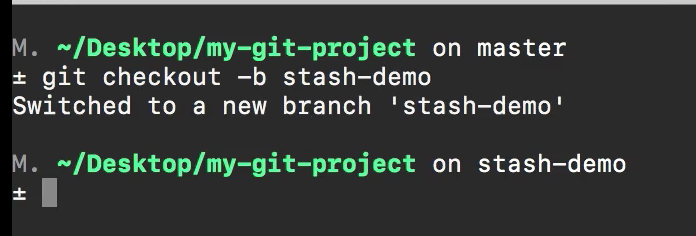
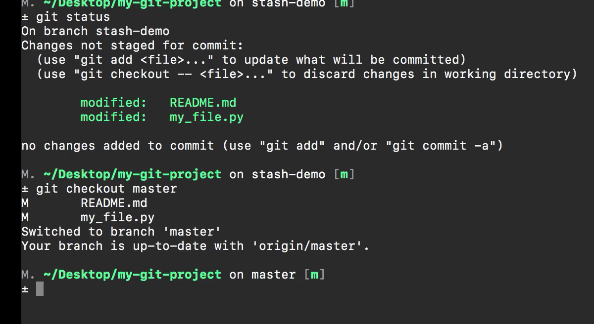
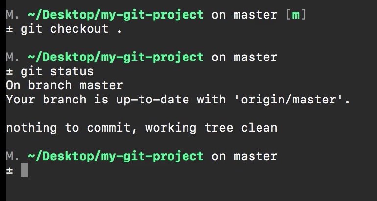
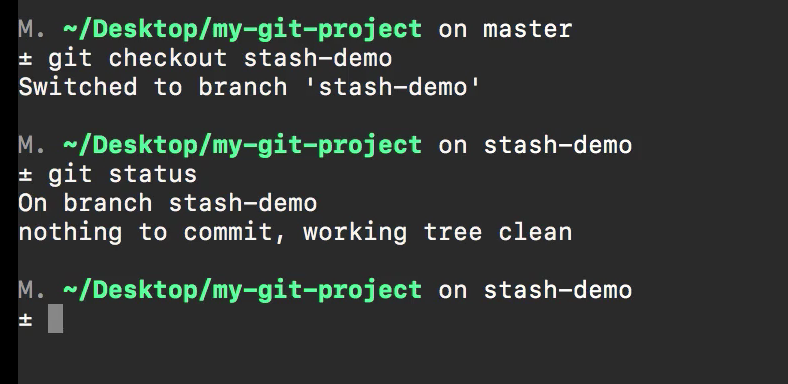
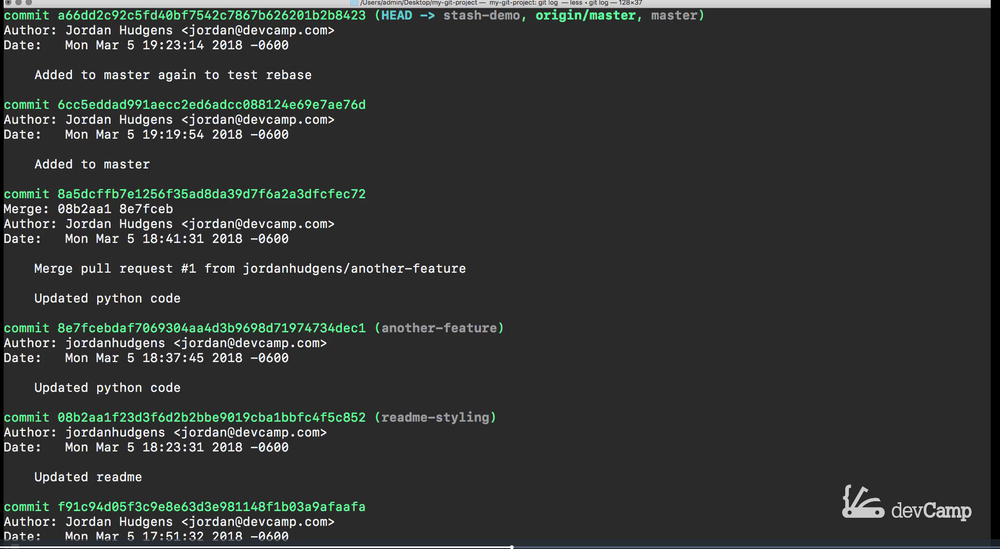
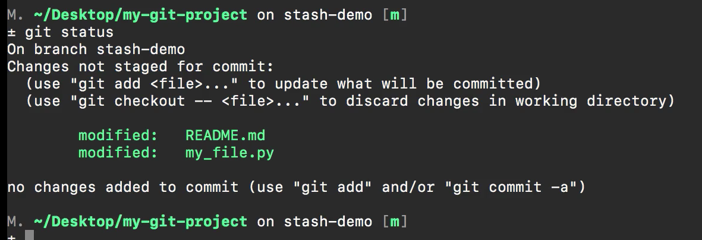

# MODULE 06-013:    Git (3)

### Stash

---

---

## Video Lesson Speech

In this guide, we're going to walk through how we can use git stash to 
work with branches and so I'm going to start off by creating a new 
branch for this.

****

I'm gonna say `git checkout  -b stash-demo`. So this is going to place us in this stash demo branch 

and I'll make a few changes so I could come right here to my python code add a new line come to the readme and duplicate this. 

So now if I close this out and I look at the changes you can see that I have a couple of changes to the files and the changes themselves do not matter. Just imagine that you have started a feature build and you're not ready to make a comment because of watch what happens. Imagine you get a call and there is a problem on the master branch and you need to very quickly go and make a fix. If you type right here without typing a commit message `git checkout master`.

 You're going to see that if I type `git status` it actually has brought in those changes on master and this is definitely not what you want to do. 

So I'm going to remove those changes so I can say `git checkout .` and now if I type 'git status' everything is back and is in normal working condition. 

Now if I say `git checkout stash demo` and type `git status` it removed those different changes we made. 

So that's not really the workflow we want because that's going to create some confusion because we brought some changes into the master branch that we didn't want we wanted to keep them secluded and isolated just in this stash demo branch. But simultaneously we had only started our work here so it wasn't really in the right spot for us to do `git add` and to go and create a commit message. Remember every time that you create a commit you are creating a benchmark in time that you may want to revert back to and with just a couple small changes you may not be ready to create that version. So that's where `git stash` comes in. So let's go back here and let's come and make a few of those changes again. So make one in the python file and the readme file. 

So we are back to having our changes here. Now let's recreate the entire scenario, where we need to switch into a master and work on the master branch. What I can do is I can type `git stash` and then just type return and now if I type `git status`  you can see that it says we're on the stash demo branch but there's nothing to commit and the working tree is clean so we didn't create a commit message

 

You can see I have not added anything to the commit list and nothing's added to the history. If I go and I type `git checkout master` I can make any kind of changes that I want here so I can come to make all the changes to implement the bug fix. Everything's good to go. And then once I'm done I'm ready to start working on my feature again. I can then just switch back to the branch stash-demo. I'm back here and so where do we get our code. Because if I open this up you may notice that it does not have any of the changes that we made. And that's because they are stashed. We have taken those changes and we place them into almost like this holding pattern where they are logged inside of the branch but we need to tell git to bring them back and so if you want to see what is available you can type `git stash list` and it's going to show you that there is some code stashed in it says WIPA which stands for work in progress on stash demo and then it said as it was added to master again to test rebase that is simply giving you the point in time the last commit message that we had. 

So this is the way that you can see the full list of stashes and then if you want to see what those changes were you can say `git stash show` and so you can see that what is included inside that stash is a change to the readme and a change to the python file. 

So if we want to take that and bring it back into our codebase we can say `git stash apply`. Now as you can see it brought those back.

If I type `git status` everything is back and I can go look at the file and you can see that all of our changes are right where they're supposed to be. 

Now one quick caveat here I'm going to add this so I'll say `git add .`, `git commit -m "Ran through stash-demo"` and if you type `git stash list` you can see that our stash is still there and this can create some confusion if you have stashed one time and then you forget to clear it out and delete that stashed item and it can create some problems in the future. So make sure that whenever you are done and you've brought the code back in from that stash that you type `git stash clear` and now if I say `git stash list` you'll see there's no output because we cleared that stash because we already brought our code directly into the repo and we're working with it. 

