# MODULE 06-014:    Git (3)

### Fetch VS Pull

---

## Differences

| Feature       | `git fetch`                         | `git pull`                   |
| ------------- | ----------------------------------- | ---------------------------- |
| Action        | Downloads changes but doesn't merge | Downloads AND merges changes |
| Safety        | Safer - lets you review first       | Riskier - automatic merge    |
| Workflow      | Two-step process (fetch then merge) | Single-step process          |
| Local Changes | Preserves your local work           | May cause merge conflicts    |

## ****

## When to Use Each

### Use `git fetch` when:

- Working on complex features

- Multiple developers are contributing

- You want to review changes before merging

- You anticipate merge conflicts

- Working on critical production code

### Use `git pull` when:

- Working alone on a simple project

- You're sure remote changes won't conflict

- You want a quick sync with remote

- Working on non-critical features

## How They Work

### `git pull` = `git fetch` + `git merge`

- Automatically brings down remote changes

- Immediately merges them into your local branch

- Can create unexpected merge conflicts

### `git fetch` + manual merge

1. `git fetch` downloads remote changes

2. `git diff` lets you review changes

3. `git merge origin/branch` merges when ready

## ****

## Step-by-Step Examples

### `git pull` Example

```bash
# Simple update of local branch
git checkout main
git pull origin main
```

### `git fetch` Example

```bash
# Safer approach for team environments
git fetch origin  # Download changes
git diff origin/main  # Review changes
git merge origin/main  # Merge when ready
```

****

## Best Practices

1. **Default to fetch-first workflow** - Especially in team environments

2. **Review before merging** - Always check what you're merging

3. **Use pull for simple updates** - When you're certain of no conflicts

4. **Clean working directory** - Stash or commit changes before both operations

## Handling Diverged Branches

When you see

```bash
Your branch and 'origin/main' have diverged,
and have 1 and 1 different commits each, respectively.
```

Recommended approach:

```bash
git fetch  # Get latest changes
git log --all --graph --oneline  # Visualize differences
git merge origin/main  # Merge remote changes
# OR for cleaner history:
git rebase origin/main  # Replay your commits on top
```

****

## Common Scenarios

### Scenario 1: Safe Update

```bash
git fetch
git merge origin/main
```

### Scenario 2: Conflict Resolution

```bash
git fetch
git diff origin/main  # Identify conflicts
# Manually resolve conflicts in files
git add .
git commit -m "Resolved merge conflicts"
```

### Scenario 3: Quick Sync

```bash
git pull  # Only when you're sure of no issues
```

****

## Resources

* [Git - git-pull Documentation](https://git-scm.com/docs/git-pull)

* [Git - git-push Documentation](https://git-scm.com/docs/git-push)

---

## Video Lesson Speech

In this lesson, we're going to walk through the differences between git 
fetch and git pull. And I think one of the easiest ways of seeing what 
the difference is is by going and walking through an example.

****

So that's what we are going to do. We've already talked about what `git pull` does `git pull` brings down all of the changed code from whatever branch that we're wanting to pull down so many times that can be the master branch so if I have some changes that have been made to the master branch right here I can come and let's make those changes. So I will say 

```
made changes for git pull demo
```

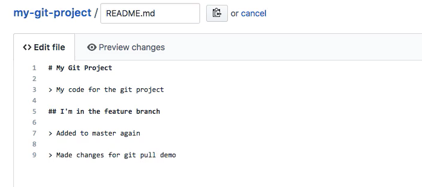


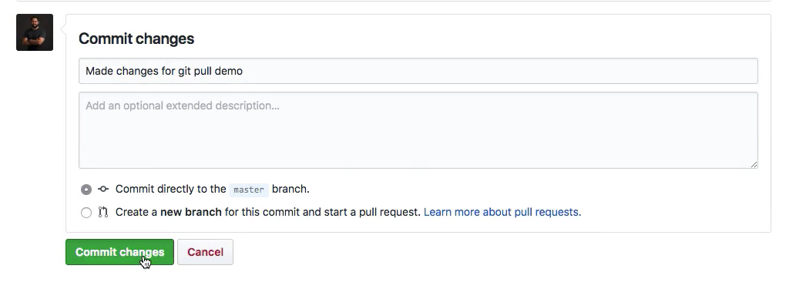

So if I come back now let's switch to the master branch 

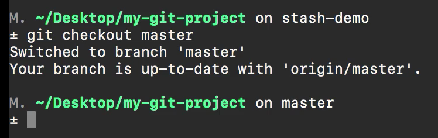

and if I type `git pull` what's going to happen is it's going to bring down those latest changes and it is also going to automatically update the file. 

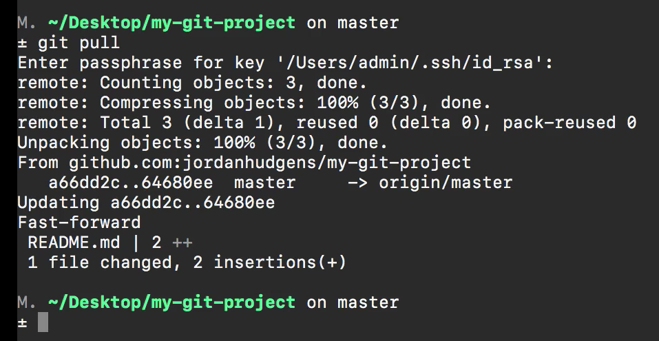

So if I look inside of the readme now you can see that it says made changes for the `git pull` demos. 

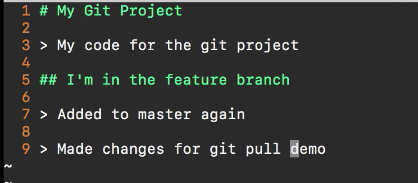

So those changes were made and they were automatically applied. So that is `git pull` and whenever you have completely kind of application where you're either doing all of the work yourself or maybe it's something where there's not a ton of other developers out there and you haven't made a lot of changes to your local version `git pull` can work. 

But imagine a scenario like this where we have already made a few changes ourselves on our local machines so I can say my file and let's just duplicate this python function. 

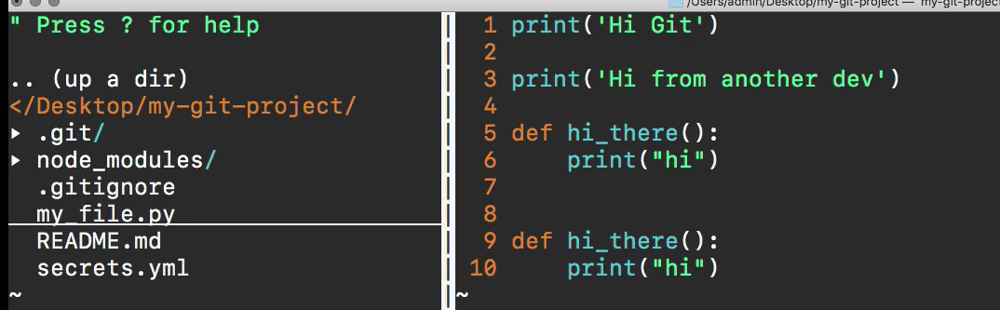

I'm g

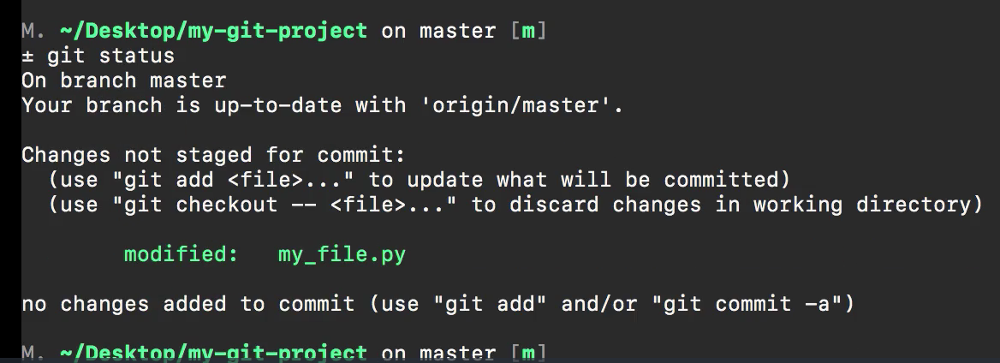

So I have a different version on my local machine then we have up here so I'm going to come right here and I'm going to create and go through the full `git add` and `git commit` process.

```bash
git add .
git commit -m "Added new python function"
```

So now what I can do is switch back and add one more change. So we'll just copy this in the readme

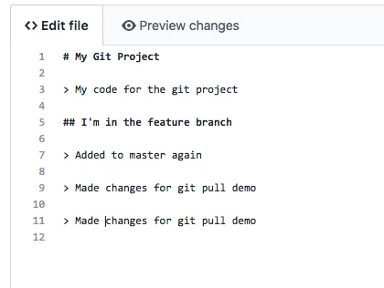

and say made more changes for the `git pull` demo and I will say `git pull/fetch` just to make it clear what we


and if I type `git status` I don't have any changes. But now notice it says your branch and origin master have diverged and have 1 and 1 different commits each respectively. 


Use `git pull` to merge the remote branch into yours nothing to commit working tree clean. 

Okay well, that's fine it'

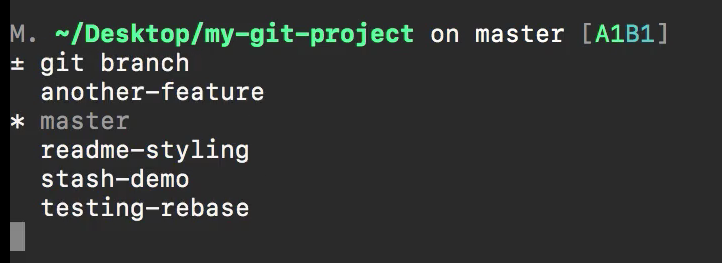


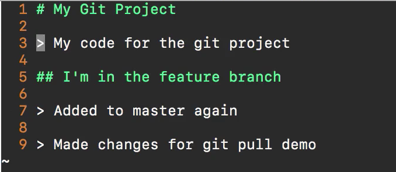

It didn't say made more changes so that is giving us our best hint on what's happening. `Git fetch` does not automatically override the code that we have locally. So now that we see that it hasn't made any changes how can we actually merge this in. Well, let's type `git status` once again just to make sure we don't have any changes and also to get that message. 

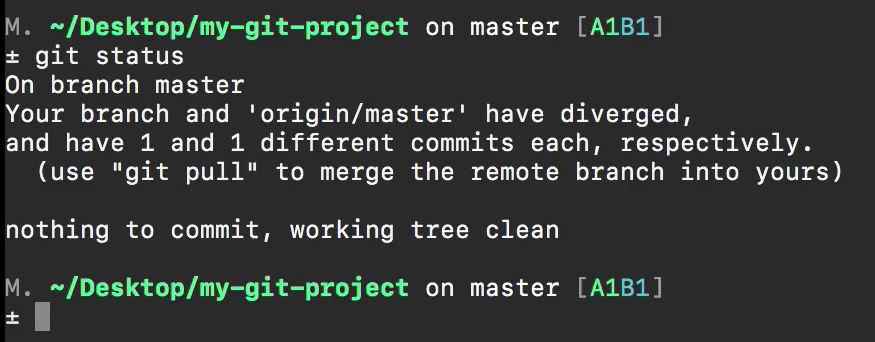

So notice how it gives us a little bit of a hint here where it says your branch and origin master. So that means that our local branch and then origin master. This is our remote origins the name of the remote and then master have diverged so we could just run `git pull` but I'm going to show you a different way of doing it. 

What you can do and this is considered more of the best practice is you can say

```bash
git merge origin/master
```

and we know to do this because that's exactly what it says right here.

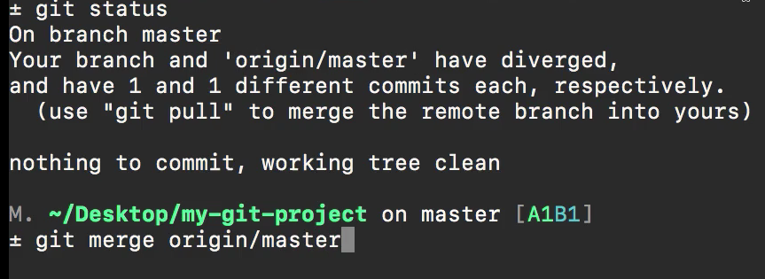

So now we can say `gi

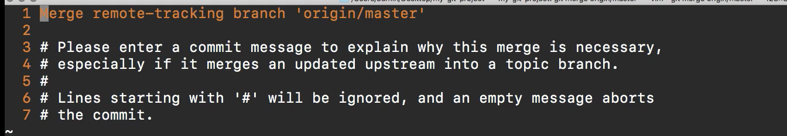

So let's walk through it. It says merge remote-tracking branch origin master please enter a commit message to explain why this merge is necessary especially if it merges an updated upstream into a topic branch. Do not worry about keywords like updated upstream because we're going to get into that later. Just know it's asking for us to add some details on wh

So this is where we explain why it is necessary and so we can say 

```text
Merged in a remote master with local master changes
```

and typically you'd add what kind of features you're working on right now we're just saying that we're merging that in. 

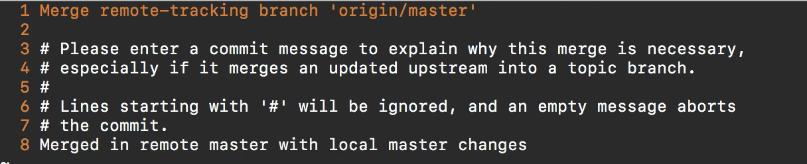

I'm going to save that and now if I type `git status` everything is clean but it says your branch is ahead of origin master by 2 commits and for the moment of truth. Let's open up that readme file and now you can see that the made more changes for git pull/fetch demo is life so I'm going to close this out and all we have to do now is type `git push` type the passphrase in and then everything is going to be sync up if you switch back to Google Chrome here. Nothing has changed in this file but if you then go to my project and click on commits you'll see that we have two new commits

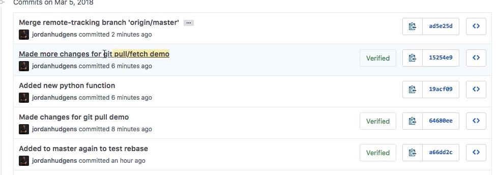

we have made more changes for a git pull/fetch demo and then we also have the main one here. This was our local change or we added a new Python function. And then lastly we have and this is our most up to date one. The merge remote-tracking branch. So this gives the little description we added where he said merged in remote master with the local master changes and so if I click on this-this is going to show that it brought in those changes. 

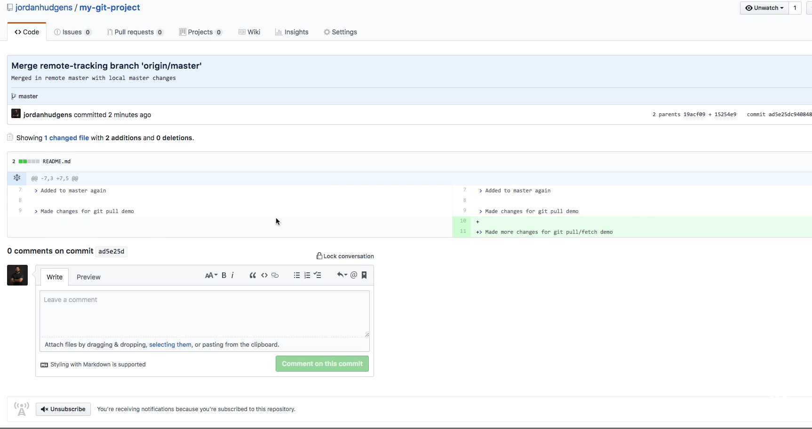

So this merged our remote copy of origin master with our local one. Now you may be curious and be wondering why in the world did we just have to go through all of those steps. When `git pull` did that for us automatically. And that's a great question because in the example I just gave. It's perfectly fine to run `git pull` if you know the files that were chang

That tells us that there were changes and then it allows you to then merge it manually and when you know that there is going to be a merge conflict so when you have a large number of files and you know there's going to be issues and some conflicts where you and another developer both ran into or both worked on the same files and the same lines than doing this process where you do fetch and then merge that allows you to do is to have much more granular control over fixing those conflicts and later on in our section on managing merged conflicts then this is going to make even more sense and is going to be a little bit more clear on why you'd want to use fetch and merge where `git pull` is a little bit of a more generic tool. Where it's performing a few different processes for you all at one time which is good in certain circumstances but then in others when you know there's going to be merge conflicts then it will create a problem. So part of this guide is giving you a little bit of a preview of how you can manage your different merges especially on larger projects and give you more control. 
