# MODULE 06-016:    Git (3)

### Resolving Git Merge conflicts

---

---

## Video Lesson Speech

When it comes to working with Git one of the most intimidating elements 
of the entire learning curve is how to manage git merged conflicts.

****

What a git merge conflict is when you and typically another team member had made changes to the same file and many times to the very same line of code and having to work through how you resolve that. I've seen developers close to tears on having to properly manage a merge conflict it can be incredibly frustrating. In this guide what my goal is is to make the entire merge conflict process as straightforward as possible so we're going to walk through an example and we're going to see exactly how you can not only fix merge conflicts but understand what's happening under the hood. What we're going to do is we're going to make a few changes and then we're going to compare how the changes are reflected from the developer who made the changes here. So we're going to make them on the live repository and then we're going to see how we can pull those down and fix those merge conflicts. So right here let's make changes and we do this to two files because it's been my experience that managing one merge conflict is not the most difficult thing but the real problem and the real frustration comes in when you're having to do it across multiple files. So that's exactly what we're going to do. So I am gonna open up this ReadMe file here and we're going to make a change to this very first line that's not the heading. 

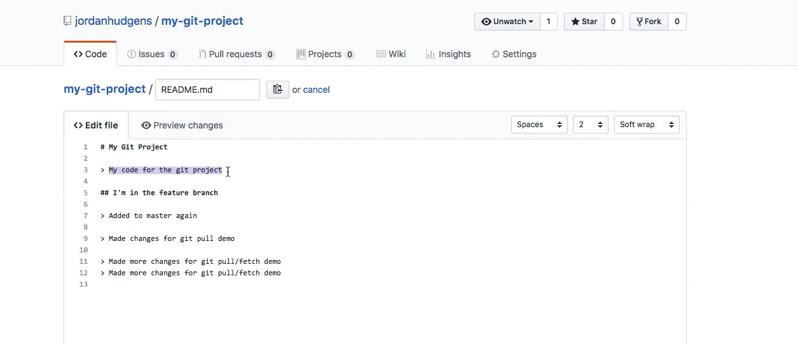

So my code for the git project is I'm going to say 'my scary merge conflict code' and let's come down here we'll create one commit. So we'll say updated readme for merge conflict demo and copy this because I mean I use a similar one when we make a change to a different file. 

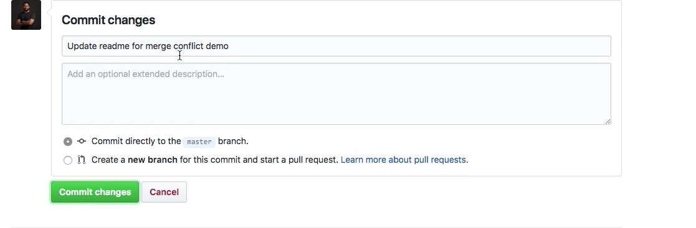

So that's been changed and you can see it right here. 

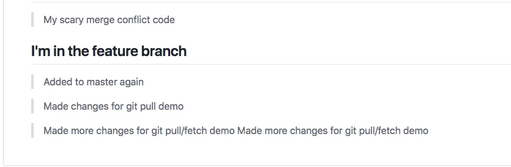

Now if I come back let's make a similar change to the python file 

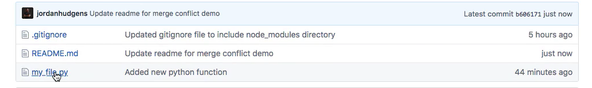

so I'm going to come here instead of saying hi there and print out hi I'm going to say 'update python function with merge conflict'

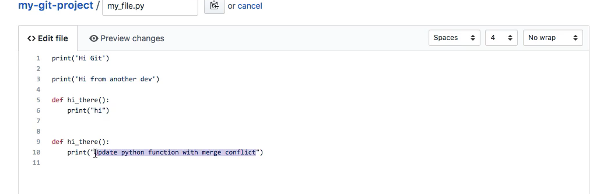

 then come down add a commit message here change that. 

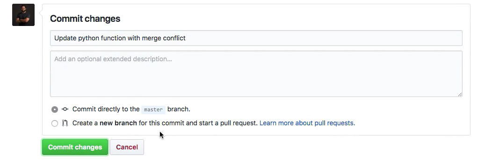

We have successfully added a couple of changes to the master repo. Now imagine a scenario where you are working and you have made changes to the exact same lines. So you're working locally and you have no idea what your coworkers doing.  And so you're going to say 'my innocent little change'

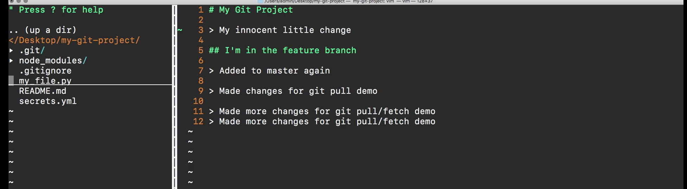

and then have you come down to the python function instead of hi there I'll say 'my local change'.

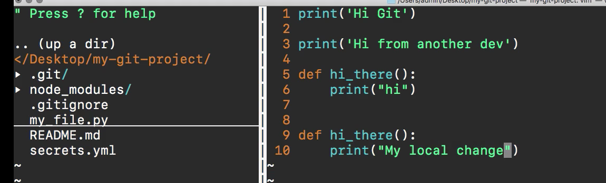

So we've added those changes. If I type git status 

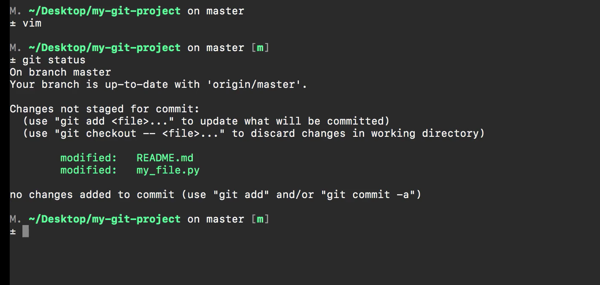

you can see we have both of those files and now I'm going to add both of them into a new commit message. So say 

```bash
git add .
git commit -m "Updated readme and python script"
```

and it seems like everything is good but we actually have a problem because now we have made changes to the exact same lines that our coworker made changes on and so what's going to happen if I type git fetch and so I say 

```bash
git fetch origin
```

is going to bring down origin which because we only have one remote if I just typed git fetch It would also bring this down but I'm going to say 'git fetch origin'. Now, this is going to bring down the code. 

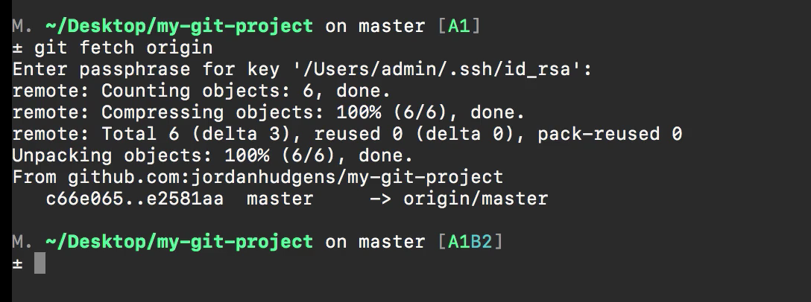

So I type my passphrase in and so it's bringing it and if I type git status you can see it says your branch and origin master have diverged and have 1 and 2 different commits each respectively.

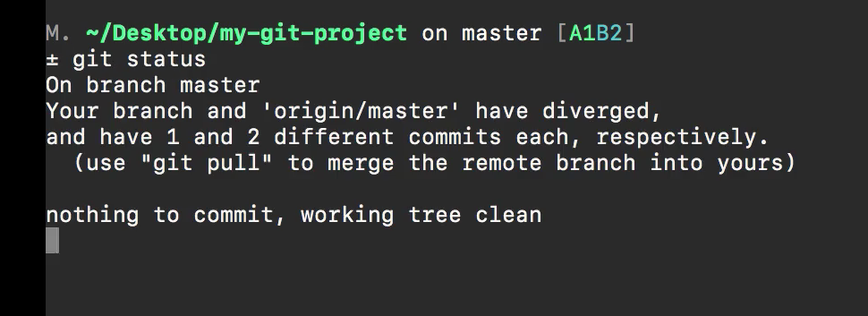

So if you went through my guide where I talked about the difference between 'git fetch' and 'git pull' then you know that the next step is going to be the merge process and that's part of the reason why I typically like to use git fetch if I'm working with the team and I know that merge conflicts may arise because it breaks a step in two. So right now I have the code locally on my machine but I have not attempted the merge yet. Whereas if I wrote git pull then I would have already run into that merge conflict because it tries to merge and fetch at the same time, this splits the steps out. So now if I say 

```bash
git merge origin/master. 
```

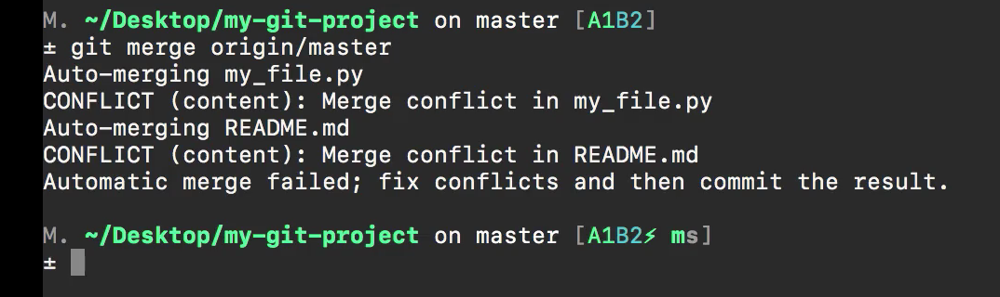

Now, this is where the merging conflict is going to occur. It says auto-merging my_file and then you can see that it throws a conflict and it's a content conflict and says merge conflict in this file and then it does the exact same thing right here. So it's an automatic merge failed to fix conflicts and then commit the result. So if I type git status you can see that both of these files say that both have been modified. 

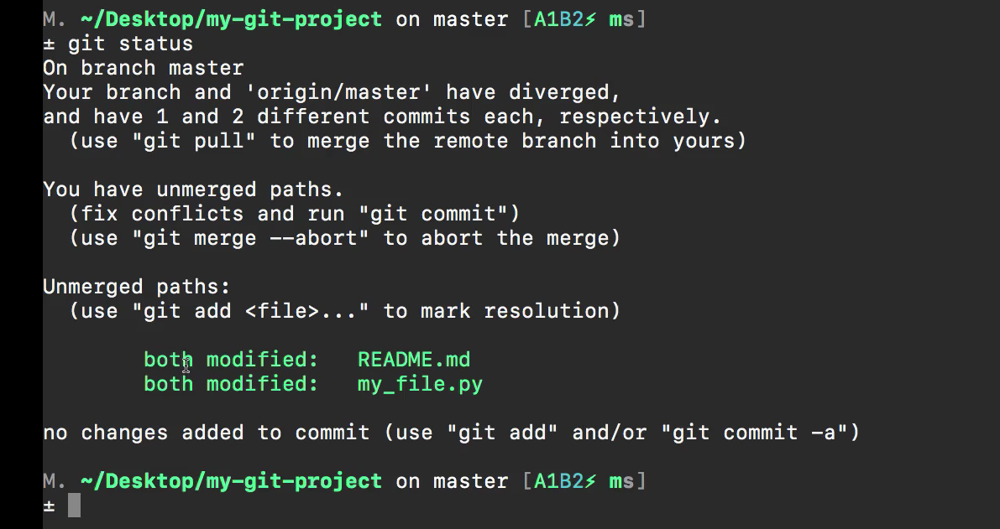

Now this kind of is a little bit confusing when it says both modified here. It doesn't mean both of these files. It means that our local version was modified and so was the remote version. So it suggests telling us that that is the issue and these items need to be fixed. These conflicts need to be fixed and so whenever you see what I'm going to show you next. It looks a little bit scary so I'm going to open up the first one and so if you've never seen a merge conflict before this could be very intimidating because what are all of these types of symbols here and it says head and then we have this origin master and all of these crazy equal signs this could be pretty intimidating but one of my biggest goals with this guide is to make the process a little bit less scary because I want you to realize that a merge conflict is its git is doing its job. 

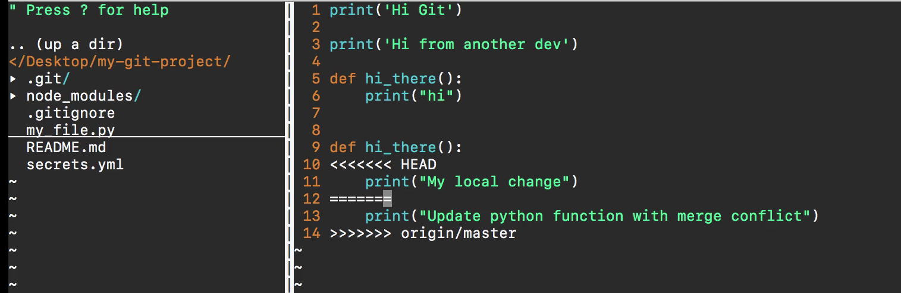

Its git is saying that hey we had two files that had different changes in the same location. We want to give you a choice on which one to take. And so right here we can see that my local change is going to be on the top and the way we know that besides the fact that we know the change we made is because it says head. So this means the local version that we are working on because it is at the head of the comments. Now when you come down and you see these equal signs what this means is that everything between head and the equal signs this is our set of code changes. Everything below the equal signs and where it says origin master this is what we brought down and so what we have now is a choice we can choose to use our own version of the code or we can say oh you know what the work that my partner did was actually better than my work. So let's keep it. So in order to clean it up all you have to do is remove the elements that you don't want. So in this case for our first example let's remove our local changes and then from there. Delete this line and this line. 

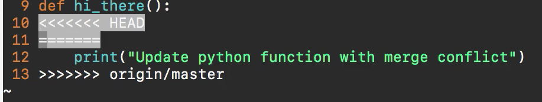

So all of these symbols are really just here to help you know exactly where the conflict occurred and then delete this and we can save the file and our merge conflict is completely resolved for that file. So this is exactly what we needed to do. Now let's come to the readme so we can see another example and you can see that it's the exact same process at the very top. It says head which means that this is our set of code changes. And then once we get to the equal sign everything below that to where it says origin master is our co-workers did. 

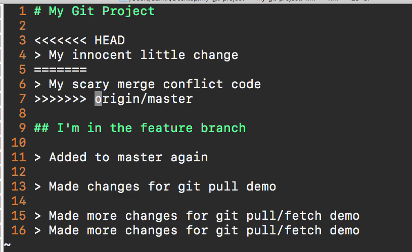

So all I have to do if I want to keep my changes which in this example I will delete where it says head and then I delete these three lines. Now if I hit save and type git status now you can see it says both modified. 

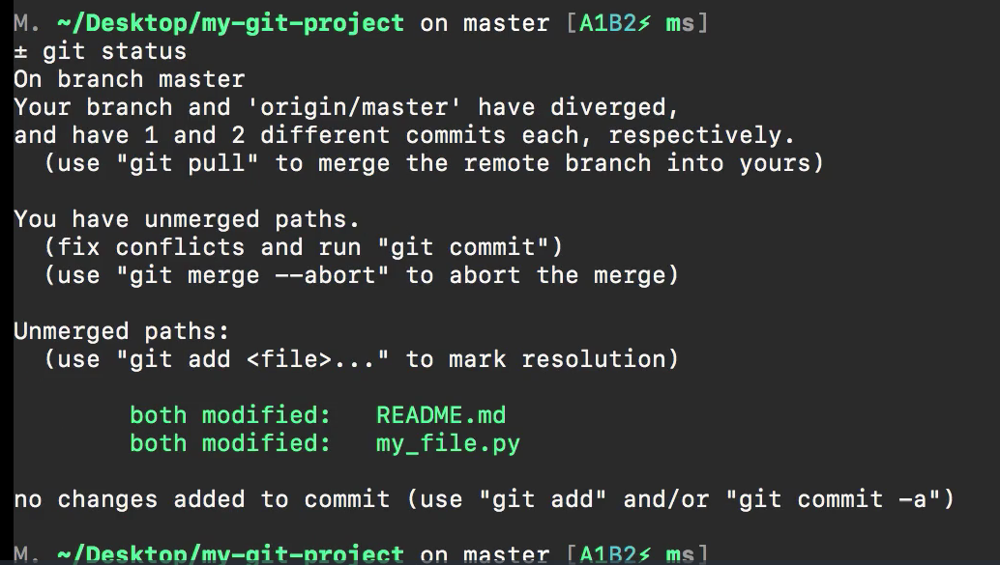

But now we've fixed our issues and so now I can say 

```bash
git add .
git commit -m "Fixed merge conflicts"
git push
```

and push this up to the remote repository everything is now working and so if I come here and let's come to the repo you can see that my innocent little change. 

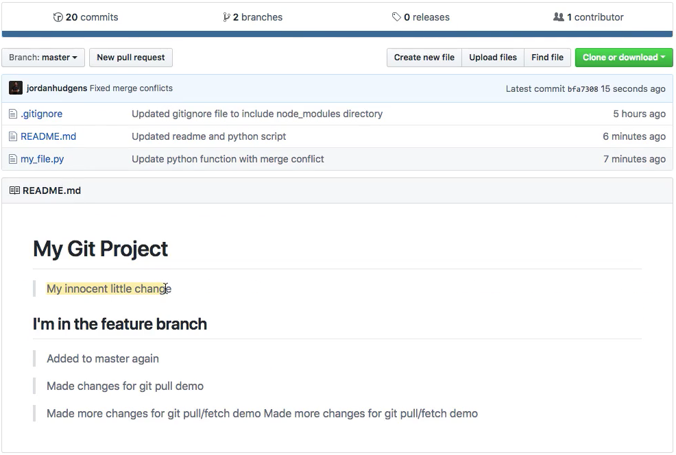

This is the one that got capped and this is now what is on the live master branch and if we come into the python file here you can see that right here it says update python function with the merge conflict 

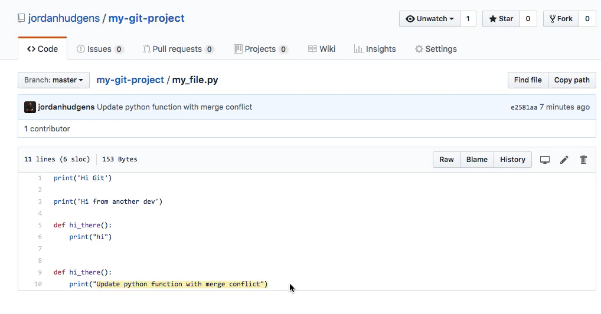

which is what our coworker did. So this is us going through the entire merge conflict process and picking out the items we want. So I hope that helps. If you're currently watching this video and you're using it for reference because you are going through a merge conflict battle right now. Hopefully, this helps to streamline the entire workflow for you. The merge conflict is not a bad thing and maybe very frustrating it may be annoying to deal with that but at the end of the day its git doing its job.  Git gives you the ability to pick and choose what you want to keep and what you want to get rid of. And so this is the workflow that you can follow whenever you want to resolve those merged conflicts. 
