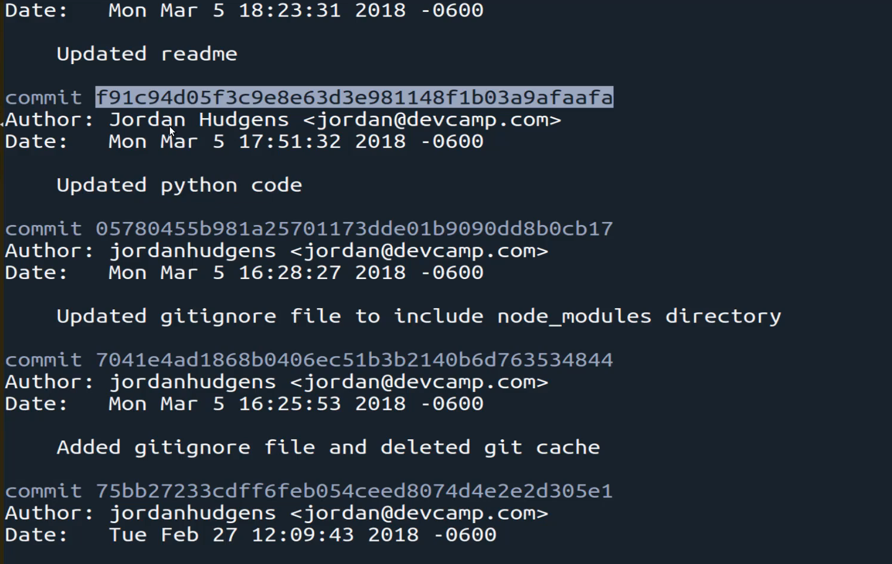

# MODULE 06-018:    Git (3)

### Reverting a single file to a previous version

---

---

## Video Lesson Speech

In the last guide, we walked through how we were able to revert any 
changes that we're making on our project back to the previous commit and
 that is going to be a very common way that you use git.

****

However, that doesn't really address the issue of reverting a file back to a previous version and that's going to also be a process that you're going to need to be familiar with because this speaks directly to one of the top reasons why we use version control. 

So let's imagine a scenario where we have our my_file.py and we know that we've made a mistake. It wasn't recent it was something that may have occurred weeks ago or even months ago. Well, what we can do is we can tell the entire system to revert back to a previous version if you remember back to when we were walking through the diagrams and we had each one of those little objects that represented a version. 

Well, the entire reason we use git or a big reason why we do it so that we can talk to a file and say you know what we want to go back in time and we want to revert this entire file back to a previous time where it was working. And so that's going to be something you're going to be doing quite a bit so in this guide we're going to walk through how to do that. 

I'm gonna start off by copying that file just so after we have walked through the process. We can look at it side by side and see what's going on with it. So I'm going to copy my file and just create one called a demo_file.py and now the syntax for doing this is going to be that we need to get the commit ID so I'll say git log and this is going to bring up the full log for the project and also just a little key because I have not mentioned it yet and if you've never worked with a tool like this before you may not know how to navigate around yet and that's perfectly fine the way that you can navigate through a git log file is to use the J key for moving down and then the K key on the keyboard for moving up and then whenever you want to quit you just type the letter Q and that will allow you to quit. 

So I'm going to go down and also if you want to get all the way to the very end of the file you type shift G and that will take you all the way down. And so now that we have that little navigation tutorial lets actually come and grab our updated code or the version we want to switch to. 

So we need to grab the comment and copy it.

 

And let's quit out of git log and the syntax for doing this is going to be typing git checkout paste in that full commit ID hash dash dash followed by the path to the file.

Now just file by itself won't work if you have it nested inside of other directories so make sure that you give the full path to the file here and then type enter. 

Now if I type git status now this is going to show that we have modified that file which is interesting because technically we haven't touched that code but because we reverted that file back the way that git treats it is just like we when in made the changes and then it adds it as changes that you can commit. I really like the flow that the creators of git did when they built this out because it's not this different process that you have to learn. Whenever you want to revert a file you can treat it just like you are the one that made the changes to the file. 

Now let's open this up just to confirm that it actually worked so you can see that this file is now completely different and if we open it up compare it to the demo file on the other side you can see the demo file is the way that our python file my file was just a minute ago but now it's been completely reverted to the previous time in history where we only had these 3 lines of code so this worked perfectly.

Now I'm going to remove that demo file since we don't need to anymore and the way that we can update the site is just by going through the same process again and say git add all git commit and say reverted back to and then usually you're going to do something like paste in the hash for my_file.py that I just so it's very explicit. 

Later on, in a future guide, I'll show you how you can add even more detail to your commit messages. But right now we can just do it like this and hit save and you can see that it followed the exact same process that we did before and if I type git push now it's going to go through. 

Push it up to the remote repository if you hit refresh and come down to my_file.py you can see it has been reverted back perfectly. 

So this is how you can revert back to a previous version of the file by using git.
