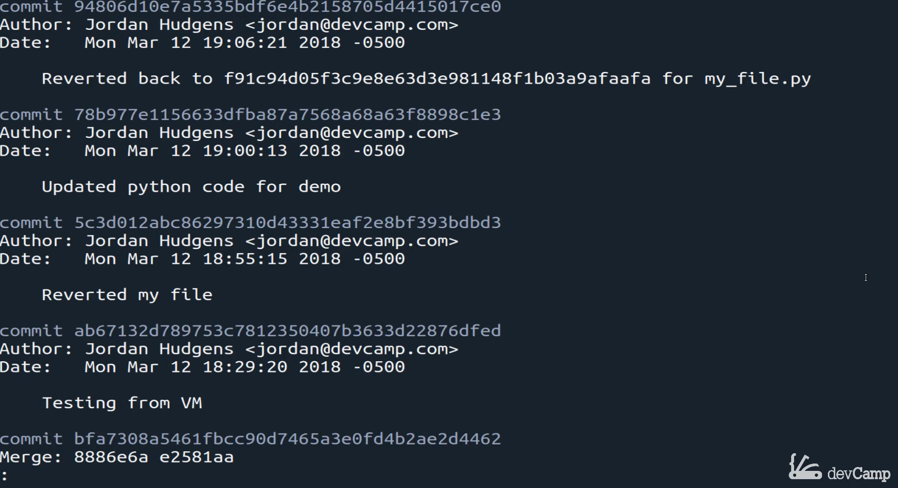
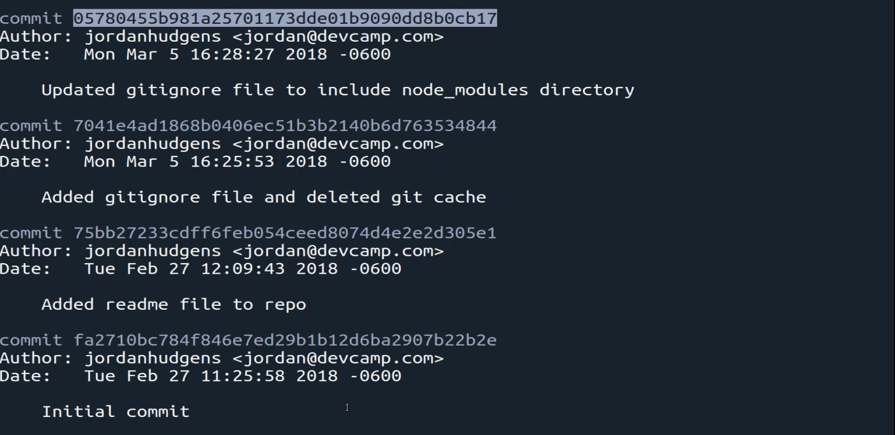
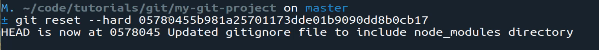
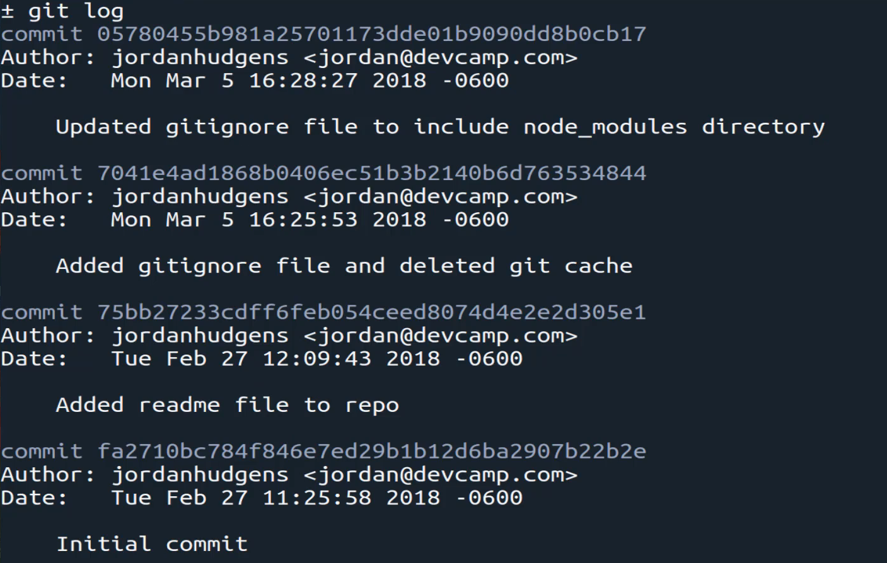
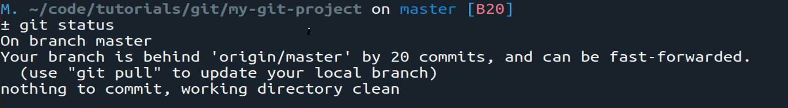
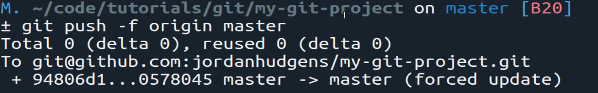
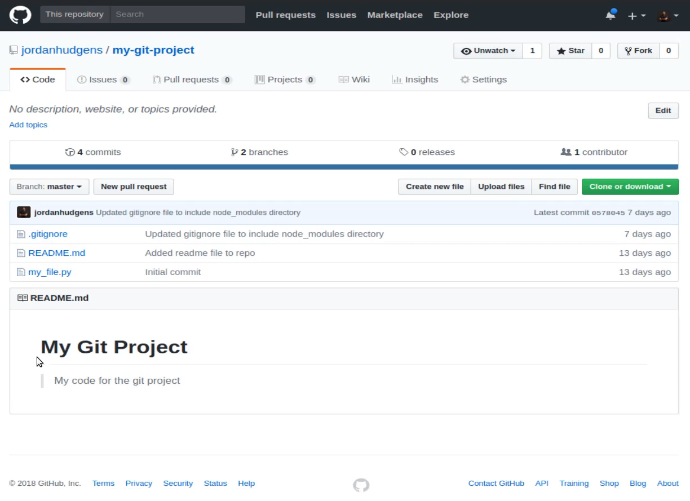

# MODULE 06-020:    Git (3)

### Reverting an entire project

---

---

## Video Lesson Speech

So far in this section of the course, we've walked through a number of 
ways where you can revert your code back to previous versions. This 
includes everything from simply removing any of the latest changes that 
you're currently working on all the way through to permanently reverting
 files back to previous versions.

****

I want to add a caveat before I go into the rest of this guide and that is that everything you've learned so far in this section is really all you're going to need to know to work with versions and reverting back inside of your projects. 

What we're going to talk about is one of the more dangerous concepts when it comes to reverting and because of that you really need to be careful with when you are attempting it and that is how we can revert our entire project back to a previous version and even how we can update the remote repository with these changes. 

Now, this is not going to be something that you should be doing very often. It is a rare thing and the main reason is because you are essentially rewriting history in the sense where you are taking and removing an entire chunk of time it could be two commits it could be 20 commits and when you go when you look at the history you're going to see all of those changes were completely removed. Now, this gets even more dangerous when you're working on a team because if you're working on a team then you could have all you could cause all kinds of conflicts if you were to do something like this. 

So this should be very isolated it is much smarter to simply go through the processes we've already walked through picking out your select files that you want to revert back to and that way you do not risk changing the entire history of your project because what we're going to do is we're going to reset the head pointer here.

If I type git log in here you can see that head is currently pointed at the very top commit there and if you go down through all these lines you can see we have a decent number of commits all the way going back all the way to the initial commit.



Now as you're going to see when we reset and we revert the entire project to a different version. All of those comments above the one that we are going to select will all go away. And so there are technically ways of getting them back but that goes into some very messy kind of topics that we want to try to avoid as much as possible. 

So I'm going to quit out of this and we are going to do exactly what we said because I want you to be familiar with it. And the other reason is because what I've discovered is that many times new developers and students are just learning git they may just be working on their own standalone projects so performing a task like this may be something that is needed.

And so I'm going to come here and let's perform our full investigation. So if I come and grab this comment right here and copy it let's check it out. 



So I'm going to make sure we don't have any other branches so git branch I only have master so I can say git check out paste this in and then call investigation. One other note here investigations just what I call it because there is nothing magical about the keyword it's not reserved or anything like that the reason why you do it is so that I know beyond a shadow of a doubt that this branch's goal is just to allow me to investigate the code inside it's not a feature branch or anything like that. 

So if I go and I look at this and I look at the code I can see git ignore file has these two elements secrets.yml and node_modules/ my_file.py for Python only has one and then the readme is pretty basic and so now if I go switch and look at the master branch I can see git ignore is the same my_file.py has two lines instead of one and then we have 13 lines instead of 3 for the readme. So this is going to go back in time it's going to revert all the changes that are different so in this case you'll just be with the python file and the read me. 

And so the way that we can do this is we can type `git reset --head` and then paste in the entire commit. So this is going to paste in the version ID or the commit ID that we had and that's it. So if I type enter here and it looks like I might add a spelling mistake get reset.

Oh, and it's not head. Sorry, it's hard. So 

```bash
git reset --hard (your commit id)
```

Run that and now you can see it has pointed head at a different ID and it's the one that we pasted in and as you can see we have 0 5 7 8 and that's exactly what we have right here. 



So it updated the git ignore file to include node modules directory. So this is taking us all the way back in time. If I type git log now you can see that this has reverted it all the way back to where now we only have these four commits. 



So if we look at the project and we see git ignore is still there my file now only has one and read me only has those three lines so this is working properly. 

Now you may think that you could just push this up so you type git status. You can see that there's no change so there's nothing that we need to commit or anything like that but it does say that the branches behind origin master by 20 commits and so and it can be fast-forwarded. 



Now it is saying to use git pull to update the local branch but if you did that what that would do is it would simply bring back all of the 20 comments that we just removed. So that's not what we're looking to do. This next command is called a force command. So I can say `git push -f` and then `origin master`. 

So I'm going with the remote name followed by the branch name and if I hit push this is going to force this up 



Now if I switch to Google Chrome you can see that we have all of these changes right here. And then we have the python changes everything here is the latest version before we perform the revert. And if I hit refresh you can see it has been reverted back. 



So our python file now only has the one line and then we only have what we had a few weeks ago here. So that worked perfectly assuming that you do want to push that back. And also if you come up here and click on commits you can see that it has taken our entire project back in time. So if that is something that you want to do just always be 100 percent certain you know exactly what you're doing.

Typically what I've discovered is that when I use this in practice it's usually when I have a new or almost new application I don't have any other developers working on it with me. I simply am testing a few things out it might be a very small service or small application. I'm working on and it doesn't have any consequences by going back in time and reverting back to a previous version. 

You would really never want to do this on a large project where you're collaborating with a number of team members because if you imagine a scenario where you did exactly what we just walked through and you had 20 members on your team they are not going to have that set of changes. So they're still going to have those missing 20 commits and if you do not coordinate with them on those changes then they're going to try to push up some new code changes with those extra 20 commits and then you are going to end up in a situation that is really not very fun where you are needing to figure out what code to keep and what not to keep.

So all of that to say that is how you can reverse the entire project back to a previous version but just be careful whenever you do that. 
