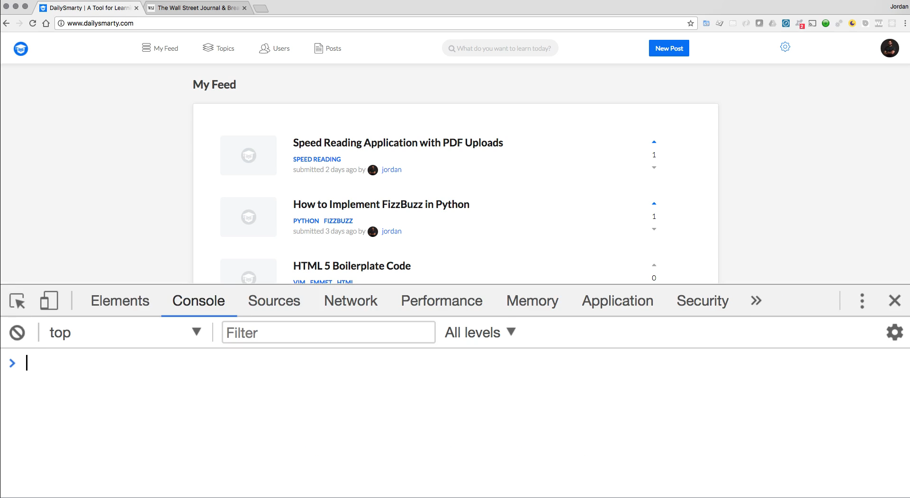
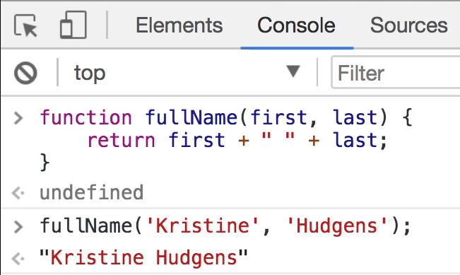
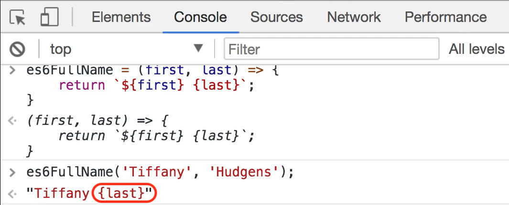
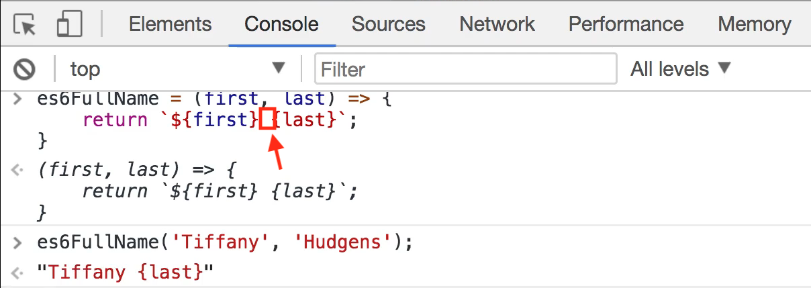

# Module 06 - 106:    Browser Console

## Running ext. scripts in browser console

The browser console, as we have previously seen and used, is a built-in development tool that allows you to:

- Execute JavaScript code in real-time

- Debug and test code snippets

- View errors and warnings

- Interact with webpage elements

- Monitor network activity

Therefore, the browser console is one of JavaScript's most powerful features, enabling rapid prototyping and debugging directly in the browser environment.

****

1. **Direct JavaScript Execution**
   
   - Run any valid JavaScript code immediately
   
   - Supports modern ES6+ syntax (arrow functions, template literals, etc.)
   
   - Test functions and algorithms without creating files

2. **Cross-Browser Compatibility**
   
   - Available in all major browsers (Chrome, Firefox, Safari, Edge)
   
   - Similar functionality across browsers
   
   - Slight differences in advanced features

****

## Opening Console using many browsers

| Browser | Windows/Linux Shortcut | Mac Shortcut |
| ------- | ---------------------- | ------------ |
| Chrome  | Ctrl+Shift+J           | Cmd+Opt+J    |
| Firefox | Ctrl+Shift+K           | Cmd+Opt+K    |
| Edge    | Ctrl+Shift+J           | Cmd+Opt+J    |
| Safari  | Ctrl+Shift+C           | Cmd+Opt+C    |

****

## Practical Examples

### Basic Function Example

```js
function fullName(first, last) {

  return `${first} ${last}`;

}

fullName('Kristine', 'Hudgens');
```

### ES6 Arrow Function Example

```js
const newFullName = (first, last) => {

  return `${first} ${last}`;

}
newFullName('Tiffany', 'Hudgens');
```

****

## When to use

1. **Quick Testing**
   
   - Test small code snippets
   
   - Experiment with new JavaScript features
   
   - Verify function outputs

2. **Debugging**
   
   - Check variable values
   
   - Test expressions
   
   - Identify errors in your code

3. **DOM Manipulation**
   
   - Select and modify page elements
   
   - Test selectors before adding to your code
   
   - Experiment with event handlers

****

## Best Practices

1. **Use Modern Syntax** - Most modern browsers support ES6+ features

2. **Clear the Console** - Use `console.clear()` or Ctrl+L to keep your workspace clean

3. **Check for Errors** - Always verify your code syntax before execution

4. **Use Console Methods** - Leverage `console.log()`, `console.warn()`, etc. for better debugging

****

## Limitations

- Code executed in console is temporary (not saved)

- Limited to client-side JavaScript capabilities

- No direct file system access

- Some advanced features may require page reload

****

## Advanced Tips

1. **Multi-line Code** - Use Shift+Enter for line breaks in longer code

2. **Autocomplete** - Use Tab for code suggestions

3. **History** - Access previous commands with arrow keys

4. **Console API** - Explore methods like `console.table()` for better data visualization

****

## Video Lesson Speech

One of the key reasons why javascript has become one of the most popular
 languages in the developer community over the past decade is because 
javascript is one of the only languages that can be processed by 
browsers.

****

So browsers, whether it be Chrome, Firefox, or Internet Explorer, have the ability to take your javascript code and interpret it directly in the application. When it comes to other languages such as Python, Ruby, or Java those are all programming languages that need to be connected to a server. So in order for a ruby application to run the ruby code has to reside on the server and then it has to render its own form of code and then send it to the browser in order for you to see anything in your window. 

Now when it comes to JavaScript code you can actually process an entire javascript application directly in the browser. You don't even need a server for certain parts of JavaScript and so that makes it an incredibly powerful tool in the developer community and in this guide we're going to see that we're able to take pure vanilla javascript and have the browser process it for us. 

If you are following along in Chrome then you can type Command + Option + J and that is going to open up the javascript console directly in the browser like you can see here 



You can also follow along using another browser such as Firefox. The only reason why I'm recommending chrome is so that the commands and shortcuts that I give you will look exactly the same on my screen as yours as you're following along.

However, most of the commands are going to work in many of the modern browsers. So what I have here is the javascript console which means we're able to run JavaScript code here. This is where it gets pretty cool because I can't do this with any other programming language, I can't take a python script and paste it into the browser like this and have the browser process that code. 

But with javascript, I can so if I want to create some type of function so I'm going to create a function called full name, and as you can see I have used this many times in other examples in the past because it gave me that auto-complete. You shouldn't see it right there but if you type `function fullName` and then pass first and last as arguments I can build an entire javascript function right here so I can say that I want to return the first name plus a space and then plus last and then with the end curly bracket I've created this function.

So now if I call full name I can pass in one string and then another and then run it and you can see that it has formatted that string it put a space inside of it and this is exactly the way that this would behave if I wrote this in a text editor and right here the browser itself was able to interpret that code. 



Now, this is using the older syntax for JavaScript but some of the more modern browsers especially the modern browsers with the latest versions are even able to process the latest versions of JavaScript.

So if I take some other function so if I say something like `es6FullName` and then I want to use an arrow function I can say es6FullName first and last as arguments create an arrow function and then inside of this I can use a string literal with backticks and have some string interpellation just like this where I say first and then last just like we did before. 

```js
es6FullName = (first, last) => {
    return `${first} {last}`;
}
```

So our output is going to be completely identical but here were able to use the modern version of JavaScript which usually and up until recently I would not have been able to do this. I would have had to have written the code in the older version of JavaScript for the browser to process it. But here I can and as you can see it as taken in that function we have no errors. And now if I say es6FullName and pass in two strings for names and run it you can see. And looks like we have a little error here.



It's because right here notice how I did not use the dollar sign 



So I'm going to copy this and paste it right here and fix it and now this will work. So, dollar sign last and run it again. And now I can call it properly so I'm gonna say es6FullName and now it returns. Tiffany Hudgens and his formatted it perfectly. 


This is pretty cool because this is something that you weren't able to do until very recently. All of the major browsers have taken into account the newest versions of javascript that have concepts such as arrow functions and string literals and the types of concepts and tools that if you went through my modern javascript course that you're familiar with and so now you can test out those exact same scripts right here in the browser.

## Code

```js
function fullName(first, last) {
  return `${first} ${last}`;
}

fullName('Kristine', 'Hudgens');


newFullName = (first, last) => {
  return `${first} ${last}`;
}

newFullName('Kristine', 'Hudgens');
```
