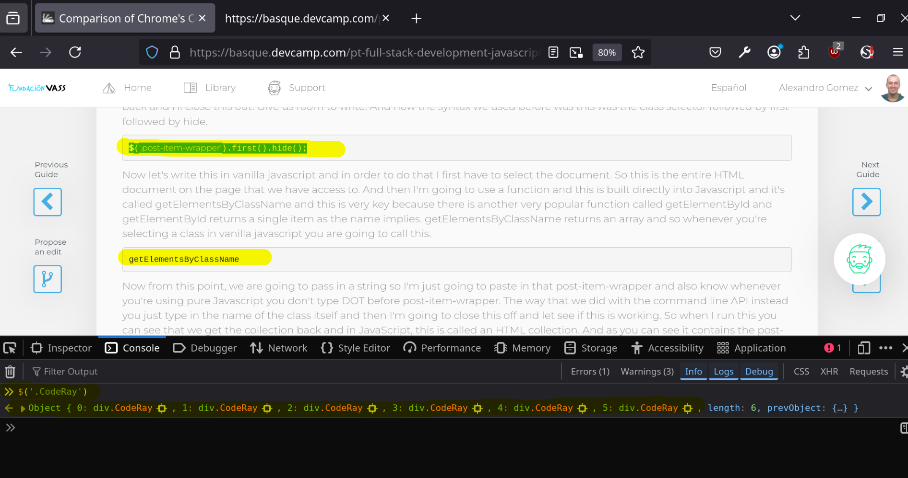
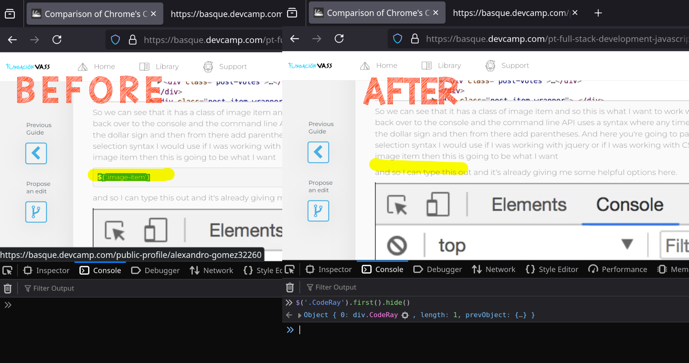
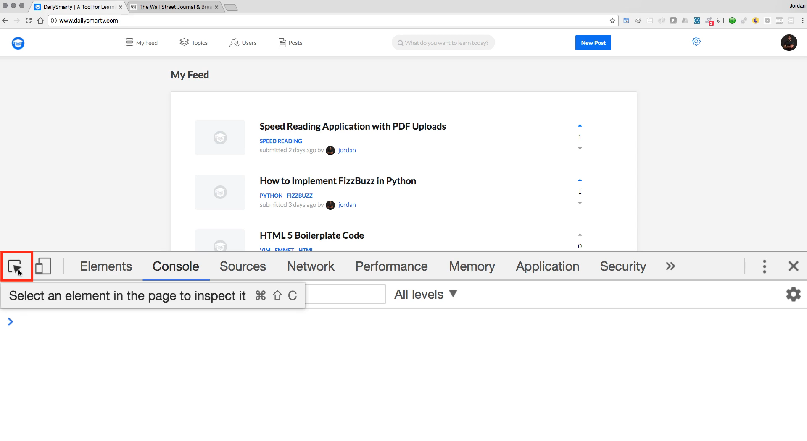
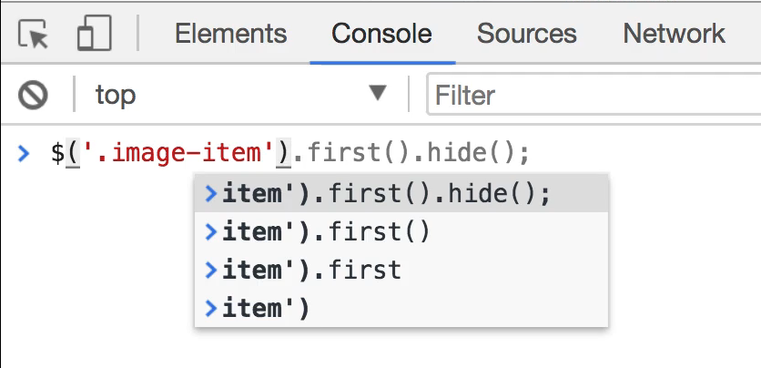
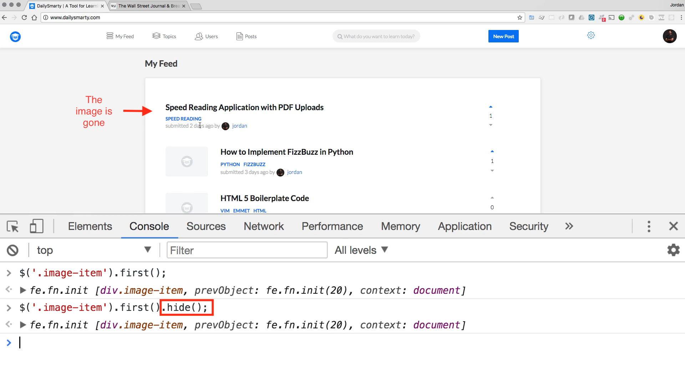
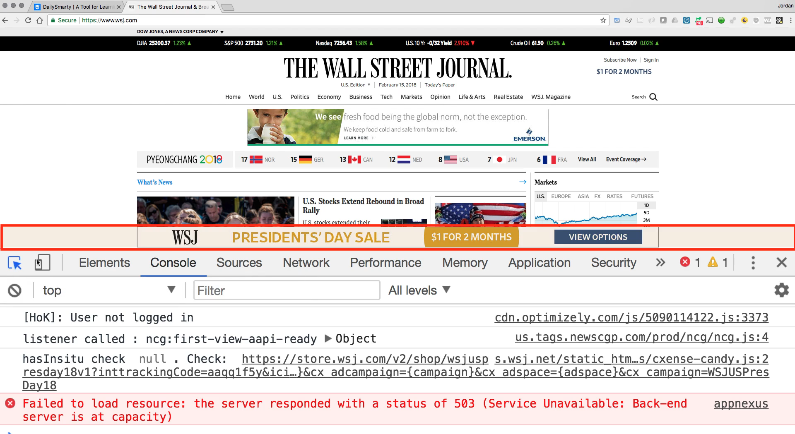
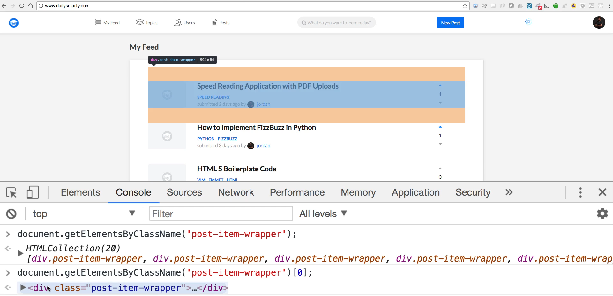
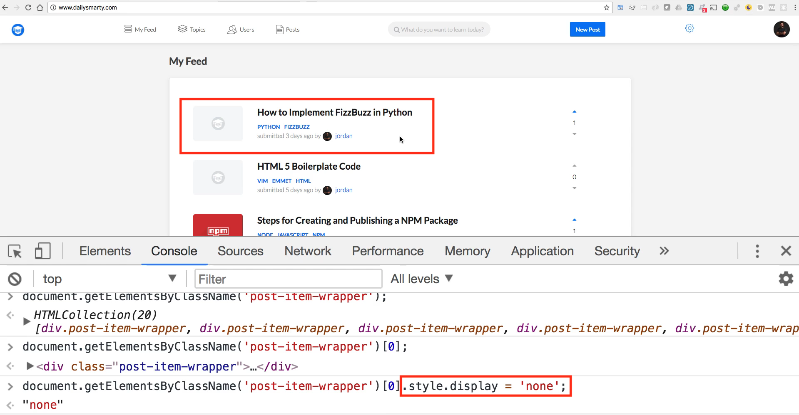

# Module 06 - 107:    Browser Console

## Chrome's JS VS Vanilla JS

****

1. Browser Tools

2. Chrome Command Line API

3. Vanilla JavaScript Equivalents

4. Key Differences

5. More Examples

6. When to Use Each

****

## 1. Browser Tools

Modern browsers provide powerful developer tools that include:

- Console for executing JavaScript

- Element inspection

- Network monitoring

- Performance analysis

- Memory profiling

****

## 2. Chrome Command Line API

##### Shortcut syntax for common operations

- jQuery-like selectors (`$()`, `$$()`)

- Convenience methods (`.hide()`, `.show()`)

- Element highlighting on hover

- Automatic completion

##### Example Usage:

[An example DevCamp guide to be used here](https://basque.devcamp.com/pt-full-stack-development-javascript-python-react/guide/comparison-chromes-command-line-api-vs-vanilla-javascript)


DevCamp skelleton guides' structure is:

```html
<!DOCTYPE html>
<html>
    <head>
        <meta content="text/html; charset=UTF-8" http-equiv="Content-Type" />
        <title>Comparison of Chrome&#39;s Command Line API vs Vanilla JavaScript</title>
        <meta content=" .... content info" />
        <link rel="... CSS .... Assests ..." />
        <script>
            scripts time
        </script>

    </head>
    <body>
        <nav class="nav">
            <div class="navbar-header">
                NAvbar things
            </div>
        </nav>
<!-- BODY -->
        <p>
            
        </p>

        <p>Typicall paragraph </p>

<!-- CODE BOXES !!! -->
        <div class="CodeRay">
            <div class="code">
                <pre>
                    <span style="color:#369;font-weight:bold">$</span>(<span style="background-color:hsla(0,100%,50%,0.05)"><span style="color:#710">'</span><span style="color:#D20">.image-item</span><span style="color:#710">'</span></span>)
                </pre>
            </div>
        </div>

    </body>
</html>
```

**What we are going to stare on is the Code Boxes part:**

```html
        <!-- CODE BOXES !!! -->

        <div class="CodeRay">
            <div class="code">
                <pre>
                    <span style="color:#369;font-weight:bold">$</span>(<span style="background-color:hsla(0,100%,50%,0.05)"><span style="color:#710">'</span><span style="color:#D20">.image-item</span><span style="color:#710">'</span></span>)
                </pre>
            </div>
        </div>
```

So,

```js
// Select all elements with class 'CodeRay'
$('.CodeRay')
```



```js
// Select first matching element and hide it
$('.CodeRay').first().hide()
```



****

## Vanilla JavaScript Equivalents

### DOM Selection Methods

| Command Line API      | Vanilla JS Equivalent                         |
| --------------------- | --------------------------------------------- |
| `$('.class')`         | `document.querySelector('.class')`            |
| `$$('.class')`        | `document.querySelectorAll('.class')`         |
| `$('#id')`            | `document.getElementById('id')`               |
| `$('.class').first()` | `document.getElementsByClassName('class')[0]` |

****

### Element Manipulation

```js
// Hide an element
document.querySelector('.CodeRay').style.display = 'none'

// Show an element
document.querySelector('.CodeRay').style.display = 'block'
```

## Differences

| Feature         | Command Line API     | Vanilla JS          |
| --------------- | -------------------- | ------------------- |
| Syntax          | Concise, jQuery-like | Standard JavaScript |
| Learning Curve  | Easier for beginners | More verbose        |
| Availability    | Browser console only | Works anywhere      |
| Performance     | Slightly slower      | Faster execution    |
| Method Chaining | Supported            | Limited             |
| Browser Support | Varies by browser    | Universal           |

****

## More Examples

### Example 1: Hiding Elements

**Command Line API:**

```js
$('.ad-banner').hide()
```

**Vanilla JS:**

```js
document.querySelectorAll('.ad-banner').forEach(el => {

    el.style.display = 'none'

})
```

****

### Example 2: Modifying Styles

**Command Line API:**

```js
$('.header').style('color', 'red')
```

**Vanilla JS:**

```js
document.querySelector('.header').style.color = 'red'
```

****

### Example 3: Event Handling

**Command Line API:**

```js
monitorEvents($('#button'), 'click')
```

**Vanilla JS:**

```js
document.getElementById('button').addEventListener('click', function() {

    console.log('Button clicked!')

})
```

****

## Command Line API or Vanilla?

### Use Command Line API When ...

- Quickly debugging in browser

- Testing selectors

- Performing one-off manipulations

- Exploring DOM structure

- Rapid prototyping

### Use Vanilla JS When ...

- Writing production code

- Need cross-browser compatibility

- Require optimal performance

- Building reusable functions

- Working outside browser console

****

## Best Practices

1. **For Development:**
   
   - Use Command Line API for quick tests
   
   - Verify with Vanilla JS before implementing
   
   - Check cross-browser compatibility

2. **For Production:**
   
   - Always use standard Vanilla JS
   
   - Consider feature detection
   
   - Use polyfills for older browsers when needed

3. **Performance Tips:**
   
   - Cache selected elements
   
   - Use specific selectors (IDs over classes)
   
   - Minimize DOM manipulations

****

## References

1. [Chrome DevTools ->  Chrome for Developers](https://developer.chrome.com/docs/devtools/)

2. [DOM scripting introduction - Learn web development | MDN](https://developer.mozilla.org/en-US/docs/Learn_web_development/Core/Scripting/DOM_scripting)

3. https://javascript.info/document

4. [Can I Use - DOM Features](https://caniuse.com/)

****

## Video Lesson Speech

In this guide, we're going to learn how to work with the command line 
API in the Chrome browser. If you utilize a different browser such as 
Internet Explorer or Firefox then they have similar tools but if you're 
following along I highly recommend that you do it in Chrome so that the 
exact commands that I enter will also work for you.

****

When it comes to working with the command line API, this is a very powerful tool that allows you to run scripts directly in the browser to manage page elements. And that's going to make more sense when we actually dive into our examples and you can see how it is utilized. 

After we have walked through the command line API we're going to see how we could run the exact same code using vanilla javascript so that you can see the difference. Because I don't want you to get the command line API confused with pure Javascript. What the command line API does is it's essentially a wrapper that was originally created by firebug that allows you to manipulate portions of an HTML page in a much easier manner than having to write all of the JavaScript out from scratch. So when it comes to analyzing elements on the page this is going to be something that you see me using quite a bit throughout this entire course and so I want you to be familiar with it. 

So in order to open this up, I'm going to type Command + Option+ j and this is going to open up the console. Now I want to look and I have this daily smarty page open right here and you can open up any website that you want and what I'm going to show you how to do is how to use the inspector so if you come to this left little icon here that says select an element in the page you could also type Command + Shift + C 



then it's going to switch over and show us all of the HTML on the page. So if I want to select say this little image right here 


then it's going to show me exactly what that code looks like. 


So we can see that it has a class of image item and so this is what I want to work with and I'll double-click on it. Copy it and come back over to the console and the command line API uses a syntax where any time that you want to select an item you start off with the dollar sign and then from there add parentheses. And here you're going to pass in a string so I'm going to use the same type of selection syntax I would use if I was working with jquery or if I was working with CSS so if I hit dot because this is a class and paste in image item then this is going to be what I want 

```js
$('.image-item')
```

and so I can type this out and it's already giving me some helpful options here. 



But for right now I simply want to find this image item on the page so I'm going to run this and you can see it brings back an array so it brings back all of the image items because image item is a class so each one of these images has that same class.


And if I open them up it'll give me all of the details for that. So it'll give me the baseURI it will give me all of the dom elements everything like that so that is very helpful. 

Now one quick caveat I want to add this is very similar to what you would write if you were working with jquery. But I don't want you to get them confused. This is not jquery this is the command line API jquery borrowed a lot of the syntax from this because it made it easier for developers who are already working with tools like firebug years ago when it first became popular. But this is not jquery this is something specific to the browser's console. 

So now because I have image-item if I want to grab an element from there so I really want to grab this top one here because I want to manipulate this if I type first or dot first and then first is a function and this is provided from the command line API and I want to invoke it so I'll add parens at the end. If I run this, you can see I no longer get that collection. Now, I am actually given access to this element 

I'm gonna click here 


and you can see that this is a single image item, it's not the entire list it shows the previous object which includes all of those but here we just have a single one. 

So now I can also perform other tasks on this, so pay attention on your screen for the image for Speed Reading Application with PDF Uploads, because I can call a function such as dot hide, and now if I run this you can see I have removed that from the screen. 



Now, this does not change the code for daily smarty. All this is doing is it's hiding it from your browser and this is part of the goal of this guide is to show you that because javascript is interpreted by the browser were able to do anything that we want. We could do the same thing on a giant site. 

If I come to Wall Street Journal right here and I open up the same set of tools and I'm going to come and select this banner so I don't like this banner for the president's day sale. 



I can come grab the ID come into the console and I can perform the same selectors, I'll say dollar and then paste in this ID right here. And actually sorry I am calling as a class but it needs to be as an ID and from there I can just call hide and now it's gone. 

```js
$('#cx-candybarhp).hide();
```


This has nothing to do with the code on their server, all this is doing is it's changing it for us. Where the power in this lies is that it shows that the browser is able to interpret this. This is getting all that code or writing in the command line API that gets converted into Javascript and then you can perform these tasks and the browser is capable of doing that.

So far in this guide, we've focused on working with the command line API but now what I want to do is I'm going open up a completely new tab for daily smarty here and I want to show how there's a direct mapping between the command line API and the javascript code that we can write so we can write vanilla javascript that performs the exact same task and later on in the course when we start talking about how we can work with elements on the page with vanilla javascript, then we're going to really dive into it. 

But for right now I want to show you a side by side comparison so I'm going to open up the command line tools here again and right here in the console I am going to first select an item before we selected the image, let's go for something larger now. Now I want to actually select the entire wrapper. So if I come here you can see that we have a class called Post item wrapper and now if I copy this and come to the console and then type dollar this time and I'm gonna post item wrapper, make sure you close it off as a string. 

Now I'm going to just call first because remember that that's going to return a collection and then I can call hide. And if I run this it has hidden that element. 


So that is nice and easy it's taken that entire element off the page. Now I'm going to hit refresh and this is going to bring everything back and I'll close this out. Give us room to write. And now the syntax we used before was this was the class selector followed by first followed by hide. 

```js
$('.post-item-wrapper').first().hide();
```

Now let's write this in vanilla javascript and in order to do that I first have to select the document. So this is the entire HTML document on the page that we have access to. And then I'm going to use a function and this is built directly into Javascript and it's called getElementsByClassName and this is very key because there is another very popular function called getElementById and getElementById returns a single item as the name implies. getElementsByClassName returns an array and so whenever you're selecting a class in vanilla javascript you are going to call this. 

```js
getElementsByClassName
```

Now from this point, we are going to pass in a string so I'm just going to paste in that post-item-wrapper and also know whenever you're using pure Javascript you don't type DOT before post-item-wrapper. The way that we did with the command line API instead you just type in the name of the class itself and then I'm going to close this off and let see if this is working. So when I run this you can see that we get the collection back and in JavaScript, this is called an HTML collection. And as you can see it contains the post-item-wrappers and contains all of them. 

So now that we have that we need to perform the same filter so instead of simply grabbing all of them we only want one. Now we can't call DOT first, that's something that's only available in the command line API. We have to use pure Javascript so I'm going to use the bracket syntax and say I want the first element and in programming language that is going to mean that I want the zero-ith index which will bring us the first one, and as you can see that brings back the element. 


We now have access to this entire div. If I hover over it as you can see right there it shows it on the page. 



And now we want to grab the style property. So I'm going to say style and then dot display because we want to change the display style and set it to none. And now if I run this code you can see that that is now gone. 



And if I run it again it's not going to have any effect because it still has the same exact post item wrapper element in memory it has not actually deleted it, it's only hiding it. And so this is the pure vanilla javascript code right here that is going to function identical to our image item or in this case, our post item wrapper first hide. 

```js
document.getElementsByClassName('post-item-wrapper')[0].style.display = 'none';
```

And so I wanted to show this to you to give you a couple of helpful tools. One is to give you an introduction if you've never used it before to the command line API and to its syntax. But then also for you to be able to see that as cool is that syntax is you can use the exact same type of tools with vanilla javascript. 

When it comes to all of the powerful frameworks like angular and view they are using this exact same kind of structure they may give you a nice API kind of like the way the command line API gives you where you can write less code to perform the same type of behavior but I want to really stress that everything that you do in JavaScript can be accomplished with pure vanilla javascript just like we have done right here. 

So in summary that is an introduction to the command line API and also how you can leverage pure Javascript to perform the same type of task.

## Code

```js
// Source page: http://www.dailysmarty.com/

// Console with Command Line API / Firebug
$('.image-item')
$('.image-item').first // returns function
$('.image-item').first()
$('.image-item').first().hide()

// Compared with
document.getElementsByClassName('post-item-wrapper')[0].style.display = 'none';
```
