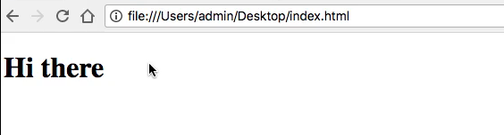

# Module 06 - 108:    Browser Console

## Loading JS script files in the browser

---

1. Embedding JS in HTML

2. Inline Scripts

3. External Scripts

4. Execution Order

****

## Embedding JS in HTML

JavaScript runs in browsers when:

- Placed inside `<script>` tags in HTML

- Linked via external `.js` files

- Entered directly in browser console

### Basic Example

```html
<!DOCTYPE html>
<html>
    <body>
        <h1>My Page</h1>

            <script>

                alert('Hello from inline JS!');
            
            </script>

    </body>
</html>
```

****

## Inline Scripts

**Characteristics:**

- Directly embedded in HTML

- Executes immediately when encountered

- Simple for small code snippets

**Example:**

```js
<script>
    function greetings(name) {

        return `Hello, ${name}!`;

    }
    console.log(greet('World'));
</script>
```

****

## External Scripts

**Preferred method for production code**

```js
<script src="app.js"></script>
```

**Benefits:**

- Separation of concerns

- Caching advantages

- Better maintainability

- Parallel downloading

## ****

## Execution Order

1. HTML parsing begins

2. When `<script>` encountered:
   
   - Pauses HTML parsing
   
   - Executes JavaScript immediately
   
   - Resumes HTML parsing after execution

3. `async` and `defer` attributes can modify this behavior

****

## Best Practices

1. **Place scripts before `</body>`** for better performance

2. **Use external files** for non-trivial code

3. **Avoid document.write()** - it can block rendering

4. **Consider `defer`** for scripts that don't need immediate execution

5. **Use IIFEs** to avoid polluting global scope
   
   ```js
   (function() {
   
       // Code here
   
   })();
   ```

****

## References

1. [MDN - Script Loading](https://developer.mozilla.org/en-US/docs/Web/HTML/Reference/Elements/script)

2. [JavaScript.info - Scripts, Async. Defer](https://javascript.info/script-async-defer)

3. [Load Third-Party JavaScript &nbsp;|&nbsp; Articles &nbsp;|&nbsp; web.dev](https://web.dev/articles/optimizing-content-efficiency-loading-third-party-javascript)

****

## Video Lesson Speech

So far in this section of the course, we've examined how the browser 
processes javascript but we've pretty much kept all of our code inside 
of the browser itself. If you're building out large programs then that 
is not going to work because that JavaScript is going to run in the 
browser but then as soon as it's done it's simply going to disappear 
because it's only kept in memory by the browser. If you're building out a
 program you need to keep your code in files.

****

So how can the browser process those kinds of files? Well to start off our journey on that I'm going to open up a text editor I'm going to be using [visual studio code](https://code.visualstudio.com/) for this entire course. However, you are completely free to use tools such as [sublime text](https://www.sublimetext.com/), [notepad++](https://notepad-plus-plus.org/), [atom](https://atom.io/) pretty much anything that you wanna utilize. I personally like Visual Studio codes so that is what I'm going to use. 

Now if I come here and I create a new JavaScript file so if I saved this I'm just going to call it `index.js` I'll save it inside the desktop here and if I create a new function so I'll say fullName and then this is going to be the same one that we ran directly in the browser so I know this works so I can say. First and last and I'm going to use an arrow function and that I'm just going to return. First and Last and I made the exact same mistake I made in the last guide by not putting the $ in front of the last but this time I'll catch it sooner. And so now we have a fullName function using the arrow syntax. 

```js
fullName = (first, last) => {
    return '${first} ${last}';
}
```

Now I want to alert the browser so what I wanna do is I want an alert message to pop up with this fullName and I'll pass in a string of Kristine and then Hudgens. So this should theoretically work, so now let me pop over into the browser and if I type open then you can see right here on the desktop I have this index.s file. 


If I open this up an alert message doesn't pop up but instead, it simply is showing me the code that I wrote. 


So this is not how you get the browser to process your code. This is simply going to render your code out and this is very important to understand. If you want the browser to actually process to interpret and then run your javascript code you have to be explicit and you need to tell the browser that that is what you're wanting to do. If not it's simply going to look at it like a regular text file. 

So let's switch back into visual studio code. I'm going to take all of this copy it, and create a new file and save this on the desktop as well but this one I'm going to call `index.html`. Now inside of here, I'm going to type some HTML boilerplate code and in another guide, I'll give you a reference to how you can have all of your html5 boilerplate pop up exactly like how I have it right here.


This is something specific to visual studio code and how I have my personal one configured but I'll show you how I did that and so now this is just regular HTML5 code. If I want to come down here in the body and add a heading I can say hi there. And then this is just a regular heading I'll save it, open this up so I'm not going to open up the js file but the index.html file. 


You can see that this works like a normal web page. 



So the way that we can get our javascript code to work is by coming down here and I'm going to place this below the end body tag. And I'm going to create a script tag and paste in our function. 

```html
<script>
  fullName = (first, last) => {
    return `${first} ${last}`;
  }

  alert(fullName('Kristine', 'Hudgens'));
</script>
```

So this is our full name function just like how we had it before and then I'm calling it with an alert. So this is going to pop up a little alert in the browser so I will save this and because I'm calling the function, this is going to run as soon as I refresh the page. So if I hit refresh you can see the alert pops up and it says Kristine Hudgens, which is exactly what we passed into that fullName function. 


So why exactly did this work, and it didn't work when we simply tried to open up that index.js file? Well, it's because of how the browsers have been programmed in order to work. They are looking for certain keywords, so they're looking for HTML code just like we have in the index.html file.

But then whenever it finds a script tag, what that does is it tells the browser that anything inside of here is going to be javascript code and to run it the same way that we ran our javascript code inside of the JavaScript console. So this is going to be viewed as pure Javascript and it's going to run exactly like how we saw before and this is going to be the structure that you're going to be watching me as I build out the rest of the course. 

This is going to be the structure that I will be using where we are going to be leveraging the HTML structure so we're going to be having this doctype and all of these various HTML tags and then all of our javascript is going to go inside of these script tags and then, later on, we're going to see how we can replace our JavaScript in other code files and then simply call them directly inside of another HTML file. But for right now, when we go through our sections on working with selectors and managing elements on the page, it's going to be performed with this kind of structure.

## Code

```html
<!DOCTYPE html>
<html lang='en'>
<head>
  <meta charset='UTF-8'>
  <title></title>
</head>
<body>
  <h1>Hi there</h1>
</body>
<script>
  fullName = (first, last) => {
    return `${first} ${last}`;
  }

  alert(fullName('Kristine', 'Hudgens'));
</script>
</html>
```
