# Module 06 - 111:    DOM Fundamentals

## DOM introduction

---

1. What is the DOM?

2. DOM as a JavaScript Object

3. Navigating the DOM

4. Common DOM Methods

5. DOM Manipulation Basics

6. More Examples

****

## 1.     What is the DOM?

The **Document Object Model (DOM)** is:

- A programming interface for HTML and XML documents

- A tree-like representation of the web page

- Accessible and modifiable via JavaScript

- Standardized by W3C

- Created by the browser when a page loads

- Live structure that updates when the document changes

- Platform and language independent

****

## 2.     DOM as a JavaScript Object

The DOM is essentially a giant JavaScript object where:

- `document` is the root object

- Each HTML element becomes a property/method

- Elements can be accessed and manipulated like any JS object

### Example Comparison

```js
// Regular JavaScript object

const user = {
  name: 'Kristine',
  email: 'kristine@devcamp.com',
  favorites: ['Chipotle', 'Chik fil a']
};


// DOM object access

document.body
document.location.href
```

****

## 3.     Navigating the DOM

### Basic Navigation

- `document` - Entry point to the DOM

- `document.documentElement` - Root `<html>` element

- `document.head` - `<head>` element

- `document.body` - `<body>` element

### Parent/Child Relationships:

- `.parentElement` - Direct parent element

- `.children` - Collection of child elements

- `.firstElementChild` - First child element

- `.lastElementChild` - Last child element

****

## 4.     Common DOM Methods

### Element Selection:

| Method                     | Returns                | Example                                     |
| -------------------------- | ---------------------- | ------------------------------------------- |
| `getElementsByClassName()` | HTMLCollection         | `document.getElementsByClassName('topics')` |
| `getElementsByTagName()`   | HTMLCollection         | `document.getElementsByTagName('div')`      |
| `getElementById()`         | Single Element         | `document.getElementById('header')`         |
| `querySelector()`          | First Matching Element | `document.querySelector('.class')`          |
| `querySelectorAll()`       | NodeList               | `document.querySelectorAll('div.class')`    |

### Element Properties

- `.innerHTML` - Gets/sets HTML content

- `.textContent` - Gets/sets text content

- `.className` - Gets/sets class attribute

- `.id` - Gets/sets id attribute

- `.style` - Access CSS styles

## 5.     DOM Manipulation Basics

### Accessing Elements

```js
// Get element by ID
const header = document.getElementById('header');

// Get elements by class name
const topics = document.getElementsByClassName('topics');

// Access nested elements
const firstTopic = topics[0].children[0].textContent;
```

### Modifying Elements

```js
// Change text content
element.textContent = 'New text';

// Change HTML content
element.innerHTML = '<strong>Bold text</strong>';

// Change styles
element.style.color = 'blue';
element.style.fontSize = '20px';
```

****

## More Examples

### Example 1: Traversing the DOM

```js
// Start from document

// Get all elements with class 'topics'
const topics = document.getElementsByClassName('topics');

// Access third topic element
const thirdTopic = topics[2];

// Get its children
const topicChildren = thirdTopic.children;

// Get text of first child
const topicText = topicChildren[0].textContent;
```

### Example 2: Working with Document Location

```js
// Get full URL
const currentUrl = document.location.href;

// Get protocol (http/https)
const protocol = document.location.protocol;

// Get pathname
const path = document.location.pathname;
```

### Example 3: Accessing Element Properties

```js
// Get body element
const body = document.body;

// Get body's parent (html element)
const htmlElement = body.parentElement;

// Count number of child elements in body
const childCount = body.children.length;
```

****

## References

* https://domenlightenment.com/

* [Constructing the Object Model &nbsp;|&nbsp; Articles &nbsp;|&nbsp; web.dev](https://web.dev/articles/critical-rendering-path/constructing-the-object-model)

* [Document Object Model (DOM) - Web APIs | MDN](https://developer.mozilla.org/en-US/docs/Web/API/Document_Object_Model) 

* https://dom.spec.whatwg.org/ + [GitHub - whatwg/dom: DOM Standard](https://github.com/whatwg/dom)

****

## Video Lesson Speech

This section of the course is going to walk through how we can leverage 
javascript to work with the dom and the DOM is an acronym for document 
object model.

****

The keyword that I want to emphasize here because this speaks directly to the javascript programming language is **object**. So when you were learning about JavaScript and you learned about this data structure called the object it may seem like it wasn't really needed or it didn't really connect with how it was important and how you're going to be able to use it in your own development. 

I hope you paid attention then because now we are going to dive into how objects are used in JavaScript specifically in how they're used for browser base development and application development. So I'm going to walk through a quick review of how objects work in JavaScript. If I created a user here so I'm gonna say const user and I'm just going to create a plain object here they're going to have a name. 

They can have an email address and then they can also have a list of items so I could say favorites and give some favorite restaurants like Chipotle and Chik-fil-a are two of my daughter's favorite restaurants. 

```js
const user = {
  name: 'Kristine',
  email: 'kristine@devcamp.com',
  favorites: [
    'Chipotle',
    'Chik fil a'
  ]
}
```

If I have these, I have a user object and so if I want to see what this user looks like, I could do something like this where I say, user and you can see there that the user gives me the output here on the right-hand side of the file object as its name attribute as an email and favorite's 

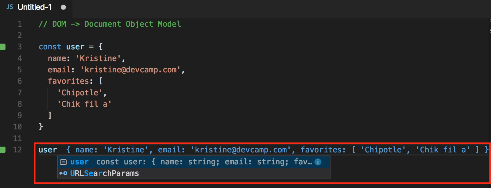

And if I want to drill down to the data I can say user.email and then this is going to output the email address. 

If I say user.name this is going to show me the name and if you've never seen how I'm rendering the javascript code out here in line I'm using the kwaak plugin which you can use with your own text editors. But I've found that it works quite well in the side of vs code but that's beside the point. 

So right here you can see that we have the ability to call an object and then call the attributes of that object and we can take it even further than this so if I say user.favorites then this is going to give me that array.

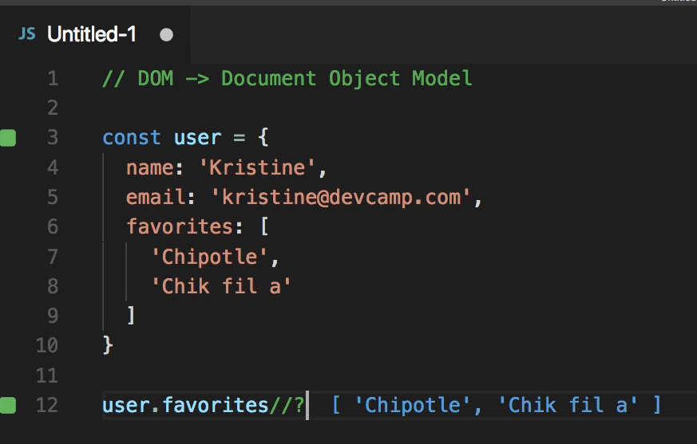

So I have an array that says Chipotle and chick-fil-a, and I can treat this like a regular array so I could say user.favorites[1] and then if I want to see what the output of that is you can see that that is chick fil a. 

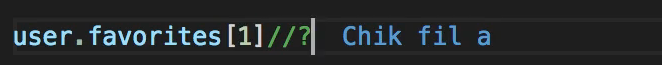

So I have leveraged this object I've traversed it all the way down through the object through the array list and then picked out a specific element.

If you know how to do this I have good news for you. You know how to work with the document object model and that is one of the biggest key requirements when it comes to implementing javascript inside of the browser. 

I'm going to show you why now, so let's switch to the browser and I have daily smarty open here but you could really follow along with any Web site. I'm gonna pop open the javascript console here and now if I type document and hit return this gives me a document object and so I could click on this. You can see that it highlights everything.

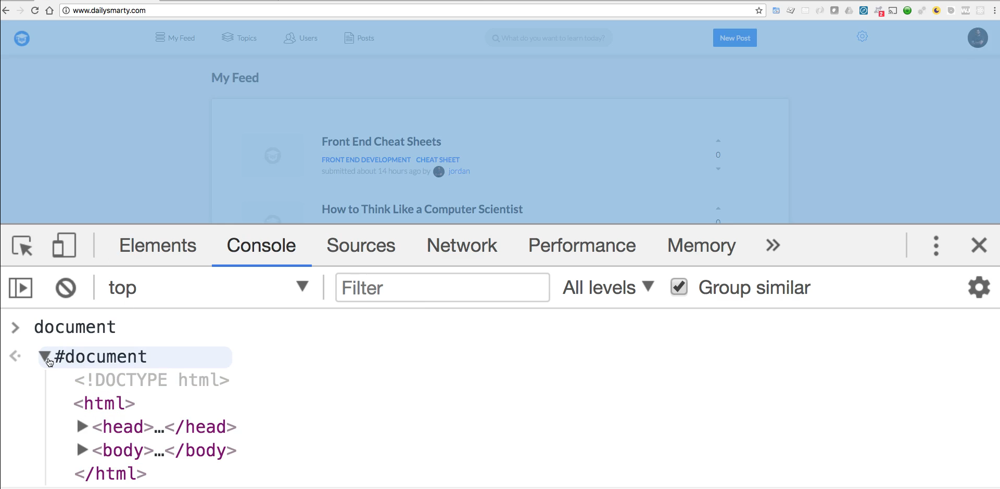

But all that I'm doing here is the way that the browser takes all the HTML code it takes all of it in and then it generates this object very similar to how we just built out that user object so we have the document which is the root. And then we have all of this HTML so we have the document we have the bodies so each one of these items like the container or the script tags. All of those kinds of things are inside of the object just like our user had the name and email and the favorite restaurants. It's the same thing with the document object. 

We can drill down even more so I could say document.location which is another attribute inside of the document object model. And from there I could do something like say href and if I run this you can see that gives me the full URL.


I could look at some of the other items so I could say protocol that shows that it's HTTP. If I switch to a different website so if I open up the wall street journal and perform the same type of query I can say document location. That brings me as you can see right here on the left-hand side. 

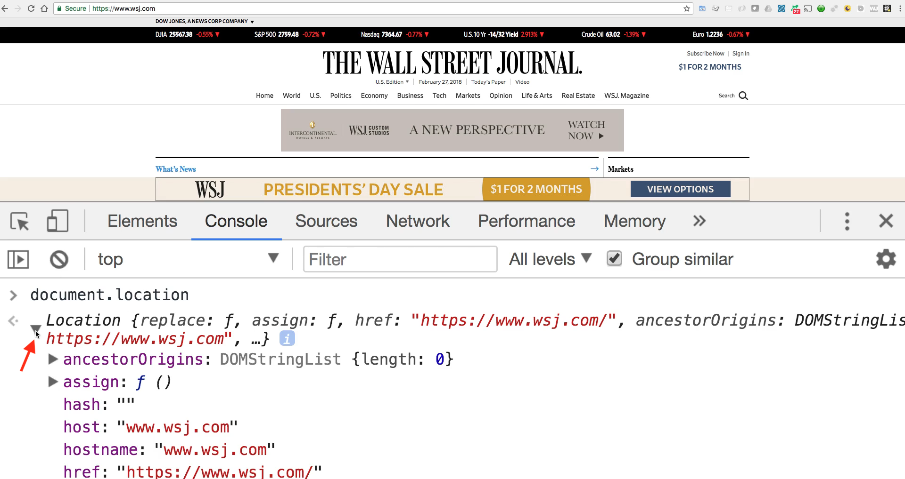

That brings me an object and if you want to look at it you can see it has all kinds of elements it has host, hostname, href which is what we queried on the daily smarty side has the path name and then it has the protocol. All we're doing here is we are treating the document, that's the website, exactly the same way that we treated this user object and that is why it's so critical to understand how objects work in JavaScript because if you understand that part everything else is going to make so much more sense because you're going to be able to realize every element on this website or on any website is just some type of object in order to get access to it you simply have to traverse your way down the object model. 

So I scrolled down here and I typed the exact same thing so I could say document.location.protocol. You'll see that here it returns https because they use an SSL certificate on their site versus when we did on daily smarty where it was just in a plain text. And so that is how you can see that there is actually a difference between those sites and that's cool but that's still kind of boring let's get into some more fun stuff. 

So now let's go and I'm going to look at document.body. What this is going to do is it's going to select that body tag which is everything on the page. So if I click here you can see this has the navbar, the container, and then all of the JavaScript elements right there. 

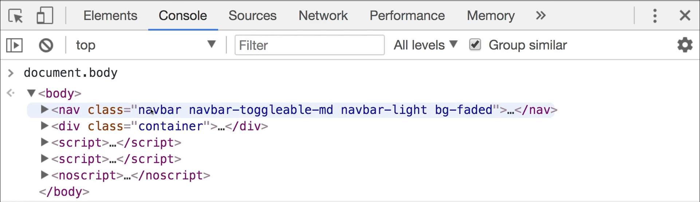

And so we also have access to grab any of the attributes inside of there so if I say document.body dot and then I could say parent element and run this. You can see that this actually goes up the chain it goes up the chain in the object model and instead of just bringing back the body the way it did here it brings back the entire HTML document. 

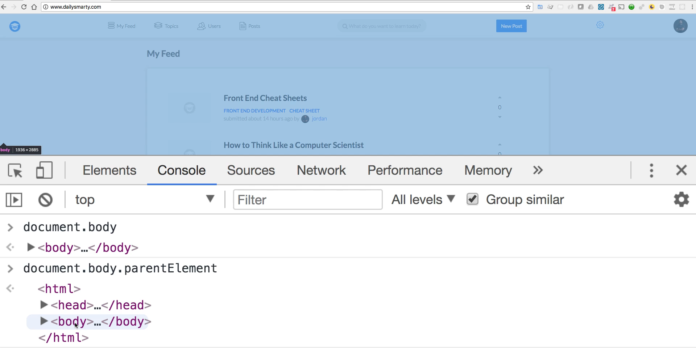

So it goes up one notch in the chain and it grabs the parent element which is the entire HTML document. So that is one other example of what you can grab. Now we also can grab elements inside of here and this is going to be something we're going to be doing quite a bit inside of the projects and the exercises in this course.

So if I come to the inspector and I come in click on one of these elements you can see that I have all kinds of HTML code here. 

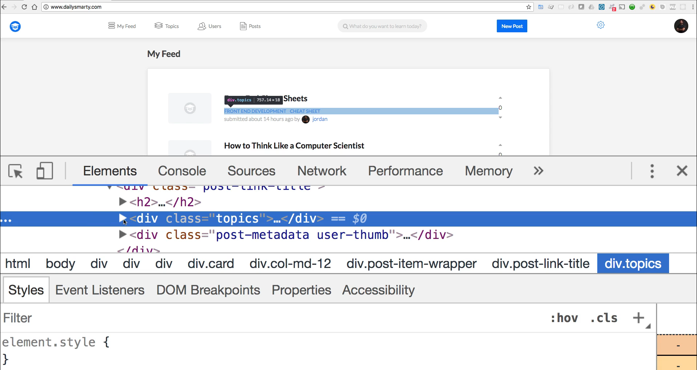

So I have this div with a class of topics I have div with a class of metadata for the user thumbnail. All kinds of different elements and whatever site that you're using you're going to see things that are slightly different but they still are going to be similar. So I want to grab these topics right here so if I come back here what I can do is say document dot and then get elements by class name

```js
document.getElementsByClassName
```

and then I can pass in the class name of topics just like I have right here and now if I run this you can see that I have all of the topics each one of the topics on the page. Each one of these different topics are going to be brought back to me in an object.

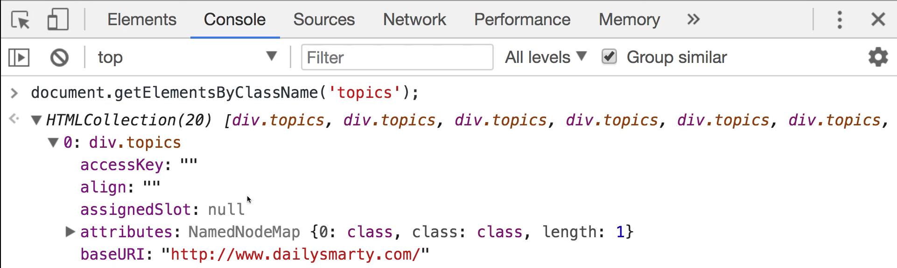

So I have this collection and then inside of it I have all of these nested ones so I have all of the links.  How many child nodes they have what their values are. Everything's all right here you can see front-end development and then cheat sheet. 


You can see that that's exactly what we have. So we are able to select those right on the page and so that is something that is incredibly helpful whenever you're wanting to perform some type of task on an element. Imagine that you're wanting to intercept a click. So you want to know when a user has clicked on a button and then you want to perform some other action, well before you do anything you first have to find that button. And so performing tasks like getting an element by a class name is a way of doing that. 

Now one thing you may have noticed when I ran this, this brought us back a collection that brought us back a collection of 20 items and that's helpful that we actually may need to drill down even more. And as you may notice we have brackets around these topics and if you remember back to your javascript programming classes then you would know that that means that we have an array of topics and so because of that we can treat it like an array. Just like how we were able to treat the favorite restaurants like an array because that's all it was, its an array inside of the object. 

We can do the same thing here so if I run the same code again but say I want to select the element with an id of 2 I can run that and now you see I do not get an HTML collection back but instead I get a div and if I scrolled down here it'll even show it as I highlight it.

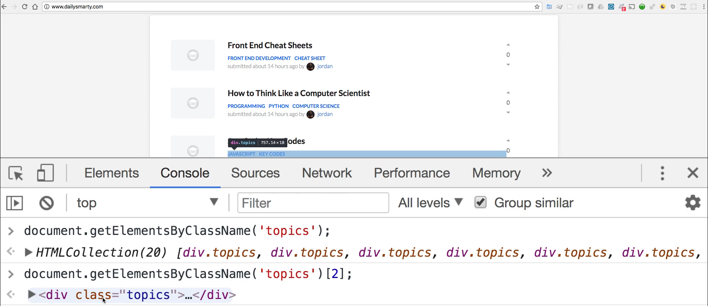

That it's bringing back this JavaScript and key codes div so I can click on that. And now you can see that I have the real HTML code right here it shows JavaScript and key codes. 

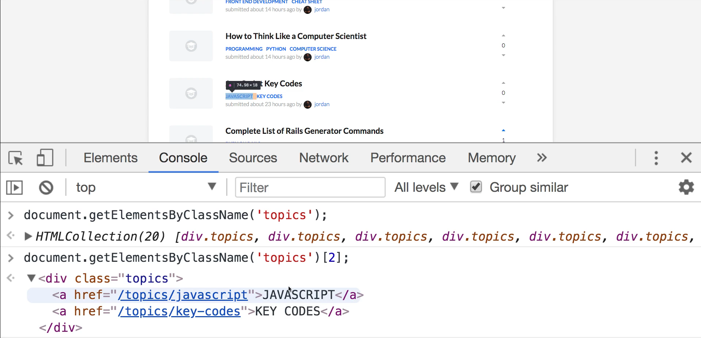

All because we found the element by the class name and then we queried it using just the standard bracket syntax. 

Now we're not done yet the cool thing about working with the document object model is that you're able to traverse it however you need and so we're going to keep on going down even further. So right now we have the entire div but now let's say that we want to get even more detailed if we call DOT children after the 2. You can see that this brings us back a nested collection so this brings back a nested array and it's going to contain these two elements so as you can see this now gives us each one of these we have one at the 0 index and then this one right here is going if we go. Keep on going all the way down you can see that the inner HTML  attribute is set to JavaScript and if we look all the way down at the next one. 

So this is one with an index of 1 and we look at the inner HTML there it's key codes which is exactly what we see right there so everything is working properly. 


But we still can go even further. We can perform tasks such as calling length on this and this can tell us that if we ran a query like this we're not going to know how many elements are there. So say that we're running some kind of check to make sure that an element exists on a page. We could check to make sure that the length is greater than zero so we know that there are two links inside of there. And now let's actually just grab the children and then grab the first element which we know is Javascript. 

We can treat it once again like an array so this is going to grab us that first link and then our final item that we're going to do in this demo is I want to actually just grab the text here and so I can do that by saying dot text. If I run that we have traversed all the way through it. 

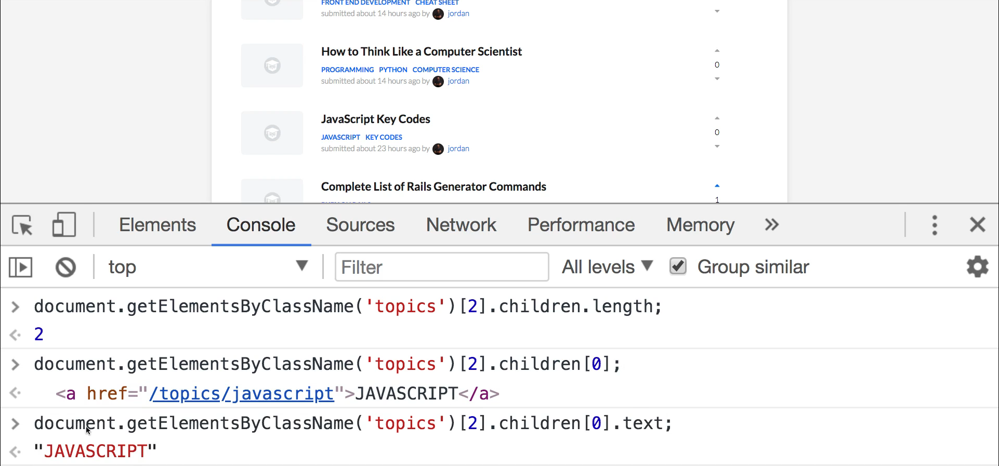

And let's review here we have the document which we started at from there. We looked at every class on the page and said bring me back all the topics that brought us back an array of all of those topics. From there we picked out the topic with an index of 2. We picked out its children and then we picked out the very first children as an ID of zero or an index of zero. And then we asked for its text value. 

So we were able to go all the way from this giant document with all of these kinds of keys and attributes and we were able to treat it like a standard object the same exact way that we treated this user object where we were able to start at the user traverse down each one of the attributes and then pick out the data we wanted. We're able to do the same thing right here and so this is going to be one of the most foundational concepts to understand when it comes to working with JavaScript in the browser.

****

## Code

```javascript
const user = {
  name: 'Kristine',
  email: 'kristine@devcamp.com',
  favorites: [
    'Chipotle',
    'Chik fil a'
  ]
}

user.email
user.favorites[1]

document

document.location.href

// On dailysmarty
document.location.protocol

// On wsj
document.location.protocol

document.body.parentElement

document.getElementsByClassName('topics')

document.getElementsByClassName('topics')[2]

document.getElementsByClassName('topics')[2].children

document.getElementsByClassName('topics')[2].children.length

document.getElementsByClassName('topics')[2].children[0].text
```

****

## Coding Exercise

You might have to do a bit of searching for this one, simply get the div below by targeting the `id`.

```html
<div id="devCamp">Select me by getting the id!</div>
```

```js
let challenge = //write your code here
```
