# Module 06 - 114:     DOM Fundamentals

## Query selectors

****

1. Introduction to Query Selectors

2. `querySelector` vs `querySelectorAll`

3. Comparison with Traditional Methods

4. Selector Syntax

5. More Examples

****

## 1.     Introduction to Query Selectors

Query selectors provide a modern way to:

- Select DOM elements using CSS-style selectors

- Work with single elements or collections

- Combine multiple selection criteria

- Maintain consistent syntax with CSS

---

## 2.     `querySelector` vs `querySelectorAll`

| Feature         | `querySelector()`      | `querySelectorAll()`    |
| --------------- | ---------------------- | ----------------------- |
| Returns         | First matching element | NodeList of all matches |
| Live Collection | No                     | No (static snapshot)    |
| Method Type     | Direct selection       | Collection selection    |
| Typical Use     | Unique elements        | Groups of elements      |

### 

### Differences

- `querySelector()` returns the **first match only**

- `querySelectorAll()` returns **all matches** as a NodeList

- NodeLists support `forEach()` but not all array methods

---

## 3.     Comparison with Traditional Methods

| Method                     | Returns        | Live | Selector Type |
| -------------------------- | -------------- | ---- | ------------- |
| `getElementById()`         | Single element | Yes  | ID only       |
| `getElementsByClassName()` | HTMLCollection | Yes  | Class only    |
| `getElementsByTagName()`   | HTMLCollection | Yes  | Tag only      |
| `querySelector()`          | Single element | No   | CSS selector  |
| `querySelectorAll()`       | NodeList       | No   | CSS selector  |

---

## 4.     Selector Syntax

Query selectors support full CSS selector syntax:

```js
// ID selection
document.querySelector('#main-header')


// Class selection
document.querySelectorAll('.menu-item')


// Attribute selection
document.querySelector('[data-toggle="modal"]')


// Complex combinations
document.querySelectorAll('div.widget > h2.title')


// Multiple selectors
document.querySelectorAll('h1, h2, h3')
```

---

## 5.     Practical Examples

### Basic Toggle Functionality

```js
const toggleButton = document.querySelector('#toggle-btn');
const content = document.querySelector('.content-wrapper');


toggleButton.addEventListener('click', () => {

    content.classList.toggle('hidden');

});
```

### Working with Collections

```js
// Select all navigation links
const navLinks = document.querySelectorAll('.nav-link');

navLinks.forEach(link => {

    link.addEventListener('click', (e) => {

        // Remove active class from all links
        navLinks.forEach(l => l.classList.remove('active'));


        // Add to clicked link
        e.target.classList.add('active');

    });
});
```

### Advanced Selection

```js
// Select first list item in each unordered list
const firstItems = document.querySelectorAll('ul > li:first-child');


// Select all external links
const externalLinks = document.querySelectorAll('a[href^="http"]');
```

****

## Performance Considerations

1. **ID selections** are fastest - use `getElementById()` when possible

2. **Complex selectors** have higher overhead

3. **Cache selectors** - Avoid repeated DOM queries

4. **Scope queries** - Limit search area when possible
   
   ```js
   const form = document.querySelector('#user-form');
   const inputs = form.querySelectorAll('input');
   ```

## Best Practices

1. **Prefer specific selectors** - Avoid overly broad queries

2. **Use IDs for unique elements** - Most performant option

3. **Scope queries appropriately** - Query within known elements

4. **Handle empty results** - Check for `null` or empty NodeLists

5. **Combine selectors wisely** - Balance specificity and performance

6. **Use modern methods** - Favor query selectors for flexibility

****

## References

* [Document: querySelector() method - Web APIs | MDN](https://developer.mozilla.org/en-US/docs/Web/API/Document/querySelector)

* [Document: querySelectorAll() method - Web APIs | MDN](https://developer.mozilla.org/en-US/docs/Web/API/Document/querySelectorAll)

* [CSS selectors - CSS: Cascading Style Sheets | MDN](https://developer.mozilla.org/en-US/docs/Web/CSS/CSS_selectors)

* https://javascript.info/dom-navigation

* https://stackoverflow.com/questions/21193437/can-i-select-multiple-tags-using-getelementsbytagname/21193495#21193495

****

## Video Lesson Speech

So right here I have stretched out our HTML code here and I now have two divs one as a main heading and one is a subheading and you can see these on the right-hand side in the browser. 

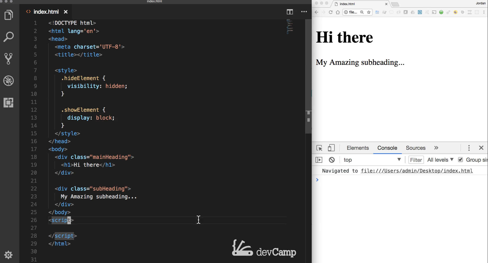

And what we've done so far is we'll create something like a const variable and we can call this Heading or main Heading or whatever you want to call it then we call document.getElement and we've either worked with element by ID or elements by a class name and so that would work and we could simply call that class name of mainHeading. And now if I console log out heading hit save and if I see what we have here you can see that we have our HTML collection has a length of 1 and it contains that main heading element 

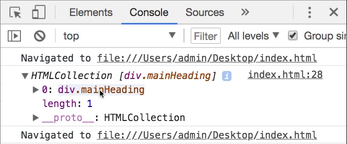

and that works perfectly fine and there are going to be many different circumstances where you use both getElementById and getElementsByClassName.

And in addition to that if I clear this out and I just start typing G. You can see that the IntelliSense shows a preview of some of the other query functions so we have the ability to see some of those other functions here such as getElementsByClassName,  getElementById, getElementsByName, getElementsByTagName, and then getElementsByTagNames and then we have getSelection and you will use some of these on an occasional basis.

However, that's not going to be what we talk about in this guide because these are going to be used a little bit more randomly. But what I want to walk through is another query selector and this is new to more modern versions of JavaScript and it is actually called query selector so if you miss being able to use tools like jQuery and use your selectors with the DOT and the hash syntax query selector was created to be able to give you a little bit more of that jQuery type of syntax and so if I now type document and then query selector and you can see I have a number of options I have queryCommandEnabled and a few of these you won't probably be using these very often. 

But these bottom two querySelector and then querySelectorAll these are going to be used quite a bit in a number of javascript programs. You'll see me use both the query selectors and also the get element and get classes or get elements by class names kind of interchangeably throughout this course. They're very similar and I'm going to show you some key differences in this guide on when you'd want to use one versus the other and the syntax for it is going to be query selector and in this case, I just want to go grab that main heading.

And so here I'm gonna pass in a string of mainHeading. And now if I cancel log out this heading once again I should have pretty much the exact same thing so if I come back here hit refresh. Now you can see that I've selected the item. 

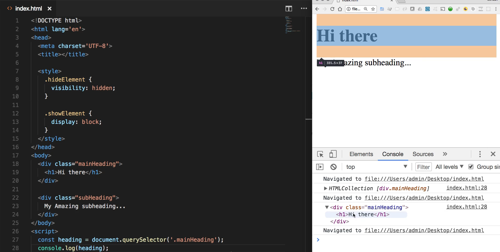

I didn't go and I wasn't grabbing a series of items so I didn't get an HTML collection instead I just got the single element that I was trying to query. So the query selector brought me back to this div mainHeading and everything in sight of it. So that worked properly. 

Now I'm going to get rid of all of this code in our script tag and let's walk through how we can use the querySelector and querySelectorAll and be able to use it in a pretty effective manner. You can see at the top here I added two styles hideElement and showElement and so in order to build this case study out. I'm going to add a button and then I want to be able to hide and show this and I want to build a toggle feature. 

So I'm going to come down here and add a button and then on this button. I'm going to add an onclick event so I'm gonna say onclick and then set this equal to a function and the way this is going to work is I'm going to create a function and I'm just going to call this contentToggle. Make sure you call it just like regular JavaScript and then I'm going to go and create a function down in the script tag that is going to be executed every time that this button is clicked. so if I come here and hit refresh it would help if I put some content here so I'll just say toggle content hit save come hit refresh and now we have a button. 

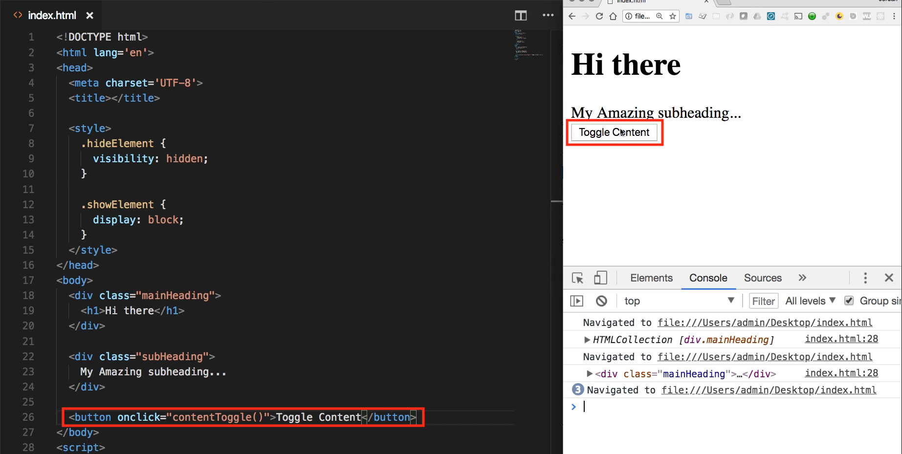

And now if we come down here to the script tag and test it out I can create this function so I'll say content toggle It's not gonna take any arguments and for right now let's just log something out and say I was clicked and if everything is wired up properly then it should say I was clicked right down here. So hit refresh toggle content and that is working. 

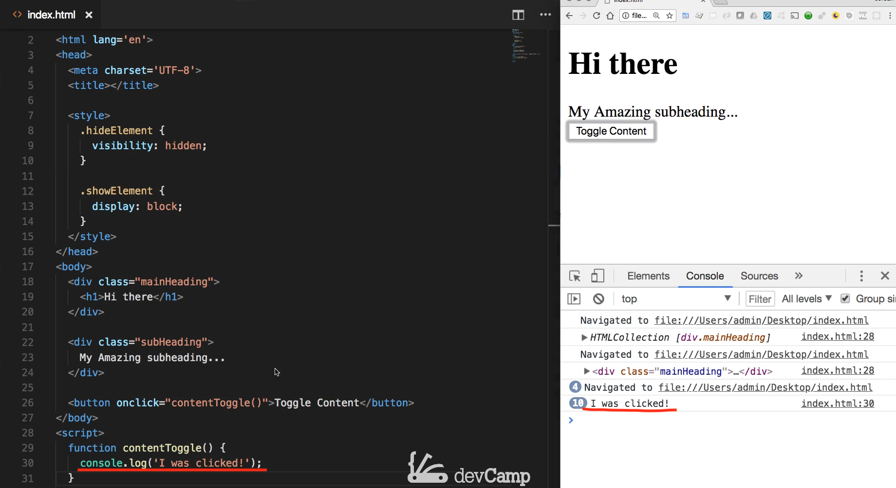

So we've set up and wired up our onclick handler here and it is calling this content toggle function. 

So now that we have that in place let's set up our query selector. So I'm going to walk through both the querySelectorAll and the querySelector because I think when you see them side by side you're going to be able to have a clear understanding on the difference between the two. So I'm going to say const and right here I'm just going to say headings and set this equal to document.querySelectorAll and I actually want to pull in because I want to show you how you can select pretty much anything you want. I am actually going to bring in all of the divs so this is typically not something that you would do but I want to show that you have complete control over this. So what you're going to do is actually be able to select all of the elements on the page that are wrapped in a div like this. You're going to bring in all the divs and then let's just test this out. So I'm going to console log this out so let's Console log headings.

Okay now if I hit save let's see what we have for our headings. So if I hit refresh you can see that now I don't get an HTML collection. 

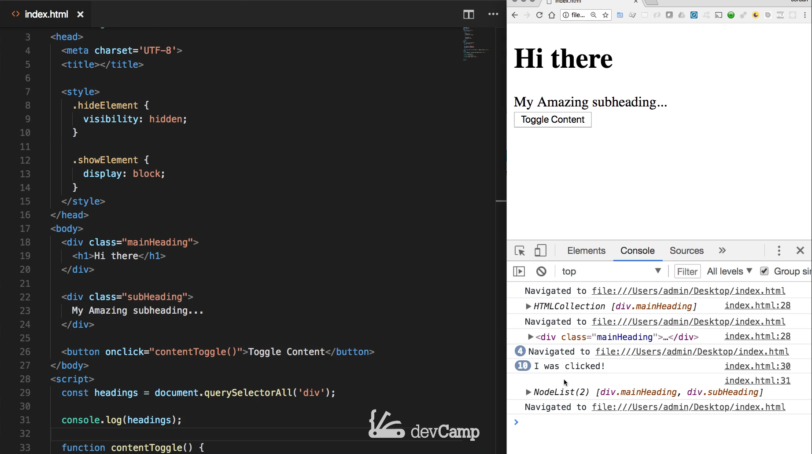

And this is one of the key differences between using something like getElementsByClassName and then get querySelectorAll. querySelectorAll returns a node list it's going to be very similar you're going to be able to work with it in a very similar manner to the HTML collection but it is important to understand that you're getting a node list right here shows you that you have two items and here you can see that we have our mainHeading and our subHeading. 

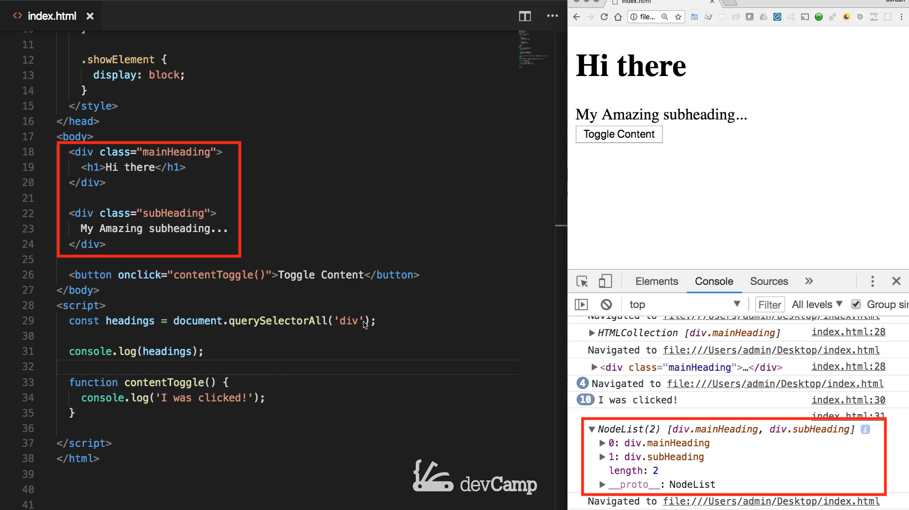

So our querySelectorAll worked it brought back everything that we wanted. It brought back the first div and the second div but it didn't bring back the button because it wasn't wrapped in a div so that selector worked. So now that we have that and we know that we've successfully grabbed our headings let's get rid of our console log statements and now let's actually build in the functionality. 

So I'm gonna come into our content toggle because remember our goal here is I want the ability to click this button and have the content be hidden and then if I click it again I want the content to come back that's a pretty standard feature to build for a Web site. So here I'm going to take our headings and because we got back a node list I can just run for each over the headings and inside for each you have to pass that function. 

So the argument is going to be a single heading and if you remember back to when we worked through for each the way this works is you're not technically passing this in this happens automatically. So the way foreach works is it iterates over the heading list whether it be a node list an HTML collection or an array so it's going to iterate over that and it's automatically going to have access to the headings so the very first time it goes through the headings going to be equal to this mainHeading because that's the first div and then the second time he goes through it's going to be equal to the subheading because that's the second div. 

Now inside of here, we're going to do something very similar to what we've done earlier in this section. So I'm going to say if heading so I'm speaking specifically to the heading that we're iterating over going to say if heading class list and then say contains so if it contains the class of show element which that's what it is going to have, I need to add this up here, so each one of these needs to start off by default with the class of showElement. 

So if it has that it's going to iterate through it's going to check to see if it has it now. If it does then we want to drop down into this code block here and we'll say heading.classList just like the first one was. So heading.classList we're going to remove the showElement class and then we are going to add the other ones, we are going to add the one and I believe its called hideElement. 

So we're going to add one called hideElement which is just going to hide it's going to make the visibility none and that's all we're going to have to do and so I'm going to save this and let's see if we have this working up until this point so clear. Hit refresh. If I press toggle content it works. It went and it hit it. 

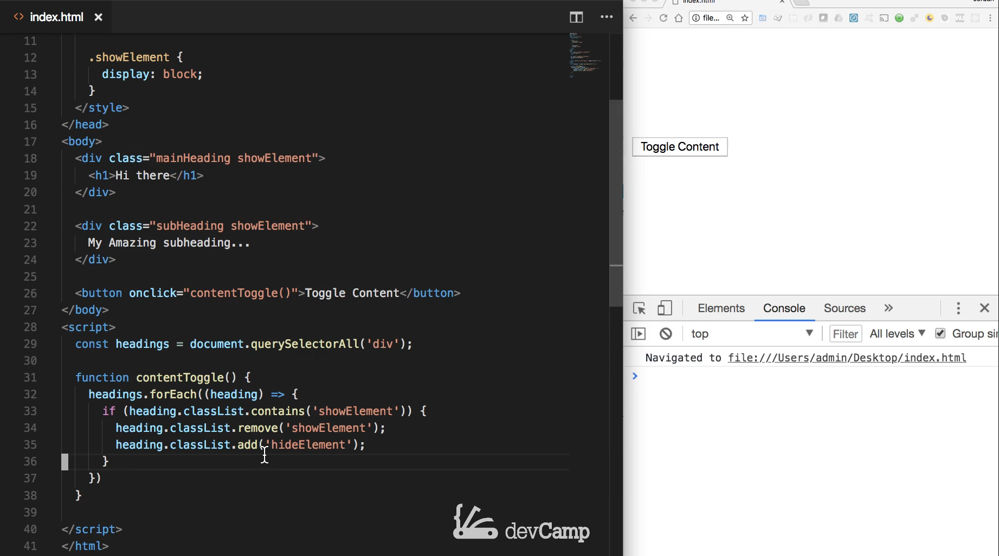

Now we have to do the other side of it. We need to get the else condition so that it toggles back forth. So now we'll say else just copy this down and we'll say heading.classList

Now we're going to remove the hideElement and then show the showElement or we're going to add it to the classList. So save that file come back here hit refresh. And now if they click toggle content you'll see it works perfectly. 

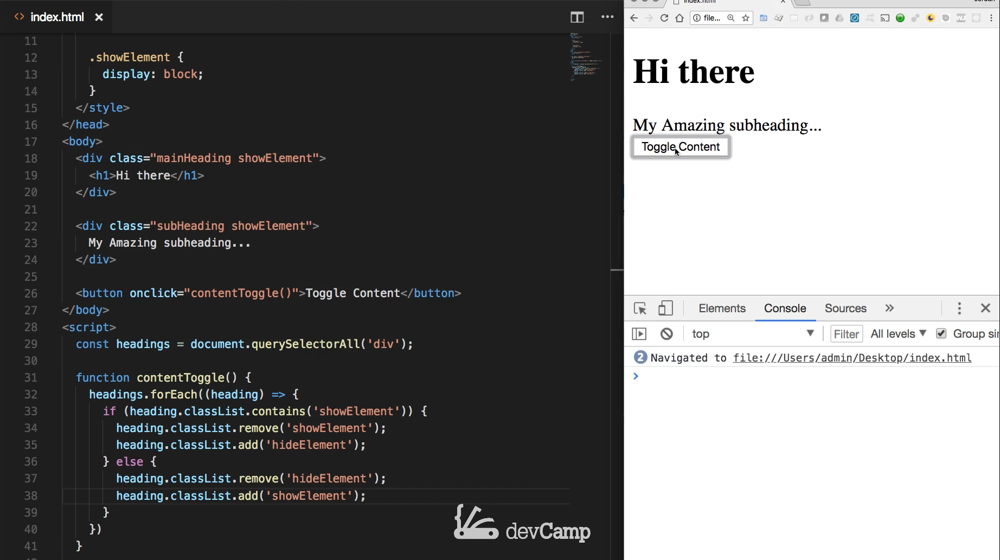

So we've effectively built a toggler that will show and hide the content at the click of a button. And one of the really nice things about working with querySelectorAll is this gives you a lot more flexibility. So whenever you need to be able to perform a query that is not based on a class and not based on id but something that's a little bit either more generic like a div or something where you want to pass an entire detailed selection criteria to it then querySelector allows you to make that possible. So that's how you can use querySelectorAll. 

Now another way of doing this and technically the way that I've done it right here this isn't the way I'd do it in a real application. Let me show you how I would do it and we're going to be able to see how querySelector works in order to do that. I'm going to come up here and I'm going to instead of selecting all these divs I'm gonna create a wrapper div so I'm going to create a div and let's imagine we're putting this on a Web site and it is going to be a widget class. So this is just going to be a widget that stores this information and then close off the div. And now what I can do is inside our widget class I can say show element and then I can come and remove it from each one of these spots. 

Now what I've done is I've created a single div that has two divs nested inside of it and what I want to do is instead of having to iterate over each one of the heading divs and add that hide class each time. Now I just want to look at this one div, this one component on the page, and say OK I want you to be hidden or I want to show you based on if I click toggle content. So that is all we have to change on the HTML side coming down here let's comment this out. And let's also comment all of this out so that you can have it in the show notes.

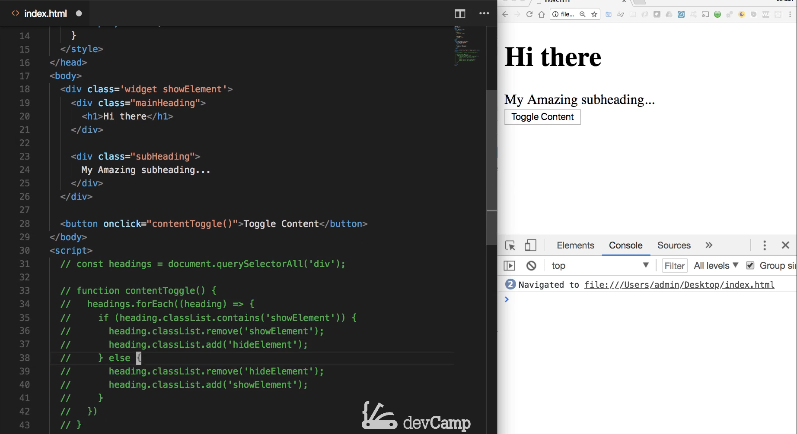

And let's now look at querySelectors, I'm gonna say const widget equals we'll say document querySelector, not querySelectorAll and we're just going to pass in a class of widget 

```js
const widget = document.querySelector('.widget');
```

And as you can see I'm not passing in the widget by itself as a string I'm passing in the traditional type of query and the typical kind of selector so if you're used to using jQuery then this is going to be the same syntax you'd use if you're used to using CSS a lot, then this is going to be the same thing and this is part of the reason why query selector has become so popular in the javascript community is because you don't have to have one type of syntax for your javascript selectors and a different one for CSS you can use them interchangeably which can be helpful. 

So here we have selected that element and let's take a look at it really quick. So I'm gonna say console log widget hit save and now if I refresh you can see that we have our widget which contains our two divs inside of it. 

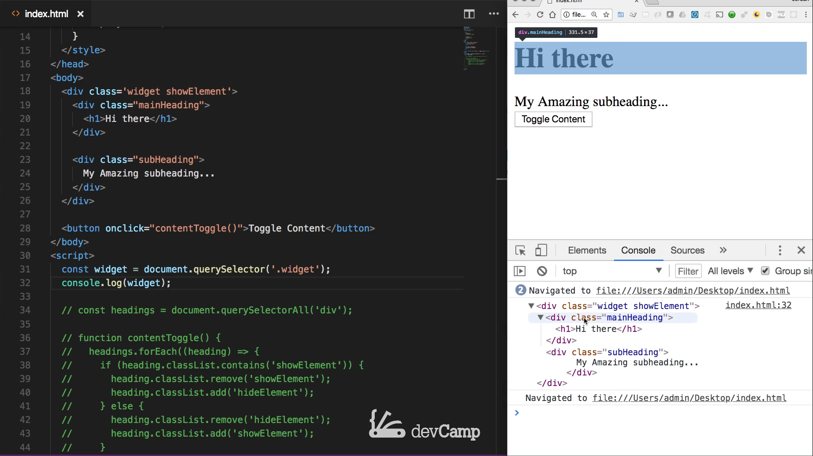

Now the key thing that I want you to take away from this guide and that is the difference between querySelector and querySelectorAll as you notice querySelector brings back the actual object that you're trying to select. It brought me back this one div 

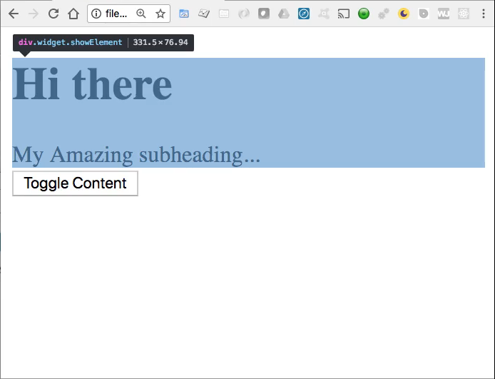

whereas when we use querySelectorAll it brought back a node list and so that's a very important thing to understand because that means that when you are using querySelector then you need to start whatever process you want to run on your query. You need to do that right away whereas with a querySelectorAll you need to iterate over. So just the same reason why we had this for each loop right here, the reason we had to do that was because we got back a list where right here we're getting back a single element and you're going to have cases where you need to use one versus the other. 

In this particular example if I had some type of widget on a page or say that you're building out a dynamic form and you only want to have the shipping address there if the billing address if they say that they are not the same that's a pretty typical kind of use case. Well, whenever I would do something like that use this example I would wrap up the entire set of components and all those form elements inside of a wrapper of div I did right here at the widget and then I would run a traditional querySelector here so I could bring back one item instead of having to do it all manually. 

So now that we've done that, let me get rid of the console log and I'm going to be able to reuse quite a bit of this content toggle function but we can get rid of the entire for each statement which is nice so I can just say get rid of this bracket get rid of that bracket and now we're just going to have our conditional. 

So now I'm going to say if widget not heading so if widget.classList contains show element then I want you to come down here and update the class lists. So come select both of these replace it with widget and do the same thing. So now let me hit save and as long as I've wired everything up this should work exactly the same way but with less code no for each statement or anything like that. 

So hit refresh hit toggle content and that is working perfectly. 

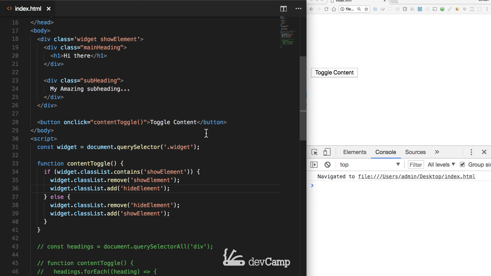

So as you can see we've walked through now 4 different ways that you can query elements on the browser page so your applications can find any elements on the dom and then it can do whatever it needs with them it can hide them it can add different classes it can remove classes that can perform all kinds of different processes. 

But you're going to find that you're going to be using these query selectors and these get element type of selectors every single day and that's a reason why walked through so many examples. Because this is something that you're going to be using quite regularly in your javascript development. 

## Starter code

```html
<!DOCTYPE html>
<html lang='en'>
<head>
  <meta charset='UTF-8'>
  <title></title>

  <style>
    .hideElement {
      visibility: hidden;
    }

    .showElement {
      display: block;
    }
  </style>
</head>
<body>
    <div class="mainHeading">
      <h1>Hi there</h1>
    </div>

    <div class="subHeading">
      My Amazing subheading...
    </div>
</body>
<script>

</script>
</html>
```

## Code

```html
<!DOCTYPE html>
<html lang='en'>
<head>
  <meta charset='UTF-8'>
  <title></title>

  <style>
    .hideElement {
      visibility: hidden;
    }

    .showElement {
      display: block;
    }
  </style>
</head>
<body>
  <div class="widget showElement">
    <div class="mainHeading">
      <h1>Hi there</h1>
    </div>

    <div class="subHeading">
      My Amazing subheading...
    </div>

  </div>
  <button onclick="contentToggle()">Toggle Content</button>
</body>
<script>
  // const mainHeading = document.querySelector('.mainHeading');
  // const headings = document.querySelectorAll('div');
  const widget = document.querySelector('.widget');

  function contentToggle() {
    if (widget.classList.contains('showElement')) {
      widget.classList.remove('showElement');
      widget.classList.add('hideElement');
    } else {
      widget.classList.remove('hideElement');
      widget.classList.add('showElement');
    }
  }

  // function contentToggle() {
  //   console.log(headings);
  //   headings.forEach((heading) => {
  //     if (heading.classList.contains('showElement')) {
  //       heading.classList.remove('showElement');
  //       heading.classList.add('hideElement');
  //     } else {
  //       heading.classList.remove('hideElement');
  //       heading.classList.add('showElement');
  //     }
  //   });
  // }
</script>
</html>
```

****

## Coding Exercise

You can also use `querySelectorAll` to select multiple elements and work with them. Write a variable named `vault` and use the query selector all to select the `i`, the `p`, and the `h1` tags. If this is confusing, click **[here](https://stackoverflow.com/a/21193495)** to learn a little more about selecting multiple elements .

```html
<h1>Hi there!</h1>
<i class="fab fa-facebook"></i>
<p>Some content</p>
```

```js
// Write your code here
```
